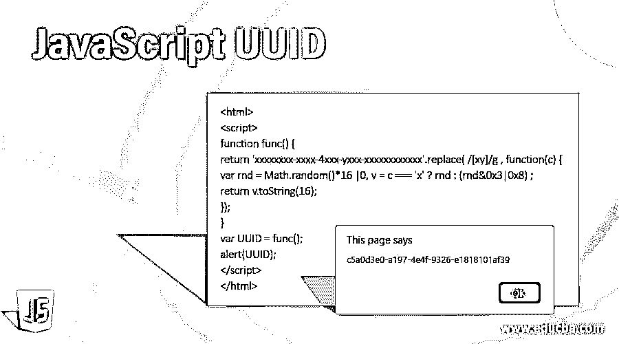
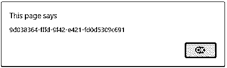
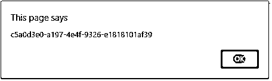
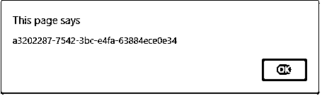

# JavaScript UUID

> 原文：<https://www.educba.com/javascript-uuid/>




## JavaScript UUID 简介

通用唯一标识符(UUID)是软件构造中使用的 128 位值的标识符。由于考虑了几个变量，该值中的每个位的含义不同。这个 UUID 的主要目的是每次生成数字时，获得的值都是唯一的。也就是说，为一个人生成的 UUID 不会与另一个人的相同。带有十六进制类型文本的规范格式用于人类可读的显示。关于 UUID 的更多细节将在下面的章节中讨论。在这个主题中，我们将学习 JavaScript UUID。

**语法**

<small>网页开发、编程语言、软件测试&其他</small>

JavaScript 中的 UUID 可以用不同的方法创建，比如数学。Random()，ES6 crypto API 获得一个随机值方法。这里，使用数学方法获得的值。随机方法可能是也可能不是唯一的。所以，总是建议不要使用数学。随机方法。但是，它用于演示目的。

根据 RFC4122 版本 4 的投诉，UUID 应该是下面提到的格式。

xxxxxxxx-xxxx-Mxxx-Nxxx-xxxxxxxxxxxx

这里，M 和 N 的允许值限于 1、2、3、4 和 5。

### JavaScript 中的 UUID 函数是如何工作的？

如前所述，UUID 可以通过不同的方式生成。在此之前，让我们看看一个好的标识符的基本要求是什么。

*   **快速生成-** 吨 ID 应该是以很小的成本生成的。
*   **Uniform-** 对于非常敏感的数据，如代金券或预付费代金券，它有助于防止暴力攻击。
*   **安全-** 这有助于避免冲突，因为 UUIDs 应该是“唯一的”。
*   **不可预测-** 尽管这也是安全特性的一部分，但有时也用于数据完整性检查。
*   **URL-friendly-** 此功能可以帮助在验证电子邮件令牌的情况下获取 URL 的参数。
*   **Tiny-** 此功能有助于以较小的成本在 web 应用程序中运输它。

### JavaScript UUID 的创建

现在，让我们继续用不同的方法创造 UUID。首先，让我们看看如何使用 random()方法实现这一点。

1.在数学的帮助下用 Javascript 创建 UUID。Random()方法:

众所周知，Math.random 是 JavaScript 中的内置函数，它允许我们生成随机数。也就是说，每次用户试图运行代码时，都会返回一个唯一的数字组合。因为它总是返回一个十进制类型的数字，所以应该先对数字进行舍入。用 javascript 和数学创造了 UUID。可以使用 Random()函数，如下所示。

```
<script>
function func() {
return ( ( ( 1+Math.random() ) * 0x10000 ) | 0 ).toString( 16 ).substring( 1 );
}
// For calling it, stitch '3' in the 3rd group
UUID = (func() + func() + "-" + func() + "-3" + func().substr(0,2) + "-" + func() + "-" + func() + func() + func()).toLowerCase();
alert(UUID);
</script>
```

2.借助 ES6 加密 API 用 Javascript 创建 UUID

要创建 UUID，请执行以下步骤。

*   使用以下命令安装 UUID

```
npm install UUID
```

*   使用以下格式创建 ES6 模块语法的 UUID。

```
import {v4 as UUIDv4} from 'UUID' ;
UUIDv4() ;
```

此外，ES6 的 Javascript 加密 API 可用于在客户端生成 UUID。在这个加密 API 中，一个名为 getRandomValues()的方法产生了一个 UUID(universal Unique Identifier ),如下所示。

函数 create uuid(){ return([1e 7]+-1 E3+-4 E3+-8 E3+-1e 11)。替换(/ [018]/g，c = >(c ^ crypto . getrandomvalues(new uint 8 array(1))[0]& 15 > > c/4)。toString(16) )}

### 例子

让我们看看 UUID 一代的一些示例程序:

#### 示例#1

使用 random()方法生成 UUID 的 Javascript 程序。

**代码:**

```
<html>
<script>
function func() {
function ff(s) {
var pt = (Math.random().toString(16)+"000000000").substr(2,8);
return s ? "-" + pt.substr(0,4) + "-" + pt.substr(4,4) : pt ;
}
return ff() + ff(true) + ff(true) + ff();
}
var UUID = func();
alert(UUID);
</script>
</html>
```

**输出:**




在这个程序中，Math.random()方法返回一个介于 0 和 1 之间的 16 位十进制数。然后转换成以 16 为基数的字符串。然后前缀被切掉，得到一个 8 个十六进制字符长的字符串。将“00000000000”附加到字符串，并用 substr()函数剪切它，使它成为 9 个字符。这样做是为了解决最坏的情况，结果是得到 0 和 1。在执行代码时，UUID 显示如上。

#### 实施例 2

使用 random()方法和正则表达式生成 UUID 的 Javascript 程序。

**代码:**

```
<html>
<script>
function func() {
return 'xxxxxxxx-xxxx-4xxx-yxxx-xxxxxxxxxxxx'.replace( /[xy]/g , function(c) {
var rnd = Math.random()*16 |0, v = c === 'x' ? rnd : (rnd&0x3|0x8) ;
return v.toString(16);
});
}
var UUID = func();
alert(UUID);
</script>
</html>
```

**输出:**




在这个程序中，还使用了 func 函数，它使用随机方法和正则表达式随机创建一个数字，以便创建一个 UUID。在执行代码时，可以看到一个数字显示为弹出窗口。如果再次执行该代码，会显示类似的另一个数字。

#### 实施例 3

使用 random()方法生成 UUID 的 Javascript 程序。

**代码:**

```
<script>
function func() {
return ( ( ( 1+Math.random() ) * 0x10000 ) | 0 ).toString( 16 ).substring( 1 );
}
// For calling it, stitch '3' in the 3rd group
UUID = (func() + func() + "-" + func() + "-3" + func().substr(0,2) + "-" + func() + "-" + func() + func() + func()).toLowerCase();
alert(UUID);
</script>
```

**输出:**


在该程序中，使用了 func 函数，该函数使用随机方法随机生成一个数字，以生成一个 UUID。在执行代码时，可以看到一个数字显示为弹出窗口。如果再次执行该代码，将显示另一个数字，如下所示。




### 结论

UUID 是一个 128 位值的标识符，有助于软件的构造。在这篇文章中，不同的方面，如语法，工作，并举例详细解释了 UUID。

### 推荐文章

这是一个 JavaScript UUID 指南。在这里，我们将讨论 UUID 函数在 JavaScript 中是如何工作的，并给出相应的编程示例。您也可以看看以下文章，了解更多信息–

1.  [JavaScript 实例 of](https://www.educba.com/javascript-instanceof/)
2.  [JavaScript 串联字符串](https://www.educba.com/javascript-concat-string/)
3.  [JavaScript 字符串替换](https://www.educba.com/javascript-string-replace/)
4.  [JavaScript 刷新页面](https://www.educba.com/javascript-refresh-page/)


