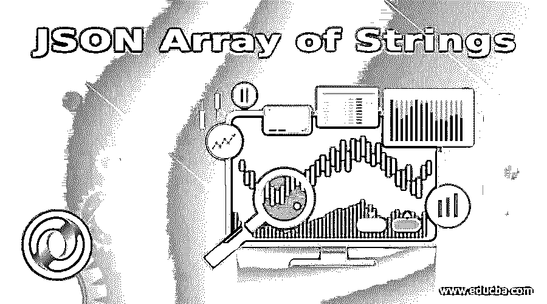
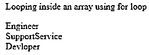
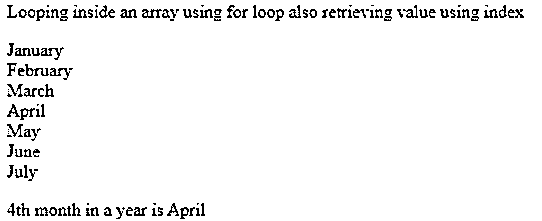
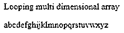
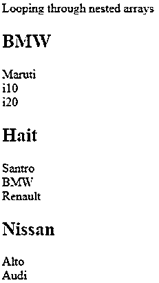
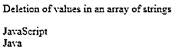

# JSON 字符串数组

> 原文：<https://www.educba.com/json-array-of-strings/>




## JSON 字符串数组介绍

这是为你的发展而增加的知识量表。这是我们将要探讨的话题。所以为了更好的理解，我们在这里破个名吧。JSON 是 JavaScript 对象表示法，用于数据交换，字符串数组是字符串类型的有序值列表。所以总的来说,JSON 字符串数组’代表一个有序的值列表，它可以存储多个值。这对于存储字符串、布尔值、数字或对象非常有用。这里我们特别关注字符串数组，所以让我们深入了解它的语法和几个例子。

**语法:**

<small>网页开发、编程语言、软件测试&其他</small>

```
["value1", "value2", "value3",……..]
```

**例如:**

```
["January", "February", "March", "April", "May", "June", "July"]
```

这些方括号用于声明 JSON 数组[ ]，JSON 因为它们可以存储多个值和值类型，这些值必须用'，'逗号分隔。JSON 中的数组与 JavaScript 中的数组非常相似。

```
{
"empName" : "Karthick",
"empage" : 42,
"empRights" : [ "Engineer", "SupportService", "Devloper" ]
}
```

所以这里的 empRights 是一个用引号括起来的字符串数组。

### JSON 字符串数组的例子

下面是一些例子:

#### 示例#1

**代码:**

```
<!DOCTYPE html>
<html>
<body>
<p>Looping inside an array using for loop</p>
<p id="demo"></p>
<script>
var sample, i, x = "";
sample = {
"empName" : "Karthick",
"empage" : 42,
"empRights" : [ "Engineer", "SupportService", "Devloper" ]
};
for (i in sample.empRights) {
x += sample.empRights[i] + "<br>";
}
document.getElementById("demo").innerHTML = x;
</script>
</body>
</html>
```

**输出:**




#### 实施例 2

**代码:**

```
<!DOCTYPE html>
<html>
<body>
<p>Looping inside an array using for loop also retrieving value using index</p>
<p id="demo"></p>
<script>
var sample, i, x = "";
sample = {
months: ["January", "February", "March", "April", "May", "June", "July"]
};
for (i in sample.months) {
x += sample.months[i] + "<br>";
}
document.getElementById("demo").innerHTML = x;
document.write('4th month in a year is ',sample.months[3]);
</script>
</body>
</html>
```

**输出:**




##### JSON 字符串数组是如何工作的？

基本上一个有效的 JSON 总是以大括号或者方括号开始。{ }或[ ]。因此

```
{ will start an object
{          string               :           value               },
{"key":"value", ….}
```

JSON 使用双引号，而 JavaScript 使用单引号。

```
[ will start array and ] will end the array
[                       value               ],
```

值可以是对象、数组、布尔值、字符串、数字或空值。

**JSON 数字数组:**

```
[90, 78, 56, 34, 21]
```

**布尔值的 JSON 数组:**

```
[true, true, false, true, false]
```

**JSON 对象数组:**

```
{"CGemployees":[
{"empname ":"Karthick", "empemail":"karthick@gmail.com", "age":73},
{"empname ":"Shyam", "empeemail":"shyam33@gmail.com", "age":88},
{"empname ":"Saideep", "empemail":"saideep@gmail.com", "age":33},
{"empname ":"Anusha", "empemail":"anu@gmail.com", "age":21}
]}
```

我们也可以存储字符串的多维数组，

```
[
[ "abc", "bcd", "cda" ],
[ "mno", "nop", "opq" ],
[ "xyz", "yza", "zab" ]
]
```

#### 实施例 3

**代码:**

```
<!DOCTYPE html>
<html>
<body>
<p>Looping multi dimensional array</p>
<p id="demo"></p>
<script>
var sample, i, j, x = "";
var sample = {
"name"   : "Karthick",
"alphabets" : [
[ "abc", "def", "ghi" ],
[ "jkl", "mno", "pqr" ],
[ "stu", "vwx", "yz" ]
]
}
for (i in sample.alphabets) {
for (j in sample.alphabets[i]) {
x = sample.alphabets[i][j];
document.write(x);
}
}
</script>
</body>
</html>
```

**输出:**




**字符串嵌套数组:**数组内部的值也可以是一个数组，称为嵌套数组。数组也可以有 JSON 对象。

#### 实施例 4

**代码:**

```
<!DOCTYPE html>
<html>
<body>
<p>Looping through nested arrays</p>
<p id="demo"></p>
<script>
var sample, i, j, x = "";
sample = {
"empname":"Saideep",
"empage":40,
"empcars": [
{"carname":"BMW", "carmodels":["Maruti", "i10", "i20"]},
{"carname":"Hait", "carmodels":["Santro", "BMW", "Renault"]},
{"carname":"Nissan", "carmodels":["Alto", "Audi"] }
]
}
for (i in sample.empcars) {
x += "<h2>" + sample.empcars[i].carname + "</h2>";
for (j in sample.empcars[i].carmodels) {
x += sample.empcars[i].carmodels[j] + "<br>";
}
}
document.getElementById("demo").innerHTML = x;
</script>
</body>
</html>
```

**输出:**




#### 实施例 5

**代码:**

删除字符串数组中的值。

```
<!DOCTYPE html>
<html>
<head>
<title></title>
</head>
<body>
<p>Deletion of values in an array of strings</p>
<p id="paraId"></p>
<script>
var string = "";
var sample = {
"employeename": "Anusha",
"employername": "CPG",
"techskills": ["react", "JavaScript", "Java"]
};
delete sample.techskills[0];
for (i in sample.techskills) {
string += sample.techskills[i] + "<br/>";
}
document.getElementById("paraId").innerHTML = string;
</script>
</body>
</html>
```

**输出:**




### 结论

我们已经看到 JSON 数组如何表示一个有序的值列表，可以是字符串、数字、布尔值或对象。在这里，根据主题，我们已经讨论了如何使用 for 循环访问字符串数组，如何删除数组值，多维数组，一个嵌套数组，上面列出了每个例子。尽管 JSON 数组类似于 JavaScript 数组，但数组值是使用数组中每个元素的索引来访问的。

### 推荐文章

这是一个 JSON 字符串数组的指南。这里我们也讨论一下 json 的介绍和 string 数组是如何工作的？以及不同的示例及其代码实现。您也可以看看以下文章，了解更多信息–

1.  [JSON Stringify Pretty](https://www.educba.com/json-stringify-pretty/)
2.  [JSON 蛮](https://www.educba.com/json-pretty/)
3.  [JSON.stringify JavaScript](https://www.educba.com/json-stringify-javascript/)
4.  [PostgreSQL JSON](https://www.educba.com/postgresql-json/)


