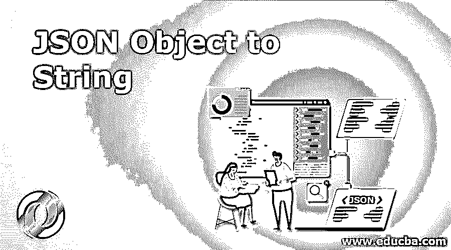
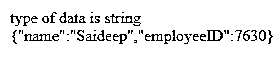
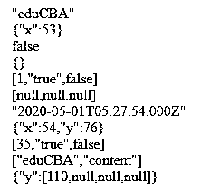
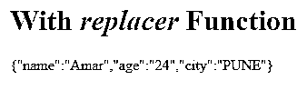
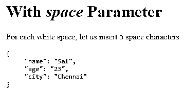

# JSON 对象到字符串

> 原文：<https://www.educba.com/json-object-to-string/>




## JSON 对象到字符串的介绍

今天我们将看到如何将 JSON 对象转换成字符串。那么什么是 JSON 对象呢？在我们之前的课程中已经给出了清晰的解释，你可能已经对这些 JSON 对象和字符串有了很好的了解。JSON 对象以键值对的形式编写，用逗号分隔，并用大括号括起来。JSON 对象用于与 web 服务器交换数据。JSON object to String 是 JSON object 到 String 的转换，可以使用 JSON.stringify()方法实现。在使用 JavaScript 开发许多应用程序时，需要将数据序列化为字符串，以便在数据库中存储数据并将其发送给 API。

### 句法

下面是提到的语法:

<small>网页开发、编程语言、软件测试&其他</small>

```
JSON.stringify(value, replace, space)
```

有 3 个这样的参数，

*   **值:**需要转换成 JSON 字符串的值
*   **Replacer:** 可以改变字符串化过程的可选函数。如果值为 NULL 或未提供，则对象的所有属性都包含在结果字符串中。
*   **Space:** 一个可选参数，用于控制使用 JSON.stringify()生成的最终字符串中的间距。如果是数字，指定的空格数将缩进到最后一个字符串，如果是字符串，则最多 10 个字符的字符串用于缩进

返回一个 JSON 字符串，如果是循环引用，或者试图对 BigInt 类型值进行字符串化时，将引发 TypeError 异常。

举个例子，

```
console.log( JSON.stringify({ x: 34, y: 56 }) );    // returns {"x":34,"y":56}
```

```
console.log ( JSON.stringify({ x: 35, y: 0 }, null) );    //returns { "x": 35, "y": 0 }
```

JSON 支持以下数据类型:

*   对象{ }
*   数组[ ]
*   原语:字符串、数字、布尔值(即真或假)和空值

### JSON 对象到字符串的示例

以下是下面提到的例子。

#### 示例#1

**代码:**

```
<!DOCTYPE html>
<html>
<head>
<title>Page Title</title>
<body>
<script>
var json = {"name": "Saideep", "employeeID": 7630};
data = JSON.stringify(json);
document.write('type of data is '+ typeof data + '</br>');
document.write(data);
</script>
</body>
</html>
```

**输出:**




#### 实施例 2

**代码:**

```
<!DOCTYPE html>
<html>
<head>
<title>Page Title</title>
<body>
<script>
document.write(JSON.stringify('eduCBA'));
document.write('</br>');
document.write(JSON.stringify({ x: 53 }));
document.write('</br>');
document.write(JSON.stringify(false));
document.write('</br>');
document.write(JSON.stringify({}));
document.write('</br>');
document.write(JSON.stringify([1, 'true', false]));
document.write('</br>');
document.write(JSON.stringify([null, NaN, Infinity]));
document.write('</br>');
document.write(JSON.stringify(new Date(2020, 4, 1, 10, 57, 54)))
document.write('</br>');
document.write(JSON.stringify({ x: 54, y: 76 }));
document.write('</br>');
document.write(JSON.stringify([new Number(35), new String('true'), new Boolean(false)]));
document.write('</br>');
let x = ['eduCBA', 'content'];
x['example'] = 'quickfix';
document.write(JSON.stringify(x));
document.write('</br>');
document.write(JSON.stringify({ y: [110, undefined, function(){}, Symbol('')] }));
document.write('</br>');
document.write(JSON.stringify({x: 2n}));  //BigInt value cannot be serialized in JSON: TypeError
</script>
</body>
</html>
```

**输出:**




JSON.stringify()将值转换为 JSON 符号，如下所示:

*   如果值为布尔值，数字、字符串对象将通过字符串化转换为相应的值
*   如果 value 有 toJSON()方法，它负责序列化哪些数据
*   如果 value 是未定义的、函数或符号，则它们不是有效的 JSON 值。这些值要么被省略，要么被更改为 NULL
*   数字无穷大、NaN 以及 null 值都被认为是 NULL。
*   所有对象实例，如 Map、Set、WeakSet 和 WeakMap，只有可枚举属性将被序列化

#### 实施例 3

**代码:**

```
<!DOCTYPE html>
<html>
<body>
<h1>With <em>replacer</em> Function</h1>
<p id="demo"></p>
<script>
var obj = { "name":"Amar", "age":"24", "city":"Pune"};
var text = JSON.stringify(obj, function (key, value) {
if (key == "city") {
return value.toUpperCase();
} else {
return value;
}
});
document.getElementById("demo").innerHTML = text;
</script>
</body>
</html>
```

**输出:**




#### 实施例 4

**代码:**

```
<!DOCTYPE html>
<html>
<body>
<h1>With <em>space</em> Parameter</h1>
<p>For each white space, let us insert 5 space characters</p>
<pre id="demo"></pre>
<script>
var obj = { "name":"Sai", "age":"23", "city":"Chennai"};
var text = JSON.stringify(obj, null, 5);
document.getElementById("demo").innerHTML = text;
</script>
</body>
</html>
```

**输出:**




**空间参数:**

用于在输出 JSON 时插入空格的字符串或数字对象。如果是一个数字，它表示用作空白的空格字符的数量。默认情况下，该值上限为 10，如果该值小于 1，则不包括空格。

如果对象是一个字符串，则字符串本身被用作空白，如果没有提供值或为空，则不向输出 JSON 添加空格。

**替换器参数:**

Replacer 可以是一个函数或者一个数组，作为函数，replacer 接受两个参数:键和值。首先，用一个空字符串调用 replacer，该空字符串表示要进行字符串化的对象。Replacer 不能用于从数组中移除值，在返回 undefined 或函数时，将使用 NULL。下面是一些数据类型的返回值，

*   如果返回值是 Number，则在添加到 JSON 字符串时，对应于该数字的字符串将用作属性值。
*   如果返回值是 String，则在添加到 JSON 字符串时，该字符串被用作属性。
*   如果返回值为布尔值，即“真”或“假”是添加到 JSON 字符串的属性值。
*   如果返回值为 null，则 NULL 属性被添加到 JSON 字符串中。
*   如果返回值是一个对象，它被递归地字符串化为 JSON 字符串。
*   如果返回值未定义，则该属性不会添加到 JSON 字符串中。

### 结论

我们已经看到了 JSON 到 string 的转换是如何使用 JSON.stringify()完成的，其中的一些例子已经进行了说明。它的一些例外，如何使用 space 和 replacer 将 JSON 对象转换成 String。作为一种数据格式，JSON 有它的标准和库，它支持所有的普通对象，比如字符串、数组、布尔和 null。任何带有 toJSON 的对象都由 JSON.stringify()调用。

### 推荐文章

这是一个 JSON 对象到字符串的指南。这里我们讨论 JSON 对象到字符串的语法和参数，例子以及代码和输出。你也可以看看下面的文章来了解更多-

1.  [Java 中的 JSON](https://www.educba.com/json-in-java/)
2.  [JSON 是什么？](https://www.educba.com/what-is-json/)
3.  [Python 中的 JSON](https://www.educba.com/json-in-python/)
4.  [SQL 中的 JSON](https://www.educba.com/json-in-sql/)


