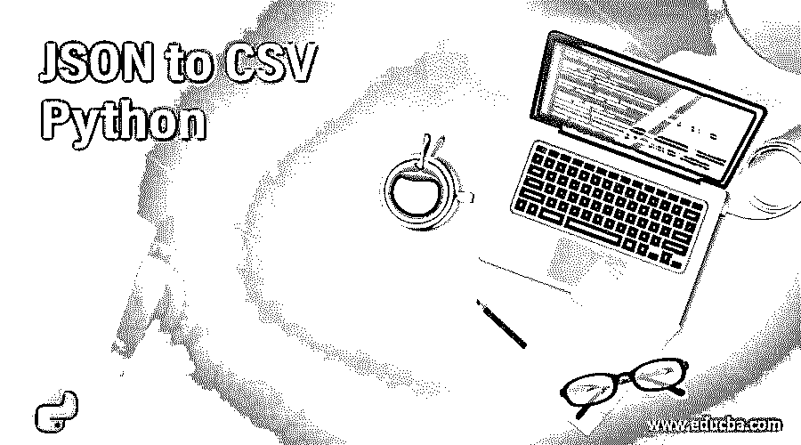
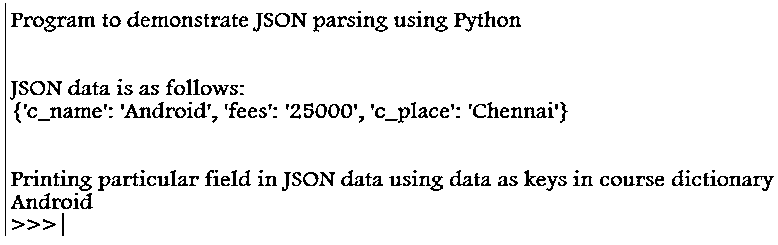
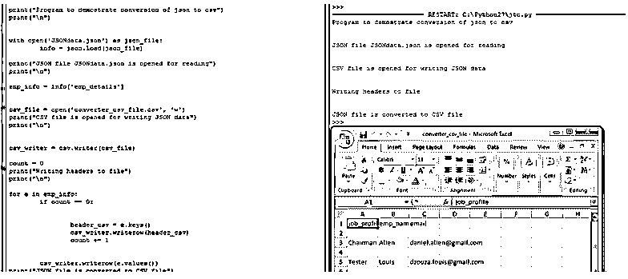
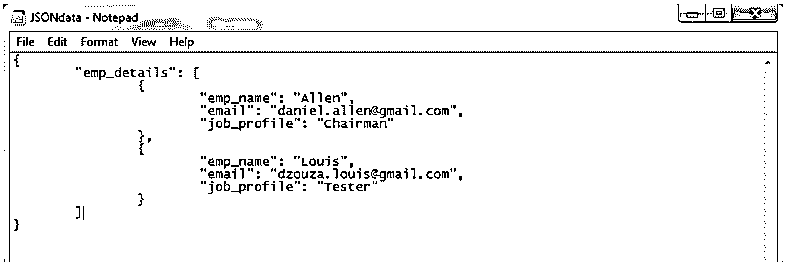
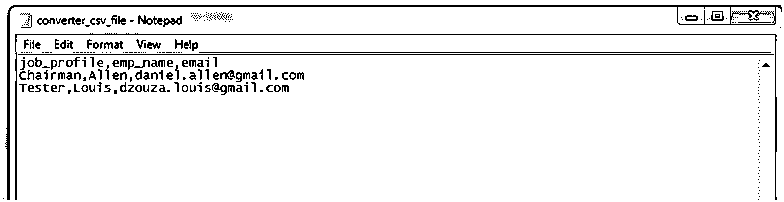

# JSON 到 CSV Python

> 原文：<https://www.educba.com/json-to-csv-python/>




## CSV Python 的 JSON 介绍

在本文中，我们将看到使用 Python 将 JSON 转换成 CSV。一般来说，JSON 文件包含 javascript 对象符号，用于使用 Python json 模块发送和接收数据，其中该模块需要在使用其功能之前导入 Python 程序。CSV 文件包含带有逗号分隔值的文本，用于以表格、电子表格或数据库格式存储数据。为了在 Python 程序中使用这些特性，我们需要导入 csv 模块。在本文中，JSON 到 CSV 的转换是通过使用 Python 脚本使 JSON 数据具有键-值对来完成的，其中键是 CSV 文件的头，值是 CSV 文件中的描述性数据。

### 如何用 Python 把 JSON 转换成 CSV？

在本文中，要使用 Python 脚本将 json 转换成 csv，我们首先需要导入 JSON 和 CSV 模块，它们是 Python 中的内置模块。在 Python 中，我们必须使用 json 模块的一些方法，比如“load ”,来从 JSON 文件中提取数据，这些数据将被保存为字典键。以及将数据写入 csv 文件的 CSV 模块方法，如 DictWriter()。要使用 Python 编程语言将任何 JSON 文件转换为 CSV 文件，我们必须将 JSON 键作为头来将其转换为 CSV 文件。

<small>网页开发、编程语言、软件测试&其他</small>

首先我们将看到如何用 Python 解析 JSON 数据，这是将 JSON 数据转换成 CSV 格式的重要部分。让我们看看使用 json 模块和 load()方法解析 JSON 数据的 Python 示例代码。首先，让我们看看下面的 JSON 数据示例，并将其保存为一个 JSON 文件，文件名为 JSONdata.json

```
{
"course_details": [
{
"c_name": "Android",
"fees": "25000",
"c_place": "Chennai"
}
]
}
```

不，我们将编写一个 Python 脚本来解析上面的 JSON 数据。

### JSON 到 CSV Python 的示例

下面是提到的不同例子:

#### 示例#1

**代码:**

```
import json
print("Program to demonstrate JSON parsing using Python")
print("\n")
course ='{"c_name":"Android", "fees": "25000", "c_place":"Chennai"}'
course_dict = json.loads(course)
print("JSON data is as follows:")
print(course_dict)
print("\n")
print("Printing particular field in JSON data using data as keys in course dictionary")
print(course_dict['c_name'])
```

**输出:**




在上面的程序中，我们可以看到我们已经声明了一个用于编写 json 数据的“course”变量，然后我们创建了一个字典，这样我们就可以使用 Python 内置模块“JSON”提供的“loads”方法来解析 JSON 数据，以处理 JSON 格式文件。所以在上面的截图中，我们看到了如何打印整个 JSON 数据，以及如何使用键打印特定的数据。这对于在 CSV 文件中编写头非常重要，这样我们就可以将 JSON 数据转换成 CSV 文件。在下面的部分，我们将看到如何做这个过程。让我们在下面的例子中演示一下:

#### 实施例 2

**代码:**

```
import json
import csv
print("Program to demostrate conversion of json to csv")
print("\n")
with open('JSONdata.json') as json_file:
info = json.load(json_file)
print("JSON file JSONdata.json is opened for reading")
print("\n")
emp_info = info['emp_details']
csv_file = open('converter_csv_file.csv', 'w')
print("CSV file is opened for writing JSON data")
print("\n")
csv_writer = csv.writer(csv_file)
count = 0
print("Writing headers to file")
print("\n")
for e in emp_info:
if count == 0:
header_csv = e.keys()
csv_writer.writerow(header_csv)
count += 1
csv_writer.writerow(e.values())
print("JSON file is converted to CSV file")
csv_file.close()
```

**输出:**




在上面的程序中，首先我们需要导入 json 和 csv 模块，后面我们可以看到“jsondata.json”这是一个 JSON 文件，包含了下面的数据。




上面的截图是包含 JSON 格式数据的 JSON 文件。打开此文件是为了读取和使用 json 模块的方法“load”。我们将提取 JSON 数据，这意味着 JSON 格式的解析主要是使用 load 方法完成的，然后我们通过以写入模式“w”打开 CSV 文件将其转换为 CSV 格式。然后，我们将编写头，通过 for 循环读取每个键，然后使用 csv 模块的 writerow()方法将每个数据值写入 CSV 文件。然后，我们可以在当前目录中看到输出，在该目录中创建了 JSON 文件 CSV 文件，我们可以打开 excel 格式的 CSV 文件，也可以在记事本中打开以查看正确的逗号分隔值。我们可以在截图 CSV 文件中看到。




上面的截图是由 JSON 格式转换成 CSV 格式的 CSV 文件。

我们也可以将这些 CSV 文件转换回 JSON 文件，这个过程与上面的过程正好相反。首先，我们将读取 CSV 数据值，然后以 JSON 格式写入这些数据值。在 Python 中，我们使用 DictReader()函数读取 CSV 文件，使用 json 模块的 dump()和 write()方法。但是我们必须记住，当打开文件时，我们应该适当地提到文件的模式，例如读“r”和写“w”。我们还应该在程序结束时关闭文件，将 JSON 格式转换为 CSV 格式，反之亦然，然后在将数据写入文件后，无论是将数据写入 CSV 文件还是 JSON 文件。

### 结论

在本文中，我们得出结论，在 Python 编程语言中，JSON 格式到 CSV 格式的转换很简单。通过导入 json 和 csv 模块，并使用这些模块的方法将 JSON 文件转换为 CSV 文件，可以很容易地完成这个过程。在本文中，我们首先看到了如何使用“loads()”方法解析 Python 中的 JSON 数据，然后我们看到了如何使用 Python 中 csv 模块的 writer()方法将转换后的 JSON 数据写入 CSV 文件。我们还看到了一个将 JSON 数据文件转换成 CSV 文件的例子，其中有程序输出的截图。

### 推荐文章

这是一个从 JSON 到 CSV Python 的指南。在这里，我们还讨论了如何用 python 将 json 转换成 csv，以及不同的例子和代码实现。您也可以看看以下文章，了解更多信息–

1.  [Laravel 响应 JSON](https://www.educba.com/laravel-response-json/)
2.  [JavaScript JSON](https://www.educba.com/javascript-json/)
3.  [JSON 解析器](https://www.educba.com/json-parser/)
4.  [将对象转换为 JSON C#](https://www.educba.com/convert-object-to-json-c-sharp/)


