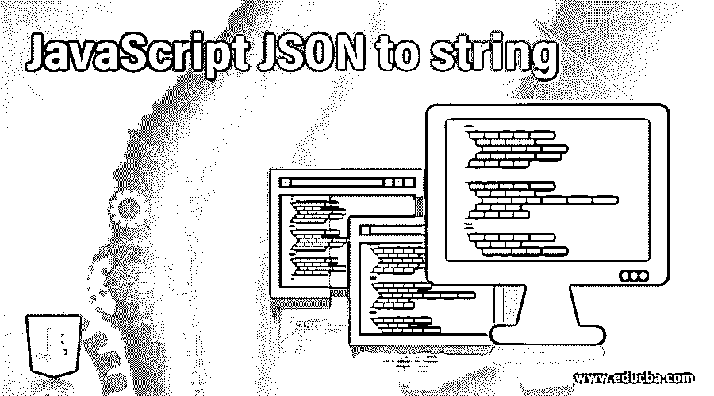
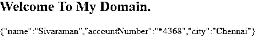

# JavaScript JSON 到字符串

> 原文：<https://www.educba.com/javascript-json-to-string/>




## JavaScript JSON to string 简介

在 javascript 中，我们已经创建了用于向服务器发送请求的客户端网页，因为我们的 web 浏览器使用 XML 和 JSON 等文件格式与客户端和服务器任务进行交互。JSON 是 javascript 对象符号，是服务器端的 web 请求和响应格式之一。我们可以使用 javascript 预定义的方法将 json 请求转换成字符串格式，比如 stringfy()，它被转换成 javascript 实例或要转换成 json 字符串的值。这些值被选择性地替换，因为 replacer 方法在当时被专门调用，或者在脚本中被专门调用 replacer 数组值的属性。

**语法:**

<small>网页开发、编程语言、软件测试&其他</small>

javascript 对象总是被转换成字符串格式或其他格式，但是客户端请求和服务器响应是使用 json 格式接收的。我们将看到在 javascript 代码中使用默认方法的地方。

```
<html>
<head>
<script>
function functionName()
{
---some javascript codes---
JSON.stringify(variablename,replacer values(spaces,…etc);
}
</script>
</head>
<body>
</body>
</html>
```

以上代码是名为 json.stringify()的 javascript 方法的基本语法，在脚本中的任何位置使用它来接收响应并将响应转换为字符串格式。

### JavaScript JSON 转 string 是如何工作的？

*   javascript 语言用于发送请求并从服务器接收响应。接收的数据将是 XML 或 json 格式。我们还使用 stringify()中的 stringify()方法将接收的数据转换为字符串格式 方法也是它的功能是用来改变字符串处理方法的行为和值是一个字符串和计算对象的数量作为一个属性的对象值是要包括在 JSON 字符串如果假设服务器响应值是 null 或不提供在字符串中所有属性的对象也包括在 JSON 字符串中收到的服务器响应数据中 空格也用于字符串和数字实例。插入空格，接收到的输出 JSON 字符串值用于可读性。
*   如果假设它是数字格式，则它指示每个字符的空格总数(包括空格)数字限制在 10 以内。如果值小于 1，则它指示不应该使用空格。如果必须用字符串来确认这一点，则字符串也被用作空白，如果假设没有提供函数参数或者值为 null，则字符串中不使用空白。
*   我们可以使用 parse()方法解析 json 字符串，它可以是 javascript 实例，也可以是与字符串数据类型相关的任何值。使用 reviver 方法，可以在返回结果实例之前对其进行转换。JSON.stringify()方法将接受更多的附加参数，因为 replacer 函数用于 string 或 integer 类型，以在给定的返回字符串值中使用它的空格。如果我们在 JSON 对象符号中返回未定义的值格式，replacer 参数可以用来过滤掉这些值。
*   json.stringify 方法用于数组或实例的深度复制，这意味着它将与要复制的其他数组或实例深度嵌套，而 reviver 函数专门用于通过解析计算的值，并在返回值之前转换这些值。返回的值和它是为其原始属性计算的，它与最常用的嵌套属性一起获取，它还在字符串值的转换之前处理原始值，它表示在 reviver 的帮助下运行和检查单个字符，并且对象总是包含自己的属性，这些属性也已经用原始属性名称作为字符串进行了处理，并且它的值作为自变量/参数传递。
*   如果假设 reviver 方法返回未定义的值格式，这意味着服务器响应具有空值或没有值。如果客户端请求被发送到服务器，并且其执行落在方法的末尾，则它返回没有值。必须从自己的实例中删除响应属性，否则属性继续并再次重新定义以返回值。

### 将 JavaScript JSON 实现为 string 的示例

下面是提到的例子:

#### 示例#1

**代码:**

```
<!DOCTYPE html>
<html>
<body>
<h2>Welcome To My Domain.</h2>
<p id=*"demo"*></p>
<script>
var x = { name: "Sivaraman", age: 31, city: "Chennai" };
var y = JSON.stringify(x);
document.getElementById("demo").innerHTML = y;
</script>
</body>
</html>
```

**输出:**


#### 实施例 2

**代码:**

```
<!DOCTYPE html>
<html>
<body>
<h2>Welcome To My Domain</h2>
<p id=*"demo"*></p>
<script>
var a = '{"emp":[' +
'{"firstName":"Siva","lastName":"Raman" },' +
'{"firstName":"Arun","lastName":"Kumar" },' +
'{"firstName":"dsa","lastName":"erf" },' +
'{"firstName":"ytrr","lastName":"dds" },' +
'{"firstName":"wqss","lastName":"ijjy" },' +
'{"firstName":"Arun","lastName":"dd" },' +
'{"firstName":"Sam","lastName":"Anderson" }]}';
obj = JSON.parse(a);
document.getElementById("demo").innerHTML =
obj.emp[0].firstName + " " + obj.emp[0].lastName;
document.getElementById("demo").innerHTML =
obj.emp[1].firstName + " " + obj.emp[1].lastName;
document.getElementById("demo").innerHTML =
obj.emp[2].firstName + " " + obj.emp[2].lastName;
document.getElementById("demo").innerHTML =
obj.emp[3].firstName + " " + obj.emp[3].lastName;
document.getElementById("demo").innerHTML =
obj.emp[4].firstName + " " + obj.emp[4].lastName;
</script>
</body>
</html>
```

**输出:**


#### 实施例 3

**代码:**

```
<!DOCTYPE html>
<html>
<body>
<h2>Welcome To My Domain.</h2>
<p id=*"demo"*></p>
<script>
var x = { "name":"Sivaraman", "accountNumber":"1235364368", "city":"Chennai"};
var y = JSON.stringify( x,sample);
document.getElementById("demo").innerHTML = y;
function sample (keys, values) {
var val = values;
if (keys == "accountNumber")
{
if(values && values.length > 5) {
val = "*" + val.substring(values.length - 4, values.length);
} else {
val = "****";
}
}
return val;
}
</script>
</body>
</html>
```

**输出:**




上述示例中，我们以 javascript 的不同方式使用了 stringify 和 parse 方法。对于每个示例，我们使用 stringify 方法将 json 对象转换为字符串值，并使用 parse 方法将字符串数据重新获取到 javascript 的对象或实例中。

### 结论

在 json.stringify()方法中，如果一次又一次地创建特定的循环实例，也会抛出错误和异常。这些类型的功能可能不会与其他变化相比，它将在最新的修订版中新创建和开发，以避免可能的错误。

### 推荐文章

这是一个 JavaScript JSON 转 string 的指南。这里我们讨论一个 JavaScript to string 的介绍，它是如何与编程例子一起工作的。您也可以浏览我们的其他相关文章，了解更多信息——

1.  [JavaScript join()](https://www.educba.com/javascript-join/)
2.  [JavaScript 子数组()](https://www.educba.com/javascript-subarray/)
3.  [JavaScript 中的多态性](https://www.educba.com/polymorphism-in-javascript/)
4.  [JavaScript 展平数组](https://www.educba.com/javascript-flatten-array/)


