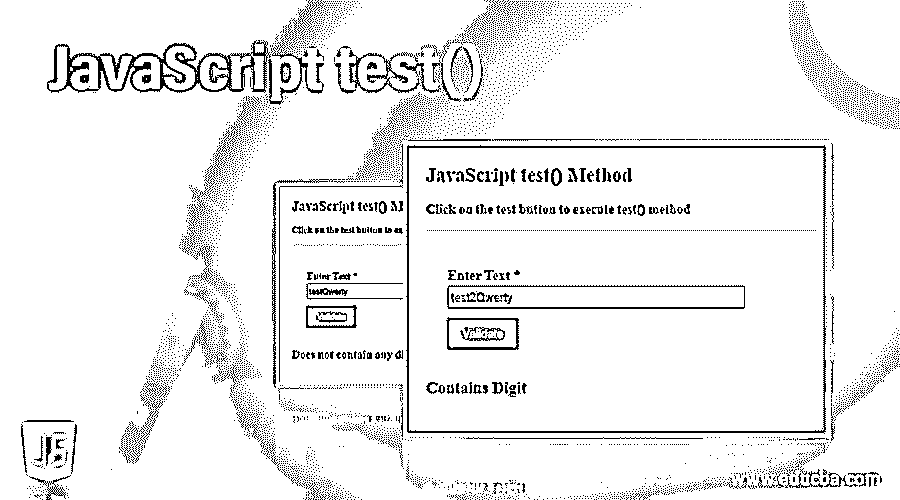
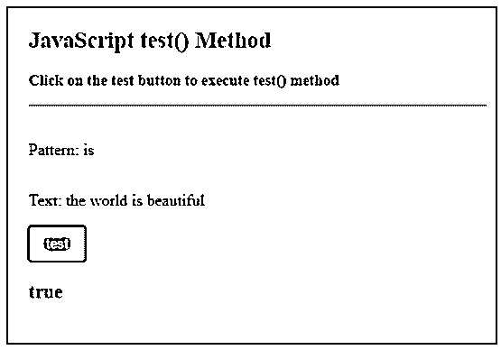
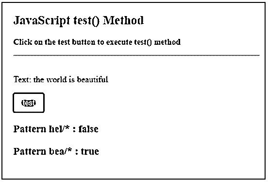
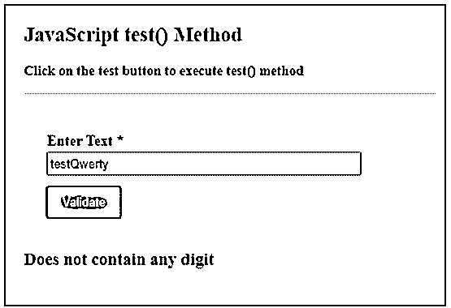
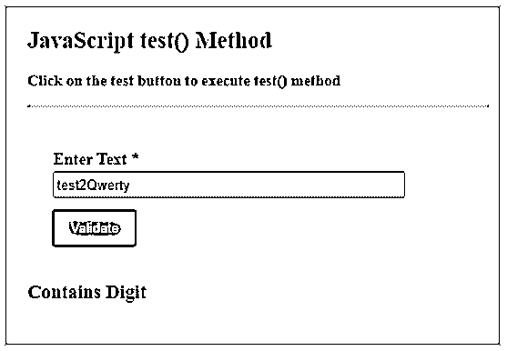

# JavaScript 测试()

> 原文：<https://www.educba.com/javascript-test/>




## JavaScript 测试简介()

JavaScript test()方法是一种正则表达式方法，用于将表达式的模式与字符串进行匹配。RegExp 是 JavaScript 中的内置对象，它提供了将文本与模式匹配的功能。test()方法是这个 RegExp 对象的方法，可作为 RegExp.prototype.test()使用。在 RegExp 对象上调用此方法。此方法使用 RegExp 对象提供的模式对指定文本执行搜索，并返回一个布尔值 true 或 false，表示是否找到匹配项。如果在字符串中找到匹配，则返回 true，否则返回 false。

**语法:**

<small>网页开发、编程语言、软件测试&其他</small>

```
regexObj.test(str);
```

**参数**

*   regex Obj: regexObj 是 RegExp 的一个对象，它定义了要搜索的正则表达式。
*   **str:** str 是一个字符串，该正则表达式将应用于该字符串并与之匹配。
*   **返回值:**返回布尔值 true 或 false。如果任何匹配者发现其他为假，则为真。

### test()方法在 JavaScript 中是如何工作的？

test()方法应用正则表达式，从左到右搜索文本以找到匹配项。如果找到一个匹配，则返回 true，否则继续搜索直到字符串结束。如果在整个字符串中没有找到匹配，则返回 false。它区分大小写，所以字符串需要完全匹配。它不像 search()方法那样返回找到匹配的字符的索引。

### 用 JavaScript 实现 test()的示例

下面是一些例子:

#### 示例#1

简单文本搜索

**代码:**

```
<!DOCTYPE html>
<html>
<head>
<title>
JavaScript test() Method
</title>
<style>
.body-data {
border : #81D4FA 2px solid;
background-color : #03a9f400;
text-align : left;
padding-left : 20px;
padding-bottom: 20px;
height : auto;
width : auto;
}
.resultText {
margin: 0 0 3px 0;
padding: 0px;
display: block;
font-weight: bold;
}
.heading {
font-weight: bold;
border-bottom: 2px solid #ddd;
font-size: 15px;
width: 98%;
}
.list button[ type = submit] {
background: #2196F3;
padding: 10px 17px 10px 17px;
margin-right: 10px;
color: #fff;
border: none;
}
.list button[ type = submit]:hover {
background: #2173f3;
}
</style>
</head>
<body>
<div class = "body-data">
<div class = "heading">
<h2> JavaScript test() Method </h2>
<p> Click on the test button to execute test() method </p>
</div>
<div class = "list" >
</br>
<label> Pattern: </label>
<p id = "pattern" style = "display: inline-block;" > Default </p>
</br>
<label> Text: </label>
<p id = "text" style = "display: inline-block;" > Default </p>
</br>
<button type = "submit" value = "submit" onclick = "matchPattern()"> test </button>
</div>
<div class = "resultText">
<h3 id = "result1"></h3>
</div>
</div>
<script type = "text/javascript">
var text = "the world is beautiful";
var regex = "is";
document.getElementById("text").innerHTML = text;
document.getElementById("pattern").innerHTML = regex;
function matchPattern() {
var pattern = new RegExp(regex);
var result = pattern.test(text);
document.getElementById("result1").innerHTML = result;
}
</script>
</body>
</html>
```

**输出:**




#### 实施例 2

使用正则表达式。

**代码:**

```
<!DOCTYPE html>
<html>
<head>
<title>
JavaScript test() Method
</title>
<style>
.body-data {
border : #81D4FA 2px solid;
background-color : #03a9f400;
text-align : left;
padding-left : 20px;
padding-bottom: 20px;
height : auto;
width : auto;
}
.resultText {
margin: 0 0 3px 0;
padding: 0px;
display: block;
font-weight: bold;
}
.heading {
font-weight: bold;
border-bottom: 2px solid #ddd;
font-size: 15px;
width: 98%;
}
.list button[ type = submit] {
background: #2196F3;
padding: 10px 17px 10px 17px;
margin-right: 10px;
color: #fff;
border: none;
}
.list button[ type = submit]:hover {
background: #2173f3;
}
</style>
</head>
<body>
<div class = "body-data">
<div class = "heading">
<h2> JavaScript test() Method </h2>
<p> Click on the test button to execute test() method </p>
</div>
<div class = "list" >
</br>
<label> Text: </label>
<p id = "text" style = "display: inline-block;" > Default </p>
</br>
<button type = "submit" value = "submit" onclick = "matchPattern()"> test </button>
</div>
<div class = "resultText">
<h3 id = "result1"></h3>
<h3 id = "result2"></h3>
</div>
</div>
<script type = "text/javascript">
var text = "the world is beautiful";
var regex = "hel/*";
document.getElementById("text").innerHTML = text;
function matchPattern() {
var pattern = new RegExp(regex);
var result = pattern.test(text);
document.getElementById("result1").innerHTML = "Pattern hel/* : " + result;
var pattern = new RegExp("bea/*");
document.getElementById("result2").innerHTML = "Pattern bea/* : " + pattern.test(text);
}
</script>
</body>
</html>
```

**输出:**




#### 实施例 3

检查文本是否包含任何数字，

**代码:**

```
<!DOCTYPE html>
<html>
<head>
<title>
JavaScript test() Method
</title>
<style>
.body-data {
border : #81D4FA 2px solid;
background-color : #03a9f400;
text-align : left;
padding-left : 20px;
padding-bottom: 20px;
height : auto;
width : auto;
}
.resultText {
margin: 0 0 3px 0;
padding: 0px;
display: block;
font-weight: bold;
}
.heading {
font-weight: bold;
border-bottom: 2px solid #ddd;
font-size: 15px;
width: 98%;
}
.form {
margin:5px auto;
max-width: 700px;
padding: 25px 15px 15px 25px;
}
.form li {
margin: 12px 0 0 0;
list-style: none;
}
.form label {
margin: 0 0 3px 0;
padding: 0px;
display: block;
font-weight: bold;
}
.form .field {
width: 80%;
height: 20px;
}
.form button[ type = submit] {
background: #2196F3;
padding: 10px 17px 10px 17px;
margin-right: 10px;
color: #fff;
border: none;
}
.form button[ type = submit]:hover {
background: #2173f3;
}
</style>
</head>
<body>
<div class = "body-data">
<div class = "heading">
<h2> JavaScript test() Method </h2>
<p> Click on the test button to execute test() method </p>
</div>
<form action = "#" onsubmit = "return matchPattern()" >
<ul class = "form" >
<li>
<label> Enter Text  * </label>
<input type="text" class="field" />
</li>
<li>
<button type = "submit" value = "submit"> Validate </button>
</li>
</ul>
</form>
<div class = "resultText">
<h3 id = "result1"></h3>
</div>
</div>
<script type = "text/javascript">
function matchPattern() {
var pattern = new RegExp("[0-9]");
var text = document.getElementsByClassName("field")[0].value;
var result = pattern.test(text);
if(result){
document.getElementById("result1").innerHTML = "Contains Digit" ;
}else {
document.getElementById("result1").innerHTML = "Does not contain any digit" ;
}
}
</script>
</body>
</html>
```

**输出:**







### 优势

下面给出了一些优点:

*   可以利用正则表达式并直接实现它们来有效地搜索 JavaScript 中的匹配项。
*   因为 test()是一个内置方法，所以不需要实现额外的搜索逻辑。
*   代码变得更少，开发人员可以更专注于业务逻辑。
*   使用这种方法非常简单。
*   因为正则表达式是通用的，所以它可以从任何其他语言中提取并在 JavaScript 中使用。

### 推荐文章

这是 JavaScript 测试指南()。在这里，我们还讨论了 javascript 中 test()方法的介绍和工作原理，以及不同的例子和代码实现。您也可以看看以下文章，了解更多信息–

1.  [JavaScript 布尔()](https://www.educba.com/javascript-boolean/)
2.  [JavaScript 应用](https://www.educba.com/javascript-apply/)
3.  [JSON.stringify JavaScript](https://www.educba.com/json-stringify-javascript/)
4.  [JavaScript 数组包含()](https://www.educba.com/javascript-array-includes/)


