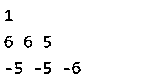
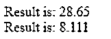
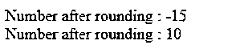

# JavaScript 中的 round()

> 原文：<https://www.educba.com/round-in-javascript/>


## JavaScript 中的 round()简介

[JavaScript 中的 round()函数是一个数学函数](https://www.educba.com/javascript-math-functions/)。此函数用于将数字四舍五入为最接近的整数。舍入数字的概念是，如果数字的小数部分大于或等于 0.5，则该数字将被舍入到下一个更大的整数。同样，如果该数字小于或等于 0.5，则该数字将被舍入到前面的整数。简而言之，round()函数将数字四舍五入为最接近的整数。

**语法**

<small>网页开发、编程语言、软件测试&其他</small>

round 函数的语法如下:

```
Round(x)
```

这是一个接受单个参数的用户定义函数。这是将被四舍五入的数字。该功能可以解释为:

```
Math.round(x)
```

这里 Math 是一个预定义的 Javascript 对象。Round 用于获取数字的值，该值将被舍入到最接近的整数。这个函数是一个静态方法，因此总是在数学中使用。圆形(x)。返回值或结果将是与给定数字最接近的整数。让我们看几个例子，看看 round 函数是如何工作的。

### JavaScript 中的 round()示例

下面提到了不同的例子:

#### 示例#1

```
console.log(Math.round(0.9));
```

在这个例子中，函数 math。Round()的数字是 0.9。然而，根据函数的工作原理，它应该四舍五入为 1，因为 1 是最接近的整数。

```
console.log(Math.round(5.95), Math.round(5.5), Math.round(5.05));
```

同样，在上面的例子中，三个数字被四舍五入。第一个有使用数字 5.95 的功能。最接近 5.95 的整数是 6，这将是这段代码的输出。下一个数字是 5.5，将再次四舍五入为 6。最后，数字 5.05 将被舍入到前面的整数，比 6 多接近 5。

```
console.log(Math.round(-5.05), Math.round(-5.5), Math.round(-5.95));
```

上面的例子是对负数进行四舍五入。这里第一个数字将被四舍五入为-5。同样，第二个数字将被舍入到-5。最大的数字是-5。最后，第三个数字将被四舍五入为-6，因为这个整数更接近。

**输出:**




上面的屏幕截图显示了前面代码的结果。

#### 实施例 2

**代码:**

```
<!DOCTYPE html>
<html>
<body>
<script type="text/javascript">
var num = 28.653
var result = Math.round(num * 100) / 100
document.write("<br />Result is: " +result);
var result1=Math.round(8.111111 * 1000)/1000
document.write("<br />Result is: " +result1);
</script>
</body>
</html>
```

**输出:**




**说明:**

```
var num = 28.653
var result = Math.round(num * 100) / 100  // returns 28.65
```

上面的函数在变量 num 上使用了一个 round 函数，并精确到两位小数。此代码的结果将是 28.65

类似地，我们可以将 var num 四舍五入到小数点后一位。我们可以通过使用以下代码来实现:

```
var result=Math.round(num *10) / 10  // returns 28.5
```

在这里，代码将返回值 28.5 作为结果。

我们也可以把数字四舍五入到小数点后三位。为此，下面的代码会有所帮助。

```
var result=Math.round(8.111111 * 1000)/1000  // returns 8.111
```

这里的结果变量使用数字 8.11111，它的值最多只有三位小数。我们使用 1000，因为我们希望结果精确到小数点后 3 位。因此，这里的结果将是 8.111。

这里的要点是你选择的太多小数位的四舍五入公式。您可以遵循以下步骤:

*   将任意一个数乘以 10 的 x 次方个^x
*   这样做之后，您就可以轻松地应用 math.round()函数了。
*   一旦这样做了，结果可以除以 10 ^ x

因此，该公式有助于利用舍入函数达到您想要的位数。根据数量可以是上限或下限。你可以很容易地用这个来决定位数。

#### 实施例 3

让我们举一个例子来解释当十进制中有一个. 5 时，round()函数是如何工作的。

**代码:**

```
<!DOCTYPE html>
<html>
<body>
<p id="example"></p>
<script type="text/javascript">
var round =Math.round(-15.5);
document.write("Number after rounding : " + round);
document.write("<br>")
var round =Math.round(9.51);
document.write("Number after rounding : " + round);
</script>
</body>
</html>
```

**输出:**




上面的程序将帮助你理解当有 0.5 时 round 函数的工作原理。

JavaScript 中的 round 函数舍入到最接近的整数。例如，round 函数将数字-15.5 四舍五入为最接近的整数 15。同样，当它找到一个正整数时，最接近的值就是下一个数字。所以这个的输出是 10。你可以在下面查看上述程序的结果。

在运行这个函数时，您也可能会遇到一些错误或异常。这些可以像用户将发送一个非数字字符串。这可能会导致 NaN。另一个原因可能是用户将一个空变量作为参数发送给该函数。这也会导致 NaN。同样，空字符串或空数组也会导致类似的问题。如果传递一个包含多个整数的数组，也会引发错误或异常。

### 结论

JavaScript 和所有语言一样，支持数学库。数学库提供了负责舍入数字的 round 函数。这种舍入可以是数字之前或之后最接近的整数。该函数将这些小数值四舍五入为最接近的整数。round 函数也可以用于事件。它能够将正数和负数四舍五入为最接近的整数。因此，round()函数对于与金融领域相关的业务非常重要。

### 推荐文章

这是 JavaScript 中 round()的指南。这里我们讨论 JavaScript 中的 round()的简介、例子、语法、代码和输出。您也可以浏览我们推荐的其他文章，了解更多信息——

1.  [JavaScript 迭代数组](https://www.educba.com/javascript-iterate-array/)
2.  [JavaScript 中的字符串](https://www.educba.com/string-in-javascript/)
3.  [Javascript 原型](https://www.educba.com/javascript-prototype/)
4.  [JavaScript 中的符号()](https://www.educba.com/sign-in-javascript/)


