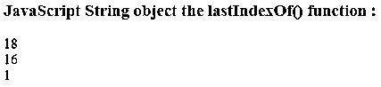
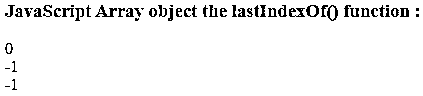
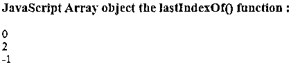

# JavaScript lastIndexOf()

> 原文：<https://www.educba.com/javascript-lastindexof/>

")


## JavaScript lastIndexOf()函数介绍

javascript 中的 lastIndexOf()函数有不同的用途。lastIndexOf()函数可以在字符串和数组上用于不同的任务。lastIndexOf()函数用于返回给定字符串中特定单词或字符的起始位置。函数的作用是:返回给定数组中特定元素的索引位置。lastIndexOf()函数是 javaScript 中的内置函数。该函数与 javaScript 中的 indexOf()函数相同，但不同之处在于它从字符串或数组的最后一个位置开始查找元素。

lastIndexOf()函数返回的索引位置总是从字符串或数组中第一个元素的零开始。如果在字符串或数组中找不到元素，则返回

<small>网页开发、编程语言、软件测试&其他</small>

### Syntax of JavaScript lastIndexOf()

根据传递的任务和参数，使用 lastIndexOf()函数有不同的语法，如下所示:

**1。**字符串的 lastIndexOf()函数的语法:

*   **lastIndexOf(character):** 这个函数给出一个字符在函数中的最后一个索引位置。
*   **lastIndexOf(character，indexpos):** 这个函数给出一个字符的最后一个索引位置，但是从给定的索引位置开始以相反的顺序查找一个元素。
*   **lastIndexOf(string):** 该函数给出函数中给定字符串第一个字符的最后一个索引位置。
*   **lastIndexOf(string，indexpos):** 该函数给出给定字符串的第一个字符的最后一个索引位置，但以相反的顺序从给定的索引位置开始查找元素。

**2。**数组的 lastIndexOf()函数的语法:

*   **lastIndexOf(element):** 该函数给出了函数中传递的元素的最后一个索引位置。
*   **lastIndexOf(element，indexpos):** 该函数给出函数中传递的元素的最后一个索引位置，但从给定的索引位置开始以相反的顺序查找元素。

#### JavaScript lastIndexOf()的参数

以下是 JavaScript lastIndexOf()的参数:

*   **字符:**该参数指定要查找其索引位置单个字符，例如‘h’。
*   **indexpos:** 该参数指定一个索引位置，从该位置开始查找一个元素。
*   **string:** 该参数指定要查找其索引位置单个字符，例如“hello”。
*   **element:** 该参数指定一个元素，其索引位置将在数组中找到。

函数的返回值是给定元素的索引位置。

### lastIndexOf()函数的函数和示例

下面是 html 代码，通过示例可以更清楚地理解 lastIndexOf()函数:

#### 示例#1

我们编写 html 代码来更清楚地理解 lastIndexOf()函数，在该函数中我们搜索字符串的第一个字符，如下例所示。

**代码:**

```
<!DOCTYPE html>
<head>
<title>This is an example for lastIndexOf() function</title>
</head>
<body>
<h3>JavaScript String object the lastIndexOf() function :</h3>
<script>
var str= "This is sample string.";
document.write(str.lastIndexOf('i')+ "<br />");
document.write(str.lastIndexOf('t')+ "<br />");
document.write(str.lastIndexOf('h')+ "<br />");
</script>
</body>
</html>
```

**输出:**




在上面的输出中，“I”的最后一个索引是 18，“t”是 16，“h”是 1。

#### 实施例 2

我们编写 html 代码来更清楚地理解 lastIndexOf()函数，例如在提供起始索引位置的字符串中搜索字符，如下例所示。

**代码:**

```
<!DOCTYPE html>
<head>
<title> This is an example for lastIndexOf() function </title>
</head>
<body>
<h3>JavaScript String object the lastIndexOf() function :</h3>
<script>
var str = "This is sample string.";
document.write(str.lastIndexOf('i',6)+ "<br />");
document.write(str.lastIndexOf('t',10)+ "<br />");
document.write(str.lastIndexOf('h',0)+ "<br />");
</script>
</body>
</html>
```

**输出:**

 Example 2")


在上面的输出中,“I”的最后一个索引是 5，因为它以相反的顺序从第 6 个<sup>索引开始查找(最多 6 个索引),因此“I”在第 5 个<sup>索引处被找到,“t”是-1，因为“t”在第 10 个索引处没有被找到,“h”是-1，与“h”相同。在 0 索引之前找不到。</sup></sup>

#### 实施例 3

我们编写 html 代码来更清楚地理解 lastIndexOf()函数，在这里我们搜索字符串的第一个字符，如下例所示。

**代码:**

```
<!DOCTYPE html>
<head>
<title> This is an example for lastIndexOf() function </title>
</head>
<body>
<h3>JavaScript String object the lastIndexOf() function :</h3>
<script>
var str = "This is sample string.";
document.write(str.lastIndexOf("is")+ "<br />");
document.write(str.lastIndexOf("sample")+ "<br />");
document.write(str.lastIndexOf("hello")+ "<br />");
</script>
</body>
</html>
```

**输出:**

 Example 3")


在上面的输出中，字符串“is”的第一个字符的最后一个索引是 5，“sample”是 8，“hello”是-1，因为没有找到字符串。

#### 实施例 4

我们编写 html 代码来更清楚地理解 lastIndexOf()函数，其中我们通过提供起始索引位置来搜索字符串的元素，如下例所示。

**代码:**

```
<!DOCTYPE html>
<head>
<title> This is an example for lastIndexOf() function </title>
</head>
<body>
<h3>JavaScript String object the lastIndexOf() function :</h3>
<script>
var str = "This is sample string.";
document.write(str.lastIndexOf("is",4)+ "<br />");
document.write(str.lastIndexOf("sample",6)+ "<br />");
document.write(str.lastIndexOf("hello",16)+ "<br />");
</script>
</body>
</html>
```

**输出:**

 Example 4")


在上面的输出中，字符串“is”的第一个字符的最后一个索引是 2 到 4 个索引，“sample”是-1，因为没有找到多达 6 个索引字符串，而“hello”是-1，因为没有找到 is 字符串。

#### 实施例 5

我们编写 html 代码来更清楚地理解 lastIndexOf()函数，其中我们通过提供起始索引位置来搜索数组的元素，如下例所示。

**代码:**

```
<!DOCTYPE html>
<head>
<title>This is an example for lastIndexOf() function</title>
</head>
<body>
<h3>JavaScript Array object the lastIndexOf() function :</h3>
<script>
var array = ["Apple", "Banana", "Orange"];
document.write(array.lastIndexOf("Apple")+ "<br />");
document.write(array.lastIndexOf("orange")+ "<br />");
document.write(array.lastIndexOf("hello")+ "<br />");
</script>
</body>
</html>
```

**输出:**




在上面的输出中，元素“Apple”的最后一个索引是 0，“orange”是-1，因为 last index of()函数区分大小写，因此“orange”与“Orange”不同，而“hello”是-1，因为没有找到元素。

#### 实施例 6

我们编写 html 代码来更清楚地理解 lastIndexOf()函数，其中我们通过提供起始索引位置来搜索数组的元素，如下例所示。

**代码:**

```
<!DOCTYPE html>
<head>
<title> This is an example for lastIndexOf() function </title>
</head>
<body>
<h3>JavaScript Array object the lastIndexOf() function :</h3>
<script>
var array = ["Apple", "Banana", "Orange"];
document.write(array.lastIndexOf("Apple",2)+ "<br />");
document.write(array.lastIndexOf("Orange",2)+ "<br />");
document.write(array.lastIndexOf("Banana",0)+ "<br />");
</script>
</body>
</html>
```

**输出:**




在上面的输出中，元素“Apple”的最后一个索引是 0(在给定的索引位置)，“Orange”是 2，“Banana”是-1，因为在给定的索引处没有找到元素。

### 结论

lastIndexOf()函数是 javaScript 中的内置函数，用于对字符串和数组对象执行不同的任务。lastIndexOf()返回给定字符串或数组中元素的最后一个索引位置。注意 lastIndexOf()函数是区分大小写的。

### 推荐文章

这是 JavaScript lastIndexOf()的指南。这里我们讨论 JavaScript lastIndexOf()及其参数的介绍，以及示例和代码实现。您也可以浏览我们推荐的其他文章，了解更多信息——

1.  [JavaScript 字符串格式](https://www.educba.com/javascript-string-format/)
2.  [Javascript 嵌套函数](https://www.educba.com/javascript-nested-functions/)
3.  [JavaScript 日期函数](https://www.educba.com/javascript-date-function/)
4.  [JavaScript 历史对象](https://www.educba.com/javascript-history-object/)


