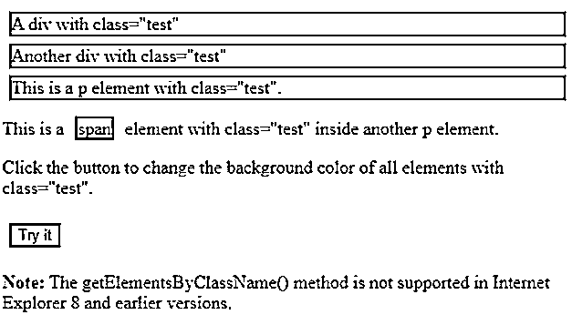
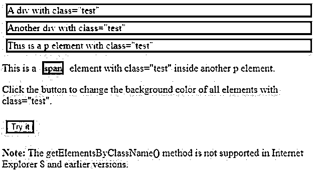
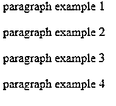
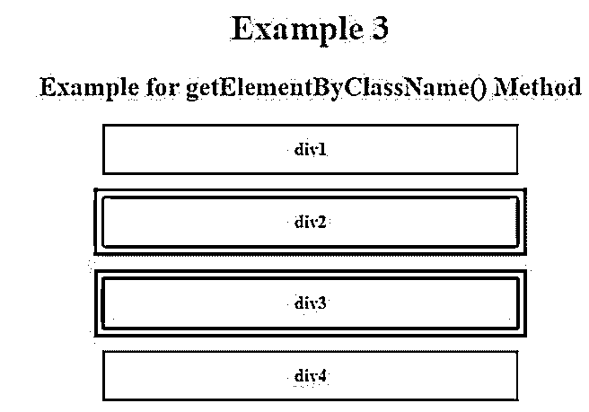

# JavaScript getElementsByClassName()

> 原文：<https://www.educba.com/javascript-getelementsbyclassname/>


## JavaScript getElementsByClassName()简介

以下文章提供了 JavaScript getElementsByClassName()的概要。getElementsByClassName()是一个名为 Document 的接口函数，它为我们提供了所有子成员的类似数组的对象，这些子成员以 HTML 的形式输入了所有的类名。这个 HTMLCollection 对象表示节点的集合。这些节点可以通过从 0 开始的索引编号来获得。将搜索整个文档，包括调用 document 对象时的主根节点。这个函数 getElementsByClassName()也可以在任何元素上调用，它将只给出那些元素的输出，这些元素将是所描述的根元素与指定类名的乘积。

**语法:**

<small>网页开发、编程语言、软件测试&其他</small>

```
document.getElementsByClassName(classname)
```

**参数:**

*   **classname:** 此参数的类型为 string，并且是必填字段，因为它是唯一的输入参数。它表示我们想要获取的类及其元素的名称。当我们需要搜索多个类名时，我们应该使用空格将它们分开，例如“test example”。

**返回值:**

这个函数获取并给我们一个 HTMLCollection 对象，它显示了具有所描述的类名的元素的集合。返回的元素将按照它们在源代码中的样子进行排序。

### JavaScript getElementsByClassName()的示例

下面是提到的例子:

#### 示例#1

**代码:**

```
<!DOCTYPE html>
<html>
<head>
<style>
.test {
border: 2px solid black;
margin: 6px;
}
</style>
</head>
<body>
<div class="test">
A div with class="test"
</div>
<div class="test">
Another div with class="test"
</div>
<p class="test">This is a p element with class="test".</p>
<p>This is a span element with class="test" inside another p element.</p>
<p>Click the button to change the background color of all elements with class="test".</p>
<button class="test" onclick="myTest()">Try it</button>
<p><strong>Note:</strong> The getElementsByClassName() method is not supported in Internet Explorer 8 and earlier versions.</p>
<script>
function myTest() {
var x = document.getElementsByClassName("test");
vari;
for (i = 0; i<x.length; i++) {
x[i].style.backgroundColor = "red";
}
}
</script>
</body>
</html>
```

**输出:**




**点击尝试按钮后:**




在这个例子中，我们首先按照我们的要求声明边界和边距。然后，我们在主体中指定两个 div 类，然后指定一个 p 元素，类名为“test”。我们创建了一个名为“try it”的按钮，当我们单击它时，顶部的所有 div 元素都将变为指定的红色。

这将在 getElementsByClassName()函数的帮助下完成。我们将一个函数描述为 myTest()，其中我们用相同的类名 Test 调用这个函数 getElementsByClassName。使用 for 循环，我们将红色分配给名为“test”的类。因此，在输出中，我们可以看到，当我们单击 try 按钮时，上面的所有文本都将变为红色，他们正在进行类“测试”。

#### 实施例 2

**代码:**

```
<html>
<body>
<div id="parent">
<p>paragraph example 1</p>
<p class="test1">paragraph example 2</p>
<p>paragraph example 3</p>
<p>paragraph example 4</p>
</div>
<script>
var parent = document.getElementById("parent");
var test = parent.getElementsByClassName("test1");
// To fetch a list of matching members apart from the
// element itself
console.log(test); //HTMLCollection[1]
vartestTarget = parent.getElementsByClassName("test1")[0];
// Fetching the first element
console.log(testTarget);
//<p class="test">paragraph example 2</p>
</script>
</body>
</html>
```

**输出:**




在这个例子中，我们首先在 HTML 主体中声明几个带有“段落示例”文本的 div。接下来，我们在 getElementsByClassName()函数的帮助下获取 html collection“parent”的类名。同样，我们也获取“test”类的匹配元素，并在输出中打印出来。然后通过这个函数“document . getelementsbyclassname(' test ')[0]”我们检索属于类“test”的第一个元素。当没有匹配的元素时，它返回 undefined。所有属于“test”类的元素都显示在输出中。

#### 实施例 3

**代码:**

```
<!DOCTYPE html>
<html>
<head>
<title>Example for getElementByClassName() Method</title>
<style>
h1 {
color: red;
}
body {
text-align: center;
}
.example {
padding: 12px;
margin: auto;
margin-top: 12px;
border: 2px solid black;
width: 350px;
}
</style>
</head>
<body>
<h1>Example 3</h1>
<h2>Example for getElementByClassName() Method</h2>
<div>
<h4 class="colorless border example">div1</h4>
<h4 class="example for red border">div2</h4>
<h4 class="example for blue border">div3</h4>
<h4 class="colorless border example">div4</h4>
</div>
<script>
document.getElementsByClassName('example for blue border')[0]
.style.border="10px solid blue";
document.getElementsByClassName('example for red border')[0]
.style.border="10px solid red";
</script>
</body>
</html>
```

**输出:**




与上面的例子相似，这里我们展示了 4 个指定长度、宽度和颜色的盒子，它们的边框应该由这些颜色组成。这个例子基本上展示了 getElementByClassName()函数在网页中的实时实现。在 HTML 的主体中，我们可以看到我们只为那些使用 getElementByClassName()方法调用的类设置了边界。它们是红色和蓝色边框类，因此在输出中，我们可以看到 div2 和 div3 分别具有指定的红色和蓝色边框，以及描述的长度和宽度。

### 结论

这里 getElementByClassName()是 JavaScript 中一个非常简单明了的函数，它的输入参数只有类名，它返回属于这个特定类名的所有成员。它可以用在任何单个元素上，以便用所需的类名搜索其子元素。这种方法非常有用，因为在一个 HTML 页面中，可能有两个或更多的元素具有相同的类名。

### 推荐文章

这是 JavaScript getElementsByClassName()的指南。在这里，我们讨论 JavaScript getElementsByClassName()的介绍，以及相应的语法、参数和示例。您也可以看看以下文章，了解更多信息–

1.  [JavaScript 键盘事件](https://www.educba.com/javascript-keyboard-events/)
2.  [JavaScript 枚举](https://www.educba.com/javascript-enum/)
3.  [禁用 JavaScript](https://www.educba.com/disable-javascript/)
4.  [JavaScript 中的 push()](https://www.educba.com/push-in-javascript/)


