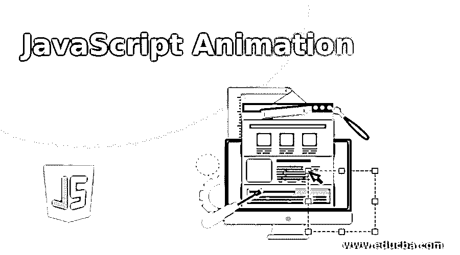
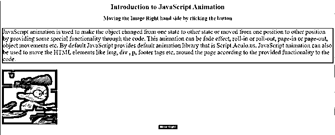
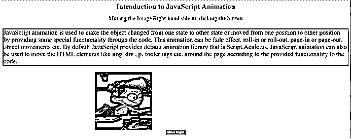
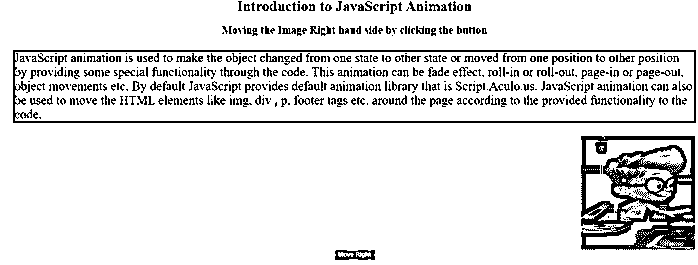
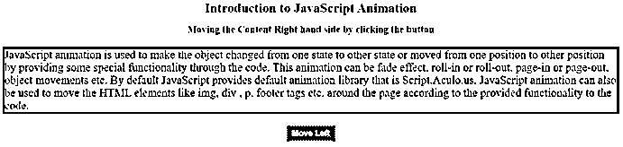
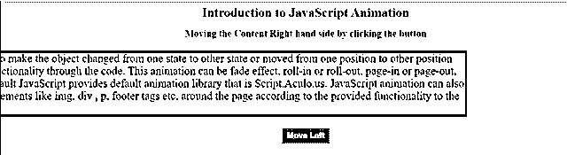
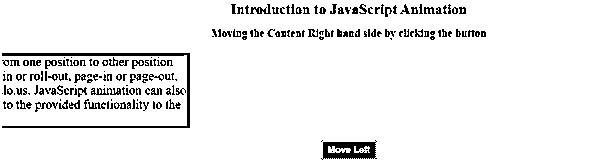
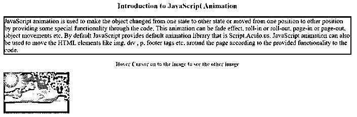
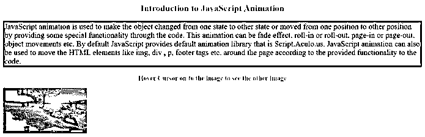

# JavaScript 动画

> 原文：<https://www.educba.com/javascript-animation/>




## JavaScript 动画简介

JavaScript 动画是通过代码提供一些特殊的功能，使对象从一种状态改变到另一种状态，或者从一个位置移动到另一个位置。这个动画可以是淡入淡出效果，滚入或滚出，页面移入或页面移出，默认情况下对象移动 JavaScript 提供了默认的动画库 Script.Aculo.us。动画也可以用来移动 HTML 元素，如、

、

、

等。根据为代码提供的功能在页面周围显示。

**优势**

<small>网页开发、编程语言、软件测试&其他</small>

*   把不可移动的物体变成可移动的。
*   用来开发游戏。

### JavaScript 中的动画是如何工作的？

动画基于为动画对象提供的函数工作。你可以考虑下面常用的动画函数。

*   **setTimeout( function，time) :** 该函数从现在开始，在规定的毫秒持续时间后执行操作。
*   **setInterval(function，time):** 该函数在每隔规定的毫秒持续时间后执行操作。
*   **clearTimeout(time):** 此函数执行用于清除由 setTimeout()函数设置的任意定时器。

JavaScript 也用于设置任何元素的属性数，还包括它在屏幕上的位置。我们还可以设置一个对象的 top 和 left 属性，将这个对象定位在屏幕上的任何位置。

**语法:**

```
var var= setInterval(getMyFun, 5);
function getMyFun() {
if (condition) {
clearInterval(var);
} else {
//required logic
}
}
```

**Note:** We can also write our own custom functionality for our own animation.

### 例子

下面是一些例子:

#### 示例# 1–向右移动图像

**代码:**

```
<html>
<head>
<title>JavaScript Animation</title>
<!-- CSS Styles -->
<style>
img {
width: 250px;
height: 250px;
}
p {
color: green;
border: solid 3px red;
font-size: 28px;
}
h1, h2 {
color: brown;
text-align: center;
}
.button {
text-align: center;
}
input {
color: white;
background-color: blue;
font-weight: bold;
}
</style>
<!-- JavaScript logic-->
<script type="text/javascript">
var imageRef = null;
function start() {//start function to initialize the objects
imageRef = document.getElementById('myID');//read the images by ID
imageRef.style.position = 'relative';//set the image positon to relative
imageRef.style.left = '0px';//set image left postion 0px.
}
function moveImageRight() {//function for move the image right
imageRef.style.left = parseInt(imageRef.style.left) + 50 + 'px';
}
window.onload = start;//calling the start method while loading the script
</script>
</head>
<body>
<h1>Introduction to JavaScript Animation</h1>
<h2>Moving the Image Right hand side by clicking the button</h2>
<p>JavaScript animation is used to make the object changed from one
state to other state or moved from one position to other position by
providing some special functionality through the code. This animation
can be fade effect, roll-in or roll-out, page-in or page-out, object
movements etc. By default JavaScript provides default animation
library that is Script.Aculo.us. JavaScript animation can also be used
to move the HTML elements like img, div , p, footer tags etc. around
the page according to the provided functionality to the code.</p>
<form>

<div class="button">
<input type="button" value="Move Right" onclick="moveImageRight();" />
</div>
</form>
</body>
</html>
```

**输出:**




**点击右移按钮后:**







#### 示例 2–向左移动内容

**代码:**

```
<html>
<head>
<title>JavaScript Animation</title>
<!-- CSS Styles -->
<style>
p {
color: blue;
border: solid 4px green;
font-size: 28px;
}
h1, h2 {
color: red;
text-align: center;
}
.button {
text-align: center;
}
input {
color: white;
background-color: maroon;
font-weight: bold;
width:120px;
font-size:20px;
height:40px;
}
</style>
<!-- JavaScript logic-->
<script type="text/javascript">
var imageRef = null;
function start() {//start function to initialize the objects
imageRef = document.getElementById('myID');//read the images by ID
imageRef.style.position = 'relative';//set the contetn positon to relative
imageRef.style.right = '0px';//set content right postion 0px.
}
function moveImageLeft() {//function for move the image right
imageRef.style.right = parseInt(imageRef.style.right) + 50 + 'px';
}
window.onload = start;//calling the start method while loading the script
</script>
</head>
<body>
<h1>Introduction to JavaScript Animation</h1>
<h2>Moving the Content Right hand side by clicking the button</h2>
<form>
<p id="myID">JavaScript animation is used to make the object
changed from one state to other state or moved from one position to
other position by providing some special functionality through the
code. This animation can be fade effect, roll-in or roll-out, page-in
or page-out, object movements etc. By default JavaScript provides
default animation library that is Script.Aculo.us. JavaScript
animation can also be used to move the HTML elements like img, div ,
p, footer tags etc. around the page according to the provided
functionality to the code.</p>
<div class="button">
<input type="button" value="Move Left" onclick="moveImageLeft();" />
</div>
</form>
</body>
</html>
```

**输出:**




**点击左移按钮后:**







#### 示例 3–鼠标悬停变化图像

**代码:**

```
<html>
<head>
<title>JavaScript Animation</title>
<style>
p {
color: maroon;
border: solid 4px blue;
font-size: 28px;
}
h1, h2 {
color: orange;
text-align: center;
}
</style>
<script type="text/javascript">
if (document.images) {//checking the document mages
var firstImage = new Image();//loading first image
firstImage.src = "n1.jpg";//first image url
var secondImage = new Image(); //loading second image
secondImage.src = "n2.jpg";//second image url
}
</script>
</head>
<body>
<h1>Introduction to JavaScript Animation</h1>
<p>JavaScript animation is used to make the object
changed from one state to other state or moved from one position to
other position by providing some special functionality through the
code. This animation can be fade effect, roll-in or roll-out, page-in
or page-out, object movements etc. By default JavaScript provides
default animation library that is Script.Aculo.us. JavaScript
animation can also be used to move the HTML elements like img, div ,
p, footer tags etc. around the page according to the provided
functionality to the code.</p>
<h2>Hover Cursor on to the image to see the other image</h2>
<a href="#" onMouseOver="document.myImage.src = secondImage.src;"
onMouseOut="document.myImage.src = firstImage.src;"> 
</a>
</body>
</html>
```

**输出:**




**将光标悬停在图像上后**




### 结论

JavaScript 动画用于使对象可移动或改变其样式。动画可以处理段落、页眉、图像、页脚或任何 html 元素标签。我们还可以将时间间隔应用到应用程序中。

### 推荐文章

这是一个 JavaScript 动画指南。在这里，我们讨论动画是如何在 JavaScript 中工作的，以及相应的编程示例。您也可以看看以下文章，了解更多信息–

1.  [JavaScript 文件阅读器](https://www.educba.com/javascript-filereader/)
2.  [JavaScript 通过类获取元素](https://www.educba.com/javascript-get-element-by-class/)
3.  [JavaScript 中的电子邮件验证](https://www.educba.com/email-validation-in-javascript/)
4.  [JavaScript 字符串编号](https://www.educba.com/javascript-string-to-number/)


