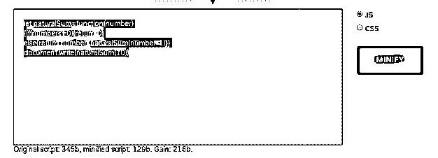
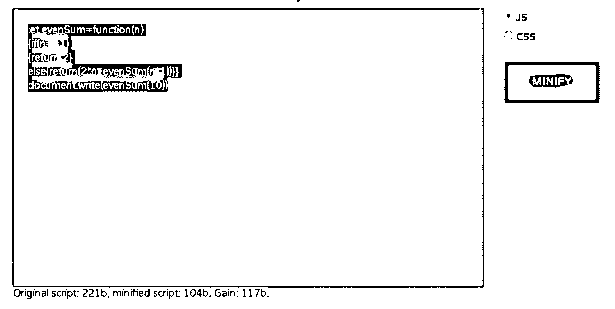
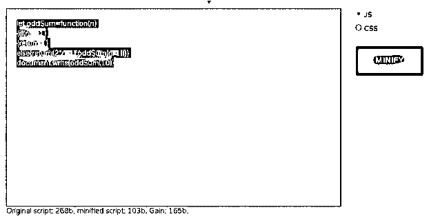
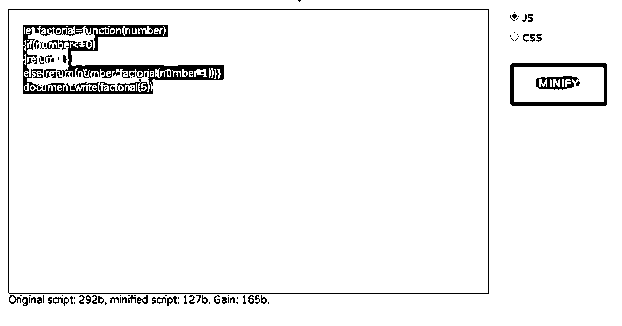
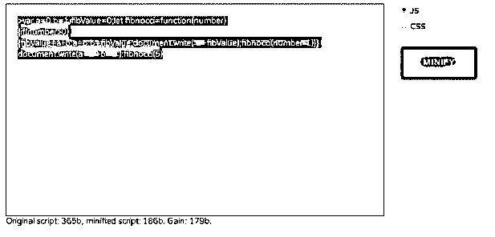
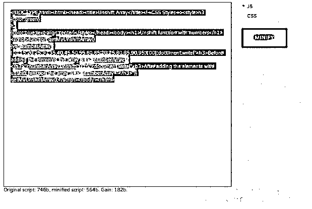
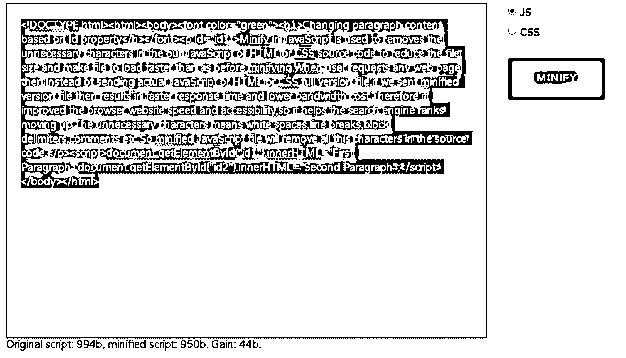

# JavaScript Minify

> 原文：<https://www.educba.com/javascript-minify/>


## JavaScript Minify 简介

JavaScript 中的 Minify 用于删除 JavaScript 或 HTML 或 CSS 源代码中不必要的字符，以减小文件大小，并使文件加载速度比缩小前更快。当用户请求任何网页时，不是发送实际的 JavaScript 或 HTML 或 CSS 完整版本文件，如果我们发送一个缩小版本文件，那么它会导致更快的响应时间和更低的带宽成本。因此它提高了浏览器网站的速度和可访问性，因此它有助于搜索引擎排名的上升。不必要的字符意味着空格、换行符、块分隔符、注释等。因此，缩小的 JavaScript 文件将删除源代码中的所有这些字符。

### JavaScript Minify 的优势

提高网站速度和可访问性。

<small>网页开发、编程语言、软件测试&其他</small>

**用于最小化 web 技术文件的重要在线工具:**

*   https://javascript-minifier.com/
*   https://jscompress.com/
*   https://www.minifier.org/

### JavaScript 中 minify 是如何工作的？

JavaScript modify 用于删除空格、换行符、块分隔符、注释等。减小应用程序文件的大小。

**JavaScript:**

```
<script>
//JavaScript code
</script>
```

**缩小代码后然后语法:**

**JavaScript:**

```
<script>//JavaScript code</script>
```

**解释:**正如你在上面看到的，在缩小代码后，所有的空格都被删除了。

### JavaScript Minify 示例

下面所有的例子我都使用过 https://www.minifier.org/在线编译器。

#### 示例 1–数字总和 JavaScript

**代码:**

```
let naturalSum=function(number)
{
if(number<=0){
return 0;
}
else{
return number+naturalSum(number-1);
}
}
//  console.log(naturalSum(10));//display the output in browser console
document.write(naturalSum(10));//display the output in the browser directly as like html page
```

**输出:**




**解释:**正如你在上面的代码中看到的，所有的空白空间都被移除了，我们可以看到从初始大小到最终大小我们得到了多少增益。

#### 示例 2–偶数求和 JavaScript

**代码:**

```
let evenSum=function(n)
{
if(n==1)
{
return 2;
}
else
{
return(2*n + evenSum(n-1));
}
}
document.write(evenSum(10));
```

**输出:**




**解释:**正如你在上面的代码中看到的，所有的空白空间都被移除了，我们可以清楚地看到从初始大小到最终大小我们得到了多少增益。

#### 示例 3–奇数和 JavaScript

**代码:**

```
let oddSum=function(n)//function
{
if(n==1)//base function
{
return 1;
}
else
{
return(2*n-1+oddSum(n-1));
}
}
document.write(oddSum(10));//recursive function call
```

**输出:**




**解释:**正如你在上面的代码中看到的，所有的空白空间都被移除了，我们可以看到从初始大小到最终大小我们得到了多少增益。

#### 示例 4–阶乘 JavaScript

**代码:**

```
let factorial=function(number)//function
{
if(number<=0)//base function
{
return 1;
}
else
{
return(number*factorial(number-1));
}
}
document.write(factorial(5));//recursive function call
```

**输出:**




**解释:**正如你在上面的代码中看到的，所有的空白空间都被移除了，我们可以清楚地看到从初始大小到最终大小我们得到了多少增益。

#### 示例 5–斐波那契 JavaScript

**代码:**

```
var a=0,b=1,fibValue=0;
let fibnocci=function(number)//function
{
if(number>0)//base function
{
fibValue=a+b;
a=b;
b=fibValue;
document.write(" "+fibValue);
fibnocci(number-1);
}
}
document.write(a+" "+b+" ");
fibnocci(5);//(number-2) because already 2 numbers taken as a and b
```

**输出:**




**解释:**正如你在上面的代码中看到的，所有的空白空间都被移除了，我们可以清楚地看到从初始大小到最终大小我们得到了多少增益。

#### 示例# 6–卸载数组 HTML 和 JavaScript

**代码:**

```
<!DOCTYPE html>
<html>
<head>
<title>Unshift  Array</title>
<!--CSS Styles-->
<style>
h3
{
color:green;
}
h1
{
color:blue;
text-align: center;
}
</style>
</head>
<body>
<h1>Unshift function with numbers</h1>
<script>
function getMyUnshiftArray()//line1
{
var numberArray=[10,15,20,25,30,35,40,45,50,55,60,65,70,75,80,85,90,95,100];//line2
document.write("<h3>Before adding the elements the array is=>"+numberArray+"</h3>");//line3
numberArray.unshift("0","5");//line4
document.write("<h3>After adding the elements with unshift function the array is=>"+ numberArray +"</h3>");//line5
}
getMyUnshiftArray();//line6
</script>
</body>
</html>
```

**输出:**




**解释:**正如你在上面的代码中看到的，所有的空白空间都被移除了，我们可以看到从初始大小到最终大小我们得到了多少增益。

#### 示例 7–InnerHTML JavaScript

**代码:**

```
<!DOCTYPE html>
<html>
<body>
<font color="green">
<h1>Changing paragraph content based on Id property</h>
</font>
<p id="id1"> Minify in JavaScript is used to removes the unnecessary characters in our JavaScript or HTML or CSS source code to reduce the file size and make file to load faster than as before minifying. When the user requests any web page then instead of sending actual JavaScript or HTML or CSS full version file, if we sent a minified version file then it results in faster response time and lower bandwidth cost. Therefore it improved the browser website speed and accessibility, so it helps the search engine ranks moving up. The unnecessary characters mean white spaces, line breaks, block delimiters, comments, etc. So minified JavaScript file will remove all these characters in the source code. </p>
<script>
document.getElementById("id1").innerHTML = "First Paragraph";
document.getElementById("id2").innerHTML = "Second Paragraph";
</script>
</body>
</html>
```

**输出:**




**解释:**正如你在上面的代码中看到的，所有的空白空间都被移除了，我们可以看到从初始大小到最终大小我们得到了多少增益。

### 结论

JavaScript minify 用于删除不必要的空格、换行符、块分隔符、注释等。从源代码上减少了文件的大小，提高了网站的性能，提高了可访问性。

### 推荐文章

这是一个 JavaScript Minify 的指南。这里我们讨论 minify 如何在 JavaScript 中工作，以及它的优点和例子。您也可以浏览我们推荐的其他文章，了解更多信息——

1.  [JavaScript 中的继承](https://www.educba.com/inheritance-in-javascript/)
2.  [JavaScript 光标](https://www.educba.com/javascript-cursor/)
3.  [Javascript 抛出异常](https://www.educba.com/javascript-throw-exception/)
4.  [JavaScript 风格可见性](https://www.educba.com/javascript-style-visibility/)


