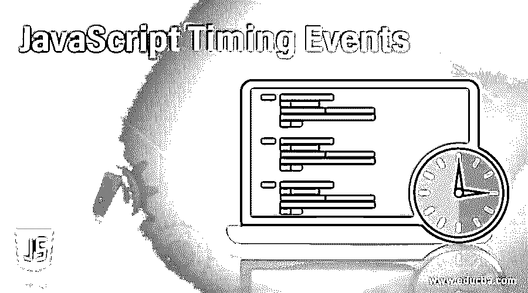
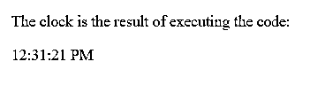
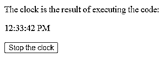
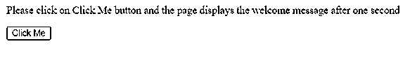
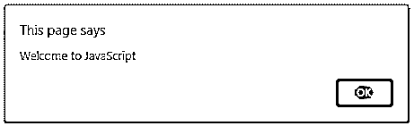

# JavaScript 计时事件

> 原文：<https://www.educba.com/javascript-timing-events/>




## JavaScript 计时事件简介

在指定的时间间隔内执行脚本的过程，也称为定期执行，在 JavaScript 中得到简化，称为 JavaScript 定时事件。它由两个方法组成，即 setInterval()方法和 setTimeout()方法，其中 setInterval()方法用于设置每个函数执行之间的延迟。当我们在多次执行一个函数时，也就是在每次代码执行的固定时间间隔后执行每一个代码，clearInterval()方法用于退出 setInterval()方法的执行，setTimeout()方法指定函数在开始执行前等待的时间段。

有两个 JavaScript 计时事件。它们是:

<small>网页开发、编程语言、软件测试&其他</small>

**1。setInterval()方法**

*   setInterval()方法用于在我们多次执行一个函数时，设置每个函数执行之间的延迟；也就是说，在每次代码执行之间的固定时间间隔之后，执行每个代码。
*   JavaScript 中 setInterval()方法的语法如下:

**2。setInterval(函数名，延迟[，arg1，arg2..])**

其中，function_name 是指一次又一次执行的函数，每次执行之间的时间延迟以毫秒为单位，由 delay 参数指定。

*   假设 JavaScript 中包含 setInterval()方法。在这种情况下，在 setInterval()方法中指定的时间过去之前，不会执行脚本，这种方法在 JavaScript 中很有用，因为 JavaScript 需要一次又一次地执行脚本。

### JavaScript 计时事件的示例

下面提到了不同的例子:

#### 示例#1

JavaScript 程序演示 setInterval()方法来显示时钟以显示当前时间并随着时间的推移更新时间:

**代码:**

```
<!DOCTYPE html>
<html>
<body>
<p>The clock is the result of executing the code:</p>
<p id="clocktimer"></p>
<script>
//setInterval() method is used to execute the fucntion clock every second
var var1 = setInterval(clock, 1000);
//date() method is used to obtain today's date and then toLocaleTimeString is used to convert the date to time and setInterval() method runs the function clock for every second to display and update the current time
function clock()
{
var dat = new Date();
document.getElementById("clocktimer").innerHTML=dat.toLocaleTimeString();
}
</script>
</body>
</html>
```

**输出:**




在上面的程序中，

标签用于在显示时钟之前显示航向。然后使用 id 来识别时钟。然后使用 setInterval()方法每秒钟执行一次函数 clock。然后用 date()方法获取今天的日期，再用 toLocaleTimeString 将日期转换成时间，setInterval()方法运行函数 clock for every 来显示和更新当前时间。

#### 实施例 2

演示 setInterval()方法和 clearInterval()方法的 JavaScript 程序，用于显示时钟以显示当前时间，并随着时间的推移更新时间，以及在单击按钮时停止时间:

**代码:**

```
<!DOCTYPE html>
<html>
<body>
<p>The clock is the result of executing the code:</p>
<p id="clocktimer"></p>
<button onclick="clearInterval(var1)">Stop the clock</button>
<script>
//setInterval() method is used to execute the function clock every second
var var1 = setInterval(clock, 1000);
//date() method is used to obtain today's date and then toLocaleTimeString is used to convert the date to time and setInterval() method runs the function clock for every second to display and update the current time
function clock()
{
var dat = new Date();
document.getElementById("clocktimer").innerHTML=dat.toLocaleTimeString();
}
</script>
</body>
</html>
```

**输出:**




在上面的程序中，

标签用于在显示时钟之前显示航向。然后使用 id 来识别时钟。然后用 clearInterval()方法停止每个函数执行的时间间隔，停止时钟。然后使用 setInterval()方法每秒钟执行一次函数 clock。然后用 date()方法获取今天的日期，再用 toLocaleTimeString 将日期转换成时间，setInterval()方法运行函数 clock for every 来显示和更新当前时间。

**1。setTimeOut()方法**

*   setTimeOut()方法用于指定在开始执行函数之前必须经过的时间(以毫秒为单位)。
*   JavaScript 中 setTimeOut()方法的语法如下:

**2。setTimeOut(函数名，延迟[，arg1，arg2..])**

其中，function_name 是指一次又一次执行的函数，每次执行之间的时间延迟以毫秒为单位，由 delay 参数指定。

*   假设 JavaScript 中包含 setTimeOut()方法。在这种情况下，在 setTimeOut()方法中指定的时间过去之前，不会执行脚本，这种方法在 JavaScript 中很有用，因为 JavaScript 要求在指定的时间后执行脚本。

#### 实施例 3

演示 setTimeout()方法的 JavaScript 程序，当单击按钮时，在等待 setTimeOut()方法中指定的时间间隔后，通过网页显示消息:

**代码:**

```
<!DOCTYPE html>
<html>
<body>
<p>Please click on Click Me button and the page displays the welcome message after one second</p>
<button onclick="setTimeout(Welcomemsg, 1000);">Click Me</button>
<script>
//Welcomemsg function displays the message on the page when the button is clicked
function Welcomemsg()
{
alert('Welcome to JavaScript');
}
</script>
</body>
</html>
```

**输出:**







在上面的程序中，

标签用于在显示 Click Me 按钮之前显示标题。然后在按钮上使用 setTimeOut()方法，在显示欢迎消息之前等待一秒钟。然后 Welcomemsg 函数在点击按钮时在页面上显示消息。

### 结论

在本教程中，我们通过 JavaScript 中定时事件的定义、语法和工作原理，通过编程示例及其输出，理解了 JavaScript 中定时事件的概念。

### 推荐文章

这是 JavaScript 计时事件指南。这里我们讨论 JavaScript 计时事件的例子以及代码和输出。您也可以看看以下文章，了解更多信息–

1.  [JavaScript 应用](https://www.educba.com/javascript-apply/)
2.  [JavaScript 刷新页面](https://www.educba.com/javascript-refresh-page/)
3.  JavaScript 中的[对象](https://www.educba.com/object-in-javascript/)
4.  [JavaScript 中的多态性](https://www.educba.com/polymorphism-in-javascript/)


