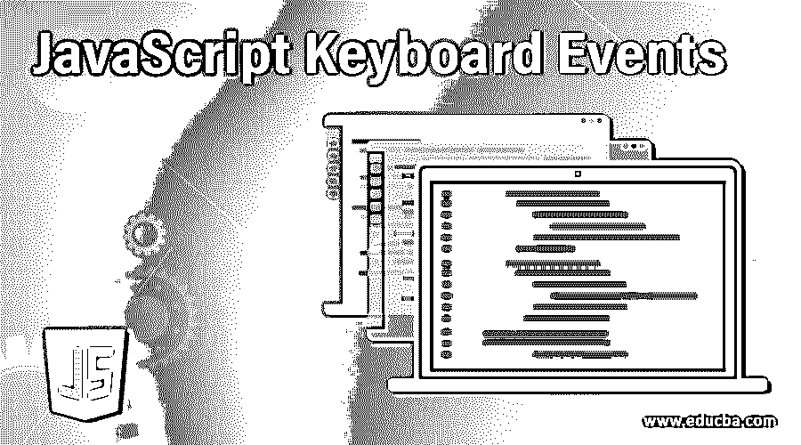
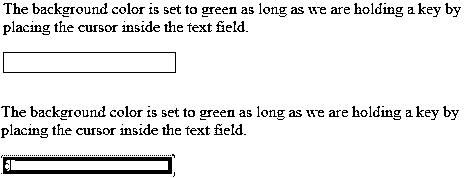
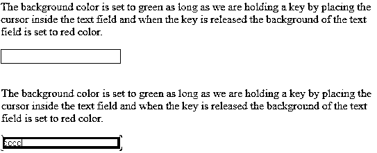
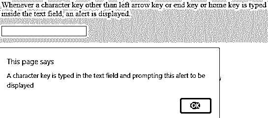
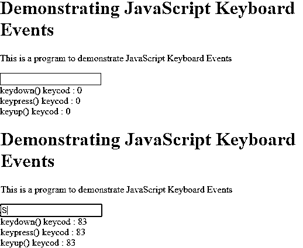

# JavaScript 键盘事件

> 原文：<https://www.educba.com/javascript-keyboard-events/>




## JavaScript 键盘事件简介

用户与键盘的交互可以通过使用键盘事件来描述，其中每个事件是用户与键盘上被修改的按键或按键组合的交互的描述。键盘上的任何活动都可以通过三种类型的键盘事件来识别，这三种类型的键盘事件是按键、向上按键和向下按键，并且对于用户的交互来说没有上下文的意义。键和键盘事件仅在用户决定不使用任何替代方式输入文本(如平板电脑上的手写系统)的情况下使用。

### 前三大 JavaScript 键盘事件

让我们看看三个主要的键盘事件，它们是:

<small>网页开发、编程语言、软件测试&其他</small>

#### 1.向下按键

每当按下键盘上的某个键时，就会触发 key down 事件，并且只要我们按住该键，该事件就会持续触发。考虑下面的程序:

**代码:**

```
<!DOCTYPE html>
<html>
<body>
<p>The background color is set to green as long as we are holding a key by placing the cursor inside the text field. </p>
<input type="text" id="de" onkeydown="keydown()">
<script>
function keydown() {
document.getElementById("de").style.backgroundColor = "green";
}
</script>
</body>
</html>
```

**输出:**




**说明:**在上面的程序中，JavaScript 键盘事件 key down 和 HTML 一起使用。程序的前两行表明它是一个 HTML 脚本，HTML 的主体从那里开始。< p >表示正在打印由文本组成的段落。然后通过调用功能键 down()来指定 JavaScript 键盘事件键按下。然后 JavaScript 中按键事件的实际功能被定义在 HTML <脚本>标签下。使用了通过 ID 获取元素的函数，该函数用于指向定义的按键事件。该程序使用 JavaScript 键盘事件键 down 将文本字段的背景色设置为绿色，只要该键被按下，并且使用 style 定义相同的颜色。在上面的程序中，背景色=绿色。

#### 2.键起

每当从键盘上释放一个键时，就会触发 key up 事件。考虑下面的程序:

**代码:**

```
<!DOCTYPE html>
<html>
<body>
<p>The background color is set to green as long as we are holding a key by placing the cursor inside the text field and when the key is released the background of the text field is set to red color. </p>
<input type="text" id="de" onkeydown="keydown()" onkeyup="keyup()">
<script>
function keydown() {
document.getElementById("de").style.backgroundColor = "green";
}
function keyup() {
document.getElementById("de").style.backgroundColor = "red";
}
</script>
</body>
</html>
```

**输出:**




**解释:**在上面的程序中，JavaScript 键盘事件 key down 和 key up 与 HTML 一起使用。程序的前两行表明它是一个 HTML 脚本，HTML 的主体从那里开始。< p >表示正在打印由文本组成的段落。然后通过调用函数 key down()和 key up()来指定 JavaScript 键盘事件 key down 和 key up。然后在 HTML <脚本>标签下定义了 JavaScript 中按键事件和按键事件的实际功能。使用通过 ID 获取元素的函数，该函数用于指向定义的按键按下事件和按键向上事件。该程序使用 JavaScript 键盘事件键 down 将文本字段的背景色设置为绿色，只要该键被按下，并使用 JavaScript 键盘事件键 up 将文本字段的背景色设置为红色，一旦该键被释放，这也是使用 style 定义的。背景色=绿色和风格。在上面的程序中，背景色=红色。

#### 3.按键

每当在键盘上按下一个字符，如 a，b，c 等。如果我们按下键盘上的 home 键或 end 键或左箭头键，将触发按键事件，但不会触发按键事件。只要我们按下键盘上的一个键，这个按键事件就会持续触发。考虑下面的程序:

**代码:**

```
<!DOCTYPE html>
<html>
<body>
<p>Whenever a character key other than left arrow key or end key or home key is typed inside the text field, an alert is displayed.</p>
<input type="text" onkeypress="Function()">
<script>
function Function() {
alert("A character key is typed in the text field and prompting this alert to be displayed");
}
</script>
</body>
</html>
```

**输出:**




**说明:**在上面的程序中，JavaScript 键盘事件按键和 HTML 一起使用。程序的前两行表明它是一个 HTML 脚本，HTML 的主体从那里开始。< p >表示正在打印由文本组成的段落。然后在 HTML <脚本>标签下定义了 JavaScript 中按键事件的实际功能。每当在文本字段中键入除左箭头键、home 键或 end 键之外的字符键时，该程序使用 JavaScript 键盘事件键显示警告消息。

### 实现 JavaScript 键盘事件的示例

演示键盘事件的 JavaScript 程序。

**代码:**

```
<!DOCTYPE html>
<html>
<head>
<title>Demonstrating JavaScript Keyboard Events</title>
<script type="text/javascript" src="https://code.jquery.com/jquery-3.3.1.min.js"> </script>
</head>
<body>
<h1>Demonstrating JavaScript Keyboard Events</h1>
<p>This is a program to demonstrate JavaScript Keyboard Events</p>
<input type="text" name="">
<br>
<label>keydown() keycod  : </label>0
<br>
<label>keypress() keycod  : </label>0
<br>
<label>keyup() keycod  : </label>0
<script>
$("input").keydown(function(event){
var keycod = (event.keyCod ? event.keyCod : event.which);
$("#keydown").html(keycod);
});
$("input").keypress(function(event){
var keycod = (event.keyCod ? event.keyCod : event.which);
$("#keypress").html(keycod);
});
$("input").keyup(function(event){
var keycod = (event.keyCod ? event.keyCod : event.which);
$("#keyup").html(keycod);
});
</script>
</body>
</html>
```

**输出:**




### 结论

在这篇文章中，我们学习了什么是键盘事件，JavaScript 中不同类型的键盘事件以及它们的解释和例子。

### 推荐文章

这是 JavaScript 键盘事件指南。这里我们讨论三个主要的 JavaScript 键盘和一个例子来实现更好的理解。您也可以看看以下文章，了解更多信息–

1.  [JavaScript 事件](https://www.educba.com/javascript-events/)
2.  [JavaScript 承诺](https://www.educba.com/javascript-promise/)
3.  [JavaScript 延迟](https://www.educba.com/javascript-defer/)
4.  [JavaScript DOM](https://www.educba.com/javascript-dom/)


