# Javascript 事件监听器

> 原文：<https://www.educba.com/javascript-event-listener/>

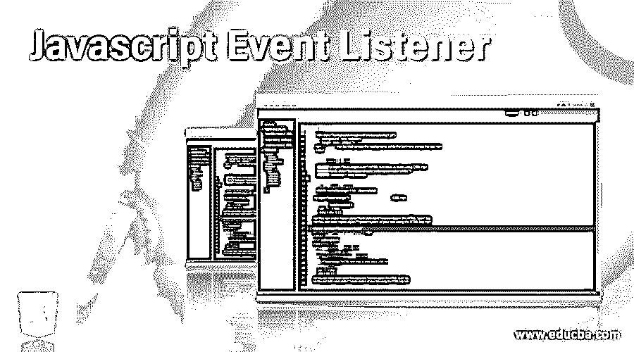


## Javascript 事件监听器简介

JavaScript 事件监听器是 JavaScript 中等待事件发生的方法。事件侦听器，也称为事件处理程序，我们可以将事件侦听器分配给特定元素上的特定事件。事件侦听器是一个接口，表示处理由事件对象调度的事件的对象。事件是 JavaScript 的重要组成部分，因为网页会基于事件做出响应。有些事件是用户生成的，有些是 API 调用生成的。在本主题中，我们将学习 Javascript 事件监听器。

**语法**

<small>网页开发、编程语言、软件测试&其他</small>

```
element.addEventListener(event, listener);
```

*   参数“event”可以被认为是任何有效的 JavaScript 事件。
*   使用不带前缀“on”的事件作为“click”或“mousehover”
*   “listener”是对发生的事件做出响应的处理函数。
*   JavaScript 事件监听器分为两种类型，即:
*   交互式和非交互式事件处理程序，
*   交互式事件处理程序依赖于用户与 HTML 页面的交互
*   非交互式事件处理程序不依赖于任何用户交互。

### Javascript 事件监听器的示例

让我们看几个例子来进一步理解，

#### 示例#1

**代码:**

```
<!DOCTYPE html>
<html>
<body>
<h2>JavaScript Event Listener</h2>
<h3>This event will show 'click' event of a button</h3>
<button id="btn">Click Here!</button>
<script>
document.getElementById("btn").addEventListener("click", function() {
document.write("<p>Hi this is the click event listener in JavaScript</p>");
});
</script>
</body>
</html>
```

**输出:**

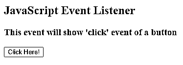


点击按钮时，

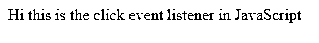


使用 click 事件侦听器，您将能够在控制台上看到打印的测试。

#### 实施例 2

**代码:**

```
<!DOCTYPE html>
<html>
<body>
<h2>Various JavaScript Event Listeners</h2>
<h3>Using addEventListener() method to add many events for single button</h3>
<button id="btn">Try me!</button>
<p id="event"></p>
<script>
var x = document.getElementById("btn");
x.addEventListener("mouseover", mouseHoverFunction);
x.addEventListener("click", onClickFunction);
x.addEventListener("mouseout", mouseOutFunction);
function mouseHoverFunction() {
document.getElementById("event").innerHTML += "Mouse Hovered!<br>";
}
function onClickFunction() {
document.getElementById("event").innerHTML += "Button Clicked!<br>";
}
function mouseOutFunction() {
document.getElementById("event").innerHTML += "Mouse Out!<br>";
}
</script>
</body>
</html>
```

**输出:**

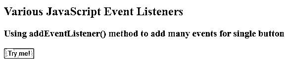


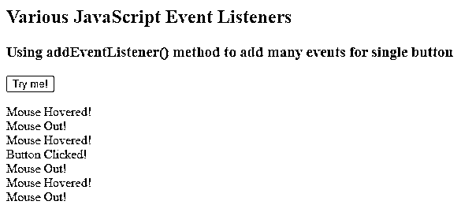


#### 实施例 3

**代码:**

```
<!DOCTYPE html>
<html>
<body>
<h2>JavaScript Event Listeners</h2>
<p>Using addEventListener() on resize</p>
<p>Resize the window so that the resize event listener will get fired.</p>
<p id="demo"></p>
<script>
window.addEventListener("resize", function(){
document.write("Window has been resized " + Math.random());
});
</script>
</body>
</html>
```

**输出:**

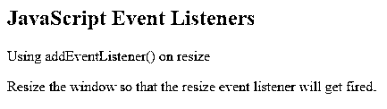


在这里调整浏览器窗口大小时，带有一些随机值的文本在控制台上定向。

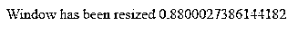


#### 实施例 4

**代码:**

```
<!DOCTYPE html>
<html lang="en">
<head>
<meta charset="utf-8">
<title>JavaScript Multiple Event Listeners</title>
</head>
<body>
<button id="btn">Click Me<button>
<script>
function function1() {
document.write("Function 1 is executed!!");
}
function function2() {
document.write("Function 2 gets executed as Function 1 is overidden!!");
}
var btnClick = document.getElementById("btn");
btnClick.onclick = function1;
btnClick.onclick = function2;
</script>
</body>
</html>
```

**输出:**

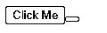


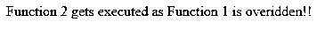


单击按钮时，function2 将被执行，因为分配第二个事件处理程序将覆盖第一个事件处理程序。

这是 JavaScript 事件监听器的缺点之一。对于特定元素上的特定事件，只能分配一个事件处理程序。

因此，为了解决这个缺点，W3C 引入了一种灵活的事件模型，称为事件监听器。这就是这个概念是如何被引入 JavaScript 的。

可以为 HTML 元素分配多个事件处理程序，为同一元素的同一事件分配多个函数。

#### 实施例 5

**代码:**

```
<!DOCTYPE html>
<html lang="en">
<head>
<meta charset="utf-8">
<title>JavaScript Multiple Event Listeners</title>
</head>
<body>
<button id="btn">Click Me<button>
<script>
function function1() {
alert("Function 1 is executed!!");
}
function function2() {
alert("Function 2 also gets executed!!");
}
var btnClick = document.getElementById("btn");
btnClick.addEventListener("click", function1);
btnClick.addEventListener("click", function2);
</script>
</body>
</html>
```

**输出:**

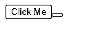


点击时，

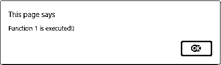


函数 1 和函数 2 都被执行。

#### 实施例 6

**代码:**

```
<!DOCTYPE html>
<html lang="en">
<head>
<meta charset="utf-8">
<title>JavaScript Event Listeners Mouse hover and out</title>
<h2>Mouse hover and out changing colors</h2>
</head>
<body>
<button id="btn">Click Here</button>
<script>
var btnHover = document.getElementById("btn");
function setHoverColor() {
btnHover.style.background = "orange";
}
function setNormalColor() {
btnHover.style.background = "";
}
btnHover.addEventListener("mouseover", setHoverColor);
btnHover.addEventListener("mouseout", setNormalColor);
</script>
</body>
</html>
```

**输出:**

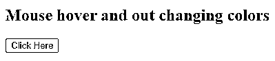


鼠标悬停时，

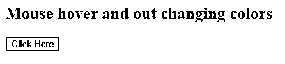


让我们来看看一些常见的事件侦听器，

*   **加载:**页面加载时
*   **点击:**当用户点击页面上的某个东西时
*   **Mouseover:** 当用户将鼠标悬停在指定元素上时。
*   **焦点:**当用户将光标放在表单字段中时
*   **模糊:**当用户将光标离开表单字段时。

我们将看到如何从元素中移除事件监听器。

#### 实施例 7

**代码:**

```
<!DOCTYPE html>
<html lang="en">
<head>
<meta charset="utf-8">
<title>JavaScript Removing an Event Listener</title>
</head>
<body>
<button id="btn">Click Here</button>
<script>
function removeFunction() {
alert("Function will be removed here");
}
var btn = document.getElementById("btn");
btn.addEventListener("click", removeFunction);
btn.removeEventListener("click", removeFunction);
</script>
<p><strong>Note:</strong> Even though you try to click the button, no event will be fired as we have removed the click event using removeEventListener</p>
</body>
</html>
```

**输出:**

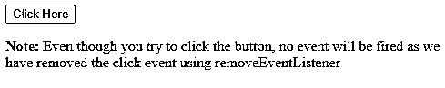


单击此处不起作用，因为没有事件侦听器被发送到该按钮。

### 结论

至此，我们可以结束“JavaScript 事件监听器”这个主题了。我们已经看到事件监听器，也称为事件处理器，在元素上分配特定的事件。还举例说明了一些例子，这将有助于你，人们，与实践的需要。我们已经看到了如何使用带有 HTML 元素的 addEventListener 来处理多个事件侦听器。它还举例说明了如何从元素中移除事件侦听器。希望这篇教程有助于很好的理解概念。

### 推荐文章

这是一个 Javascript 事件监听器的指南。这里我们讨论如何从元素中移除事件监听器的例子。您也可以看看以下文章，了解更多信息–

1.  [JavaScript 鼠标按下](https://www.educba.com/javascript-mousedown/)
2.  [JavaScript 网格](https://www.educba.com/javascript-grid/)
3.  [JavaScript 绑定](https://www.educba.com/javascript-bind/)
4.  [JavaScript proxy()](https://www.educba.com/javascript-proxy/)


