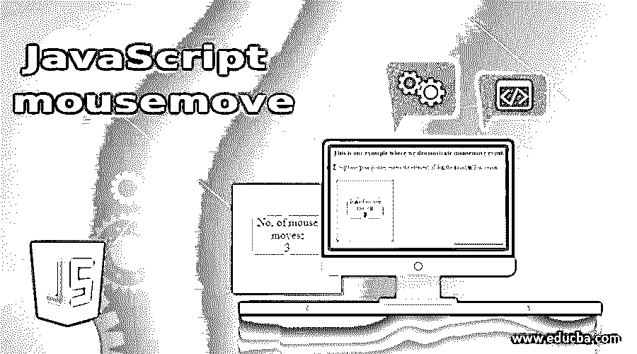
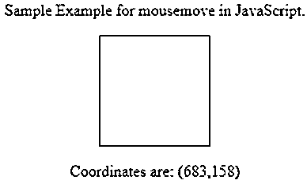
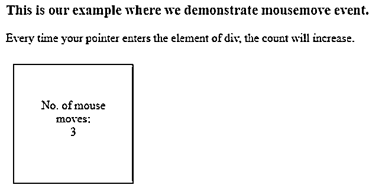

# JavaScript 鼠标移动

> 原文：<https://www.educba.com/javascript-mousemove/>




## JavaScript mousemove 简介

MouseMove 是一个简单的事件，当指针在元素上或元素周围移动时执行。Mousemove 是网页中的一个 javascript 事件。mousemove 事件也可以被理解为事件处理程序的一部分，在该事件中，执行鼠标指针的某个动作或移动，即一个预期的脚本。

mousemove 作为一个事件工作，每当指针移动时，mousemove 将被调用并执行预期的代码。mousemove 是 MouseEvent 接口的一部分，包括许多其他事件，如 mouseout、click、mouseup、mousedown 等。现在让我们理解实现 mousemove 事件所需的语法。

<small>网页开发、编程语言、软件测试&其他</small>

### JavaScript 鼠标移动的语法

理解标准语法对于实现 mousemove 事件非常重要。对于 mousemove，我们分别为 HTML 和 JavaScript 提供了两种不同的语法。我们将从 HTML 语法开始:

HTML 中 mousemove 的标准语法如下:

```
<element onmousemove = "samScript">
```

如您所见，html 中 mousemove 的语法在尖括号内工作，就像 HTML 中的任何其他元素一样。这里我们有一个元素，可以是任何需要的东西。后跟关键字 onmousemove，最后是要运行的脚本。对于 Javascript，语法如下:

```
object.onmousemove = function(){samScript};
```

就像我们的 HTML 语法以元素开始一样，我们的 Javascript 语法也以元素开始。然后元素后面是我们的 mousemove 关键字，然后我们传递一个函数。最后，我们有了将要执行的脚本。现在让我们来理解 mousemove 事件在 JavaScript 中实际上是如何工作的。

### Javascript 中的 mousemove 事件是如何工作的？

Javascript 中的鼠标移动就像一个事件。不像其他赛事。，鼠标移动是基于鼠标指针的移动。它是鼠标事件接口的一部分，包括许多这样的事件。因此，基本上，每次指针在定义的分区周围或上方移动时，都会执行一条消息或一个脚本。根据需求，可以执行多个事件或功能。mousemove 的一个非常简单的实现可能是一条简单的消息，当我们滚动 submit 或 clear 这样的按钮时，它将被打印出来。

既然我们已经理解了什么是 mousemove，它是如何工作的，以及它的标准语法，让我们转到正确的实现。在我们的例子中，我们将使用 HTML 和 JavaScript 在网页中使用 mousemove 事件。第一个示例的代码如下。

#### 示例#1

**代码:**

```
<!DOCTYPE html>
<html>
<head>
<style>
div {
width: 110px;
height: 110px;
border: 1px solid black;
}
</style>
</head>
<body>
<center>
<br>
<p> Sample Example for mousemove in JavaScript. </p>
<div onmousemove = "samFunct(event)" onmouseout = "clearCoo()"></div>
<p id="demo"></p>
<script>
function samFunct(el) {
var x = el.clientX;
var y = el.clientY;
var coo = "Coordinates are: (" + x + "," + y + ")";
document.getElementById("demo").innerHTML = coo;
}
function clearCoo() {
document.getElementById("demo").innerHTML = "Keep mouse pointer within";
}
</script>
</center>
</body>
</html>
```

代码解释:开始就像一个网页，有所有需要的 HTML 标签，然后我们有一个部门定义所有必要的方面，如宽度、高度和边框。然后我们的 head 标签结束，body 开始，在这里我们有一个简单的声明将被打印。然后我们有了我们的划分，mousemove 事件调用了代码中稍后定义的函数。此外，我们有一个 mouseout 事件调用另一个函数。然后我们从脚本开始，在这里我们定义了我们的第一个函数，在这里我们根据需要声明了几个变量，我们有 document get element by id 函数，它调用了 demo 并打印了保存坐标的“coo”变量。最后，我们有最后一个函数，名为 clearCoo，它将在每次我们将指针移出坐标框时被调用。

预期的输出将是一个包含坐标的框，当我们移动指针时，坐标将被打印在网页上，当我们移出指针时，将打印消息内的鼠标指针。请参考下面所附的屏幕截图，以获得正确的输出:




如前所述，web 浏览器中显示的输出如下所示。一个简单的语句，然后一个正方形的除法运算保存坐标，当我们移动鼠标指针时，下面的语句将打印鼠标指针移动到的任何地方的坐标。当我们移出指针时，消息将变为“保持鼠标指针在内”。

#### 实施例 2

在这个例子中，我们实现了 mousemove 和 mouseout 事件。我们的下一个例子是实现 mousemove 事件的 onmouseenter 函数。

**代码:**

```
<!DOCTYPE html>
<html>
<head>
<style>
div {
width: 100px;
height: 100px;
border: 1px solid black;
margin: 10px;
float: left;
padding: 30px;
text-align: center;
background-color: lightgray;
}
p {
background-color: white;
}
</style>
</head>
<body>
<h3> This is our example where we demonstrate mousemoveevent.</h3>
<p> Every time your pointer enters the element of div, the count will increase.</p>
<div onmouseenter = "myFunct()">
<p>No. of mouse moves: <br>Move the mouse over me!</p>
</div>
<script>
var x = 0;
function myFunct() {
document.getElementById("ex1").innerHTML = x+=1;
}
</script>
</body>
</html>
```

代码解释:从 HTML 标签开始，然后是包含 div 元素的样式标签。在 div 元素中，我们有一些重要的方面，比如宽度、高度、边框、边距等等。都是有定义的。接着将背景颜色定义为白色。

然后从我们的主体开始，我们在标题和段落标签中定义了两个简单的句子。然后，我们有另一个部门持有主要功能，与所需的文本消息。这个 main 函数保存了 span id，稍后将在程序中调用它。然后我们有我们的脚本，我们从声明一个名为 x 的简单变量开始。然后我们有我们的函数，其中是我们的文档，并通过 ID 获取元素，在这里我们调用前面创建的 span。这一行保存了要打印的值，即 x+=1，这意味着每次我们将鼠标指针滚动到范围内，该值都会增加，最后，我们得到了我们滚动指针的总次数。

要正确理解输出，请参考下面的截图:




### 结论

Mousemove 是 javascript 的鼠标事件接口的一部分，负责指针移动后的动作。其工作原理是，当鼠标指针在按钮或部门等元素上滚动时，将会执行一条消息或一个脚本。我们理解了示例的工作方式，也实现了 mouseout。

### 推荐文章

这是一个 JavaScript 鼠标移动的指南。这里我们还讨论了 javascript 中的鼠标移动事件的介绍和工作原理。以及不同的示例及其代码实现。您也可以看看以下文章，了解更多信息–

1.  [JavaScript 刷新页面](https://www.educba.com/javascript-refresh-page/)
2.  [JavaScript 中的赋值运算符](https://www.educba.com/assignment-operator-in-javascript/)
3.  [JSON.stringify JavaScript](https://www.educba.com/json-stringify-javascript/)
4.  [JavaScript getElementsByTagName()](https://www.educba.com/javascript-getelementsbytagname/)


