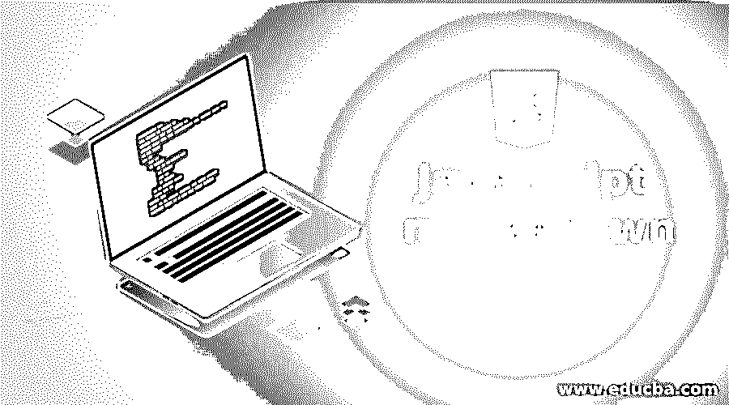
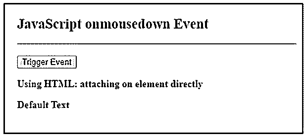
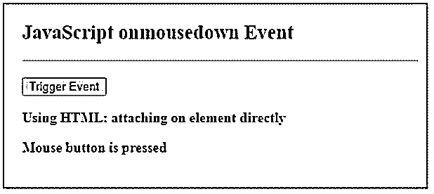
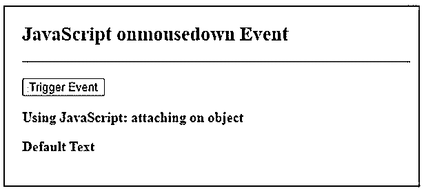
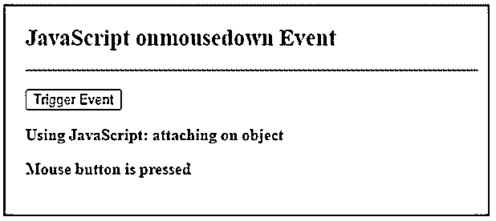
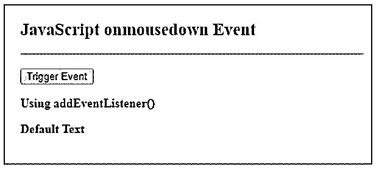
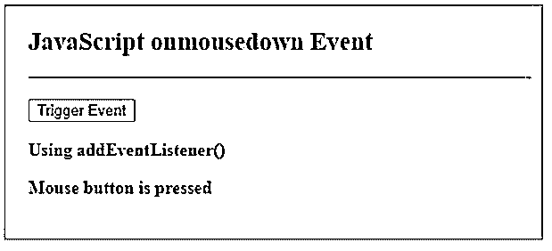
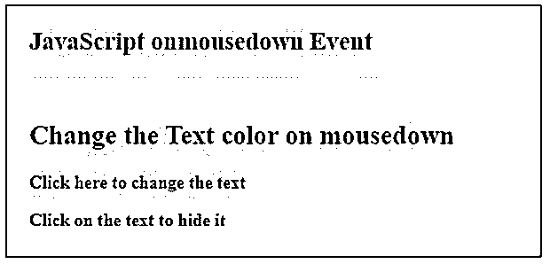

# JavaScript 鼠标按下

> 原文：<https://www.educba.com/javascript-mousedown/>




## JavaScript mousedown 简介

JavaScript 支持各种类型的事件，包括鼠标事件。mousedown 就是 JavaScript 支持的一种鼠标事件。mousedown 事件可以应用于该元素，并且每当在该元素上按下鼠标左键时触发。这种左按钮按压可以由诸如触摸板、屏幕显示器等其他类型的外围设备模仿，并且这也可以创建鼠标按下事件。当 mousedown 事件在元素上发生时，我们可以附加一个函数在它之后执行。此事件通常与释放按钮的 mouseup 事件一起使用，这与 mousedown 事件相反。

**语法:**

<small>网页开发、编程语言、软件测试&其他</small>

我们可以通过下面的方式附加一个每当 mousedown 事件发生时执行的函数。

**HTML:**

```
<element onmousedown = "functionName()" >
```

**JavaScript:**

```
elementObj.onmousedown = function () { //script };
```

在 JavaScript 中使用 addEventListener()方法:

```
elementObj.addEventListener("onmousedown" , function() { //script });
```

### JavaScript 中 mousedown 事件是如何工作的？

*   每当光标或指针位于所选元素内并且按钮被按下(即被按下且未释放)时，mousedown 事件被触发。
*   此事件不同于 click 事件，在 click 事件中，当按钮被按下并释放时发生 click 事件，但在 mousedown 事件中，按钮仅被按下。
*   最初按下左键时，mousedown 事件立即被触发。

### JavaScript mousedown 示例

下面是提到的例子:

#### 示例#1

在 HTML 中。

**代码:**

```
<!DOCTYPEhtml>
<html>
<head>
<meta charset = "UTF-8">
<title>
JavaScript onmousedown Event
</title>
<style>
.body-data {
border : #81D4FA 2px solid;
background-color : #03a9f400;
text-align : left;
padding-left : 20px;
padding-bottom: 20px;
height : auto;
width : auto;
}
.resultText {
margin: 0 0 3px 0;
padding: 0px;
display: block;
font-weight: bold;
}
.heading {
font-weight: bold;
border-bottom: 2px solid #ddd;
font-size: 15px;
width: 98%;
}
</style>
</head>
<body>
<div class = "body-data">
<div class = "heading" >
<h2> JavaScript onmousedown Event </h2>
</div>
<div class = "resultText" >
</br>
<!-- attaching mousedown event on button -->
<button onmousedown = "fireEvent()" > Trigger Event </button>
<p> Using HTML: attaching on element directly </p>
<p id = "result1" > Default Text </p>
</div>
</div>
<script type = "text/javascript">
// This function will be called whenever mousedown event occurs
function fireEvent( ) {
document.getElementById("result1").innerHTML = " Mouse button is pressed ";
}
</script>
</body>
</html>
```

**输出:**

**事件发生前:**




**事件发生后:**




#### 实施例 2

在 JavaScript 中。

**代码:**

```
<!DOCTYPE html>
<html>
<head>
<meta charset = "UTF-8">
<title>
JavaScript onmousedown Event
</title>
<style>
.body-data {
border : #81D4FA 2px solid;
background-color : #03a9f400;
text-align : left;
padding-left : 20px;
padding-bottom: 20px;
height : auto;
width : auto;
}
.resultText {
margin: 0 0 3px 0;
padding: 0px;
display: block;
font-weight: bold;
}
.heading {
font-weight: bold;
border-bottom: 2px solid #ddd;
font-size: 15px;
width: 98%;
}
</style>
</head>
<body>
<div class = "body-data" >
<div class = "heading" >
<h2> JavaScript onmousedown Event </h2>
</div>
<div class = "resultText" >
</br>
<!--id is added to get the element -->
<button id = "myButton" > Trigger Event </button>
<p> Using JavaScript: attaching on object </p>
<p id = "result1" > Default Text </p>
</div>
</div>
<script type = "text/javascript">
// attaching mousedown event on button
document.getElementById( "myButton" ).onmousedown = function(){
fireEvent();
};
// This function will be called whenever mousedown event occurs
function fireEvent( ) {
document.getElementById("result1").innerHTML = " Mouse button is pressed ";
}
</script>
</body>
</html>
```

**输出:**

**事件发生前:**




**事件发生后:**




#### 实施例 3

在 JavaScript 中使用 eventListener()方法。

**代码:**

```
<!DOCTYPE html>
<html>
<head>
<meta charset = "UTF-8">
<title>
JavaScript onmousedown Event
</title>
<style>
.body-data {
border : #81D4FA 2px solid;
background-color : #03a9f400;
text-align : left;
padding-left : 20px;
padding-bottom: 20px;
height : auto;
width : auto;
}
.resultText {
margin: 0 0 3px 0;
padding: 0px;
display: block;
font-weight: bold;
}
.heading {
font-weight: bold;
border-bottom: 2px solid #ddd;
font-size: 15px;
width: 98%;
}
</style>
</head>
<body>
<div class = "body-data" >
<div class = "heading" >
<h2> JavaScript onmousedown Event </h2>
</div>
<div class = "resultText" >
</br>
<!--id is added to get the element -->
<button id = "myButton" > Trigger Event </button>
<p> Using addEventListener() </p>
<p id = "result1" > Default Text </p>
</div>
</div>
<script type = "text/javascript">
// attaching mousedown event on button using event listener
document.getElementById( "myButton" ).addEventListener( "mousedown" , function() {
fireEvent();
});
// This function will be called whenever mousedown event occurs
function fireEvent( ) {
document.getElementById("result1").innerHTML = " Mouse button is pressed ";
}
</script>
</body>
</html>
```

**输出:**

**事件发生前:**




**事件发生后:**




#### 实施例 4

对不同类型的元素进行不同的操作。

**代码:**

```
<!DOCTYPE html>
<html>
<head>
<meta charset = "UTF-8">
<title>
JavaScript onmousedownEvent
</title>
<style>
.body-data {
border : #81D4FA 2px solid;
background-color : #03a9f400;
text-align : left;
padding-left : 20px;
padding-bottom: 20px;
height : auto;
width : auto;
}
.resultText {
margin: 0 0 3px 0;
padding: 0px;
display: block;
font-weight: bold;
}
.heading {
font-weight: bold;
border-bottom: 2px solid #ddd;
font-size: 15px;
width: 98%;
}
</style>
</head>
<body>
<div class = "body-data" >
<div class = "heading" >
<h2> JavaScript onmousedown Event </h2>
</div>
<div class = "resultText" >
</br>
<!--onmousedown event on element of type h2 : HTML style  -->
<h2 id = "color" onmousedown = "changeColor()"> Change the Text color on mousedown</h2>
<!--onmousedown event on element of type p : In JavaScript  -->
<p id = "myText" > Click here to change the text </p>
<!--onmousedown event on element of type div : In JavaScript using addEventListener() method -->
<div id = "hideText" style = "display: block;"> Click on the text to hide it </div>
</div>
</div>
<script type = "text/javascript">
// Function to change  thecolor of text
function changeColor() {
document.getElementById( "color" ).style.color = "Red";
}
// attaching mousedown event on paragraph
document.getElementById( "myText" ).onmousedown = function() {
document.getElementById( "myText").innerHTML = " Text is changed ";
}
// attaching mousedown event on div element using addEventListener
document.getElementById( "hideText").addEventListener( "mousedown" , function() {
toggleDisplay();
})
// function to toggle the display property of element
function toggleDisplay( ) {
var property = document.getElementById( "hideText" );
if ( property.style.display === 'block') {
property.style.display = 'none';
} else {
property.style.display = 'block';
}
}
</script>
</body>
</html>
```

**输出:**

**事件发生前:**




**事件发生后:**


### 结论

onmousedown 是 JavaScript 中可用的鼠标事件的子类型。当在元素上按下鼠标左键时，发生 mousedown 事件。发生鼠标按下事件时，可以执行多种类型的操作。

### 推荐文章

这是一个 JavaScript mousedown 的指南。这里我们讨论一下鼠标按下事件在 JavaScript 中是如何工作的？和示例。您也可以看看以下文章，了解更多信息–

1.  [JavaScript 中的多态性](https://www.educba.com/polymorphism-in-javascript/)
2.  [JavaScript getelement byid()](https://www.educba.com/javascript-getelementbyid/)
3.  [JavaScript 中的 push()](https://www.educba.com/push-in-javascript/)
4.  [JavaScript 混淆器](https://www.educba.com/javascript-obfuscator/)


