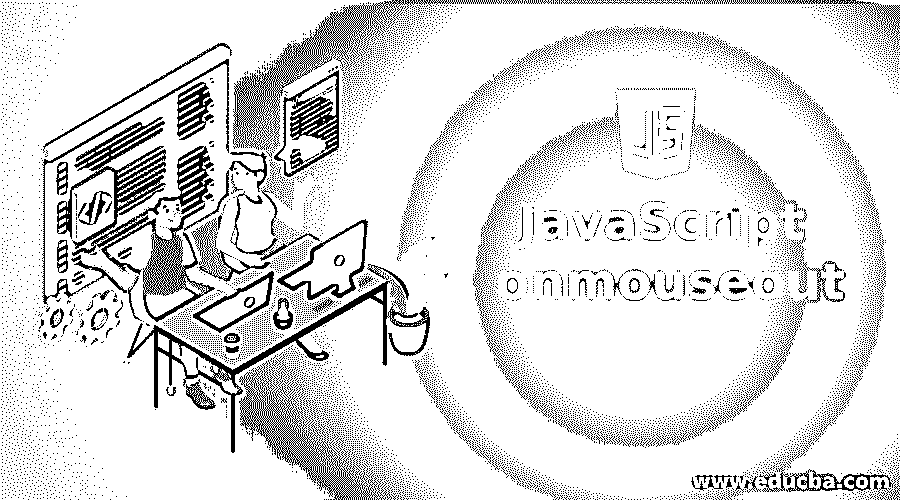
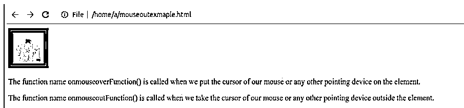
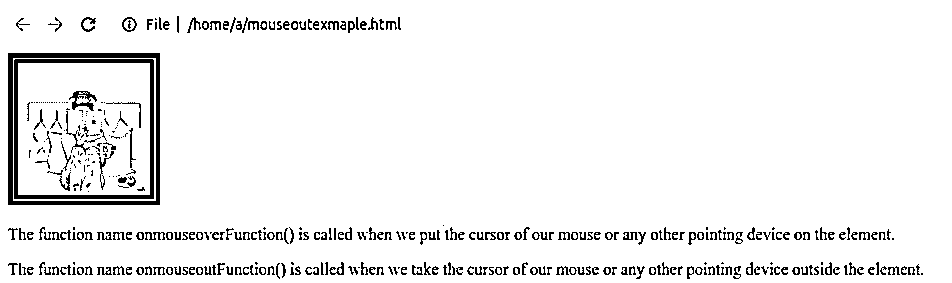
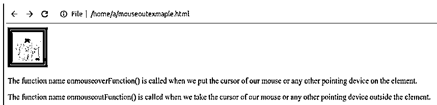
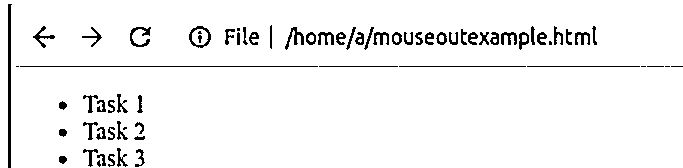
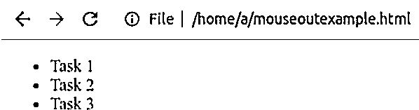

# JavaScript onmouseout

> 原文：<https://www.educba.com/javascript-onmouseout/>




## JavaScript onmouseout 简介

JavaScript onmouseout 是 JavaScript 中可用的事件，当鼠标离开元素覆盖的区域时，它可以帮助您执行某些操作、执行某些语句、调用另一个函数。请注意，使用该事件的主元素的子元素不受父元素上定义的该事件的影响。JavaScript 中的这个事件通常与 JavaScript onmouseover 事件一起使用，当鼠标箭头放在元素区域时调用该事件。onmouseout 是一个事件处理程序属性，由负责在 JavaScript 中执行 mouseout 事件的 GlobalEventHandlers mixing 提供。

**语法:**

<small>网页开发、编程语言、软件测试&其他</small>

以下是 JavaScript 中 onmouseout 事件的语法，它告诉我们如何调用该事件以及我们需要提供什么:

```
elementOfDOM.onmouseout = nameOfFunction;
```

其中 elementOfDOM 可以是 DOM 中存在的任何元素，并且当鼠标从元素区域移开时，您希望对其应用 onmouseout 事件并执行某些操作，nameOfFunction 是函数名，它将包含您希望在发生 mouseout 事件时执行的所有语句和代码。

### 工作和使用

每当指针(通常是鼠标或任何其他设备的光标)从元素外的区域移开时，就会发生 mouseout 事件。请注意，当我们为父元素定义 onMouseOut 事件时，该元素的子元素不会隐式应用 onMouseOut 事件，就像 mouseleave 事件一样。当我们使用 onmouseout 事件时，子元素的任何区域都不被认为是元素的区域，因为如果我们将光标从子元素上移开，函数将不会执行。

Mouseout 是 MouseEvent 接口的事件，该事件的事件处理程序属性是 onmouseout 属性。鼠标离开事件遵循冒泡模式，并且是可取消的。Mouseout 和 mouseleave 是两个不同的事件。Mouseout 事件仅应用于元素级别，而在 mouseleave 事件的情况下，该事件应用于所有子元素和定义该事件的主元素。我们可以在多种情况下使用 JavaScript 的 onmouseout 事件，例如当鼠标从元素上移开时，我们可以缩小图像，在 onmouseover 事件上，我们可以放大该事件，等等。

### JavaScript onmouseout 示例

下面是提到的例子:

#### 示例#1

我们将显示一个图像元素，在该元素中，我们将以 64 像素的默认大小显示文件夹中名为 sample.jpg 的图像，在鼠标悬停功能上，我们将大小增加到 128 像素，在执行鼠标事件后，大小将再次调整为原始值 64 像素。

**代码:**

```
<!DOCTYPE html>
<html>
<body>

<p>The function name onmouseoverFunction() is called when we put the cursor of our mouse or any other pointing device on the element.</p>
<p>The function name onmouseoutFunction() is called when we take the cursor of our mouse or any other pointing device outside the element.</p>
<script>
//Change the size of image to 128 pixel when mouse cursor is moved out of the image
function onmouseoverFunction(x) {
x.style.height = "128px";
x.style.width = "128px";
}
//Change the size of image to 64 pixel when mouse cursor is moved over the image
function onmouseoutFunction(x) {
x.style.height = "64px";
x.style.width = "64px";
}
</script>
</body>
</html>
```

我们将把这段代码保存在名为 mouseoutexample.html 的文件中，并在浏览器上执行后给出如下输出。

**输出:**




当我们将鼠标放在图像上时，它会以放大的图像显示以下输出:




鼠标移出图像后，图像的大小恢复到原始大小，如下图所示:




#### 实施例 2

我们将考虑需要完成的任务列表，并将鼠标移出列表元素上的事件，并研究它的工作。

**代码:**

```
<!DOCTYPE html>
<html>
<body>
<ul id="Tasks" onmouseout="onmouseoutFunction(this)" onmouseover="onmouseoverFunction(this)">
<li>Task 1</li>
<li>Task 2</li>
<li>Task 3</li>
</ul>
<script>
//Change the color of the list contents to green when mouse cursor is moved out of list
function onmouseoutFunction(x) {
x.style.color = "Green";
}
//Change the color of the list contents to red when mouse cursor is moved over of list
function onmouseoverFunction(x) {
x.style.color = "Red";
}
</script>
</body>
</html>
```

我们将用 mouseoutexample.html 的名字保存这个文件，并在浏览器上运行。它在执行后给出以下输出。

**输出:**




当我们将鼠标放在列表上时，它会显示以下带有红色内容的输出:


鼠标移出列表后，列表的颜色变为绿色:




### 结论

我们可以使用 onmouseout 属性作为 JavaScript 中 mouseout 事件的事件处理程序，通过调用编写 onmouseout 事件的函数来执行某些操作或执行某些代码。当根据需求考虑 web 开发时，这在许多用例中都是有用的。请注意，此事件应用于元素级别，元素的子元素被排除在事件工作范围之外。

### 推荐文章

这是 JavaScript onmouseout 的指南。这里我们分别用工作、使用和编程的例子来讨论 JavaScript onmouseout 的介绍。您也可以看看以下文章，了解更多信息–

1.  [JavaScript getElementsByTagName()](https://www.educba.com/javascript-getelementsbytagname/)
2.  JavaScript 中的[对象](https://www.educba.com/object-in-javascript/)
3.  [JavaScript 中的 push()](https://www.educba.com/push-in-javascript/)
4.  [禁用 JavaScript](https://www.educba.com/disable-javascript/)


