# JavaScript Onkeydown

> 原文：<https://www.educba.com/javascript-onkeydown/>

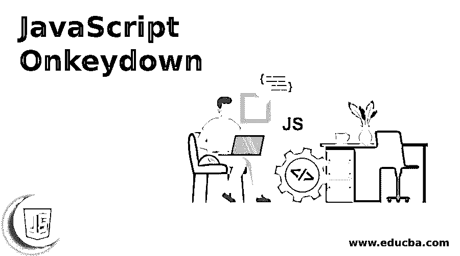


## JavaScript Onkeydown 简介

Onkeydown 是 Javascript 中的一个事件处理程序，当一个人按下键盘上的一个键时就会被调用。用于此目的的 web 元素可以是用户可以输入字符的任何元素，比如文本区域或文本框等表单元素。该事件处理程序声明当文档的对象处于焦点时按下键会发生什么。让我们在接下来的小节中看到 onkeydown 事件的更多细节。

**语法**

<small>网页开发、编程语言、软件测试&其他</small>

下面是 Javascript 中 Onkeydown 事件处理程序的语法:

```
<input type = "text" onkeydown = " myFunction()">
```

在这里，我们可以看到当一个键被按下时，一个函数 myFunction()被调用。

### onkeydown 事件在 Javascript 中如何工作？

让我们看看下面的代码是如何工作的:

**代码:**

```
<html>
<head>
<script>
<!--
function myFunction() {
alert("hey…you pressed a key now.")
}
//-->
</script>
</head>
<body>
<input type = "text" onkeydown = " myFunction()">
</body>
</html>
```

**说明:**这里可以看到，输入类型是文本，按下按键，函数 myFunction()被调用，一条文本嘿…你现在按了一个键。弹出窗口。

### 实现 JavaScript Onkeydown 的示例

以下是 Onkeydown 事件处理程序上的不同程序:

#### 示例#1

按下按键时弹出消息的 Java 脚本程序:

**代码:**

```
<html>
<head>
<script>
<!--
function myFunction() {
alert("hey…you pressed a key now.")
}
//-->
</script>
</head>
<body>
<input type = "text" onkeydown = " myFunction()">
</body>
</html>
```

**输出:**

执行代码时，会显示一个没有任何标签的文本框:

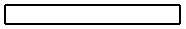


按下一个键时，会显示一条如下所示的消息:

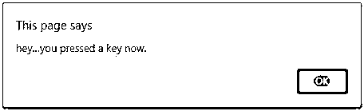


当按下 Ok 时，按下的键将显示在文本框中:

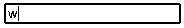


#### 实施例 2

按下键时改变文本框颜色的 Java 脚本程序:

**代码:**

```
<!DOCTYPE html>
<html>
<head>
<title> Javascript onkeydown Event Handler  </title>
<style>
h1 {
text-align: center;
color: red;
}
h2 {
text-align: center;
}
input[type=text] {
width: 100%;
padding: 14px 22px;
margin: 7px 0;
box-sizing: border-box;
font-size: 22px;
color: white;
}
p {
font-size: 22px;
}
</style>
</head>
<body>
<h1>Event handler<h1>
<h2>Sample Output</h2>
<p>Press the key to change the background color </p>
<input type="text" id="demo" onkeydown="func1()"
onkeyup="func2()">
<script>
function func2() {
document.getElementById("demo").style.backgroundColor = "red";
}
function func1() {
document.getElementById("demo").style.backgroundColor = "yellow";
}
</script>
</body>
</html>
```

**输出:**

执行代码时，会显示一个带有标题和段落的文本框:

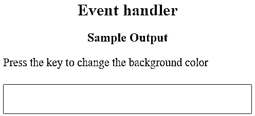


当按下一个键时，文本框的背景色从白色变为黄色:

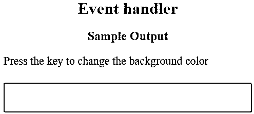


#### 实施例 3

按下按键时弹出消息的 Java 脚本程序:

**代码:**

```
<!doctype html>
<html>
<head><title>onkeydown event demo</title>
</head>
<body>
<h3>Sample onkeydown event handler</h3>
<p>A message will popup when any key is pressed. . .</p>
<input onkeydown="javascript:alert('You have pressed a key! ! !');"/>
</body>
</html>
```

**输出:**

执行代码时，会显示一个没有任何标签的文本框:

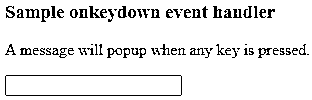


按下一个键时，会显示一条如下所示的消息:

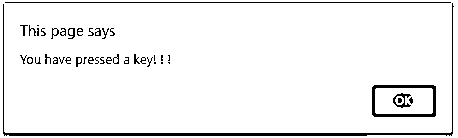


#### 实施例 4

按下某个键时，显示该键的 Unicode 的 Java 脚本程序:

**代码:**

```
<!DOCTYPE html>
<html>
<head>
<title> Javascript onkeydown Event Handler  </title>
</head>
<body>
<h1>Event handler<h1>
<h2>Sample Output</h2>
<input type="text" id="demo" onkeydown="func1()"
>
<script>
function func1() {
var keyCode = ('which' in event) ? event.which : event.keyCode;
alert ("The Unicode key code is: " + keyCode);
}
</script>
</body>
</html>
```

**输出:**

执行代码时，会显示一个带有标题和段落的文本框:

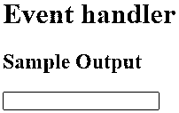


按下任何键，该键的 Unicode 就会弹出。在下图中，当我按下 s 时，会显示 s 的 Unicode:


单击确定后，按下的键将显示在文本框中:

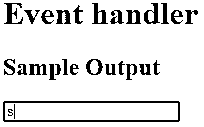


#### 实施例 5

当按下一个键时，改变文本框的颜色并显示该键的 Unicode 的 Java 脚本程序:

**代码:**

```
<!DOCTYPE html>
<html>
<head>
<title> Javascript onkeydown Event Handler  </title>
<style>
h1 {
text-align: center;
color: red;
}
h2 {
text-align: center;
}
input[type=text] {
width: 100%;
padding: 14px 22px;
margin: 7px 0;
box-sizing: border-box;
font-size: 22px;
color: white;
}
p {
font-size: 22px;
}
</style>
</head>
<body>
<h1>Event handler<h1>
<h2>Sample Output</h2>
<p>Press the key to change the background color and print the unicode</p>
<input type="text" id="demo" onkeydown="func1()"
onkeyup="func2()">
<script>
function func2() {
document.getElementById("demo").style.backgroundColor = "red";
}
function func1() {
var keyCode = ('which' in event) ? event.which : event.keyCode;
alert ("The Unicode key code is: " + keyCode);
document.getElementById("demo").style.backgroundColor = "yellow";
}
</script>
</body>
</html>
```

**输出:**

执行代码时，会显示一个带有标题和段落的文本框:

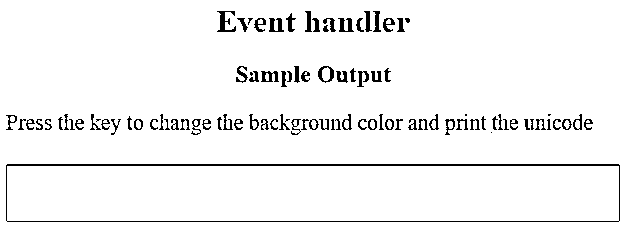


按下任何键，该键的 Unicode 就会弹出。在下图中，当我按下 s 时，会显示 s 的 Unicode。此外，当按下键时，textbox 的背景颜色会从白色变为黄色:

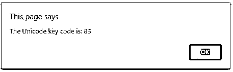


单击确定后，按下的键将显示在文本框中:

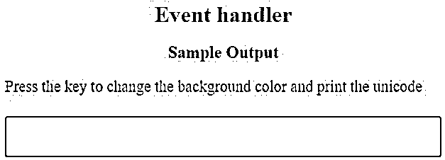


#### 实施例 6

按下数字键时不输入的 Java 脚本程序。

**代码:**

```
<!DOCTYPE html>
<html>
<head>
<title> Javascript onkeydown Event Handler  </title>
</head>
<body>
<h1>Event handler<h1>
<h2>Sample Output</h2>
<input type="text" id="demo" onkeydown=" return func1(event)">
<script type="text/javascript">
function func1 (event) {
var code = ('which' in event) ? event.which : event.code ;
chknum = (code >= 48 && code <= 57) ||
(code >= 96 && code <= 105 );
mod = ( event.altKey || event.ctrlKey|| event.shiftKey ) ;
return !chknum || mod ;
}
</script>
</body>
</html>
```

**输出:**

执行代码时，会显示一个带有标题和段落的文本框:

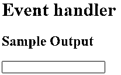


当试图输入任何数值时，由于受到限制，这是不可能的。同时，当输入一个字符时，它将显示如下:

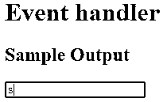


### 结论

Onkeydown 是 Javascript 中的一个事件处理程序，当键盘上的一个键被按下时就会被调用。该事件处理程序声明当文档的对象处于焦点时按下键会发生什么。在本文中，详细解释了 Onkeydown 事件处理程序的语法、工作方式和示例等不同方面。

### 推荐文章

这是一个 JavaScript Onkeydown 的指南。这里我们讨论 JavaScript Onkeydown 的介绍，语法，它是如何工作的，编程实例。您也可以浏览我们的其他相关文章，了解更多信息——

1.  [JavaScript 表单事件](https://www.educba.com/javascript-form-events/)
2.  [JavaScript 键盘事件](https://www.educba.com/javascript-keyboard-events/)
3.  [HTML 事件](https://www.educba.com/html-events/)
4.  [HTML 事件属性](https://www.educba.com/html-event-attributes/)


