# JavaScript 表单事件

> 原文：<https://www.educba.com/javascript-form-events/>

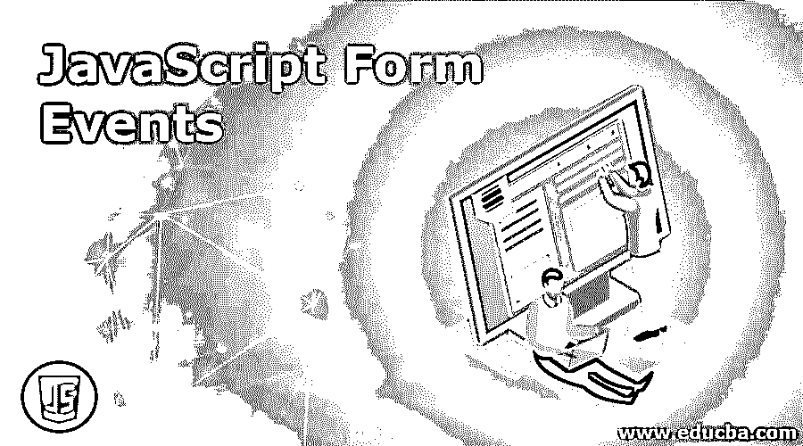


## JavaScript 表单事件简介

当用户失去焦点，或者从某种意义上说，用户想要修改表单控件值时，JavaScript 中的表单事件就会被触发。值的修改包括选择表单的任何复选框、在失去焦点的打开的表单上进行修改或改变键入的文本等。所有这些事件都是在表单中定义的，可以作为用户的事件，作为 JavaScript 表单事件。总的来说，当用户在表单上进行修改时，相关联的事件就构成 JavaScript 表单成功事件。

### JavaScript 中的各种表单事件

JavaScript 中有各种表单事件，这些事件与用户在焦点离开实际的焦点控件视图时可以创建的场景和事件有关:

<small>网页开发、编程语言、软件测试&其他</small>

#### 1.OnBlur

当用户留下一个空的输入字段，甚至没有尝试在表单上创建或键入任何额外的文本时，就会发生这种事件。

**示例:**这个程序演示了 JavaScript 中的 Onblur Form 事件，其中用户将输入字段留空，然后尝试给出如图所示的输出。

**代码:**

```
<!DOCTYPE html>
<html>
<head>
<script>
function Functa() {
var p = document.getElementById("fnm");
p.value = p.value.toUpperCase();
}
</script>
</head>
<body>
Enter your name: <input type="text" id="fnm" onblur="Functa()">
<p>when the function a is triggered then the input text gets converted into upper case</p>
</body>
</html>
```

**输出:**

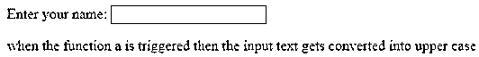


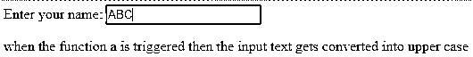


#### 2.昂哥

当用户试图打开表单，但没有在表单中键入或输入任何文本，然后用户将字段留空时，就会发生这种事件。此外，用户试图从表单中的下拉列表中选择值。
**例如:**这个程序演示了 JavaScript 中的 Onchange Form 事件，其中用户将输入字段留空，然后尝试从下拉列表中选择一个字段值，选择之后，它为列出的值做好准备。

**代码:**

```
<!DOCTYPE html>
<html>
<head>
<script>
function prefrrdsubjects() {
prefer = document.forms[0].browsers.value;
alert("subjects which are most liked and preferred " + prefer);
}
</script>
</head>
<body>
<form>
Choose which subject you like and will prefer:
<select id="subjects" onchange="liked&preferred()">
<option value="Chemistry">Chemistry</option>
<option value="Physics">Physics</option>
<option value="Maths">Maths</option>
</select>
</form>
</body>
</html>
```

**输出:**

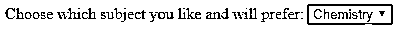


#### 3.专注

这是一个特殊的事件，其行为方式是，当用户想要通过突出显示文本的背景或文本作为输入来突出显示或将焦点转向某个事件时。
例 3:这个程序说明了 JavaScript 中的 Onfocus Form 事件，其中用户将输入字段留空，然后试图选择并单击按钮，这是一个由用户执行的事件，以突出显示用户写在突出显示文本中的重要文本，如给定程序的输出所示。

**代码:**

```
<!DOCTYPE html>
<html lang="en">
<head>
<meta charset="UTF-8">
<title> Event for focusing the JavaScript element </title>
</head>
<body>
<script>
function highlightInput(em1){
em1.style.background = "red";
}
</script>
<input type="text" onfocus="highlightInput(this)">
<button type="button">Button</button>
</body>
</html>
```

**输出:**

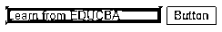


#### 4\. OnSelect

这是 JavaScript 中的一个表单事件，用户试图将一些文本作为输入输入到文本字段，然后显示它以在表单上执行进一步的操作。

**示例:**这个程序演示了选择文本然后提交给最终值的表单事件。

**代码:**

```
<!DOCTYPE html>
<html>
<head>
<script>
function function5th() {
document.getElementById("demo1").innerHTML = "select text to display";
}
</script>
</head>
<body>
Display text: <input type="text" value="Welcome Educba!" onselect="Function5th()">
<p id="demo1"></p>
</body>
</html>
```

**输出:**

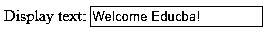


#### 5.昂松宾

这是一个表单事件，其中用户试图通过在表单事件上放置文本来进行一些输入，然后它选择要求用户提供一些文本作为输入的文件，这些文本在作为表单事件提交时可以执行进一步的操作，如参考下一页或移动到下一段。

**示例:**这个程序演示了选择文本然后提交给最终值的表单事件。

**代码:**

```
<!DOCTYPE html>
<html>
<head>
<script>
function Input_a() {
fnm = document.forms[0].fnm.value;
alert("Hi " + fnm + "! This Page will get redirected to www.educba.com");
}
</script>
</head>
<body>
<form onsubmit="Input_a()" action="https://www.educba.com/">
Enter your name: <input id="fnm" type="text" size="20">
<input type="submit">
</form>
</body>
</html>
```

**输出:**

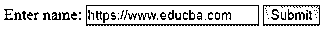


点击提交按钮后:

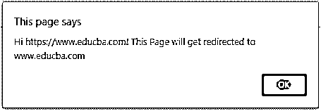


#### 6\. OnReset

Onreset 是一个窗体事件，用户试图单击 reset 按钮来使窗体事件出现或使控件视图出现与前一个窗体相同，这是用户最初试图做的。

这个程序演示了 onreset form 事件，用户试图重置表单。

**代码:**

```
<!DOCTYPE html>
<html>
<head>
<script>
function mess_reset() {
alert("This event is used to trigger the event where user clicks on reset button");
}
</script>
</head>
<body>
<form onreset="mess_reset()">
Enter your name: <input type="text" size="20">
<input type="reset">
</form>
</body>
</html>
```

**输出:**

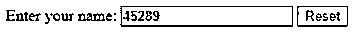


点击重置按钮后:

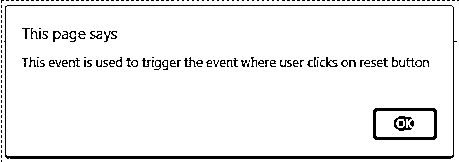


#### 7.OnKeyDown

onkeydown 是一个窗体事件，用户单击窗体来执行一个用户按住向下键的事件。

这个程序演示了用户按下 onkeyDown 键的事件。

**代码:**

```
<!DOCTYPE html>
<html>
<head>
<script>
function Function8() {
alert("press key inside the input field");
}
</script>
</head>
<body>
<p>Function is pressed to keep the key inside the input field when once triggered</p>
<input type="text" onkeydown="Function8()">
</body>
</html>
```

**输出:**

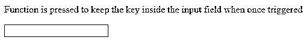


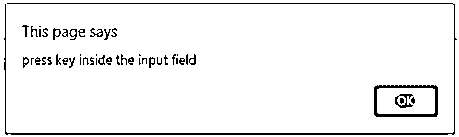


**有没有印刷机:**

它的行为也与 Onkeydown 相同，即用户连续按下或按住一个键。

#### 8\. OnKeyUp

这是一个用户执行用户释放键的事件。

这个程序演示了用户按下 OnKeyUp 键的事件。

**代码:**

```
<!DOCTYPE html>
<html>
<head>
<script>
function Mess_8() {
document.forms[0].SecondI/p.value = document.forms[0].Input.value;
}
</script>
</head>
<body>
<p>This event occurs when a keyboard key is on its way UP.</p>
<form>
Enter your name:
<input type="text" name="Input" onkeyup="writeMessage()" size="20">
<input type="text" name="SecondI/p" size="20">
</form>
</body>
</html>
```

**输出:**

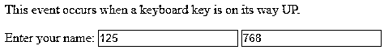


#### 9.OnKeyUp 和 OnKeyDown

这也被认为是用户有可能同时按下两个键来完成场景的事件。

这个程序演示了用户同时按下 OnKeyUp 和 OnkeyDown 键的事件。

**代码:**

```
<!DOCTYPE html>
<html>
<head>
<script>
function colr(colr) {
document.forms[0].Input.style.background = colr;
}
</script>
</head>
<body>
<form>
Give some message:<br>
<input
type="text"
onkeydown="color('pink')"
onkeyup="color('white')"
name="colr">
</form>
</body>
</html>
```

**输出:**

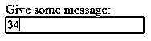


### 结论

JavaScript 表单事件是一个基于场景的过程，当用户的焦点转移到格式化文本文件的输入或单击表单选项卡以提交和重置表单的事件时，它依赖于用户。

### 推荐文章

这是 JavaScript 表单事件指南。这里我们讨论 JavaScript 表单事件及其方法的介绍，以及示例和代码实现。您也可以浏览我们推荐的其他文章，了解更多信息——

1.  [Javascript 嵌套函数](https://www.educba.com/javascript-nested-functions/)
2.  [JavaScript 日期函数](https://www.educba.com/javascript-date-function/)
3.  [JavaScript 混淆器](https://www.educba.com/javascript-obfuscator/)
4.  [JavaScript lastIndexOf()](https://www.educba.com/javascript-lastindexof/)


