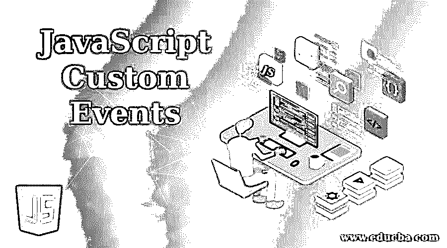
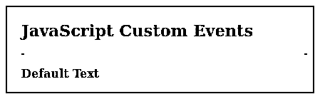
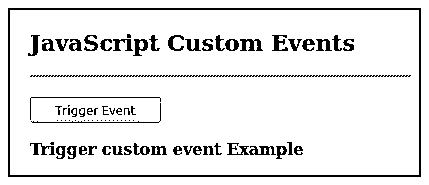

# JavaScript 自定义事件

> 原文：<https://www.educba.com/javascript-custom-events/>




## JavaScript 自定义事件简介

JavaScript 提供了一种根据用户需求定义和执行事件的方法，我们称之为自定义事件。由于 JavaScript 在鼠标悬停、select dropdown 等目标元素上提供了默认事件，因此会执行默认的处理函数，但是在定制事件的情况下，我们可以定义事件并执行执行函数。这为用户开发代码提供了更大的灵活性，也改进了代码的维护。这些事件不是由浏览器触发的，因此也称为合成事件。在本文中，我们将看到如何创建自定义事件并分派它们。

**语法:**

<small>网页开发、编程语言、软件测试&其他</small>

```
let customEvent = new CustomEvent("newEventName");
```

这就是通常创建自定义事件的方式。它的语法如下:

```
new CustomEvent(typeArg, customEventInit);
```

**参数:**

*   **type arg:**type arg 参数表示我们正在定义的自定义事件的名称。
*   **customEventInit:**customEventInit 是一个可选字段，它包含一个“详细信息”字段，该字段也是一个可选字段。此字段保存与事件相关的值。

**返回值:**如果用 customEventInit 字典指定，则返回一个带有相关属性的 CustomEvent 对象。

### JavaScript 中的自定义事件是如何工作的？

自定义事件的工作方式与默认事件相同。通过使用 addEventListener()方法，我们可以将元素配置为以类似于默认事件的方式侦听自定义事件。这就是创建和实现自定义事件的方式，

首先，自定义事件定义如下:

```
var customEvent = new CustomEvent('newEventName')
```

一旦创建了对象，事件就被传递给我们想要附加事件的元素上的 dispatchEvent 方法。该元素将作为目标事件。

```
element.dispatchEvent(customEvent );
```

自定义事件的定义和实现到此为止，之后为该事件添加事件侦听器，就像任何其他事件一样。

```
element.addEventListener('newEventName', function( event));
```

通过这种方式，我们可以在事件发生时传递事件对象，并且可以根据需要执行多个活动。

### JavaScript 中自定义事件的示例

下面是用 JavaScript 实现自定义事件的不同例子。

#### 示例 1–修改事件的元素数据

**代码:**

```
<!DOCTYPE html>
<html>
<head>
<meta charset = "UTF-8">
<title>
JavaScript Custom Events
</title>
<style>
.body-data {
border : #81D4FA 2px solid;
background-color : #03a9f400;
text-align : left;
padding-left : 20px;
height : auto;
width : auto;
}
.resultText {
margin: 0 0 3px 0;
padding: 0px;
display: block;
font-weight: bold;
}
.heading {
font-weight: bold;
border-bottom: 2px solid #ddd;
font-size: 15px;
width: 98%;
}
</style>
</head>
<body>
<div class = "body-data" >
<div class = "heading" >
<h2> JavaScript Custom Events </h2>
</div>
<div class = "resultText" >
<p id = "result1" > Default Text </p>
</div>
</div>
<script type = "text/javascript">
var textElement = document.getElementById( 'result1' );
// Adding defined custom event on the text field element
textElement.addEventListener( 'newEventName' , function( event ) {
textElement.innerHTML = event.detail.newText;
textElement.style.fontSize = event.detail.fontSize;
} ) ;
function changeText( t, s ) {
// Creating new event name newEventName with event object detail containing
// new text to be updated and font size to change dynamically
var customEvent = new CustomEvent( 'newEventName', {
detail : {
newText: t,
fontSize: s
}
} );
// dispatching the event on element on which we want it to register
textElement.dispatchEvent( customEvent );
}
</script>
</body>
</html>
```

**输出:**

事件前:




事件之后:


这里，我们定义了一个自定义事件来修改文本内容及其字体大小。我们从控制台调用函数 changeText()来生成一个事件。

#### 示例 2–使用按钮触发事件

**代码:**

```
<!DOCTYPE html>
<html>
<head>
<meta charset = "UTF-8">
<title>
JavaScript Custom Events
</title>
<style>
.body-data {
border : #81D4FA 2px solid;
background-color : #03a9f400;
text-align : left;
padding-left : 20px;
height : auto;
width : auto;
}
.resultText {
margin: 0 0 3px 0;
padding: 0px;
display: block;
font-weight: bold;
}
.heading {
font-weight: bold;
border-bottom: 2px solid #ddd;
font-size: 15px;
width: 98%;
}
</style>
</head>
<body>
<div class = "body-data" >
<div class = "heading" >
<h2> JavaScript Custom Events </h2>
</div>
<div class = "resultText" >
</br>
<button> Trigger Event </button>
<p id = "result1" > Default Text </p>
</div>
</div>
<script type = "text/javascript">
// Add an event listener
document.addEventListener( 'myEvent' , function( e ) {
console.log( e.detail );
document.getElementById( 'result1').innerHTML = e.detail;
} );
function fireEvent( ) {
// create new custom event
var event = new CustomEvent( 'myEvent' , {
"detail" : "Trigger custom event Example "
});
// Dispatch the custom event
document.dispatchEvent( event );
}
// button to trigger the event
document.getElementsByTagName( "button" )[0].onclick = function() {
fireEvent();
}
</script>
</body>
</html>
```

**输出:**

点击前:


点击后:




这里，我们创建了一个新的自定义事件，详细信息作为一条文本消息。此事件已附加到文档本身。为了在这个场景中触发事件，我们创建了一个按钮。该按钮将触发事件，并导致文档在单击时动作。在我们的例子中，我们用事件本身的消息细节替换文本。

### 优势

*   我们可以根据特定的功能创建自定义事件。
*   这改进了代码的维护，因为相同的功能被绑定在一起。
*   自定义事件允许我们在脚本之外运行函数。
*   可以在其他文件或脚本中附加事件并运行它们。
*   可以将多个侦听器附加到同一个事件。
*   从脚本中分离代码是可能的，因为我们不必在函数中包含事件代码。
*   代码被分离，多个脚本可以使用这些事件，多个开发人员也可以有效地工作。

### 结论

自定义事件只不过是开发人员自己创建的事件。这些与 JavaScript 中的默认事件没有什么不同。自定义事件允许我们将代码从脚本或函数中分离出来，它们也可以从外部触发。这些事件也被称为合成事件。

### 推荐文章

这是 JavaScript 自定义事件的指南。在这里，我们讨论自定义事件如何在 JavaScript 中工作，以及不同的例子和代码实现。您也可以浏览我们的其他相关文章，了解更多信息——

1.  [JavaScript 中的多态性](https://www.educba.com/polymorphism-in-javascript/)
2.  [JavaScript 键盘事件](https://www.educba.com/javascript-keyboard-events/)
3.  [JavaScript 窗口事件](https://www.educba.com/javascript-window-events/)
4.  [JavaScript 表单事件](https://www.educba.com/javascript-form-events/)


