# JavaScript 警报

> 原文：<https://www.educba.com/javascript-alert/>

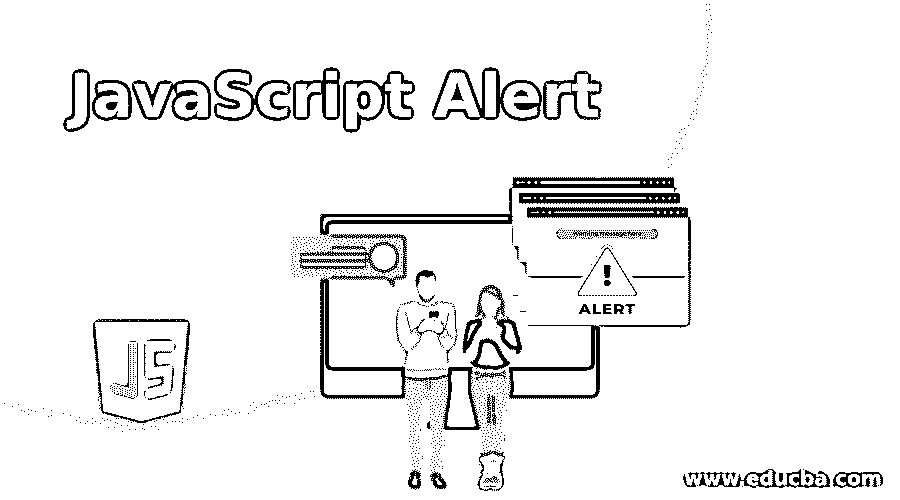


## JavaScript Alert 简介

JavaScript Alert 被定义为警告用户应用程序表单的状态，如警告消息、成功消息、失败消息等。我们简单地使用 alert 关键字让弹出框警告用户。警告框用于警告用户警告、错误、信息等。

**实时示例:**假设您正在填写选民身份证在线申请表，然后它会询问您的出生日期，然后您必须提供出生日期以检查选民身份的资格标准。如果你是 18 岁或以上，那么申请进一步移动；否则，它将显示一条警告消息，说明您的年龄低于 18 岁。这种警告信息被称为“警告框”。

<small>网页开发、编程语言、软件测试&其他</small>

### JavaScript 中的 Alert Box 是如何工作的？

警告框用于警告用户在填写表单时已经执行的操作。出现警告框时，用户必须单击“确定”才能进入下一步。

**语法:**

```
alert("message");
```

下面是提到的例子:

#### 示例#1

带按钮的警告框

**代码:**

```
<!DOCTYPE html>
<html>
<title>Alert Box</title>
<!--CSS Styles-->
<style>
p
{
border: double 8px red;
font-size: 20px;
color: green;
text-align: justify;
}
h1,h2
{
color: blue;
text-align:center;
}
.button
{
text-align: center;
}
input
{
color:white;
background: brown;
font-size: 25px;
}
</style>
<!--JavaScript Logic-->
<script>
function getMyLoginStatus()// getMyLoginStatus() function defination
{
var name="AMARDEEP";// name variable declaration
if (name==="AMARDEEP")//checck whether given name is matched or not
{
alert("Login was successful "+name);//if given name match alert the user about this message
}
else
{
alert("Login was unsuccessful "+name);//if given name not match alert the user about this message
}
}
</script>
<body>
<div>
<font color="green"><h1>Alert Box Real Time Example</h1></font>
<p>Let suppose you are filling online application form for voter identity card then it is asking youabout your date of birth then you have to provide the date of birth for checking eligibility criteria of the voter identity. If you are 18 years or above then application move further otherwise it will show one warning message that your age is below 18 years. This warning message is known as “Alert box”.</p>
<h2>Click below button know your login status</h2>
<form>
<div class="button">
<!--Creating Alert Me button and calling getMyLoginStatus() function to perform alert box operation-->
<input type="button" value="Alert Me" onclick="getMyLoginStatus();" />
</div>
</form>
</div>
</body>
</html>
```

**输出:**

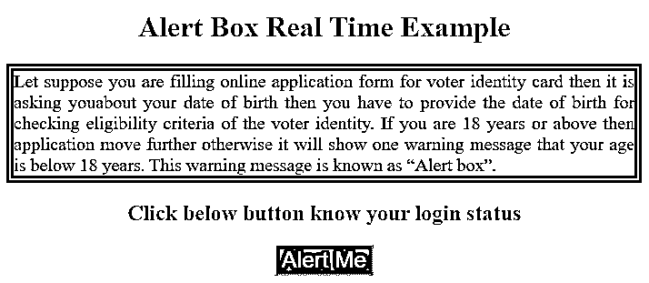


**如果名称匹配，则提示框:**

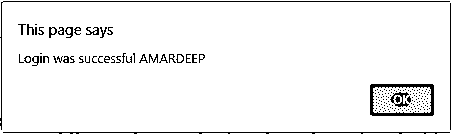


**如果名称不匹配，则警告框:**

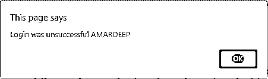


#### 实施例 2

通过单击按钮切换案例的警告框示例:

**代码:**

```
<!DOCTYPE html>
<html>
<title>Alert Box</title>
<!--CSS Styles-->
<style>
p
{
border: dotted 8px blue;
font-size: 20px;
color: red;
text-align: justify;
}
h1,h2
{
color: green;
text-align:center;
}
.button
{
text-align: center;
}
input
{
color:white;
background: navy;
font-size: 25px;
}
</style>
<!--JavaScript Logic-->
<script>
function getMyFavouriteColor()//getMyFavouriteColor () function defination
{
var color="Green";// color variable declaration
switch(color) {//switch case for matching value
case "Green": //if given value is match alert the user about this message
alert("Green is my favorite color!");
break;
case "Blue"://if given value is match alert the user about this message
alert("Blue is my favorite color!");
break;
case "Red"://if given value is match alert the user about this message
alert("Red is my favorite color!");
break;
case "Pink"://if given value is match alert the user about this message
alert("Pink is my favorite color!");
break;
case "Brown"://if given value is match alert the user about this message
alert("Brown is my favorite color!");
break;
default://if none of the given value is match alert the user about this default message
alert("I don't have any favorite color!");
}
}
</script>
<body>
<div>
<font color="green"><h1>Brief Introduction of Alert Box</h1></font>
<p>In JavaScript alert box is the sub type of pop up box. This pop up boxes are used give the information about further step. Generally, Popup boxes are 3 types
1\. Alert box
2\. Confirm box
3\. Prompt box
For Time being now we will discuss about the alert box in JavaScript. Alert box is used to alert the user about warnings, errors, information etc.
</p>
<h2>Click below button know your favorite color from switch cases</h2>
<form>
<div class="button">
<!--Creating Alert Me button and calling getMyFavouriteColor () function to perform alert box operation-->
<input type="button" value="Show My Favourite Color" onclick=" getMyFavouriteColor();" />
</div>
</form>
</div>
</body>
</html>
```

**输出:**

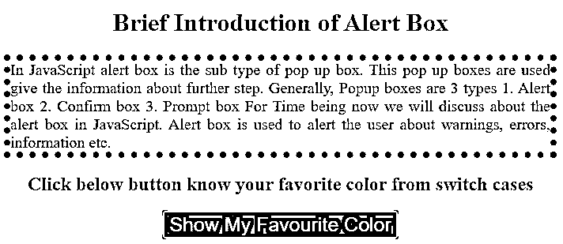


**如果颜色匹配，则警告框:**

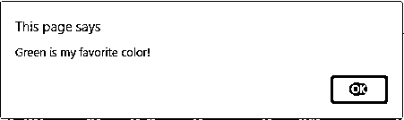


**如果颜色不匹配，则警告框:**

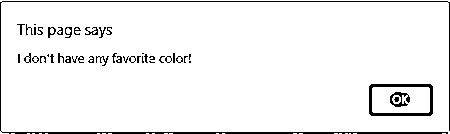


#### 实施例 3

带有用户输入的警告框示例:

**代码:**

```
<!DOCTYPE html>
<html>
<title>Alert Box</title>
<!--CSS Styles-->
<style>
p
{
border: dashed 8px blue;
font-size: 20px;
color: orange;
text-align: justify;
}
h1,h2
{
color: navy;
text-align:center;
}
.button
{
text-align: center;
}
input
{
color:white;
background: skyblue;
font-size: 25px;
}
</style>
<!--JavaScript Logic-->
<script>
function knowMyEligibility()// knowMyEligibility() function defination
{
var input=prompt("Please enter your age=>");// asking user input
if(input>=18) {//CHeck whether the age is 18 or greater
alert("Congratulations! You are eligible  for vote");
}
else
{
alert("Sorry! You are not eligible for vote, please try when you are 18 years");
}
}
</script>
<body>
<div>
<font color="green"><h1>Alert Box Usage</h1></font>
<p>An alert box is used for warning the user about action has performed at the time of form filling. When an alert box appears, user must click Ok to move next step.
Syntax:
alert(“message”);
</p>
<h2>Click by Know My Eligibility button from the below</h2>
<form>
<div class="button">
<!--Creating Alert Me button and calling knowMyEligibility() function to perform alert box operation-->
<input type="button" value="Know My Eligibility" onclick="knowMyEligibility();" />
</div>
</form>
</div>
</body>
</html>
```

**输出:**

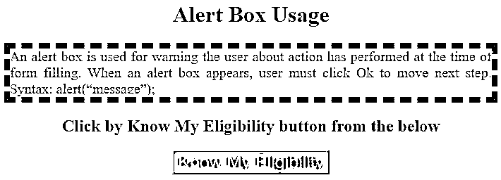


**如果年龄匹配，则提示框:**

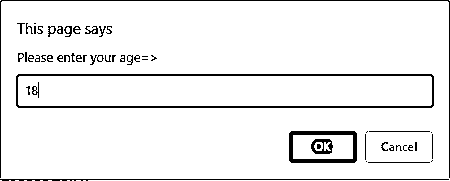


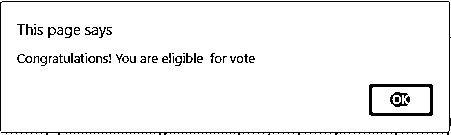


**如果年龄不匹配，则提示框:**

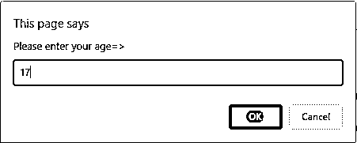


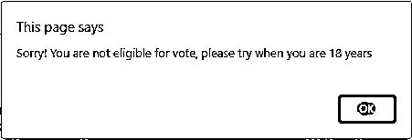


### 推荐文章

这是一个 JavaScript Alert 的指南。这里我们也讨论一下 javascript 中的简介和 alert box 是如何工作的？以及不同的示例和代码实现。您也可以看看以下文章，了解更多信息–

1.  [JavaScript 承诺](https://www.educba.com/javascript-promise/)
2.  [JavaScript 模块](https://www.educba.com/javascript-modules/)
3.  [JavaScript 延迟](https://www.educba.com/javascript-defer/)
4.  [JavaScript 混淆器](https://www.educba.com/javascript-obfuscator/)


