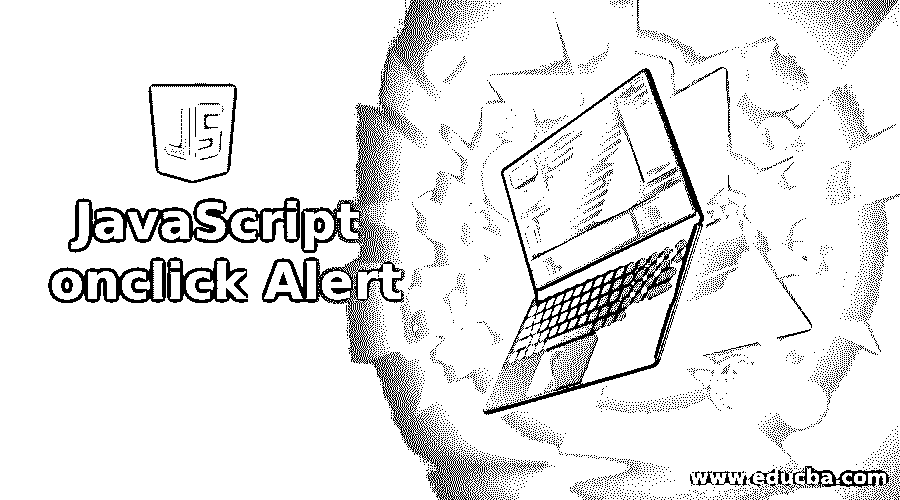
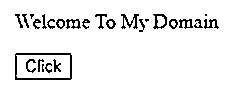
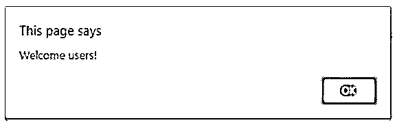
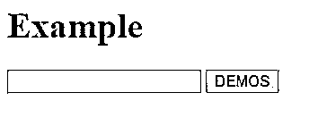
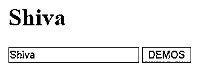
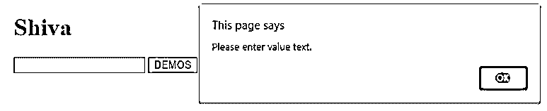
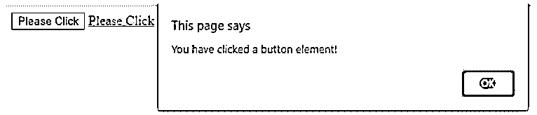
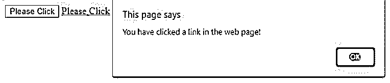

# JavaScript onclick 警报

> 原文：<https://www.educba.com/javascript-onclick-alert/>




## JavaScript onclick Alert 简介

以下文章提供了 JavaScript onclick Alert 的概要。JavaScript 是客户端脚本语言之一，也是用户浏览器根据浏览器的不同而解释的动态计算机编程语言，它可能因用户使用的浏览器版本而异。该事件就像是当用户单击或触发该功能时，该应用程序中必须发生某些事情的信号。相同的 onclick 是事件之一，它将发生一次，或者当用户单击该事件时，它将显示一些警告或弹出消息，这些消息将显示在用户浏览器上，以便在 web 应用程序上调用特定的功能。

**语法:**

<small>网页开发、编程语言、软件测试&其他</small>

JavaScript 还为每个函数提供了一些单独的语法，包括预定义函数和用户定义函数。所有的 dom(文档对象模型)都有生成信号的节点，但是 JavaScript 事件并不局限于生成 DOM 对象。

```
<html>
<head>
<script>
function name()
{
alert("");
}
</script>
</head>
<body>
<button onclick="javascriptfunctionname()"></buttom><!—any other html input tag elements will also used instead of button-->
<input type="button" value="" onclick="alert('')" >
-------some html codes---
</body>
</html>
```

我们在同一个程序中创建了 onclick()函数和 alert()函数，像 button 等 html 标记元素将用于创建和设计 html 网页，它将调用 JavaScript 函数进行身份验证或验证。

### JavaScript onclick Alert 是如何工作的？

每当我们调用 JavaScript 函数时，在每个事件中都会自动触发后端，因为它会使用一些警告函数或消息在浏览器屏幕中显示输出，然后只有用户知道应用程序状态或给定的输入是否有效，基于此，他们会更改输入值等，直到警告消息停止。每个事件将使用单独的处理程序来处理，JavaScript 函数在每个脚本事件的情况下运行。

在 JavaScript 中有很多方法来分配处理程序。每当用户点击 onclick 事件时，它都会被后端的 onclick 事件处理程序处理，因为 onclick 事件在同一个网页上有报警功能，所以它会同时执行两个事件操作。如果我们在网页中使用 onclick，在 onclick 方法的值中使用 alert，那么警报函数值将在单引号中传递，因为 onclick 事件属性本身被赋值为使用双引号。如果我们在警报函数值中使用双引号，那么它将不会在脚本中工作，它会在代码中显示错误。

JavaScript onclick 事件可以借助实例来触发。每当我们在网页中使用 JavaScript 函数时，它将作为事件被调用，它将与网页中的用户浏览器进行协调和交互，它必须被单击浏览器链接或一些其他 ui 标签元素，如按钮，我们可以在输入文本框或一些其他输入文本区域或一些其他选择或复选框中输入值，这些标签元素用于触发的 JavaScript 函数 用户浏览器会话中的事件，甚至硬件组件，如键盘、鼠标指针或一些其他硬件组件，都必须在 html 表单中使用，它将用于在后端逻辑中提交请求。

如果必须在数据库中检查用户请求的详细信息，则只有用户请求对后端逻辑代码(如 java、php 等)有效。相同的请求和响应格式具有不同的请求事件必须由事件处理器或事件监听器处理，以处理特定任务或一组分组任务的请求。onclick 事件基于鼠标事件，因为每当用户单击网页中的某些 ui 标签元素时都会触发该事件。用户拖动鼠标指针通常会在整个网页浏览器中拖动鼠标指针。一旦用户单击 web 应用程序或页面上的特定元素，就会发生 click 事件。

### JavaScript onclick 警报示例

下面是提到的例子:

#### 示例#1

**代码:**

```
<html>
<head>
<script type="text/javascript">
functiondemo() {
alert ("Welcome users!");
document.write ("Have a Nice day!");
}
</script>
</head>
<body>
<p>Welcome To My Domain</p>
<form>
<input type="button" value="Click" onclick="demo();"/>
</form>
</body>
</html>
```

**输出:**







#### 实施例 2

**代码:**

```
<html>
<body>
<h1 id="sample">Example</h1>
<input type="text" id="firstValue"/>
<input type="submit" id="b" value="DEMOS"/>
<script type="text/javascript">
var i = document.getElementById('b');
i.addEventListener ("click",demo);
functiondemo(){
var v = document.getElementById('firstValue').value;
if( v.length==0 ){
alert('Please enter value text.');
return;
}
var title = document.getElementById('sample');
title.innerHTML = v;
} </script>
</body>
</html>
```

**输出:**










#### 实施例 3

**代码:**

```
<!DOCTYPE html>
<html lang="en">
<head>
<meta charset="utf-8">
<title>Welcome To My Domain</title>
</head>
<body>
<button type="button"onclick="alert('You have clicked a button element!');">Please Click</button>
<a href="#"onclick="alert('You have clicked a link in the web page!');">Please Click</a>
</body>
</html>
```

**输出:**







在上面的例子中，我们将使用 onclick 和 alert 事件，它们用在具有不同场景的网页中。第一个例子中，我们使用普通的 onclick 和 alert 事件，每当用户单击 html 标记元素 like button 时，它们就在同一网页中被触发。第二个例子中，我们使用一个额外的事件，如 addEventListener() 是事件之一，该事件由其自己的侦听器处理，因此每当单击按钮时，该事件都会被触发并调用 JavaScript 函数，即使我们不能在文本框中输入任何值，它也会显示警告消息。 最后一个例子我们使用普通的基本 onclick 和 alert 事件函数。

### 结论

当事件发生时，用户点击任何 HTML 标签元素，JavaScript 就会被执行。onclick 和 alert 事件是网页 JavaScript 中最常用的事件类型。如果 HTML 元素有任何匿名函数，onclick 属性会将事件附加到这个元素上。

### 推荐文章

这是一个 JavaScript onclick Alert 的指南。这里我们讨论 JavaScript onclick alert 是如何工作的？和示例。您也可以看看以下文章，了解更多信息–

1.  [JavaScript 中的多态性](https://www.educba.com/polymorphism-in-javascript/)
2.  [JavaScript 中的定时器](https://www.educba.com/timer-in-javascript/)
3.  [JavaScript 枚举](https://www.educba.com/javascript-enum/)
4.  [JavaScript lastIndexOf()](https://www.educba.com/javascript-lastindexof/)


