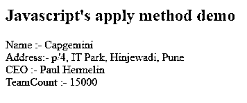
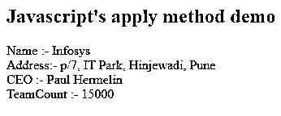

# JavaScript 应用

> 原文：<https://www.educba.com/javascript-apply/>


## JavaScript 应用简介

Javascript apply 是帮助我们调用一个函数的方法，该函数设置传递的值或被指定为“this”关键字的对象，每当调用 apply 方法时，该关键字被称为当前引用对象，并且您希望将参数数组作为第二个参数传递给该函数。Javascript 的 apply 和 call 方法在工作上可能看起来是相似的。但是，两者有一点不同。call()方法接受逗号分隔格式的参数，而 apply()方法希望参数列表以数组格式指定为函数调用的第二个参数。

**语法:**

<small>网页开发、编程语言、软件测试&其他</small>

```
mainFunction.apply(argumentForThis,[argument1,argument2,...argumentN])
```

我们可以看到，在对您的函数使用 apply 之后，它导致调用带有指定参数的函数，该参数由“this”关键字引用，并且参数被传递给在第二个参数的数组中指定的函数。应用函数的语法定义如下

*   **argumentfor This:**application 函数的这个参数将 javascript 的“This”关键字引用到作为 apply 函数的第一个参数传递的参数。ArgumentForThis 这是在调用目标函数时将作为“This”参数进一步传递的值，在我们的语法中，目标函数是 mainFunction。是强制值，需要提一下。如果非严格模式为 on，并且 ArgumentForThis 的值为 null 或未定义，则认为它是“This”关键字进一步引用的全局对象。
*   **[argument1，argument2，…argumentN]** :在我们的例子中，这些是您想要传递给目标函数 main function 的附加参数。它们应该被称为数组。ECMAScript 5 和更高版本的最新版本的 javascript 甚至支持类似数组的参数，并把数组作为应用函数的第二个参数。这是可选的。
*   **返回值:**调用原始 main 函数的输出，以“this”关键字的指定值作为第一个参数，其他参数值作为数组参数或类数组参数(如果提到的话)中提供的初始值。

### Javascript 中 apply()方法的函数

apply()方法帮助我们编写一次函数，并通过由多个对象继承来使用该函数。这意味着通过指定不同的值，即对象引用作为应用方法的第一个参数，单个函数可以被多个对象使用。“this”的值可以在调用函数时指定。

call()和 apply()方法以相同的方式工作。两者之间唯一的区别是 call()方法接受逗号分隔的参数列表，而 apply()方法需要一个参数数组。我们可以使用数组文字或数组对象来指定函数的参数。例如 function.apply(this，['javascript '，' mysql'])使用数组文字，而 ffuncuncunc . apply(this，new Array('javascript '，' mysql '))。使用新的数组对象作为参数。

从 ECMAScript 的第五版开始，类似数组的对象也可以用来指定参数。所谓类似数组的对象，我们指的是任何具有长度属性的对象，比如 NodeList，或者任何定制对象，比如 JSON 格式，比如{ 'length': 2，' 0': 'javascript '，' 1': 'MySQL' }，也是受支持的。不支持数组类对象作为参数的浏览器版本会引发异常。本文末尾给出了浏览器及其支持版本的完整列表。

### JavaScript 应用示例

考虑一个简单的例子来理解上面提到的说法。

**代码:**

```
<!DOCTYPE html>
<html>
<body>
<h2>Javascript's apply method demo</h2>
<p id="demo"></p>
<script>
var company = {
fullName: function(ceo, teamcount) {
return "Name :- " + this.name + "<br> Address:- " + this.address + "<br> CEO :- " + ceo + "<br> TeamCount :- " + teamcount;
}
}
var company1 = {
name:"Capgemini",
address: "p/4, IT Park, Hinjewadi, Pune"
}
var company2 = {
name:"Infosys",
address: "p/7, IT Park, Hinjewadi, Pune"
}
var temporaryVariable = company.fullName.apply(company1, ["Paul Hermelin", 15000]);
document.getElementById("demo").innerHTML = temporaryVariable;
</script>
</body>
</html>
```

**输出:**




我们可以观察到 company1 记录被获取，并且“this”关键字引用了 company1 对象，因为我们将它作为第一个参数。同样，如果我们使用

```
var temporaryVariable = company.fullName.call(company2, "Paul Hermelin", 15000);
```

我们将得到以下输出，而不是 company1，因为现在“this”将引用 company2 对象。




### 结论

我们可以使用全名为 Function.prototype.apply()的 apply 方法来创建可由多个对象使用的函数，只需在其他对象中继承它们即可。没有必要为多个对象重写相同的函数。您需要做的只是将“this”关键字引用的值或对象作为 apply()方法的第一个参数。

### 推荐文章

这是一个 JavaScript 应用指南。在这里，我们还将讨论 javascript 中 apply()方法的介绍和使用，以及一个示例及其代码实现。您也可以看看以下文章，了解更多信息–

1.  [JavaScript 应用 vs 调用](https://www.educba.com/javascript-apply-vs-call/)
2.  [JavaScript 中的 push()](https://www.educba.com/push-in-javascript/)
3.  [JavaScript 数组过滤器](https://www.educba.com/javascript-array-filter/)
4.  [JavaScript keys()](https://www.educba.com/javascript-keys/)


