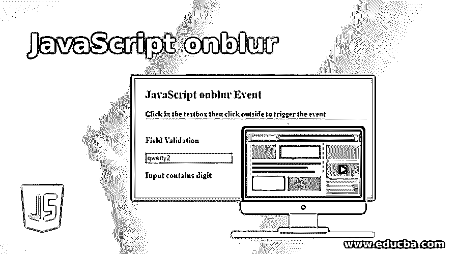
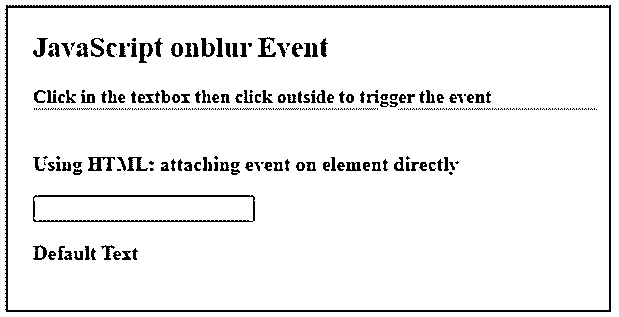
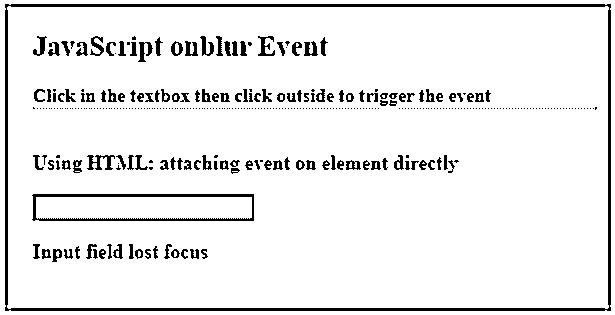
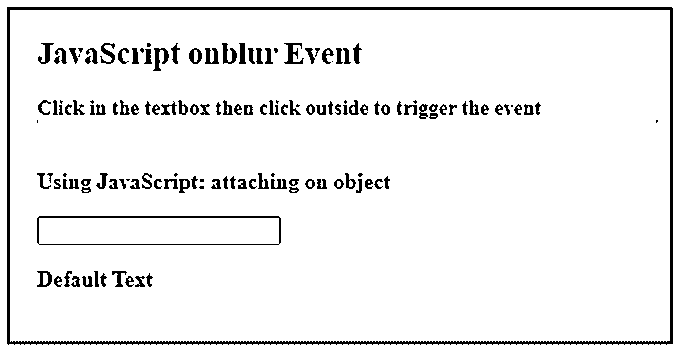
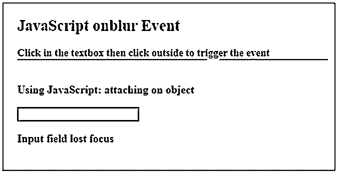
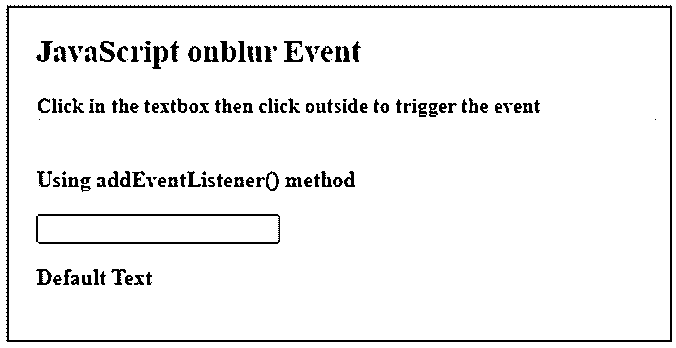
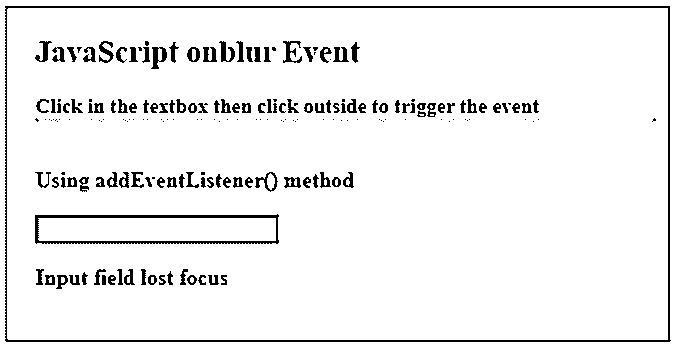
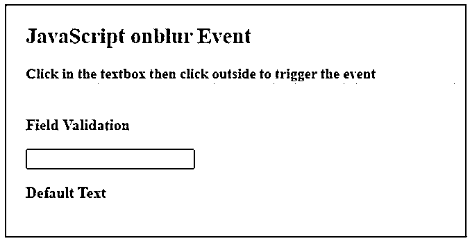
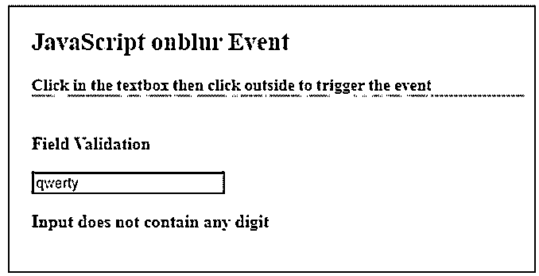
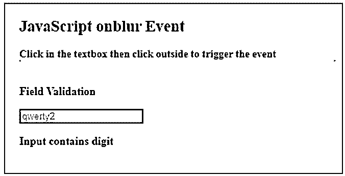

# JavaScript onblur

> 原文：<https://www.educba.com/javascript-onblur/>




## JavaScript onblur 简介

onblur 是 JavaScript 中的一个内置事件，当应用它的元素失去焦点时，就会触发这个事件。这是 JavaScript 支持的事件中的一个重要事件。当该项在网页上失去焦点时，将触发此事件。onblur 事件主要与输入字段元素一起使用，例如在表单中可以执行输入验证，例如当用户在字段中输入内容并转到下一个元素时，onblur 事件可以附加在该字段上，并可以执行验证。

**语法:**

<small>网页开发、编程语言、软件测试&其他</small>

我们可以通过以下方式附加一个每当 onblur 事件发生时执行的脚本。

**HTML:**

```
<element onblur = "functionName()" >
```

**JavaScript:**

```
elementObj.onblur = function () { //script };
```

在 JavaScript 中使用 addEventListener()方法:

```
elementObj.addEventListener( "blur" , function() { //script } );
```

### onblur 事件在 JavaScript 中是如何工作的？

当用户导航到输入字段时，onblur 事件被触发，并且当用户离开元素时，也就是说，元素对于用户来说不在焦点上。onblur 事件与 onfocus 事件相反，在 onfocus 事件中，当输入字段获得焦点时触发事件。onblur 事件属于 FocusEvent 对象。

#### 示例# 1–以 HTML 格式

**代码:**

```
<!DOCTYPE html>
<html>
<head>
<meta charset = "UTF-8">
<title>
JavaScript onblur Event
</title>
<style>
.body-data {
border : #81D4FA 2px solid;
background-color : #03a9f400;
text-align : left;
padding-left : 20px;
padding-bottom: 20px;
height : auto;
width : auto;
}
.resultText {
margin: 0 0 3px 0;
padding: 0px;
display: block;
font-weight: bold;
}
.heading {
font-weight: bold;
border-bottom: 2px solid #ddd;
font-size: 15px;
width: 98%;
}
</style>
</head>
<body>
<div class = "body-data" >
<div class = "heading" >
<h2> JavaScript onblur Event </h2>
 Click in the textbox then click outside to trigger the event 
</div>
<div class = "resultText" >
</br>
<p> Using HTML: attaching event on element directly </p>
<!-- attaching mousedown event on button -->
<input type = "text"  id = "myText"  onblur = "fireEvent()" >
<p id = "result1" > Default Text </p>
</div>
</div>
<script type = "text/javascript">
// This function will be called whenever onblur event occurs
function fireEvent( ) {
document.getElementById( "myText" ).style.backgroundColor = '#81D4FA';
document.getElementById("result1").innerHTML = " Input field lost focus ";
}
</script>
</body>
</html>
```

**输出:**

事件发生前:




事件发生后:




#### 示例 2——在 JavaScript 中

**代码:**

```
<!DOCTYPE html>
<html>
<head>
<meta charset = "UTF-8">
<title>
JavaScript onblur Event
</title>
<style>
.body-data {
border : #81D4FA 2px solid;
background-color : #03a9f400;
text-align : left;
padding-left : 20px;
padding-bottom: 20px;
height : auto;
width : auto;
}
.resultText {
margin: 0 0 3px 0;
padding: 0px;
display: block;
font-weight: bold;
}
.heading {
font-weight: bold;
border-bottom: 2px solid #ddd;
font-size: 15px;
width: 98%;
}
</style>
</head>
<body>
<div class = "body-data" >
<div class = "heading" >
<h2> JavaScript onblur Event </h2>
 Click in the textbox then click outside to trigger the event 
</div>
<div class = "resultText" >
</br>
<p> Using JavaScript: attaching on object </p>
<!--id is added to get the element  -->
<input type = "text" id = "myText" >
<p id = "result1" > Default Text </p>
</div>
</div>
<script type = "text/javascript">
// attaching mousedown event on button
document.getElementById( "myText" ).onblur = function(){
fireEvent();
};
// This function will be called whenever onblur event occurs
function fireEvent( ) {
document.getElementById( "myText" ).style.backgroundColor = '#81D4FA';
document.getElementById( "result1" ).innerHTML = " Input field lost focus ";
}
</script>
</body>
</html>
```

**输出:**

事件发生前:




事件发生后:




#### 示例 3–在 JavaScript 中使用 eventListener()方法

**代码:**

```
<!DOCTYPE html>
<html>
<head>
<meta charset = "UTF-8">
<title>
JavaScript onblur Event
</title>
<style>
.body-data {
border : #81D4FA 2px solid;
background-color : #03a9f400;
text-align : left;
padding-left : 20px;
padding-bottom: 20px;
height : auto;
width : auto;
}
.resultText {
margin: 0 0 3px 0;
padding: 0px;
display: block;
font-weight: bold;
}
.heading {
font-weight: bold;
border-bottom: 2px solid #ddd;
font-size: 15px;
width: 98%;
}
</style>
</head>
<body>
<div class = "body-data" >
<div class = "heading" >
<h2> JavaScript onblur Event </h2>
 Click in the textbox then click outside to trigger the event 
</div>
<div class = "resultText" >
</br>
<p> Using addEventListener() method </p>
<!--id is added to get the element  -->
<input type = "text" id = "myText" >
<p id = "result1" > Default Text </p>
</div>
</div>
<script type = "text/javascript">
// attaching onblur event on input field using event listener
document.getElementById( "myText" ).addEventListener( "blur" , function() {
fireEvent();
});
// This function will be called whenever onblur event occurs
function fireEvent( ) {
document.getElementById( "myText" ).style.backgroundColor = '#81D4FA';
document.getElementById( "result1" ).innerHTML = " Input field lost focus ";
}
</script>
</body>
</html>
```

**输出:**

事件发生前:




事件发生后:




#### 示例 4–测试输入是否包含任何数字

**代码:**

```
<!DOCTYPE html>
<html>
<head>
<meta charset = "UTF-8">
<title>
JavaScript onblur Event
</title>
<style>
.body-data {
border : #81D4FA 2px solid;
background-color: #03a9f400;
text-align : left;
padding-left : 20px;
padding-bottom: 20px;
height : auto;
width : auto;
}
.resultText {
margin: 0 0 3px 0;
padding: 0px;
display: block;
font-weight: bold;
}
.heading {
font-weight: bold;
border-bottom: 2px solid #ddd;
font-size: 15px;
width: 98%;
}
</style>
</head>
<body>
<div class = "body-data" >
<div class = "heading" >
<h2> JavaScript onblur Event </h2>
 Click in the textbox then click outside to trigger the event 
</div>
<div class = "resultText" >
</br>
<p> Field Validation </p>
<input type = "text" id = "myText" >
<p id = "result1" > Default Text </p>
</div>
</div>
<script type = "text/javascript">
// attaching onblur event on input field using event listener
document.getElementById( "myText" ).addEventListener( "blur" , function() {
validateField();
});
// This function will be called whenever onblur event occurs
function validateField( ) {
var pattern = new RegExp("[0-9]");
var text = document.getElementById("myText").value;
var result = pattern.test(text);
if(result){
document.getElementById( "myText" ).style.backgroundColor = '#ff00008f';
document.getElementById( "result1" ).innerHTML = " Input contains digit ";
} else {
document.getElementById( "myText" ).style.backgroundColor = '#0080008c';
document.getElementById( "result1" ).innerHTML = " Input does not contain any digit ";
}
}
</script>
</body>
</html>
```

**输出:**










### 推荐文章

这是一个 JavaScript onblur 的指南。在这里，我们还讨论了简介和 onblur 事件如何在 javascript 中工作，以及不同的例子和它的代码实现。您也可以看看以下文章，了解更多信息–

1.  JavaScript 中的[对象](https://www.educba.com/object-in-javascript/)
2.  [JavaScript getElementsByName()](https://www.educba.com/javascript-getelementsbyname/)
3.  [JavaScript getelement byid()](https://www.educba.com/javascript-getelementbyid/)
4.  [JavaScript 中的定时器](https://www.educba.com/timer-in-javascript/)


