# JavaScript 聚焦

> 原文：<https://www.educba.com/javascript-onfocus/>

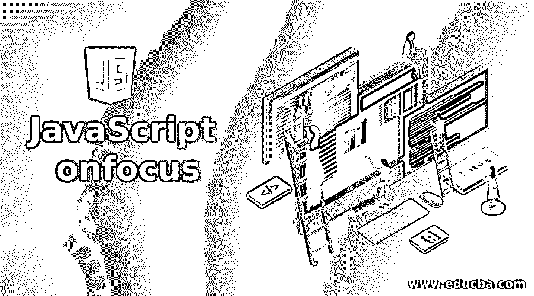


## JavaScript onfocus 简介

在 JavaScript 中，onfocus 是一个当焦点在任何元素上时都有效的属性。该属性通常与<input>、

**语法:**

<small>网页开发、编程语言、软件测试&其他</small>

下面给出了 onfocus 事件处理程序的语法:

```
<element onfocus = "script">
```

这里，属性值是调用属性 onfocus 时运行的脚本值。

### JavaScript 中 onfocus 事件是如何工作的？

文本框是可以使用 onfocus 的一种情况。除此之外，当用户试图在特定框中的项目列表中漫步，并且该人在特定时间将光标移动到每个选项上时，选择框中出现的选项是焦点。onfocus 事件处理程序经常与文本框和选择下拉列表一起使用，以便突出显示用户当前滚动显示的每个选项。正是这个元素是目前漫步和选择。它通常用在表单上，使用户能够准确识别表单上的哪个字段在任何给定时刻被选中。

当元素处于焦点上时，开发人员可以使用该事件处理程序来执行不同的任务。然而，最常见的工作是改变焦点项目的背景颜色。这很清楚也很容易将它与其他元素区分开来，并使其突出显示该元素是当前关注的焦点。假设有一个文本框，当它被点击时，文本框突出显示一种颜色。这证明了当一个项目成为焦点时，它是如何能够为该项目创建几种情况的。

一旦被单击，即使在被单击之后，该对象仍保持并保留事件处理程序的属性。即使您单击页面的其他部分，文本框的颜色也保持不变。要恢复原状，必须在文本框中添加一个 on blur 事件处理程序，以便背景颜色变为白色。

### 例子

下面是提到的例子:

#### 示例#1

当文本字段处于焦点时改变其颜色的 JavaScript 程序。

**代码:**

```
<!DOCTYPE html>
<html>
<body>
<p>Sample for onfocus event handler</p>
User Name: <input type="text" id="fname" onfocus="func(this.id)"><br>
Confirm user name: <input type="text" id="lname" onfocus="func(this.id)">
<script>
function func(x) {
document.getElementById(x).style.background = "red";
}
</script>
</body>
</html>
```

**输出:**

执行代码时，将显示两个文本字段。

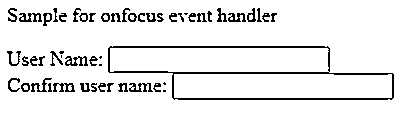


单击第一个文本框，当调用 onfocus 函数时，它的颜色变为红色。

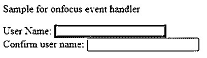


单击第二个文本框时，它的颜色也变为红色。

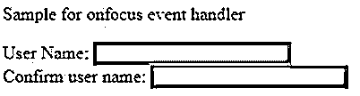


#### 实施例 2

改变文本框背景颜色并输出 Unicode 的 JavaScript 程序。

**代码:**

```
<!DOCTYPE html>
<html>
<head>
<title> Javascript onkeydown Event Handler  </title>
</head>
<body>
<h1>Event handler<h1>
<h2>Sample Output</h2>
User Name: <input type="text" id="fname" onfocus="func(this.id)"><br>
Confirm user name: <input type="text" id="lname" onfocus="func(this.id)"><br>
Age: <input type="text" id="demo" onkeydown="func1(this.id)">
<script>
function func1(x) {
var keyCode = ('which' in event) ? event.which : event.keyCode;
alert ("The Unicode key code is: " + keyCode);
document.getElementById(x).style.background = "red";
}
function func(x) {
document.getElementById(x).style.background = "red";
}
</script>
</body>
</html>
```

**输出:**

执行代码时将显示三个文本字段。

**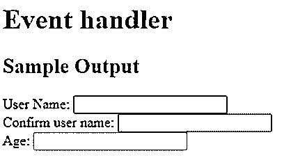

** 

单击前两个框时，背景颜色变为红色。同时，当点击第三个框时，弹出输入字符的 Unicode。

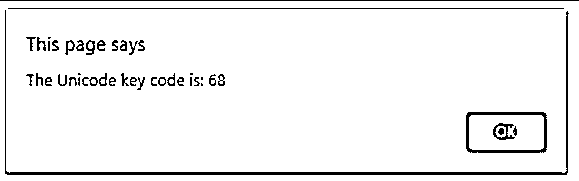


当按下“确定”时，该框的颜色也会变为红色。

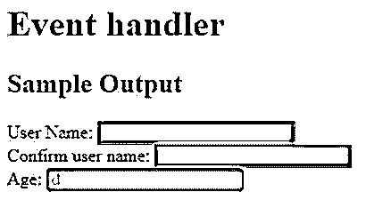


#### 实施例 3

一个 JavaScript 程序，当文本框被点击并离开字段时，它改变文本框的背景颜色。

**代码:**

```
<!DOCTYPE html>
<html>
<body>
<p>Background color changes to green when input is given. color changes to yellow when the field is left.</p>
User name: <input type="text" id="myInput" onfocus="func1()" onblur="func2()">
<script>
function func1() {
//background color changes to green
document.getElementById("myInput").style.background = "green";
}
function func2() {
//background color changes to yellow
document.getElementById("myInput").style.background = "yellow";
}
</script>
</body>
</html>
```

**输出:**

执行代码时会显示一个带标题的文本框。

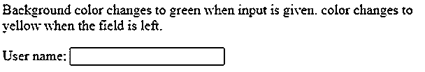


单击输入字段时，颜色变为绿色。

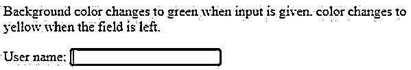


同时，当输入字段离开时，颜色变为黄色。

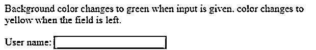


#### 实施例 4

当焦点在字段上时清除字段的 JavaScript 程序。

**代码:**

```
<!DOCTYPE html>
<html>
<body>
<p>Input field became empty when it is on focus</p>
<input type="text" onfocus="this.value=''" value="Cool">
</body>
</html>
```

**输出:**

执行代码时，将显示一个文本框，其中包含一个标题和一个字符串。

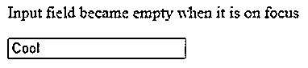


但是，当单击文本字段时，它变成了空的。

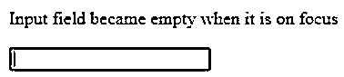


#### 实施例 5

JavaScript 程序，当用户在文本域输入时改变背景颜色，当用户离开输入域时去掉背景颜色。

**代码:**

```
<!DOCTYPE html>
<html>
<body>
<p>Background color changes to red when user inputs on a text field and removes the color when the user left the input field</p>
<form id="myForm">
<input type="text" id="Input">
</form>
<script>
var v = document.getElementById("myForm");
v.addEventListener("focus", func1, true);
v.addEventListener("blur", func2, true);
function func1() {
document.getElementById("Input").style.backgroundColor = "green";
}
function func2() {
document.getElementById("Input").style.backgroundColor = "";
}
</script>
</body>
</html>
```

**输出:**

执行代码时显示的文本字段将具有白色背景色。

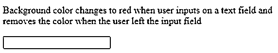


但是当用户点击文本字段时，颜色变成绿色。

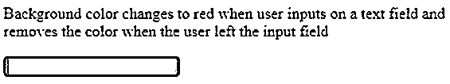


一旦用户离开该区域，颜色再次变为白色。

**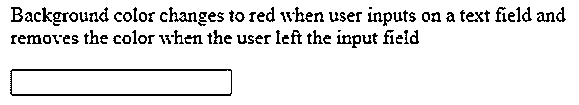

** 

### 推荐文章

这是 JavaScript onfocus 的指南。这里我们分别用编程例子来讨论 onfocus 事件是如何在 JavaScript 中工作的。您也可以看看以下文章，了解更多信息–

1.  [JavaScript getElementsByTagName()](https://www.educba.com/object-in-javascript/)
2.  [JavaScript 事件](https://www.educba.com/javascript-events/)
3.  [JavaScript 表单事件](https://www.educba.com/javascript-form-events/)
4.  [JavaScript 中的定时器](https://www.educba.com/timer-in-javascript/)


