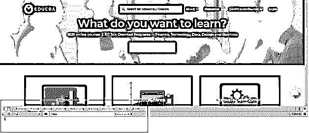
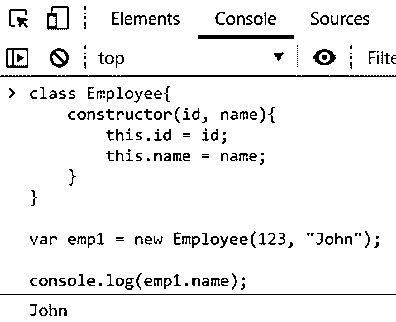
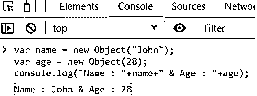
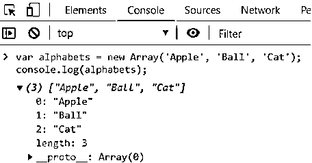
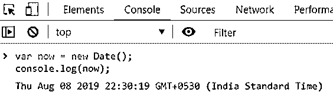
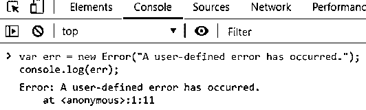
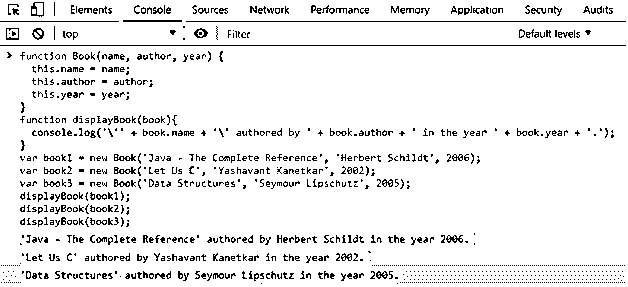
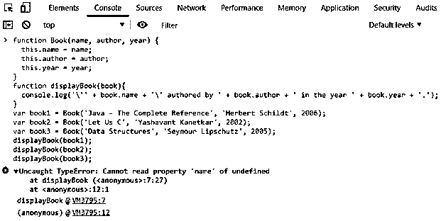
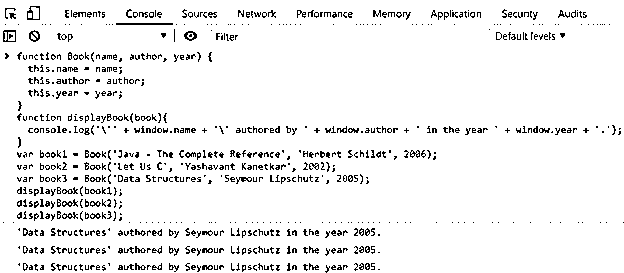

# JavaScript 中的构造函数

> 原文：<https://www.educba.com/constructor-in-javascript/>


## JavaScript 中的构造函数简介

JavaScript 中的构造函数方法是一种特殊的方法，用于创建和初始化类中的对象。这是每一种编程语言中的构造函数所做的。JavaScript 构造函数不同于其他构造函数的地方在于语法方面的自由。为了更好地理解它，只需打开浏览器开发工具(Ctrl/Cmd + Shift + C)并转到开发工具窗口中的控制台选项卡。

在 Chrome 中看起来是这样的

<small>网页开发、编程语言、软件测试&其他</small>




这是大多数 JavaScript 相关概念的游乐场。在整篇文章中，我们都会用到这个操场。

### JavaScript 中构造函数的类型

JavaScript 中有两种类型的构造函数

#### 1.内置构造函数

这些是与执行环境捆绑在一起的现成的构造函数。用户只需调用它们和 viola，工作就完成了。内置构造函数的例子有数组、日期和对象。

#### 2.用户定义的构造函数

这些是由程序员声明和定义的在整个应用程序中使用的构造函数。程序员也可以定义他们自己的自定义类型的属性和方法。它们也被称为自定义构造函数。按照惯例，所有 JavaScript 构造函数都是句子大小写的。这是为了告诉使用它们的人，这个函数必须使用 new 关键字来调用。

### JavaScript 中构造函数是如何工作的？

在我们研究 JavaScript 构造函数的语法之前，我们需要理解 JavaScript 的一个非常基本的概念

*   Object 类总结在本文的上下文中，每个 JavaScript 对象都是由对象构造函数创建的。如果创建对象时提供的值为 null 或未定义，对象构造函数将创建一个空对象。否则，它将创建一个在创建对象时定义的类型的对象。
*   每当声明类类型的新对象时，new 关键字返回对新创建的对象的引用。在构造函数中使用这个关键字来初始化对象的属性，从而访问该对象。
*   虽然，从技术上讲，JavaScript 没有任何类，但是有构造函数和原型来带来类似的功能。在 ECMAScript 2015 中，JavaScript 中引入了类的概念。这只是对现有的基于原型的继承的语法上的补充，并没有给语言增加任何新的功能。

### Javascript 中构造函数的语法和示例

下面是一些例子。

#### 1.构造函数方法

下面是构造函数的方法。此方法在类的原型内部使用。

**语法**

```
constructor([arguments]){ ... }
```

**代码**

```
class Employee{
constructor(id, name){
this.id = id;
this.name = name;
}}
var emp1 = new Employee(123, "John");
console.log(emp1.name);
```

**输出:**




#### 2.对象构造函数(内置构造函数)

当创建类对象的对象时，直接调用对象构造函数。如果 null 或未定义的参数作为参数传递，这将创建一个类对象的对象。否则，创建给定参数类型的对象。

**语法**

```
new Object([*value*])
```

或者

```
new Array([*value*])
```

或者

```
new Date([*value*])
```

或者

```
new String([*value*])
```

或者

```
new Number([*value*])
```

或者

```
new Boolean([*value*])
```

或者

```
new Function([*value*])
```

或者

```
new Error([*value*])
```

或者

```
new RegExp([*value*])
```

诸如此类…

**代码:**

```
var name = new Object("John");
var age = new Object(28);
console.log("Name : "+name+" & Age : "+age);
```

**输出:**




#### 3.数组和日期构造函数

以类似的方式，数组和日期构造函数也可以用来创建各自类型的对象。

**代码:**

```
var alphabets = new Array('Apple', 'Ball', 'Cat');
console.log(alphabets);
```

**输出:**




**代码:**

```
var now = new Date();
console.log(now);
```

**输出:**




**代码:**

```
var err = new Error("A user-defined error has occurred.");
console.log(err);
```

**输出:**




#### 4.自定义构造函数

我们还可以声明和定义我们自己的构造函数，以便在整个应用程序中使用。让我们看看如何实现这一点。

**语法**

```
function FunctionName([arguments]){ ... }
```

**代码:**

```
function Book(name, author, year) {
this.name = name;
this.author = author;
this.year = year;
}
function displayBook(book){
console.log('\'' + book.name + '\' authored by ' + book.author +         ' in the year ' + book.year + '.');
}
var book1 = new Book('Java - The Complete Reference', 'Herbert             Schildt', 2006);
var book2 = new Book('Let Us C', 'Yashavant Kanetkar', 2002);
var book3 = new Book('Data Structures', 'Seymour Lipschutz', 2005);
displayBook(book1);
displayBook(book2);
displayBook(book3);
```

**输出:**

**

** 

### 新关键字的重要性

现在你可能想知道如果我不使用新的关键字会怎么样？可以省略 new 关键字吗？嗯，我的朋友，不。使用新的关键字是非常必要的。

*   JavaScript 构造函数是常规函数。它们伴随着一个新的关键字，告诉 JavaScript 引擎必须用给定的属性构造一个新的对象。如果没有 new 关键字，您只会创建越来越多的全局对象。
*   new 关键字返回对新创建的对象的引用。然后，我们将这个引用存储在一个变量中。如果没有 new 关键字，则会创建对象，但不会返回对该对象的引用。该对象采用全局范围。对该对象的唯一引用是通过窗口对象。
*   迷茫？用例子让我们更好的理解。再次考虑上面的例子。我们从对象声明中删除了 new 关键字。结果是未定义变量的例外。这是因为，如果没有 new 关键字，新创建的对象的引用不会被返回，因此不会存储在我们的变量 book1、book2 和 book3 中。当我们试图在 display book 方法中访问这些变量时，抛出了异常。

**代码:**

```
function Book(name, author, year) {
this.name = name;
this.author = author;
this.year = year;
}
function displayBook(book){
console.log('\'' + book.name + '\' authored by ' + book.author +         ' in the year ' + book.year + '.');
}
var book1 = Book('Java - The Complete Reference', 'Herbert Schildt',       2006);
var book2 = Book('Let Us C', 'Yashavant Kanetkar', 2002);
var book3 = Book('Data Structures', 'Seymour Lipschutz', 2005);
displayBook(book1);
displayBook(book2);
displayBook(book3);
```

**输出:**




在同一个示例中，如果我们修改 display book 方法来通过窗口范围访问对象，我们会得到一个意外的输出。

**代码:**

```
function Book(name, author, year) {
this.name = name;
this.author = author;
this.year = year;
}
function displayBook(book){
console.log('\'' + window.name + '\' authored by ' + window.author      +' in the year ' + window.year + '.');
}
var book1 = Book('Java - The Complete Reference', 'Herbert Schildt',       2006);
var book2 = Book('Let Us C', 'Yashavant Kanetkar', 2002);
var book3 = Book('Data Structures', 'Seymour Lipschutz', 2005);
displayBook(book1);
displayBook(book2);
displayBook(book3);
```

**输出:**




现在，作为一个练习，做一点头脑风暴，找出为什么我们得到这个输出！

### 范围安全的构造函数

JavaScript 中的内置构造函数是范围安全的构造函数。在没有 new 关键字的情况下调用时，它们不会创建全局范围的变量。因此，无论有没有新关键字，都可以安全地创建这些对象。

**代码**

```
function SampleFn(argument) {
// if "this" is not an instance of the constructor
// it means it was called without new
if (!(this instanceof SampleFn)) {
// call the constructor again with new
return new SampleFn(argument);
}
// The code to construct properties and methods
}
```

是的，您也可以创建用户定义的范围安全的构造函数。继续，在上面的例子中为我们的书创建一个作用域安全的构造函数。

### 结论

本文深入演示了 JavaScript 构造函数。这也有助于理解 JavaScript 的工作原理。这里要记住的关键是，虽然从技术上讲 JavaScript 中没有类，但是方法和原型提供了类似的功能，供开发人员使用。是的，新的关键字很重要。

### 推荐文章

这是 JavaScript 中构造函数的指南。这里我们讨论它的类型和重要的方法，以及如何创建一个作用域安全的构造函数。你也可以浏览我们给定的文章来了解更多-

1.  【Javascript 能做什么？
2.  [JavaScript 是什么？](https://www.educba.com/what-is-javascript/)
3.  [安装 JavaScript](https://www.educba.com/install-javascript/)
4.  [JavaScript 字符串替换](https://www.educba.com/javascript-string-replace/)


