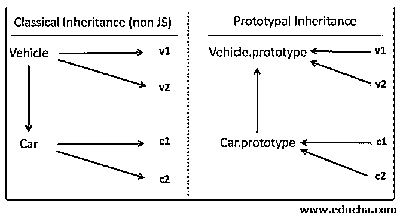

# JavaScript 中的继承

> 原文：<https://www.educba.com/inheritance-in-javascript/>


## JavaScript 中的继承介绍

以下文章概述了 JavaScript 中的继承。继承是面向对象语言中的一个概念，其中一个类继承或扩展另一个类的属性或行为。继承有助于重用继承或开发的类的字段和方法。这有助于代码的可重用性和避免代码重复(冗余代码)。继承表示基类和派生类之间的父子关系。在面向对象的语言中，有基于类的语言，如 Java、C++等。，还有原型语言，比如 JavaScript。在基于类的面向对象语言中，类是蓝图；通过使用这些蓝图，我们创建了一个对象来使用它们。相比之下，在原型面向对象语言中，我们创建对象，然后用它们作为原型来开发其他东西。

### 继承–JS:原型继承

在 JavaScript 中，继承是通过使用原型对象实现的。这有时被称为“原型继承”或“行为委托”

<small>网页开发、编程语言、软件测试&其他</small>

下图分别展示了 Java 中的继承和 JavaScript 中的继承。




v1 和 v2 是 Vehicle(基类/父类)的实例，c1 和 c2 是 Car(派生类/子类)实例。在 JavaScript 中，当创建一个对象时，它会创建一个链接，而不是复制面向对象编程语言中常见的行为或属性。在 Java 中，父子类是一个独立的实体，其中父类(车辆)的属性/行为被复制到子类(汽车)中。

在类继承的情况下，也会产生类似的链接。这种模式被称为行为委托模式，在 JavaScript 中通常被称为原型继承。因为副本是在 Java 中创建的，所以所有的箭头都是向下的(属性和行为是向下的)，而在 JavaScript 中，箭头是向上的。

### JavaScript 中的继承示例

下面是一些例子:

#### 示例#1

**代码:**

```
<!DOCTYPE HTML>
<html>
<head>
<title> Inheritance in JS </title>
</head>
<body>
<script>
//Parent / Base Class
function Employee(firstName, lastName) {
this.FirstName = firstName || "unknown";
this.LastName = lastName || "unknown";
}
//Parent class Method
Employee.prototype.getName = function () {
return this.FirstName + " " + this.LastName;
}
//Child / Derived Class
function Manager(firstName, lastName, level, rating)
{
Employee.call(this, firstName, lastName);
this. level = level || "unknown";
this. rating = rating || 0;
}
// Child Class Inheriting Parent Class
Manager.prototype = new Employee ();
Manager.prototype.constructor = Manager;
//Created object of Child class
var manager = new Manager ("Panos","Dsouza", "GCM 4", 5);
// Output Generation
console.log ("Full Name : " ,manager.getName());
console.log ("Level : ",manager.level)
console.log ("Rating : ",manager.rating)
console.log (manager instanceof Manager);
console.log (manager instanceof Employee);
</script>
</body>
</html>
```

**输出:**


**说明:**

*   在上面的例子中，我们已经用 FirstName 和 LastName 属性定义了 Employee 类(函数),并将 getName 方法添加到它的 prototype 对象中。
*   然后，我们使用在 Employee 类中定义的 FirstName、LastNameproperties 和 getName()方法创建了从 Employee 类继承的 Manager 类，从而避免了这些属性的重新定义，因此建立了继承关系。
*   在原型继承中，附加到对象原型的字段或方法对该对象及其后代变得可用。理解原型链及其工作对于全面掌握 JavaScript 中的继承概念非常重要。甚至当我们使用关键字 class 和 extend 在 JavaScript 中实现继承时，它仍然遵循原型继承。

#### 实施例 2

**代码:**

```
<!DOCTYPE HTML>
<html>
<head>
<title> Inheritance in JS </title>
</head>
<body>
<script>
class Employee {
constructor(firstName,lastName){
this.FirstName = firstName;
this.LastName = lastName;
}
getName() {
return this.FirstName + " " + this.LastName;
}
}
class Manager extends Employee {
constructor(firstName,lastName,level,rating) {
super(firstName,lastName);
this.FirstName = firstName;
this.LastName = lastName;
this.level = level;
this.rating = rating;
}
}
let emp = new Employee()
console.log("Before Assignment")
console.log(emp.getName())
let mng = new Manager("Manoj","Khanna","GCM5",5);
console.log("After Assignment")
console.log(mng.getName())
</script>
</body>
</html>
```

**输出:**


### 说明

*   super()方法调用 Employee 类(父类)构造函数，并将各自的值赋给 Employee 类中定义的字段，即 FirstName 和 LastName。class Manager 的 mng 对象扩展了 Employee 类，可以访问它的所有方法和字段，并可以使用它们来获得所需的结果。
*   在上面的例子中，我们已经看到了原型继承与传统的/基于类的继承的不同，以及 JavaScript 是如何实现它的。

### 结论

继承帮助我们获得更干净和可重用的代码，从而节省重复对象属性和方法定义的内存。它允许我们添加更新的功能或已经存在的功能和特性。因此，我们可以将继承定义为一种扩展，其中子类/派生类通过添加或重写其属性或行为来扩展父类/基类。

### 推荐文章

这是 JavaScript 继承的指南。在这里，我们已经讨论了介绍，继承-JS:原型继承，和例子。您也可以看看以下文章，了解更多信息–

1.  [JavaScript indexOf()](https://www.educba.com/javascript-indexof/)
2.  [JavaScript 的抽象类](https://www.educba.com/abstract-classes-in-javascript/)
3.  [Python 中的继承](https://www.educba.com/inheritance-in-python/)
4.  [Ruby 中的继承](https://www.educba.com/inheritance-in-ruby/)


