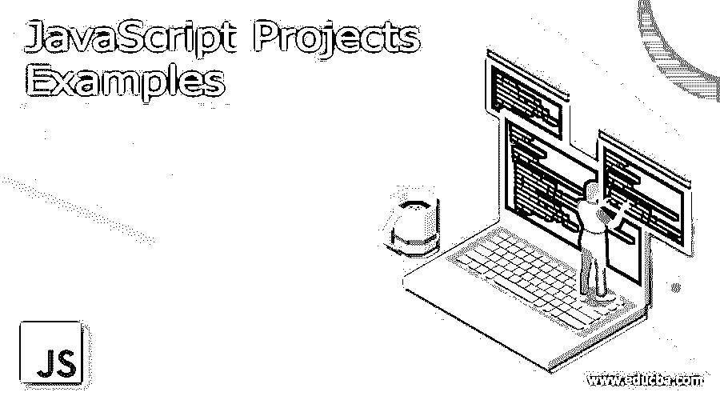
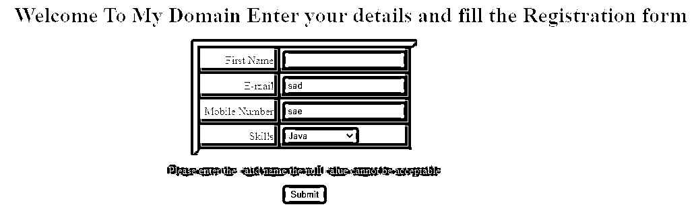

# JavaScript 项目示例

> 原文：<https://www.educba.com/javascript-projects-examples/>




## JavaScript 项目示例简介

JavaScript 是使用最广泛的脚本语言之一。它用于所有类型的 web 应用程序，这些应用程序可以使用动态内容进行数据呈现和其他交互式网页验证，如动画、更多 JS 与静态和动态 HTML 的结合，以及可用于创建整个网页和复杂 web 应用程序资源利用的 CSS 网页。在这个主题中，我们将看看不同的 JavaScript 项目示例。

### 最佳 Java 脚本项目示例

在所有语言中，代码结构是最难的一个方面，与其他语言相比，这是一个令人生畏的 JavaScript 复杂代码。许多编译编程语言将用于编译特定的模式和其他数据结构，但这与 javascript 语言无关。它结合了 html、CSS 和其他 UI 标签元素，对客户端和服务器端验证都有装饰作用。在 javascript 等通用语言的帮助下，按钮、标签、文本框和其他标签元素等 UI 元素将有助于增加维护和管理组织代码的复杂性。主要包括以下模式:

<small>网页开发、编程语言、软件测试&其他</small>

**工厂功能和模块模式**

**普通的旧 JavaScript 对象和对象构造器**

**类**

**ES6 的模块**

以上类型是预先定义的概念学习机会，如闭包、原型、生命等。我们使用的方法将根据项目情况而定。尽管在首选语言中，点运算符标记会更频繁地被清除，但在某些特定的时候，使用 IDE 是不切实际和不可能的。作为设计模式的对象用于创建对象和访问它们的属性，以使用多个对象操作符。一些强大的数组函数可以用在实时用户数据的应用上。因此，对象是 javascript 语言中最重要的部分，它用于完成实时项目和对象特性的更简单和中级任务的数据。如果我们使用高级和中级数组魔术来存储和检索数据，并使用一些填充数据的默认函数来操作这些数据，那么 javascript 对象的主要用途将在介绍概念和功能的基础时刻迅速深入。然后，我们可以调用并利用这些函数来放松数组并显示每个网页的数据。如果此时模块包含更多数据，我们可以使用表格格式和其他卡片帮助对数据进行排序。

#### 班

javascript 和 Java 或者其他语言类不一样；它主要用于覆盖 ES6 格式和标准代码。用于创建对象创建的代码的语法就像与对象构造函数和其他原型的确切定义相关的 class 关键字。然而，反对者认为基本类是基于原型的构造函数和其他误导对象。尽管在类和其他特性方面存在争议，但真正的代码库肯定有助于应对 React 等框架。

#### Npm

与节点包管理器(npm)一样，打包管理器也是命令行工具界面之一，有助于使用插件、库和其他工具访问代码库。每当我们可以读取 npm 数据时，基础可能会参与到应用程序的测试框架中。

#### 故事

像 npm 一样，yarn 是另一种类型的包管理器；这最像是国家预防机制的替换。与 npm 相比，最新版本的 yarn 将具有最好的特性，因此未来考虑 yarn 比 npm 更有帮助。

#### 网络包

它是处理模块捆绑的最简单的工具之一；在复杂的应用网页中难度更大。然而，它是一个功能强大的工具，拥有大量数据，有助于在应用程序端配置文件以获得最佳配置。

### JavaScript 项目示例

**代码:**

```
<html>
<head>
<title>Welcome To My Domain</title>
<script type = "text/javascript">
function methdValidtaes() {
var a;
if( document.myForm.name.value == "" ) {
a = "Please enter the valid name the null value cannot be acceptable";
document.getElementById("ex").innerHTML = a;
document.myForm.name.focus() ;
return false;
}
if( document.myForm.email.value == "" ) {
a = "Please enter valid email it should be formattable";
document.getElementById("ex").innerHTML = a;
document.myForm.email.focus() ;
return false;
}
var emId = document.myForm.email.value;
atposn = emId.indexOf("@");
dotposn = emId.lastIndexOf(".");
if (atposn < 1 || ( dotposn - atposn < 2 )) {
a = "ENter valid email";
document.getElementById("ex").innerHTML = a;
document.myForm.email.focus() ;
return false;
}
if( document.myForm.phone.value == "" || isNaN( document.myForm.phone.value ) ||
document.myForm.phone.value.length != 10 ) {
a = "Enter valid mobile number it should be atleast 10 digits";
document.getElementById("ex").innerHTML = a;
document.myForm.phone.focus() ;
return false;
}
if( document.myForm.subject.value == "0" ) {
a = "Enter your skills and expertise domains";
document.getElementById("ex").innerHTML = a;
return false;
}
return( true );
}
</script>
</head>
<body bgcolor="blue">
<form action = "" name = "myForm" onsubmit = "return(methdValidtaes());">
<h1 align="center"><marquee>Welcome To My Domain Enter your details and fill the Registration form</marquee></H1>
<table align="center" cellspacing = "5" cellpadding = "5" border = "6">
<tr>
<td align = "right">First Name</td>
<td><input type = "text" name = "name" /></td>
</tr>
<tr>
<td align = "right">E-mail</td>
<td><input type = "text" name = "email" /></td>
</tr>
<tr>
<td align = "right">Mobile Number</td>
<td><input type = "text" name = "mobile" /></td>
</tr>
<tr>
<td align = "right">Skills</td>
<td>
<select name = "skills">
<option value = "0" selected>Select</option>
<option value = "1">Java</option>
<option value = "2">JavaScript</option>
<option value = "3">Html</option>
<option value = "4">CSS</option>
<option value = "5">Web Services</option>
</select>
</td>
</tr>
</table>
<p id="ex" style="color:green; text-align:center"></p>
<div style="text-align:center"><input type = "submit" value = "Submit" /></div>
</form>
</body>
</html>
```

**样本输出:**




在上面的例子中，我们使用了一些 html、css 和 javascript 验证。因此，它将在客户端，即浏览器本身进行验证。所以它有助于用户友好的环境。

### 结论

如今，javascript 是实现基于 web 的应用程序的最常用和用户友好的语言。这是因为它有 n 个框架、库、插件和 ide 来根据用户逻辑和需求生成代码。此外，它支持所有类型的网络浏览器。

### 推荐文章

这是一个 JavaScript 项目示例指南。这里我们讨论实现基于 web 的应用程序的最有用和用户友好的语言。您也可以阅读以下文章，了解更多信息——

1.  [JavaScript 格式化程序](https://www.educba.com/javascript-formatter/)
2.  [JavaScript 已经()](https://www.educba.com/javascript-has/)
3.  [JavaScript 连接字符串](https://www.educba.com/javascript-concatenate-strings/)
4.  [JavaScript 幻灯片演示](https://www.educba.com/slideshow-in-javascript/)


