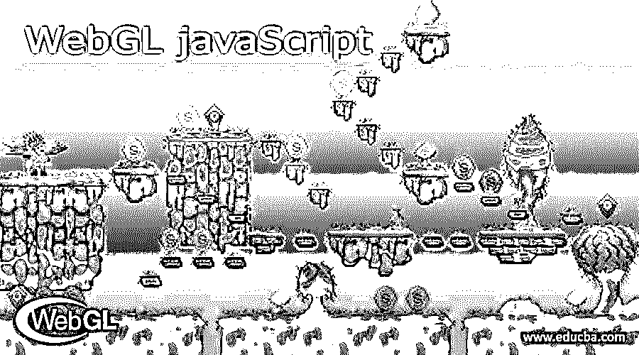
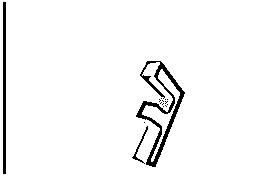
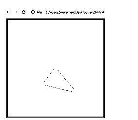

# WebGL JavaScript

> 原文：<https://www.educba.com/webgl-javascript/>




## WebGL JavaScript 简介

以下文章提供了 WebGL JavaScript 的概要。WebGL 被称为 Web 图形库。它是一种 JavaScript APIs，允许任何兼容的 web 浏览器版本生成高性能的交互式 2D 和 3D 图形，而无需额外的插件，这些插件可以使用兼容 API 的 OpenGL ES 2.0 版本来提供，以利用 Html 5 等基于 web 的元素和更多版本。像

<canvas>web GL 这样的元素只在 GPU 上执行。</canvas>

### 什么是 WebGL JavaScript？

WebGL 允许使用基于 API 的 OpenGL ES 2.0 版本的在线数据内容在 HTML 画布中进行 2D 和 3D 渲染，而无需支持 JavaScript 版本的用户浏览器所需的插件。这些 WebGL 程序由 JavaScript 控制代码组成，并被称为 GLSL 着色器代码，它运行在具有指定功能的计算机图形处理器(GPU)上。UI HTML 元素与其他类型的 HTML 元素混合在一起。如果加载了脚本，javascript 的主函数将通过 WebGL 上下文调用，以便启动服务并运行应用程序以开始渲染。

<small>网页开发、编程语言、软件测试&其他</small>

### 如何使用 WebGL JavaScript？

由 JavaScript 代码组成的 WebGL 程序，它们将使用运行在计算机图形处理器单元(GPU)上的 GLSL 着色器代码。就像这样，WebGL 元素可以使用网页的其他部分或可以与 HTML 元素混合的页面背景来合成。WebGLRenderingContext 是提供对 OpenGL ES 2.0 版本和 HTML 标记元素(如用于绘制其表面的

<canvas>元素)的图形渲染上下文的访问的接口之一。调用 getContext()是一个

<canvas>HTML 元素的默认方法，它将“WebGL”作为参数来访问 WebGL 上下文，以覆盖 2D 和 3D 图形渲染。</canvas>

</canvas>




上面的截图和标志有助于渲染图形和设计动画。它允许网络浏览器使用默认插件生成动态 2D 和 3D 动态计算机图形。游戏开发者最终获得了利用地图可视化的交易，如地理位置、数据图表和更多演示。

### WebGL JavaScript 的使用

对于在编码任务中操作 DOM 元素，WebGL 有一些独特的默认优势。它将有助于执行 JavaScript 单线程和 CPU 受限线程，以便不卸载 GPU 等设备，并且它将被处理为高负载性能。它非常适合游戏和其他复杂的视觉效果，如硬件加速和其他 GPU 内置的设备。每个小程序员都被称为着色器，可以用来创建复杂的视觉效果。这可能是基本的着色效果，如棕褐色和其他更复杂的模拟阴影效果，如水或火的烟雾效果。它收集了一些影响和例子。一般来说，GPU 分为两部分。第一部分被转换为顶点或数据流以裁剪空间顶点。那么第二部分区域是相关的并且基于所绘制像素的第一部分。它有 n 种方式，其中我们遵循如下四种类型的着色器，

*   **属性和缓冲区:**缓冲区是我们发送到 GPU 位置的二进制数据数组，通常将纹理坐标、顶点颜色和其他缓冲区数据存储在单独的区域中。属性是顶点着色器，用于获取特定属性中的数据缓冲区以获得位置。
*   **制服:**制服是可以在运行着色器程序之前设置的全局变量。
*   **纹理:**纹理是可以与着色器软件一起随机使用的数据数组。在图像中，数据对于包含纹理和其他颜色数据是最重要的。
*   **变量化:**顶点着色器可以通过变量化将数据传输到片段着色器。使用顶点着色器放在变量上的值将在执行片段着色器时进行插值。这取决于用什么来绘制形状的点。

### WebGL JavaScript 示例

下面是提到的例子:

**代码:**

```
<!doctype html>
<html>
<body>
<canvas width = "423" height = "423" id = "ex"></canvas>
<script>
var first = document.getElementById('ex');
var gl = first.getContext('experimental-webgl');
var b = [-0.1, 0.2, -0.3, -0.4, 0.5, -0.6,];
var j = gl.createBuffer();
gl.bindBuffer(gl.ARRAY_BUFFER, j);
gl.bufferData(gl.ARRAY_BUFFER, new Float32Array(b), gl.STATIC_DRAW);
gl.bindBuffer(gl.ARRAY_BUFFER, null);
var i =
'attribute vec2 example;' +
'void main(void) {' + ' gl_Position = vec4(example,0.1, 1.2);' + '}';
var d = gl.createShader(gl.VERTEX_SHADER);
gl.shaderSource(d, i);
gl.compileShader(d);
var e = 'void main(void) {' + 'gl_FragColor = vec4(0.1, 0.2, 0.3, 0.4);' + '}';
var f = gl.createShader(gl.FRAGMENT_SHADER);
gl.shaderSource(f, e);
gl.compileShader(f);
var h = gl.createProgram();
gl.attachShader(h, d);
gl.attachShader(h, f);
gl.linkProgram(h);
gl.useProgram(h);
gl.bindBuffer(gl.ARRAY_BUFFER, j);
var c = gl.getAttribLocation(h, "example");
gl.vertexAttribPointer(c, 2, gl.FLOAT, false, 0, 0);
gl.enableVertexAttribArray(c);
gl.clearColor(0.3, 0.3, 0.3, 0.7);
gl.enable(gl.DEPTH_TEST);
gl.clear(gl.COLOR_BUFFER_BIT);
gl.viewport(1,2,first.width,first.height);
gl.drawArrays(gl.TRIANGLES, 1, 4);
</script>
</body>
</html>
```

**样本输出:**




我们使用了 WebGL 和 JavaScript 代码；这里，我们使用了带有一些顶点的三角形。顶点属性被表示为用于绘制矩形框的 X 轴和 Y 轴。HTML canvas 对象主要用于检索，以及它的 WebGL 呈现上下文代码和特性。几何属性，如顶点、索引和其他颜色，用于定义和存储 javascript 数组。我们可以为存储的对象创建一个以上的缓冲区，并用适当的缓冲区对象将缓冲区提供给数据数组。例如，我们可以使用 javascript 数组指定三角形的顶点和尺寸，并将其传递给顶点缓冲区对象。

### 结论

WebGL 和 WebGL 管道的基础主要是基于渲染图形的应用程序，支持 2D 和 3D 类型的应用程序。HTML、CSS 和 JavaScript 代码验证客户端用户数据条件。因此，它支持所有类型的 web 浏览器。

### 推荐文章

这是一个 WebGL JavaScript 的指南。这里我们讨论一下简介，什么是 WebGL JavaScript，工作中的 WebGL JavaScript，以及代码实现的例子。您也可以看看以下文章，了解更多信息–

1.  [JavaScript 格式化程序](https://www.educba.com/javascript-formatter/)
2.  [JavaScript 转储对象](https://www.educba.com/javascript-dump-object/)
3.  [JavaScript 连接字符串](https://www.educba.com/javascript-concatenate-strings/)
4.  [JavaScript 幻灯片演示](https://www.educba.com/slideshow-in-javascript/)


