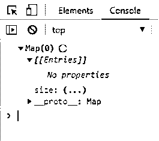
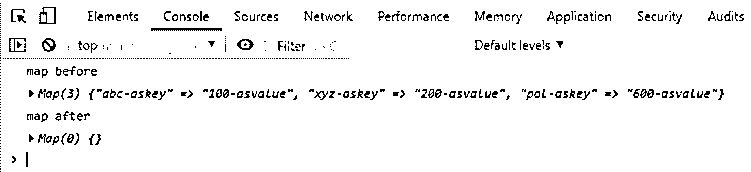
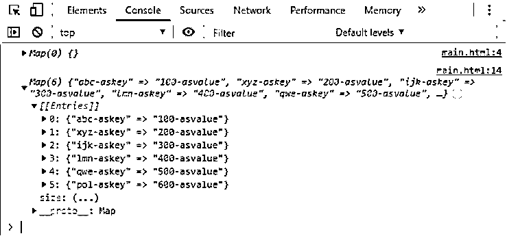
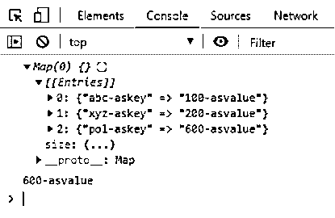
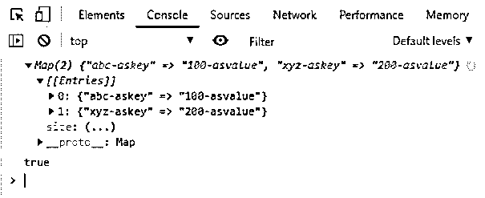
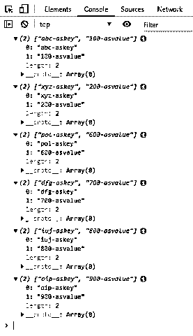
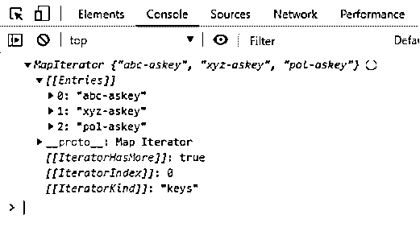
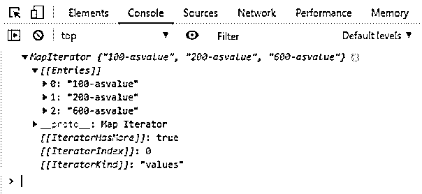
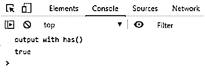

# JavaScript 中的地图

> 原文：<https://www.educba.com/map-in-javascript/>


## JavaScript 中的地图简介

JavaScript 映射对象由 ES6 提供。map 是元素的集合，就像我们在 java 中一样。映射基本上是元素的集合，其中每个元素都被视为一个键值对；这个键在这里是唯一的。它阻止了元素开始存储到其中的插入顺序。

它的一个优点是既可以存储对象，也可以将原始值存储为键或值。因此，我们可以通过传递 iterable 对象来创建 map 对象，但是它的元素必须是键和值对的形式。我们还可以创建一个空的 map，然后在需要的时候插入条目，当我们迭代这个 map 对象时，它只将元素作为键值对返回，并保持插入顺序。

<small>网页开发、编程语言、软件测试&其他</small>

由于它只包含一个惟一的键，因此防止了惟一性，我们可以插入重复的对。

**语法**

我们可以通过使用–

**1)新操作员**

```
var map = new Map(); //this will create an empty map object. Which can be initialize later.
```

**2)其构造函数。**

```
var map = new Map([[100,250], [200,450], [300,500]]); // map as key value pair and persist insertion order as well= {100=>220, 200=>450, 300=>500}
```

它在创建值存储为键-值对的对象时接受迭代器对象。如果我们不提供它的值，那么它将创建一个空的 map 对象。

**返回**:总是返回一个新的地图对象。

**参数**:迭代器对象。

**例子**

```
<script>
var map1 = new Map();
console.log(map1);
</script>
```

**输出:**




### JavaScript 中的 Map 是如何工作的？

它的工作方式与 Java 类似。它保持键的唯一性，不允许重复。在内部，它只使用链表。下面是一些方法和例子，可以帮助你理解它是如何工作的。

### JavaScript 中的 Map 方法？

以下是下面提到的方法

#### 1.Map.prototype.clear()

此方法从地图对象中移除所有元素。

**例子**

```
<script>
var map1 = new Map();
// adding elements to the map object
map1.set("abc-askey", "100-asvalue");
map1.set("xyz-askey", "200-asvalue");
map1.set("pol-askey", "600-asvalue");
console.log( "map before");
console.log( map1);
map1.clear();
console.log( "map after");
console.log(map1);
</script>
```

**输出:**




#### 2.Map.prototype.set(键，值)

该方法将键和值作为参数，并为键设置值。它返回地图对象。

**例子**

```
<script>
var map1 = new Map();
console.log(map1); // create empty map
// adding elements to the map object
map1.set("abc-askey", "100-asvalue");
map1.set("xyz-askey", "200-asvalue");
map1.set("ijk-askey", "300-asvalue");
map1.set("lmn-askey", "400-asvalue");
map1.set("qwe-askey", "500-asvalue");
map1.set("pol-askey", "600-asvalue");
console.log(map1);
</script>
```

**输出:**




#### 3.Map.prototype.get(答案)

该方法将密钥作为参数。它用于获取与作为参数传递的键相关的有值关联。如果不存在，有时会返回 undefined。

**例子**

```
<script>
var map1 = new Map();
console.log(map1); // create empty map
// adding elements to the map object
map1.set("abc-askey", "100-asvalue");
map1.set("xyz-askey", "200-asvalue");
map1.set("pol-askey", "600-asvalue");
console.log(map1.get("pol-askey"));
</script>
```

**输出:**




#### 4.Map.prototype.delete(键)

此方法返回布尔值。将 key 作为参数。如果元素存在于地图中并且已经被删除，它将返回 true。如果元素不存在，它将返回 false。

**例子**

```
<script>
var map1 = new Map();
map1.set("abc-askey", "100-asvalue");
map1.set("xyz-askey", "200-asvalue");
map1.set("pol-askey", "600-asvalue");
var b = map1.delete("pol-askey");
console.log(map1);
console.log(b);
</script>
```

**输出:**




#### 5.Map.prototype[@@iterator]()

它返回一个迭代器对象，该对象包含映射中每个元素的[key，value]对数组，并保持插入顺序。

**例子**

```
<script>
var map1 = new Map();
// adding elements to the map object
map1.set("abc-askey", "100-asvalue");
map1.set("xyz-askey", "200-asvalue");
map1.set("pol-askey", "600-asvalue");
map1.set("dfg-askey", "700-asvalue");
map1.set("iuj-askey", "800-asvalue");
map1.set("oip-askey", "900-asvalue");
var iterator = map1[Symbol.iterator]();
// it prints
// ["abc-askey", "100-asvalue"]
// ["xyz-askey", "200-asvalue"]
// ["pol-askey", "600-asvalue"]
// ["dfg-askey", "700-asvalue"]
// ["iuj-askey", "800-asvalue"]
// ["oip-askey", "900-asvalue"]
for(var ele of iterator)
console.log(ele);
</script>
```

**输出:**




#### 6.Map.prototype.forEach(回调 Fn[，thisArg])

该方法为 map 对象中的每个元素调用 callbackFn 作为键-值对，如果提供了另一个参数，则该参数将作为每个回调的值。

#### 7.map . prototype . key()

该方法将返回新的迭代器对象，其中所有键都以插入顺序出现。

**例子**

```
<script>
var map1 = new Map();
// adding elements to the map object
map1.set("abc-askey", "100-asvalue");
map1.set("xyz-askey", "200-asvalue");
map1.set("pol-askey", "600-asvalue");
var keys = map1.keys();
console.log(keys);
</script>
```

**输出:**




#### 8.Map.prototype.values()

这个方法将返回新的迭代器对象，所有值都按插入顺序排列。

**例子**

```
<script>
var map1 = new Map();
// adding elements to the map object
map1.set("abc-askey", "100-asvalue");
map1.set("xyz-askey", "200-asvalue");
map1.set("pol-askey", "600-asvalue");
var values = map1.values();
console.log(values);
</script>
```

**输出:**




#### 9.Map.prototype.has(答案)

无论是否存在，该方法都将返回一个与密钥通道相对应的布尔值。将 key 作为参数。

**例子**

```
<script>
var map1 = new Map();
// adding elements to the map object
map1.set("abc-askey", "100-asvalue");
map1.set("xyz-askey", "200-asvalue");
map1.set("pol-askey", "600-asvalue");
var has = map1.has("abc-askey");
console.log("output with has() ");
console.log(has);
</script>
```

**输出:**




#### 10.地图.原型.条目()

该方法将返回地图对象中存在的所有元素。但是，首先，创建一个新的迭代器对象，用一个包含元素的数组作为键-值对来保持插入顺序。

**例子**

```
<script>
var map1 = new Map();
// adding elements to the map object
map1.set("abc-askey", "100-asvalue");
map1.set("xyz-askey", "200-asvalue");
map1.set("pol-askey", "600-asvalue");
var entries = map1.entries();
console.log(entries);
</script>
```

**输出:**


### 为什么映射到对象上？

在地图中，我们可以使用任何值作为一个关键螺母；这是对象的限制，它只能是符号和字符串。

另外，映射是可迭代的，默认情况下对象是不可迭代的。

Map 还会保持插入顺序，而 object 则不会。

该映射还提供了一些额外的方法，但是对象没有提供额外的内置方法。

还有，我们可以通过调用 size()方法来识别地图的大小，但是对象中没有这个特性；我们需要手动操作。

### 结论

因此，通过使用 map 对象，我们可以将元素存储为键值对。它还维护插入顺序，以防我们需要按顺序排列数据。它的内部工作方式与 java 中的 Map 相同。它还为我们提供了一些内置的方法，使我们的搜索和插入操作更加容易。如果使用正确，映射还可以提高代码的性能。

### 推荐文章

这是一个 JavaScript 地图指南。在这里，我们通过例子讨论 JavaScript 中的 Map 方法，以及它在 JavaScript 中是如何工作的。您也可以看看以下文章，了解更多信息–

1.  [汉堡菜单 JavaScript](https://www.educba.com/hamburger-menu-javascript/)
2.  [JavaScript 数组串联](https://www.educba.com/javascript-array-concat/)
3.  [JavaScript 中的动态数组](https://www.educba.com/dynamic-array-in-javascript/)
4.  [JavaScript 对象到字符串](https://www.educba.com/javascript-object-to-string/)


