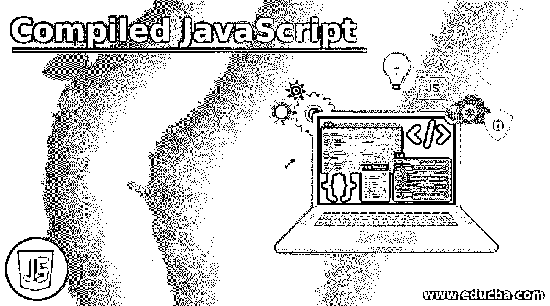
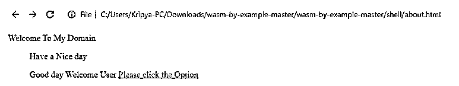
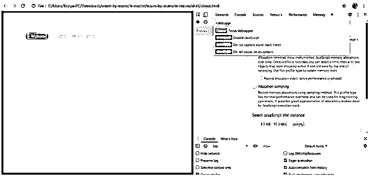
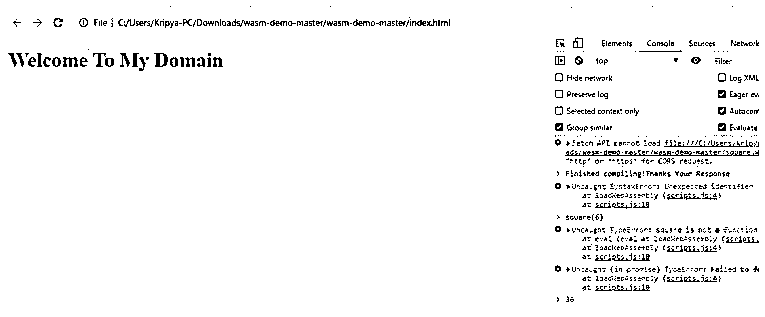

# 编译的 JavaScript

> 原文：<https://www.educba.com/compiled-javascript/>




## 编译 JavaScript 简介

基本上，JavaScript 是客户端和解释语言，不是编译时语言；它提前工作，并且它还创建一个新文件，该文件包含对文件中用户输入数据的机器代码翻译。通常有两种方法，我们可以将 JavaScript 代码翻译为机器代码。如果要编译代码，那么机器必须更好地理解代码，然后开始运行，这使得代码执行更快，稍后需要一些时间来使用这个过程的前端。

**编译后的 JavaScript 语法**

<small>网页开发、编程语言、软件测试&其他</small>

JavaScript 代码也可以在浏览器的帮助下解释语言和调试。javascript 有默认的 JVM 叫做 JavaScript 虚拟机，用于将 JavaScript 代码编译成机器码。使用 WebAssembly 技术调试 JavaScript 代码如下。

```
<html>
<head>
<script>
function name()
{
var v=new Worker(".js");//Worker is the default WebAPI here we created the instance and utilizes in the WebAssembly compile() method
---some javascript logics---
WebAssembly.compile(variablename)
v.postMessage(variablename) // postMessage() is the default function which has been received the byte codes with the help of Worker API.
}
</script></head>
<body>
---some html codes which depends on the user needs---
</body></html>
```

我们都知道上面的代码是 JavaScript 语言的基本语法，我们都使用了关于函数或无函数；这取决于开发商的前景。我们也可以将 JavaScript 代码编写为一个单独的文件，然后将其作为名为

### JavaScript 中编译是如何完成的？

*   JavaScript 不是一种编译语言；这是一种翻译语言。它大多运行在网页上，在浏览器的内部；它也运行在服务器端环境中。基本上，JavaScript 运行在 JavaScript 控制台上；它还帮助我们更快地查看代码中的结果。像 C，C++，java 等。，这些是一些类型的编译语言，所以它们有自己预定义的编译器来编译它们的代码。
*   但是在 JavaScript 中，在“WebAssembly”的帮助下，也就是说，用户将在浏览器中与 JS 代码进行交互，只使用可以编译成 LLVM 字节代码的特定类型的语言。所以我们可以使用 JS 代码，而不是编写 c 代码；将 JS 翻译成 WebAssembly 格式是一种更好的方法。WebAssembly 使用了许多允许在 web 中编译的语言。webassembly 具有文件格式。一旦加载到浏览器缓存中，它可以比其他相应的 JavaScript 源代码执行得更快，但差别较小。假设我有一个 js 文件，必须在浏览器中使用 webassembly 编译一次。
*   WebAssembly 具有名为 compile()的默认方法，即 WebAssembly.compile()方法。它将 WebAssembly 二进制代码编译到 WebAssembly.Moduleobject 中。Worker 也是 Web Workers API 中使用的接口，可以在脚本代码中创建该接口，并将消息发送回用户。与只在现代浏览器中运行的 JavaScript 相比，WebAssembly 代码的大小很小。还请注意，webassembly 语言不是 JavaScript 的替代品，JavaScript 是基于 web 的语言的编译平台之一。
*   但是在某些情况下，webassembly 将取代 JavaScript，但是没有 JavaScript 代码就无法构建 web 应用程序。我们可以在 webassembly 中使用 JavaScript 调用 dom(文档对象模型),这样它就可以访问任何 web api。因为 webassembly 方法是以通过 JavaScript 的方式使用的，所以它有助于提高性能，并且为 web 开发人员提供了新的功能。

### 编译后的 JavaScript 示例

以下是编译后的 JavaScript 示例:

#### 示例#1

**代码:**

```
<!DOCTYPE html>
<html>
<head>
<title>Example</title>
<style>
{{{styles.normalize}}}
{{{styles.sakura}}}
{{{styles.index}}}
</style>
</head>
<body>
<p>
Welcome To My Domain
</p>
<blockquote>
<p class="label">Have a Nice day</p>
<p>
Good day Welcome User
<a
target="_blank"
rel="noopener"
href="examplesList.js">Please click the Option
</a>
</p>
</blockquote>
<script type="text/javascript">
{{{js.examplesList}}}
</script>
</body>
</html>
import wasmInit from "first.js";
const demo = async () => {
const r = await wasmInit(
"./wasm/first.wasm"
);
r.console_log_from_wasm();
};
demo();
```

**输出:**




#### 实施例 2

**代码:**

```
<!DOCTYPE html>
<html>
<style>
.sample {
src: url('WWW.facebook.com');
font-family:'MutatorSans';
font-style: normal;
}
</style>
</head>
<body bgcolor="green">
<div class="sample">
<p>
Welcome To My Domain
</p>
</div>
<blockquote>
<p class="sample">Have a Nice day</p>
<p>
Good day Welcome User
<a
target="_blank"
rel="noopener"
href="examplesList.js">Please click the Option
</a>
</p>
</blockquote>
<script type="text/javascript">
{{{js.examplesList}}}
</script>
</body>
</html>
import wasmInit from "first.js";
const demo = async () => {
const r = await wasmInit(
"./wasm/first.wasm"
);
r.console_log_from_wasm();
};
demo();
```

**输出:**




#### 实施例 3

**代码:**

```
<!DOCTYPE html>
<html>
<head>
<meta charset="utf-8" />
<meta http-equiv="X-UA-Compatible" content="IE=edge">
<title>Welcome To My Domain</title>
<meta name="viewport" content="width=device-width, initial-scale=1">
</head>
<body>
<h1>Welcome To My Domain</h1>
<script src="scripts.js"></script>
</body>
</html>
let square;
async function loadWebAssembly(files) {
const r = await fetch(files);
const b = await r.arrayBuffer();
const m = await WebAssembly.compile(b);
return new WebAssembly.Instance(m);
};
loadWebAssembly('square.wasm')
.then(ins => {
square = ins.exports._Z7squarei;
console.log('Finished compiling!Thanks Your Response');
});
```

**输出:**




在上面的三个例子中，我们看到 web 汇编代码和 JavaScript 代码在名为 compile 和 loadWebAssembly()方法的默认方法的帮助下，将用于处理用户操作以及 web 应用程序的性能。当我们看到第一个例子时，我们简单地使用了带有 JavaScript 代码的 web 程序集和 html。它将导航网页；同样的例子，我们使用了 CSS 样式，所以 web 程序集接受了演示，JavaScript 最终示例我们使用了调试选项，输出显示在浏览器本身中。

### 结论

在 JavaScript 中，我们使用的 webassembly 技术是一个基于 web 的平台，因此它可以用于所有的 web 语言和应用程序，也可以像桌面应用程序一样在独立的应用程序中工作。它是使用 JavaScript 中的默认 API 与脚本一起设计和补充的。

### 推荐文章

这是一个编译 JavaScript 的指南。这里我们讨论一下入门，JavaScript 中编译是如何完成的？和示例。您也可以看看以下文章，了解更多信息–

1.  [JavaScript Onkeydown](https://www.educba.com/javascript-onkeydown/)
2.  [JavaScript 克隆对象](https://www.educba.com/javascript-clone-object/)
3.  [JavaScript JSON](https://www.educba.com/javascript-json/)
4.  [JavaScript object . assign()](https://www.educba.com/javascript-object-assign/)


