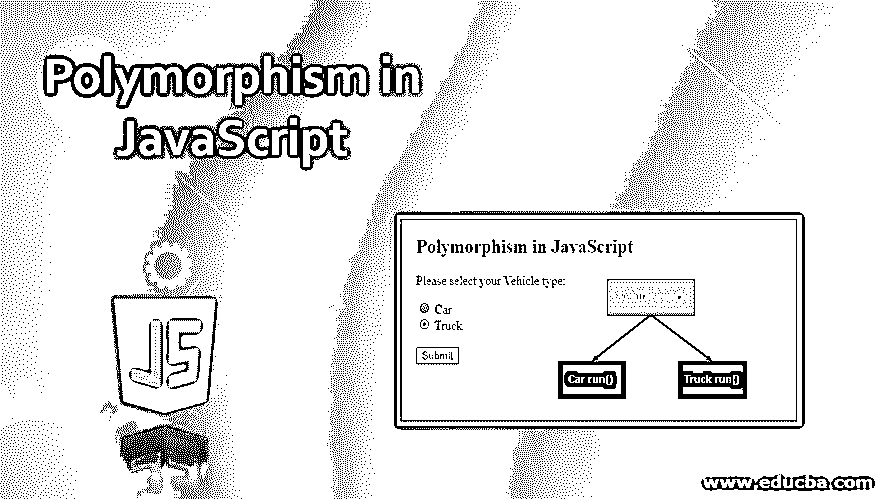
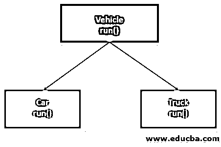
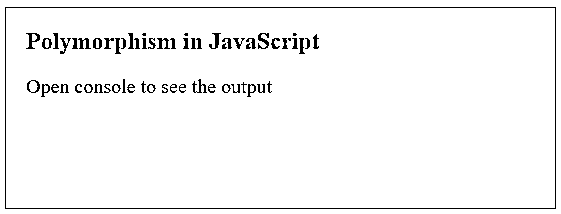
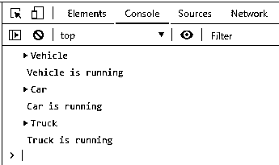
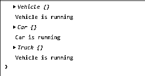
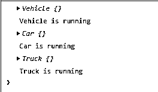
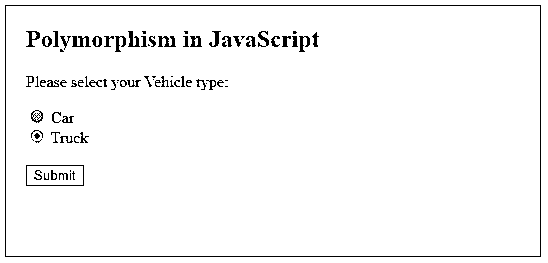

# JavaScript 中的多态性

> 原文：<https://www.educba.com/polymorphism-in-javascript/>




## JavaScript 中多态性的定义

由于 JavaScript 有一种机制来支持 OOPS 范式，多态性是它所支持的基本原则之一。由于面向对象的编程概念主要围绕着对象，因此对象在不同的场景中会有不同的行为。多态性只不过是一种类型，有多种形式。一种类型的对象可以根据运行时场景表现不同。多态使用继承的概念来实现这一点。在多态性中，多个对象将具有相同的方法但不同的实现，并且根据用户偏好，将选择相应的对象，并且将执行对应于该对象的方法。

**语法:**

<small>网页开发、编程语言、软件测试&其他</small>

让我们用一个简单的例子来形象化多态的概念。




```
var v1 = new Car();
v1.run(); // run() method from Car class will be executed
var v2 = new Truck();
v2.run(); // run() method from Truck class will be executed
```

### JavaScript 中多态性的工作原理

多态性允许我们在不同的对象中定义相同的方法，并提供根据对象调用它们的能力。如果我们考虑上面的例子，run()方法在两个子对象中是通用的。用户可以在运行时选择任何子类的对象，JavaScript 将相应地调用 run()方法。

### JavaScript 中实现多态性的示例

下面是一些例子:

#### 示例 1–使用 JavaScript 类

让我们定义类似于上面提到的例子的 JavaScript 类。

**代码**:

```
<!DOCTYPE html>
<html>
<head>
<title>
Polymorphism in JavaScript
</title>
<style>
.results {
border : green 1px solid;
background-color : aliceblue;
text-align : left;
padding-left : 20px;
height : 200px;
width : 95%;
}
.resultText {
font-size : 20px;
font-style : normal;
color : blue;
}
</style>
</head>
<body>
<div class = "results">
<h2> Polymorphism in JavaScript </h2>
<div class = "resultText">
<p> Open console to see the output </p>
<script type = "text/javascript">
class Vehicle {
run() {
console.log( " Vehicle is running " );
}
}
class Car extends Vehicle {
run() {
console.log( " Car is running " );
}
}
class Truck extends Vehicle {
run() {
console.log( " Truck is running " );
}
}
var v1 = new Vehicle();
var v2 = new Car();
var v3 = new Truck();
console.log( v1 );
v1.run();
console.log( v2 );
v2.run();
console.log( v3 );
v3.run();
</script>
</body>
</html>
```

这里，我们有一个父类车辆和两个子类汽车和卡车。所有的类都有同名的 run()方法，但是根据传递的引用，相应的 run()方法将被调用。

**输出**:







#### **例 2-**其中一个子类不包含 run()方法

这里我们将从 Truck 类中移除 run()方法，并将看到结果。

**代码:**

```
<!DOCTYPE html>
<html>
<head>
<title>
Polymorphism in JavaScript
</title>
<style>
.results {
border : green 1px solid;
background-color : aliceblue;
text-align : left;
padding-left : 20px;
height : 200px;
width : 95%;
}
.resultText {
font-size : 20px;
font-style : normal;
color : blue;
}
</style>
</head>
<body>
<div class = "results">
<h2> Polymorphism in JavaScript </h2>
<div class = "resultText">
<p> Open console to see the output </p>
<script type = "text/javascript">
class Vehicle {
run() {
console.log( this );
console.log( " Vehicle is running " );
}
}
class Car extends Vehicle {
run() {
console.log( this );
console.log( " Car is running " );
}
}
class Truck extends Vehicle {
}
var v1 = new Vehicle();
var v2 = new Car();
var v3 = new Truck();
var v = [ v1, v2, v3];
v.forEach(function(obj) {
obj.run();
});
</script>
</body>
</html>
```

这里，我们创建了一个包含所有对象的数组，并对它们调用 run()方法。

**输出:**




由于 Truck 类不包含 run()方法，尽管对象引用是 Truck 类型，但仍将执行 Vehicle 类的 run()方法。

#### 示例 3–使用基于原型的方法

**代码**:

```
<!DOCTYPE html>
<html>
<head>
<title>
Polymorphism in JavaScript
</title>
<style>
.results {
border : green 1px solid;
background-color : aliceblue;
text-align : left;
padding-left : 20px;
height : 200px;
width : 95%;
}
.resultText {
font-size : 20px;
font-style : normal;
color : blue;
}
</style>
</head>
<body>
<div class = "results">
<h2> Polymorphism in JavaScript </h2>
<div class = "resultText">
<p> Open console to see the output </p>
<script type = "text/javascript">
function Vehicle() {
}
Vehicle.prototype.run = function() {
console.log( " Vehicle is running " );
}
function Car() {
}
Car.prototype = Object.create (Vehicle.prototype);
Car.prototype.run = function() {
console.log( " Car is running " );
}
function Truck() {
}
Truck.prototype = Object.create (Vehicle.prototype);
Truck.prototype.run = function() {
console.log( " Truck is running " );
}
var v1 = new Vehicle();
var v2 = new Car();
var v3 = new Truck();
console.log( v1 );
v1.run();
console.log( v2 );
v2.run();
console.log( v3 );
v3.run();
</script>
</body>
</html>
```

**输出:**




输出与示例 1 的输出相同。

#### 例子# 4–现实生活中的例子

基于用户的偏好，我们将执行该方法。

**代码:**

```
<!DOCTYPE html>
<html>
<head>
<title>
Polymorphism in JavaScript
</title>
<style>
.results {
border : green 1px solid;
background-color : aliceblue;
text-align : left;
padding-left : 20px;
height : 250px;
width : 95%;
}
.resultText {
font-size : 20px;
font-style : normal;
color : blue;
}
</style>
</head>
<body>
<div class = "results">
<h2> Polymorphism in JavaScript </h2>
<form>
<p> Please select your Vehicle type: </p>
<input type="radio" id="car" name="vehicle" value="car">
<label for="car"> Car </label> <br>
<input type="radio" id="Truck" name="vehicle" value="truck">
<label for="truck"> Truck </label> <br>
<br>
<input type="button" value="Submit" onclick = "processData(this.form)">
</form>
<div class = "resultText">
<p id = "result"> </p>
</div>
</div>
<script type = "text/javascript">
class Vehicle {
run() {
return " Vehicle is running " ;
}
}
class Car extends Vehicle {
run() {
return " Car is running " ;
}
}
class Truck extends Vehicle {
run() {
return " Truck is running " ;
}
}
function processData(form) {
var type = form.vehicle.value;
var v;
if(type == "car"){
v = new Car();
}else if( type == "truck"){
v = new Truck();
}else {
v = new Vehicle();
}
msg = v.run();
document.getElementById("result").innerHTML = msg;
}
</script>
</body>
</html>
```

**输出:**




在这里，取决于用户选择一个将被创建的对象，相应的 run()方法将被调用。

### 结论

多态性允许我们在多个对象中定义同一个方法，并允许根据对象引用来调用它们。这种行为在动态或运行时环境中很有用。我们已经看到了在 JavaScript 中实现多态性的多种方法。

### 推荐文章

这是 JavaScript 中多态性的指南。这里我们还讨论了 javascript 中多态性的定义和工作，以及不同的例子和代码实现。您也可以看看以下文章，了解更多信息–

1.  [JavaScript 中的继承](https://www.educba.com/inheritance-in-javascript/)
2.  [c#中的多态性](https://www.educba.com/polymorphism-in-c-sharp/)
3.  PHP 中的多态性
4.  [Java 中的多态性](https://www.educba.com/polymorphism-in-java/)


