# JavaScript 颜色选择器

> 原文：<https://www.educba.com/javascript-color-picker/>

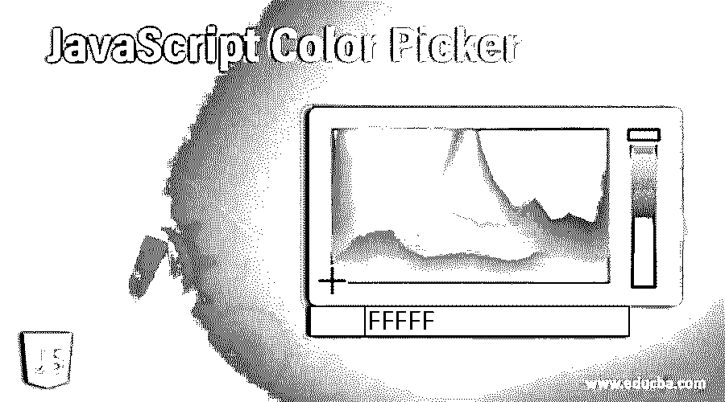


## JavaScript 颜色选择器简介

JavaScript 颜色选择器是一个允许用户从颜色选择器容器中选择颜色的控件。颜色选择器还允许用户调整不透明度和色调，以获得所需的颜色。此外，它支持调色板定制，并支持集成到表单中的内嵌模式。你们都见过很多种颜色选择器，它可以用任何编程语言编程，也可以是任何直接插件。通常，这些颜色拾取器用于拾取所需的颜色来装饰应用程序或根据需要。

**语法**

<small>网页开发、编程语言、软件测试&其他</small>

为颜色选择器创建一个新实例，

```
var samplePicker =  new jscolor(<targetElement>, <options>);
```

这里的参数<targetelement>是节点选择器，鼠标点击时会显示一个颜色选择器。</targetelement>

```
<options>: An object with optional hashmap with configurations and values in format, {<option>: <value>,….}
```

对于 JavaScript 颜色选择器，我们有一个通用的 JavaScript 代码，可以从“http://jscolor.com”下载

```
jscolor.js
```

jscolor.js 文件将包含颜色选择器的各种类型的编程逻辑。

### JavaScript 颜色选择器的示例

下面提到了不同的例子:

#### 示例#1

**代码:**

```
<script src="./jscolor.js"></script>
<h1>Different Color Pcikers</h1>
<h3>
Color:
<input data-jscolor="{position:'right'}" value="28F1C9">
</h3>
<h3>
Button type Large dark picker:
<button data-jscolor="{preset:'large dark', value:'rgba(48,85,255,0.8)'}"></button>
</h3>
<h3>
Small RGBA picker:
<input data-jscolor="{width:120}" value="rgba(144,34,82,1)">
</h3>
```

**输出:**


对于颜色，我们已经默认指定了特定的颜色；单击时，会显示颜色选择器。

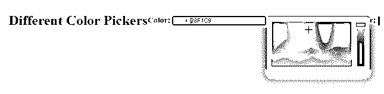


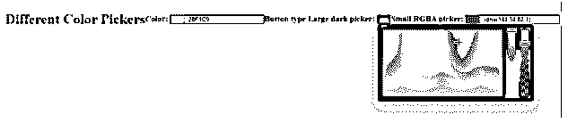


深色背景的输入型拾色器

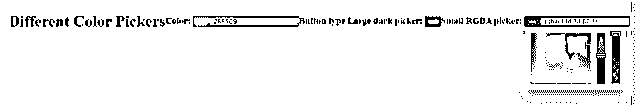


拾色器的小视图。

#### 实施例 2

**代码:**

```
<script src="jscolor.js"></script>
<p>
Small dark preset color picker:
<input value="FFA000" data-jscolor="{preset:'small dark', position:'right'}">
</p>
<p>
Large preset color picker:
<input value="rgba(255,255,0,0.5)" data-jscolor="{preset:'large', position:'right'}">
</p>
<p>
Custom theme:
<input value="rgba(255,255,0,2.5)" data-jscolor="{
position: 'right', width: 120, height: 120,
padding: 10, sliderSize: 25, borderRadius: 5,
borderWidth: 1, controlBorderWidth: 1, pointerBorderWidth: 2,
borderColor: '#256', controlBorderColor: '#CCC', backgroundColor: '#334'
}">
</p>
<p>
Input with large preview color picker:
<input value="rgba(255,110,0,0.5)" data-jscolor="{previewSize:50}">
</p>
<p>
Button with large preview color picker:
<button data-jscolor="{value:'rgba(255,160,120,0.5)', previewSize:20}"></button>
</p>
```

**输出:**

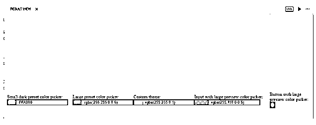


只有字母的小预设，作为 RGBA 变体的大预设。首先，自定义主题设置位置、宽度、高度、填充、背景颜色和边框宽度。接下来是带有 previewSize 的输入大预览颜色选择器，另一个带有按钮预览。

#### 实施例 3

**代码:**

```
<script src="jscolor.js"></script>
<h3>Redirect value of color picker</h3>
<p>
<button data-jscolor="{valueElement:'#value1', alphaElement:'#alpha1'}">
Pick color here
</button>
Value: <input id="value1" value="ABC222">
Alpha: <input id="alpha1" value="0.8">
<p>
<h3>Redirect value and preview of color picker</h3>
<p>
<button data-jscolor="{valueElement:'#value2', alphaElement:'#alpha2', previewElement:'#pr2'}">
Pick color here
</button>
Value: <input id="value2" value="BB2447">
Alpha: <input id="alpha2" value="0.9">
Preview: &nbsp;
<p>
```

**输出:**

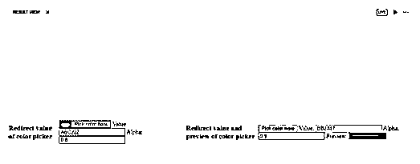


让我们试着改变这里的颜色，

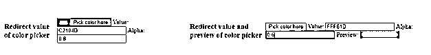


#### 实施例 4

**代码:**

```
<script src="jscolor.js"></script>
<h2>Positioning of color picker</h2>
<p>
Color Picker on right:
<input data-jscolor="{position:'right'}">
</p>
<p style="margin-top:200px">
Color Picker on Top
<input data-jscolor="{position:'top'}">
</p>
<p style="margin-bottom:200px">
Color Picker on Bottom
<input data-jscolor="{position:'bottom'}">
</p>
```

**输出:**

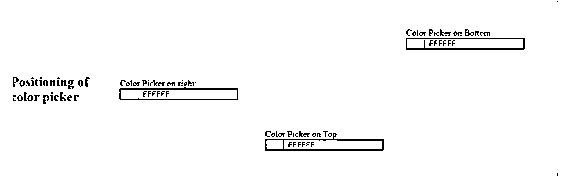


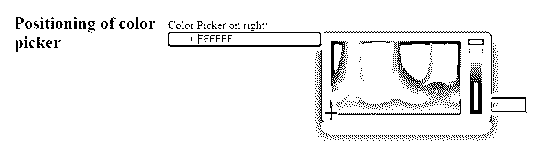


右边颜色选择器的位置

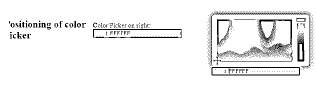


颜色选择器在顶部的位置

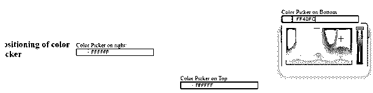


底部拾色器的位置

#### 实施例 5

**代码:**

```
<script src="jscolor.js"></script>
<button onclick="addPickers(100)">Add 100 color pickers</button>
<p id="container"></p>
<script>
function addPickers(count) {
for(var i = 0; i < count; i++) {
var inputColor = document.createElement('INPUT')
var opts = {backgroundColor:'#666'}
var picker = new JSColor(inputColor, opts)
picker.fromHSVA((360/count) * i, 100, 100)
document.getElementById('container').appendChild(inputColor)
}
}
</script>
```

**输出:**

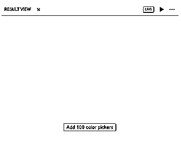


点击时，100 种颜色被添加到控制台中。

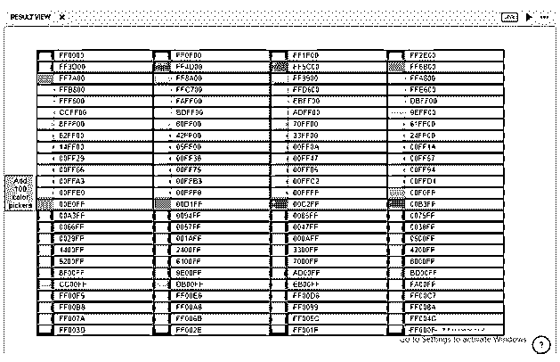


#### 实施例 6

**代码:**

```
<script src="jscolor.js"></script>
<script>
function generatePicker() {
document.getElementById('output').innerHTML += '<input data-jscolor="">'
jscolor.install()
}
</script>
<button onclick="generatePicker()">Click to generate Color Picker</button>
<p id="output"></p>
```

**输出:**

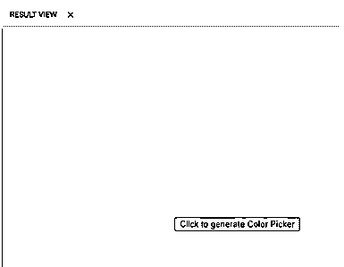


单击时，会生成一个颜色选择器

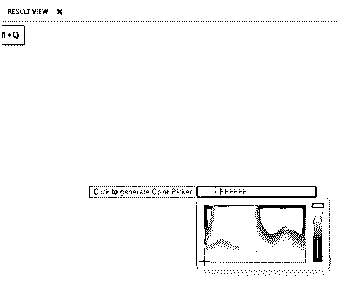


#### 实施例 7

**代码:**

```
<script src="jscolor.js"></script>
<p>HSV(Hue Saturation Value) mode: <input data-jscolor="{mode:'HSV', position:'top'}"></p>
<p>HVS mode: <input data-jscolor="{mode:'HVS', position:'bottom'}"></p>
```

**输出:**

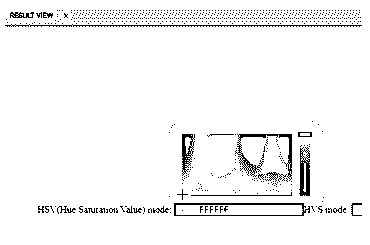


#### 实施例 8

**代码:**

```
<script src="jscolor.js"></script>
Color picker with a <b>Close</b> button:
<input value="fb3333" data-jscolor="{closeButton:true, closeText:'Close Picker!',
backgroundColor:'#555', buttonColor:'#AAA'}">
```

**输出:**

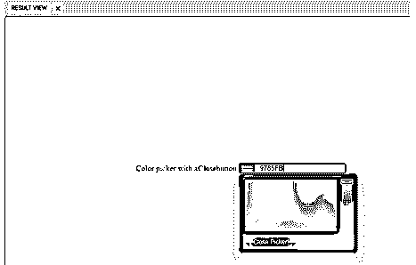


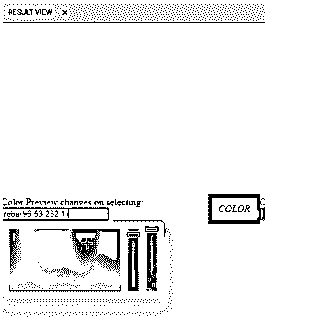


单击关闭拾色器，拾色器将关闭。

#### 实施例 9

**代码:**

```
<script src="jscolor.js"></script>
<p>
Color Preview changes on selecting:
<input data-jscolor="{value:'rgba(222,160,232,1)', previewElement:'#preview1'}">
</p>
<em id="preview1" style="display:inline-block; padding:1em;">COLOR</em>
<p>
Color picker using onInput event handler:
<input data-jscolor="{value:'rgba(242,90,233,0.9)'}", onInput="update(this.jscolor)">
</p>
<em id="preview2" style="display:inline-block; padding:1em;">background</em>
<em id="preview3" style="display:inline-block; padding:1em;">background color</em>
<script>
function update(colorpicker) {
document.getElementById('preview2').style.background = colorpicker.toBackground()
document.getElementById('preview3').style.backgroundColor = colorpicker.toRGBAString()
}
jscolor.trigger('input');
</script>
```

**输出:**

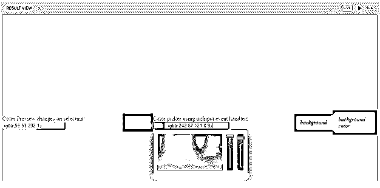


选择颜色后显示颜色预览，

带有事件处理程序的颜色选择器将显示背景颜色和不透明度

上面所有的例子都是我们编程编写的，也有一些用于颜色选择器的库，

*   平面颜色选择器
*   引导颜色选择器
*   反应颜色
*   Swatches 视图
*   灵活的颜色选择器
*   胡贝
*   彩色乔
*   光谱等。

### 结论

至此，我们结束了对“JavaScript 颜色选择器”主题的讨论我们已经看到了什么是 JavaScript 颜色选择器及其语法。我们也看到了很多例子，会让你很容易理解。jscolor.js 是为所有示例编写的通用脚本。

所以一定要理解 jscolor.js 文件，这样要做的任何更改都很容易理解。我们还看到了一些可以直接安装的颜色选择器库。此外，我们有一些浏览器或脚本应用程序的扩展来帮助我们在一行中添加颜色选择器。JavaScript 颜色选择器还支持许多内置的主题，如引导，材料。内置主题可以定制，或者通过覆盖 SASS 变量和使用任何主题工作室应用程序来创建新的主题。

### 推荐文章

这是一个 JavaScript 颜色选择器的指南。在这里，我们讨论 JavaScript 颜色选择器的例子以及代码和输出，这一定会让你很容易理解。您也可以看看以下文章，了解更多信息–

1.  [JavaScript onblur](https://www.educba.com/javascript-onblur/)
2.  [JavaScript 确认](https://www.educba.com/javascript-confirm/)
3.  [JavaScript 中的定时器](https://www.educba.com/timer-in-javascript/)
4.  JavaScript 中的[对象](https://www.educba.com/object-in-javascript/)


