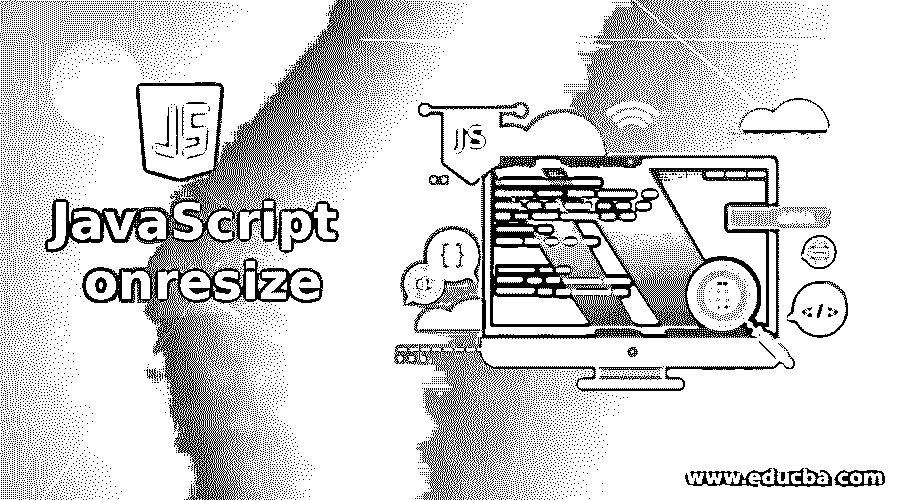
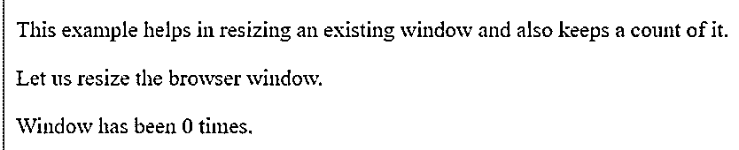
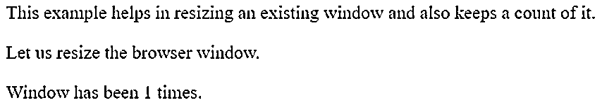
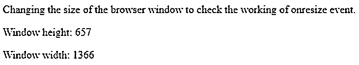
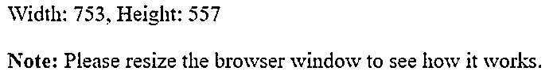
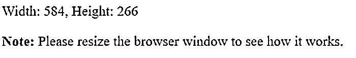

# JavaScript onresize

> 原文：<https://www.educba.com/javascript-onresize/>




## JavaScript onresize 简介

JavaScript onresize 函数是一个可以在事件处理中使用的属性。每当发生调整大小的事件时，它就会触发。当调整特定页面的窗口大小时，会发生此事件。它用于调整到不同的大小。它也可以用于不同的互联网浏览器，并根据需要使用。它是文档对象模型(DOM)的一部分，可以非常容易地使用。

**语法:**

<small>网页开发、编程语言、软件测试&其他</small>

JavaScript onresize 函数可以如下使用:

```
window.onresize = functionName;
```

functionName 是将接收 FocusEvent 对象作为其唯一参数的函数名或函数表达式。这个函数将负责处理 FocusEvent 对象发送的参数，并负责处理它。

我们还需要 addEventListener()方法，如下所示:

```
object.addEventListener("resize", myCode);
```

我们使用上面的语法来监听事件。

### onresize 事件在 JavaScript 中是如何工作的？

onresize 函数的工作非常简单。

**代码:**

```
<!DOCTYPE html>
<html>
<body>
<p>This example helps in resizing an existing window and also keeps a count of it.</p>
<p>Let us resize the browser window.</p>
<p>Window has been 0 times.</p>
<script>
document.getElementsByTagName("BODY")[0].onresize = function() {myResizeFunction()};
var x = 0;
function myResizeFunction() {
var edu = x += 1;
document.getElementById("demo").innerHTML = txt;
}
</script>
</body>
</html>
```

在正文中，我们打印了窗口被调整大小的次数。下面的脚本包含 onresize 函数。这个函数正在调用 myResizeFunction()。然后，我们声明了一个变量 x，它将保存调整大小的计数。如上所述，onresize 函数将用户定义的函数作为参数，然后执行其功能。这里，在这个函数中，每当调整窗口大小时，计数就递增。它表示这个函数在调整窗口大小时调用 onresize。除此之外，我们还有一些调整大小的功能。




当程序第一次运行时，将显示上述输出。但是当调整窗口大小时，计数器将增加。要检查它，您只需最小化您的浏览器窗口，事件将被捕获，计数将增加。下面是调整页面大小后的输出。




### JavaScript onresize 示例

以下是 JavaScript onresize 的示例:

#### 示例#1

让我们看一个使用<iframe>调整窗口大小的例子。由于代码将在一个<iframe>上运行，因此需要一个设置来帮助实际查看调整大小的效果。</iframe>

**代码:**

```
<!DOCTYPE html>
<html>
<body>
<p>Changing thesize of  the browser window to check the working of onresize event.</p>
<p>Window height: </p>
<p>Window width: </p>
<script>
const heightOutput = document.querySelector('#height');
const widthOutput = document.querySelector('#width');
function letsresize() {
heightOutput.textContent = window.innerHeight;
widthOutput.textContent = window.innerWidth;
}
window.onresize = letsresize;
</script>
</body>
</html>
```

在这个程序中，我们使用了两个变量来接受窗口的高度和宽度。我们使用 querySelector 来存储高度和宽度。函数 letsresize()使用了不同的函数。

这些功能如下:

*   clientWidth，clientHeight
*   内侧宽度，内侧高度
*   outerWidth, outerHeight
*   偏移宽度，偏移高度

这些功能可以帮助我们设置窗口、客户端或服务器的高度和宽度。我们已经使用了这些函数中的一个来根据正在调整大小的窗口设置文本的大小。在这之后，我们使用 onresize 函数来调用 letsresize 函数。下面是上面代码的输出。如前所述，您必须在运行该程序之前设置<iframe>。</iframe>

**输出:**




#### 实施例 2

上述调整大小函数也可以与 addEventListener()一起使用。

**代码:**

```
<!DOCTYPE html>
<html lang="en">
<head>
<meta charset="utf-8">
<title>JavaScript Resize Event for a Window</title>
</head>
<body>
<div id="result"></div>
<script>
// Function for Event Listener
function displayWinSize(){
// Acquiring width and height
var w = document.documentElement.clientWidth;
var h = document.documentElement.clientHeight;
// Display result of the element
document.getElementById("result").innerHTML = "Width: " + w + ", " + "Height: " + h;
}
window.addEventListener("resize", displayWindowSize);
displayWinSize();
</script>
<p><strong>Note:</strong> Resizing the window is important to see the working</p>
</body>
</html>
```

上面的程序在运行时显示窗口的宽度和高度。您可以很容易地改变窗口大小，并看到数字动态变化。我们使用 clientWidth，clientHeight 来获取事件触发时的高度和宽度。一旦我们从调整大小函数中得到这些，我们就通过显式调用函数来显示它。displayWinSize 因此帮助我们获得窗口的精确高度和宽度。我们使用的所有浏览器都支持这一功能。您可以使用这些功能，并在使用时获得窗口的实时大小。下面是上面程序的输出。我们第一次运行程序时，窗口是全尺寸的。

**输出:**




要查看调整数字的变化，您必须最小化屏幕。您也可以在方便的时候使用鼠标拖动来调整大小。它将按预期工作。除了完整的窗口高度和宽度之外，附加功能还可以帮助您获得内部高度和宽度以及外部高度和宽度。下一个输出是我们最小化窗口的时候。

**输出:**




### 结论

onresize 函数是一个有用的函数，可以帮助我们得到窗口的大小。它是在用户定义函数的帮助下触发的。这个函数可以让一个事件监听器在调整窗口大小时进行检查。这对于获得不同大小的窗口很有用。我们日常生活中使用的所有浏览器都支持它。onresize 函数有助于获得动态窗口大小，当特定事件发生时可以使用。

### 推荐文章

这是一个 JavaScript onresize 的指南。在这里，我们讨论一下 JavaScript 中 onresize 事件是如何工作的？和示例。您也可以看看以下文章，了解更多信息–

1.  [JavaScript 中的多态性](https://www.educba.com/polymorphism-in-javascript/)
2.  [JavaScript getElementsByTagName()](https://www.educba.com/javascript-getelementsbytagname/)
3.  [JavaScript 窗口事件](https://www.educba.com/javascript-window-events/)
4.  [JavaScript 中的 linked list](https://www.educba.com/linkedlist-in-javascript/)


