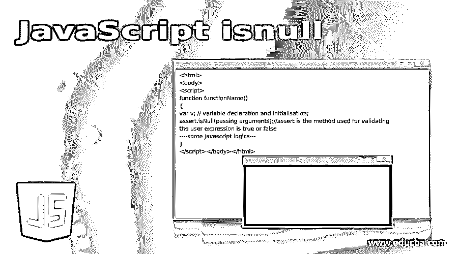
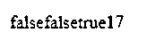
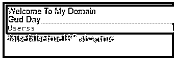

# JavaScript 为空

> 原文：<https://www.educba.com/javascript-isnull/>




## JavaScript isnull 简介

在 JavaScript 中，isnull 被定义为关键字，而的方法指定用表示的值为 null 在有意缺少任何类型的对象值的情况下，值可以是任何数据类型作为变量值的原始类型它还包括不同的附加原始数据类型值为 null 和未定义两者都被指定为没有值被赋给变量它有自己的特殊含义我们可以赋值 变量的空值表示它没有任何值，但以后会有。

### 语法和参数

isnull()也是函数的方法之一，它接受传递给它的未定义的参数。它有自己的语法和属性来调用空值作为参数。

<small>网页开发、编程语言、软件测试&其他</small>

```
<html>
<body>
<script>
function functionName()
{
var v; // variable declaration and initialisation;
assert.isNull(passing arguments);//assert is the method used for validating the user expression is true or false
----some javascript logics---
}
</script></body></html>
```

上面的代码是基本语法，这里我们使用了 assert()方法，这是验证表达式的默认方法之一，因此设置 isNull()并检查参数、参数列表和其他用户定义的表达式。

### JavaScript 中 isnull 是如何工作的？

JavaScriptisnull()是为表达式和值进行验证的方法。每当我们指定空值时，它是一个原始数据类型，它通常设置变量值，它的目的是表明值已经被声明，但它还不是原始类型中的赋值。我们知道空值是临时值，将来会被已定义变量中其他有价值的值替换。我们还检查了 UI 中的空值表达式，有时这种情况会发生在基于 web 的用户注册页面应用程序或其他一些应用程序模块中。尽管事实上 null 是 false 语句，但它也被认为是松散耦合的，与脚本中的其他类型的 false 语句相同。主要是与代码中未定义类型的值进行比较。

除此之外，它还指示空字符串或空字符串列表的值。这些函数将检查是否使用了空字符串。它还检查字符串，并返回布尔值，如果值设置为 true，则字符串为 null，否则，如果字符串不为 null，则返回 false。如果假设值为 Null，它将遵循 isEmpty()方法操作符的条件，检查字符串是否不包含字符，只接受空格。然后，如果我们使用 isBlank()方法操作符，字符串被检查，它不包含任何字符，只有空格，然后它接受变量中的空值。在应用程序代码中，由于某种原因，我们也可以解析字段值并将其保存为 null，这是因为无论何时我们都必须使用一些无法解析值的操作来解析值，并且使用一些运算符也存在与查找查询不匹配的情况。即使使用运算符的地理查找查询中缺少一些字段，这些字段也将是运算符查询的转置。当我们比较 undefined 和 null 值时，undefined 是变量类型，null 是对象值，只要我们在脚本中使用 null 关键字，它就表示“没有值”或值不存在，如果假设变量与其赋值共享，那么它可以简单地将其赋值给任何对象的完整值。

#### 示例#1

**代码:**

```
<!-- Write HTML code here -->
<html>
<head>
<script src=
"https://cdnjs.cloudflare.com/ajax/libs/underscore.js/1.9.1/underscore-min.js">
</script>
</head>
<body>
<script type="text/javascript">
var x = _.isNull(undefined);
var y = _.isNull(null);
var z = x + y;
vari=16;
document.write(_.isNull(16));
document.write(x);
document.write(y);
document.write(z);
function demo(str) {
const p = str.match(/[aeiou]/gi);
if (p === null) {
return 0;
}
returnp.length;
}
document.write(demo('welcome to my domain'));</script>
</body>
</html>
```

**输出:**




#### 实施例 2

**代码:**

```
<html>
<head>
<script src=
"https://cdnjs.cloudflare.com/ajax/libs/underscore.js/1.9.1/underscore-min.js">
</script>
<style>
div.four {
background-color:pink;
font: 80% sans-serif;
}
div.five {
background-color:yellow;
font: 13px/11px sans-serif;
}
div.six {
background-color:orange;
font-weight: 500;
font: 1rem monospace;
white-space: nowrap;
}
</style>
</head>
<bodybgcolor="blue">
<div class="four">Welcome To My Domain</div>
<div class="five">Gud Day</div>
<div class="six">Userss</div>
<script type="text/javascript">
var x = _.isNull(undefined);
var y = _.isNull(null);
var z = x + y;
vari=16;
document.write(_.isNull(16));
document.write(x);
document.write(y);
document.write(z);
function demo(a) {
a = a.filter(sample);
return a;
}
function sample(v) {
if(v !== false || v !== null || v !== 0 || v !== "") {
return v;
}
}
document.write(demo([37, '', 'siva', true, null, false, 0]));
</script>
</body>
</html>
```

**输出:**




### 结论

在结论部分，我们使用 isnull 作为关键字和函数，用于不同的场景，同时将 null 作为代码中的值和方法中的参数传递。在需求中任何需要的地方都应该进行检查和验证，原始类型的值也是代码中考虑最多的。

### 推荐文章

这是一个 JavaScript isnull 的指南。在这里，我们还将讨论 javascript isnull 的简介、语法和参数，以及不同的示例和代码实现。您也可以看看以下文章，了解更多信息–

1.  [JavaScript Onkeydown](https://www.educba.com/javascript-onkeydown/)
2.  [JavaScript 克隆对象](https://www.educba.com/javascript-clone-object/)
3.  [JavaScript exec()](https://www.educba.com/javascript-exec/)
4.  [JavaScript 鼠标按下](https://www.educba.com/javascript-mousedown/)


