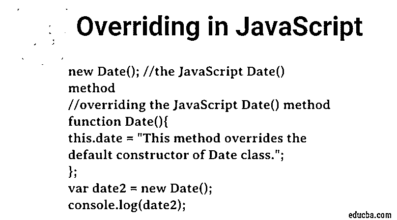
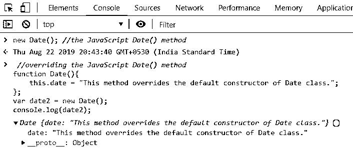
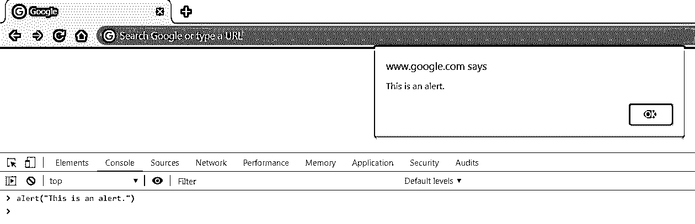
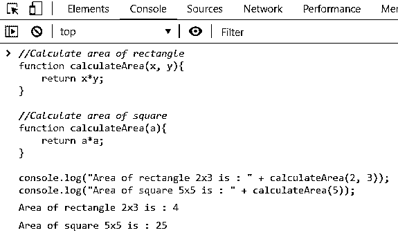
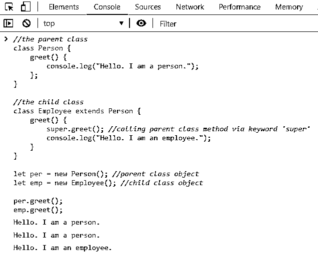

# 在 JavaScript 中覆盖

> 原文：<https://www.educba.com/overriding-in-javascript/>




## JavaScript 中什么是覆盖？

为了理解 JavaScript 中覆盖的概念，让我们首先整体修改一下覆盖的概念。

方法覆盖是一个与[继承](https://www.educba.com/inheritance-in-javascript/)紧密结合的[概念](https://www.educba.com/course/core-java/)。当子类方法覆盖具有相同名称、参数和返回类型的父类方法时，称为方法覆盖。还要提醒的是，这和方法重载的概念完全不同。当有两个同名但参数不同的函数时，就会发生方法重载。

<small>网页开发、编程语言、软件测试&其他</small>

现在，让我们试着从 JavaScript 的角度来理解这个概念。我们知道 JavaScript“相对”不是面向对象的。它有对象的概念，这使它有资格成为面向对象的，但是它没有类的概念。它在本质上是典型的。是的，是的，我听到你大声说我们可以用 JavaScript 声明类，但是让我提醒你，这个类符号仅仅是底层原型架构的语法糖。

因此，JavaScript 支持方法覆盖的概念。它以非常奇怪的方式做到这一点。毕竟，它是编程界最容易被误解的语言。JavaScript 支持重写，但不支持重载。

<u>注意</u>–在本文的所有示例中，我们将使用浏览器的开发人员控制台。只需打开浏览器开发者工具(Ctrl/Cmd + Shift + C)并转到开发者工具窗口中的控制台选项卡。

在 Chrome 中看起来是这样的:


这是大多数 JavaScript 相关概念的游乐场。在整篇文章中，我们都会用到这个操场。

### JavaScript 中的重写是如何工作的？

在 JavaScript 中，所有对象都继承自对象原型。所有对象都是对象的实例。因此，无论何时创建任何新对象，JavaScript 都会自动为新对象定义 _proto_ (prototype)属性。当一个子对象被创建时，它又有一个 _proto_ property，依此类推。现在，当您试图访问一个对象的方法或属性时，JavaScript 首先检查该对象是否具有该方法/属性。如果没有，JavaScript 检查对象的 _proto_ 是否有那个方法/属性。如果没有，JavaScript 检查它的父对象的 _proto_ 是否有那个方法/属性。它继续沿着链向上搜索，直到找到方法/属性或者遇到并搜索到 _proto_ of 对象。例如 date . Prototype .[[Prototype]]是 Object.prototype。

现在看倒挂的链条。这就是 JavaScript 中重写的工作方式。一个方法将继续重写父对象的方法，即使它是 object 的方法。例如，我们甚至可以覆盖核心功能，比如创建一个日期对象。

让我们看一个例子:

```
new Date(); //the JavaScript Date() method
//overriding the JavaScript Date() method
function Date(){
this.date = "This method overrides the default constructor of Date class.";
};
var date2 = new Date();
console.log(date2);
```




### JavaScript 中覆盖的类型

JavaScript 中没有定义覆盖类型。然而，基于编程语言的行为，我们可以说 JavaScript 中的方法覆盖以下列方式工作。

#### 1.第一个行为

第一种方式是我们在上面看到的，我们定义了一个方法来覆盖 JavaScript 的默认日期[构造函数。这与下面的第三种方式类似，因为 JavaScript 中的所有对象都是对象原型的一个实例。第三种行为的不同之处在于超级关键字的](https://www.educba.com/constructor-in-javascript/)[用法。](https://www.educba.com/super-keyword-in-java/)我们在阐述第三种行为时会看到更多。

我们再看一个类似的例子。这一次，我们将覆盖警报功能。JavaScript 中 alert 函数的默认行为是在页面顶部显示一个小对话框，其中包含我们作为参数传递的消息。




现在，当我们用自己的代码覆盖它时，默认的 alert 函数不再被调用。

```
function alert(msg) {
console.log(msg);
};
alert("This is an alert.");
```


#### 2.第二种行为

第二种方式是当我们试图在 JavaScript 中重载函数时。记住，JavaScript 不支持函数重载。因此，JavaScript 不会重载你的函数，而是用最新的定义覆盖你的函数所有以前的定义。

让我们来看看这是怎么回事。

```
//Calculate area of rectangle
function calculateArea(x, y){
return x*y;
}
//Calculate area of square
function calculateArea(a){
return a*a;
}
console.log("Area of rectangle 2x3 is : " + calculateArea(2, 3));
console.log("Area of square 5x5 is : " + calculateArea(5));
```




注意结果。JavaScript 总是调用函数的第二个定义，并返回第一个参数的平方。后续参数将被忽略。

#### 3.第三种行为

当我们在 JavaScript 中涉及到类和继承时，第三种行为就出现了。当子类继承了父类的方法并定义了自己的同名方法时，父类的方法将被覆盖。这不是我们在实际应用中想要的。我们希望我们的父类方法即使被子类方法覆盖也是可访问的。所以，超级关键字来拯救我们。使用 super 关键字，我们可以访问父类方法。

让我们来看看这是怎么回事。

```
//the parent class
class Person {
greet() {
console.log("Hello. I am a person.");
};
}
//the child class
class Employee extends Person {
greet() {
super.greet(); //calling parent class method via keyword 'super'
console.log("Hello. I am an employee.");
}
}
let per = new Person(); //parent class object
let emp = new Employee(); //child class object
per.greet();
emp.greet();
```




现在回到第一个行为示例，尝试使用 super 关键字。你会注意到它不起作用。这是因为当我们在第一个例子中创建我们的方法时，我们没有扩展父类。我们在全局范围内创建了该方法，因此覆盖了该方法的所有其他定义。

### 结论

让我们修正一下对 JavaScript 中方法覆盖的理解。我们了解到 JavaScript 支持覆盖，但不支持重载。如果我们试图重载方法，JavaScript 会用最新的定义覆盖所有以前的定义。即使是核心功能也是如此！

接下来，我们看到了如何在子类中重写方法，并在需要时访问父类方法。这是一个非常有用的概念，因为它允许我们扩展父类的功能，从而提高代码的可重用性。

### 推荐文章

这是一个用 JavaScript 重写的指南。这里我们讨论 JavaScript 中的覆盖是如何工作的，以及 JavaScript 中的覆盖类型。您也可以阅读以下文章，了解更多信息——

1.  【Javascript 能做什么？
2.  [JavaScript 是什么？](https://www.educba.com/what-is-javascript/)
3.  [如何安装 JavaScript](https://www.educba.com/install-javascript/)
4.  [Java 运行时类](https://www.educba.com/java-runtime-class/)


