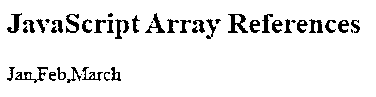
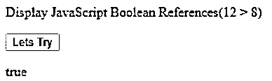
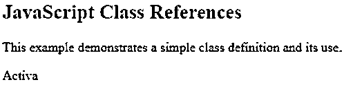
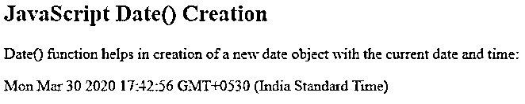
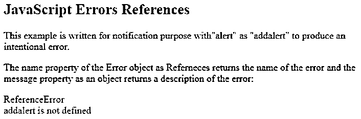
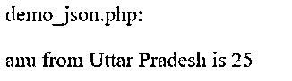
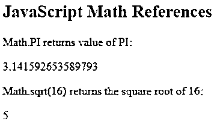
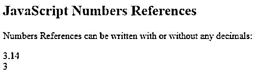
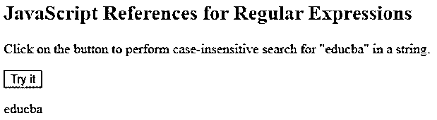
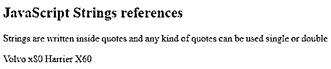

# JavaScript 参考

> 原文：<https://www.educba.com/javascript-references/>


## JavaScript 参考简介

JavaScript 引用是 JavaScript 的一个非常重要的特性，因为它不支持内部指针概念，这使得它不同于其他编程语言。此外，引用不能直接使用，因为 JavaScript 引用与其他引用完全不同。在引用中，不可能将一个对象的值直接引用到另一个对象。只有像对象和数组这样的复合值可以使用引用来引用或赋值。JavaScript 引用可以指向复合值而不是标量原语，这一点也很重要，正如上面提到的，它不能直接使用引用。

**语法**

<small>网页开发、编程语言、软件测试&其他</small>

引用语法的工作方式是，当复合值赋给一个变量时，就会创建一个新的引用。

```
var <array of var> =[x,y,z];
var <variable>= <array of var> // assign by reference
<variable> = [x,y,z]; //value gets reassigned (create new reference)
```

**解释:**声明一个变量数组，并为该数组中的元素赋值。考虑另一个变量，并为该变量赋值引用。给同一个变量分配一些值，表示它已经重新分配并为现有变量和值集创建了一个新的引用。

### JavaScript 引用是如何工作的？

让我们来看看 JavaScript 引用的工作原理:

```
var months = [april,may,june];
(function (a)) {
a.push (60);
console.log(a);
a=[oct,nov,dec];
a.push (55);
console.log(a);
}) (months);
console.log(months);
```

**说明**:声明一组变量，将月份视为复合变量。这个函数作为一个变量用元素来推动，并打印出来，直到现在元素都没有被覆盖和重新分配。获取这些月份和变量，然后用一组新值重新分配复合变量，并打印复合变量。很容易分析实际变量和重新分配的复合变量与参考变量之间的差异。**T3】**

### JavaScript 引用的类型

基本上，JavaScript 有三种作为引用传递的数据类型，即数组、函数和对象。这些在技术上都被认为是对象，因此统称为对象来引用。但是，一个清晰的参考列表如下:

1.  数组引用
2.  布尔引用
3.  类别引用
4.  日期参考
5.  误差参考
6.  全局引用
7.  Json 参考
8.  数学参考
9.  参考编号
10.  运营商参考
11.  正则表达式引用
12.  语句引用
13.  字符串引用

### JavaScript 引用的示例

以下是提及的参考案例

#### 例 1–引用数组引用的程序。

**代码:**

```
<!DOCTYPE html>
<html>
<body>
<h2>JavaScript Array References</h2>
<p id="demo"></p>
<script>
var months = ["Jan","Feb", "March"];
document.getElementById("demo").innerHTML = months;
</script>
</body>
</html>
```

**输出:**




#### 示例 2–引用布尔引用的程序

**代码:**

```
<!DOCTYPE html>
<html>
<body>
<p>Display JavaScript Boolean References(12 > 8)</p>
<button onclick="BooleanFunction()"> Lets Try</button>
<p id="demo1"></p>
<script>
function BooleanFunction() {
document.getElementById("demo1").innerHTML = Boolean(12 > 8);
}
</script>
</body>
</html>
```

**输出:**




#### 示例 3–引用类引用的程序

**代码:**

```
<!DOCTYPE html>
<html>
<body>
<h2>JavaScript Class References</h2>
<p> This example demonstrates a simple class definition and its use. </p>
<p id="demo2"></p>
<script>
class Scooter {
constructor(brand) {
this.scootername = brand;
}
}
myscooter = new Scooter("Activa");
document.getElementById("demo2").innerHTML = myscooter.scootername;
</script>
</body>
</html>
```

**输出:**




#### 示例 4–引用日期参考的程序

**代码:**

```
<!DOCTYPE html>
<html>
<body>
<h2>JavaScript Date() Creation </h2>
<p> Date() function helps in creation of a new date object with the current date and time:</p>
<p id="demo3"></p>
<script>
var deff = new Date();
document.getElementById("demo3").innerHTML = deff;
</script>
</body>
</html>
```

**输出**




#### 例 5–引用错误参考的程序

**代码:**

```
<!DOCTYPE html>
<html>
<body>
<h2>JavaScript Errors References</h2>
<p>This example is written for notification purpose with"alert" as "addalert" to produce an intentional error.</p>
<p>The name property of the Error object as Referneces returns the name of the error and the message property as an object returns a description of the error:</p>
<p id="demo4" style="color:red"></p>
<script>
try {
addalert("Hello first time user!");
}
catch(err) {
document.getElementById("demo4").innerHTML =
err.name + "<br>" + err.message;
}
</script>
</body>
</html>
```

**输出:**




#### 例 6–引用 JSON 引用的程序。

**代码:**

```
<!DOCTYPE html>
<html>
<body>
<script>
var myObj = { "name":"anu", "age":25, "city":"Uttar Pradesh", "gender":"female" };
var myJSON = JSON.stringify(myObj);
window.location = "demo_json.php?x=" + myJSON;
</script>
</body>
</html>
```

**输出:**




#### 示例# 7–引用数学参考的程序

**代码:**

```
<!DOCTYPE html>
<html>
<body>
<h2>JavaScript Math References </h2>
<p>Math.PI returns value of PI:</p>
<p id="piDemoa"></p>
<p>Math.sqrt(16) returns the square root of 16:</p>
<p id="sqrtDemob"></p>
<script>
var z = Math.PI;
var x = Math.sqrt(25);
document.getElementById("piDemoa").innerHTML = z;
document.getElementById("sqrtDemob").innerHTML = x;
</script>
</body>
</html>
```

**输出:**




#### 示例 8–引用编号参考的程序

**代码:**

```
<!DOCTYPE html>
<html>
<body>
<h2>JavaScript Numbers References</h2>
<p>Numbers References can be written with or without any decimals:</p>
<p id="demo5"></p>
<script>
var z = 3.14;
var x = 3;
document.getElementById("demo5").innerHTML = z + "<br>" + x;
</script>
</body>
</html>
```

**输出:**




#### 示例 9–参考操作员参考的程序

**代码:**

```
<!DOCTYPE html>
<html>
<body>
<p>typeof operator is used to return type or the property of a variable, object, function or expression.</p>
<p id="demo6"></p>
<script>
document.getElementById("demo6").innerHTML =
typeof "ajay" + "<br>" +
typeof 3.14 + "<br>" +
typeof NaN + "<br>" +
typeof false + "<br>" +
typeof [1, 2, 3, 4] + "<br>" +
typeof {name:'ajay', age:30} + "<br>" +
typeof new Date() + "<br>" +
typeof function () {} + "<br>" +
typeof myScooter + "<br>" +
typeof null;
</script>
</body>
</html>
```

**输出:**


#### 示例# 10–引用正则表达式引用的程序

**代码:**

```
<!DOCTYPE html>
<html>
<body>
<h2>JavaScript References for Regular Expressions</h2>
<p>Click on the button to perform case-insensitive search for "educba" in a string.</p>
<button onclick="myFunctionq()">Try it</button>
<p id="demo8"></p>
<script>
function myFunctionq() {
var str = "Welcome to educba";
var patrn = /educba/i;
var result = str.match(patrn);
document.getElementById("demo8").innerHTML = result;
}
</script>
</body>
</html>
```

**输出:**




#### 例# 11–引用语句引用的程序。

**代码:**

```
<!DOCTYPE html>
<html>
<body>
<h1>My educba learning Page</h1>
<p id="demo5">First article.</p>
<script>
document.getElementById("demo5").innerHTML = "Hello educba.";
</script>
</body>
</html>
```

**输出:**


#### 例# 12–引用字符串引用的程序。

**代码:**

```
<!DOCTYPE html>
<html>
<body>
<h2>JavaScript Strings references</h2>
<p>Strings are written inside quotes and any kind of quotes can be used single or double </p>
<p id="demo8"></p>
<script>
var car1 = "Volvo x80";
var car2 = 'Harrier X60';
document.getElementById("demo8").innerHTML =
car1 + " " + car2;
</script>
</body>
</html>
```

**输出:**




### 结论

JavaScript 引用非常有用，因为引入引用有助于开发人员避免错误，并增强编码模式和规范。

### 推荐文章

这是 JavaScript 参考指南。这里我们讨论 JavaScript 引用的例子以及类型和工作原理。您也可以看看以下文章，了解更多信息–

1.  [JavaScript 风格可见性](https://www.educba.com/javascript-style-visibility/)
2.  [JavaScript 字符串编号](https://www.educba.com/javascript-string-to-number/)
3.  [三元运算符 JavaScript](https://www.educba.com/ternary-operator-javascript/)
4.  [JavaScript 地图对象](https://www.educba.com/javascript-map-object/)


