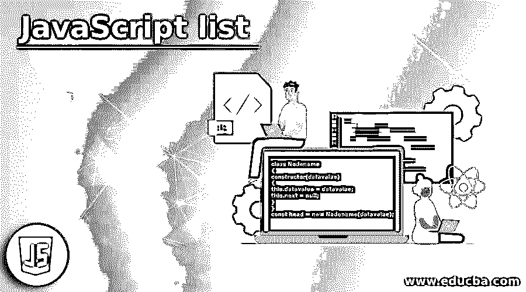
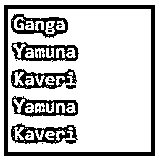

# JavaScript 列表

> 原文：<https://www.educba.com/javascript-list/>




## JavaScript 列表简介

用于以线性方式存储多个值的数据结构在 JavaScript 中被称为链表，节点是链表中的对象，它由数据以及到列表中下一个节点的链接组成。其中 link 是指向列表中下一个节点的指针，或者如果列表中没有下一个节点，则它为空，如果每个节点中只有一个指针指向列表中下一个节点，则该列表称为单链表，或者如果每个节点中有两个指针指向列表中的猎物节点和列表中的下一个节点，则该列表称为双链表。

**JavaScript 列表的语法:**

<small>网页开发、编程语言、软件测试&其他</small>

```
class Nodename
{
constructor(datavalue)
{
this.datavalue = datavalue;
this.next = null;
}
}
const head = new Nodename(datavalue);
```

在哪里，

*   类 Nodename 是具有 datavalue 的节点的结构是要存储在节点中的数据，next 是指向列表中下一个节点的指针(如果它存在或指向 null)。
*   head 是列表中的第一个节点。

### JavaScript 列表的工作

*   每当需要在 JavaScript 中以线性方式存储多个值时，我们就使用一种叫做链表的数据结构。
*   节点是链表中的一个对象，它由数据和指向链表中下一个节点的链接组成，其中 link 是指向链表中下一个节点的指针，如果链表中没有下一个节点，则它为空。
*   如果每个节点只有一个指针指向链表中的下一个节点，那么这个链表叫做单链表。
*   如果每个节点中有两个指针分别指向链表中的前一个节点和下一个节点，那么这个链表称为双向链表。

**在 JavaScript 中使用链表时可以使用的方法有:**

#### 1.插入(数据)

insert(data)方法用于将给定元素添加到列表的末尾。

实现 insert(data)方法的代码如下所示:

insert(data)被定义为向列表中添加新元素，在该列表中创建节点，并且检查头节点是否为空，如果为真，则将所创建的节点分配给头节点，并将元素插入其中，并且使来自该节点的指针指向列表中的下一个节点。

#### 2.删除(数据)

remove(data)方法用于从列表末尾删除给定的元素。移除的元素由此方法返回，或者如果列表中没有元素，则此方法返回-1。

实现 remove(data)方法的代码如下所示:

remove(data)方法被定义为从列表中删除给定的元素。该列表在列表的长度上迭代，以找到给定的元素，一旦找到该元素，就将其从列表中移除。

#### 3.显示()

display()方法用于显示列表中的元素。

实现 display()方法的代码如下所示:

函数 display 用于显示列表中的元素，其工作方式是显示每个元素，并将指针指向下一个节点，同时遍历到列表的末尾。

### JavaScript 列表示例

JavaScript 程序，用 JavaScript 演示链表，在链表末尾添加一个元素，从链表中删除一个元素，并显示链表中的元素。

**代码:**

```
//creating a data structure for linked list which initializes the head and length of the list to null
class LinkedList
{
constructor()
{
this.head = null;
this.length = 0;
}
//a function called insert is defined to insert an element into the list
insert(element, pos = this.length)
{
//a new node is created and checking if the node is null and if its true, it is made the head of the node
let node = new this.Node(element);
if (this.head === null)
{
this.head = node;
this.length++;
return this.head;
}
let iteration = 1;
let currentNode = this.head;
//checking if the current node is not null and the variable iteration is less than the length of the list
while (currentNode.next != null && iteration < pos)
{
currentNode = currentNode.next;
iteration++;
}
//assigning the next node of the current node to the new node consisting of element
node.next = currentNode.next;
currentNode.next = node;
this.length++;
return node;
}
//a function called remove is defined to remove the element from the list
remove(element, pos = 0)
{
//checking if the length of the list is zero or not
if (this.length === 0)
{
console.log("The list do not contain items");
return;
}
this.length--;
let currentNode = this.head;
if (pos <= 0)
{
this.head = this.head.next;
}
else if (pos >= this.length - 1)
{
while (currentNode.next.next != null)
{
currentNode = currentNode.next;
}
currentNode.next = null;
}
else
{
let iteration = 0;
//a variable called iteration is chosen and checked if the position of less than the iteration
while (iteration < pos)
{
currentNode = currentNode.next;
iteration++;
}
currentNode.next = currentNode.next.next;
}
return currentNode;
}
//a function called display is defined to display the elements in the list
display()
{
let currentNode = this.head;
while (currentNode != null)
{
console.log(currentNode.element);
currentNode = currentNode.next;
}
}
}
LinkedList.prototype.Node = class
{
constructor(element)
{
this.element = element;
this.next = null;
}
}
//creating an instance of the linked list and inserting the elements into the list, deleting the elements from the list and displaying the elements
var rivers = new LinkedList();
rivers.insert("Ganga");
rivers.insert("Yamuna");
rivers.insert("Kaveri");
rivers.display();
rivers.remove("Ganga");
rivers.display();
```

**输出:**




在上面的程序中，定义了创建链表的数据结构，在该数据结构中初始化了链表的头节点和长度。然后，定义一个称为 insert 的函数，向列表中添加新元素，在该列表中创建一个节点，并检查头节点是否为空，如果为真，则将创建的节点分配给头节点，并将元素插入其中，并使来自该节点的指针指向列表中的下一个节点。然后定义一个名为 remove 的函数，从列表中删除给定的元素。该列表在列表的长度上迭代，以找到给定的元素，一旦找到该元素，就将其从列表中移除。功能显示用于显示列表中的元素。

### 推荐文章

这是一个 JavaScript 列表指南。这里我们分别用例子来讨论 JavaScript list 的介绍、工作原理。您也可以看看以下文章，了解更多信息–

1.  [JavaScript 动画](https://www.educba.com/javascript-animation/)
2.  [JavaScript elseIf](https://www.educba.com/javascript-elseif/)
3.  [JavaScript 随机](https://www.educba.com/javascript-random/)
4.  [JavaScript onsubmit](https://www.educba.com/javascript-onsubmit/)


