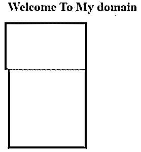
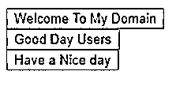
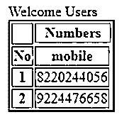

# JavaScript 网格

> 原文：<https://www.educba.com/javascript-grid/>


## JavaScript 网格简介

JavaScript 是客户端脚本语言之一，因为 JavaScript 具有许多组件来验证客户端请求和从服务器接收的响应。网格是 JavaScript 组件之一，它将用于显示表格格式的数据或信息，数据分别保存在每行和每列中。这也是一个库函数，它的工作与元素和组件在最佳的位置，可用于适合在网页的水平和垂直空间，也与项目值排序。

**语法:**

<small>网页开发、编程语言、软件测试&其他</small>

JavaScript 网格布局对于网页上的每个屏幕都有更多不同的语法，这取决于用户的需求，可能会有所不同。

```
<html>
<head>
<script>
---javascript functions and logic codes—
</script>
<body>
<div class = "ui-grid or some default classses">
<div subclasses >
</div>
</div>
</body>
</html>
```

上面的代码是 html 中使用 JavaScript 函数的网格布局列和行的基本语法之一。

### JavaScript 网格是如何工作的？

当我们在网页中有一个网格布局时，它将根据定制的视图使用不同的功能。网格包含多列中每一列的行和列。它们具有单独的布局，这对于移动设备来说通常是不可接受的，因为移动屏幕的屏幕宽度较窄，但有时我们可能需要在移动视图的网页应用程序中并排放置或输入较小的值，这可能会因移动屏幕而异，但情况是我们已经使用导航或按钮或一些其他 ui 标签元素来放置这些值。

网格布局不仅用于 JavaScript，也用于其他一些 JavaScript 库，如 jquery、Angular frameworks 等。在 JavaScript 中，Masonry 是 JavaScript 网格布局库之一，我们可以访问所有数据，并以表格格式显示。使用此库，网格是一组相交的水平线和垂直线，其中一组用于定义列，另一组包含行，元素和值被放置到每个布局的这些行和列中的网格上。我们也可以通过 grid-template-rows 和 grid-template-columns 属性对网格上的行和列使用网格轨迹，这些属性被称为并定义为网格轨迹。网格轨迹是网格上两条线之间空间的概念之一。

JavaScript 网格系统提供了多种方式来布局 html 内容，包括等宽、特定宽度、动态和自调整的行和列。我们可以在网页的任何地方使用普通的 JS API。如果我们使用多种方式的系统来水平对齐内容，并推动开始、中间和结束，或者在水平网格布局中的每个地方使用普通 JS api。我们可以使用另一种叫做偏移列的网格布局。Grid layout 将用于推送列偏移量调整为左边距的内容，并根据偏移列的需要尽可能多地使用普通 jsapi，用于 JavaScript grid layouts 中的偏移列。

在网格系统中，一些响应重新安排 html 内容，对数据或信息使用 push 和 pull 特性，指定断点上的一些行为，这里也对整个 push 和 pull 网格布局使用普通 jsapi。在响应式网格布局中，我们使用不同方法显示的 JavaScript 函数来布局 html 内容，基于断点或无断点，普通 jsapi 用于响应式布局中的任何地方。如果我们使用固定宽度的概念，它可能会随着行和列中的一些 ui 变化而改变布局，这取决于屏幕大小，在特定的 JavaScript 网格布局中，响应容器为无处不在的普通 jsapi 获得固定宽度。

### 例子

下面是提到的例子:

#### 示例#1

**代码:**

```
<html>
<head>
<style>
*{ box-sizing: border-box; }
body{ font-family: Times New Roman; }
.first {
background: green;
max-width: 203px;
}
.second{
content: '';
display: block;
clear: both;
}
.third {
width: 161px;
height: 122px;
float: right;
background: red;
border: 3px solid #444;
border-color: hsla(0, 1%, 2%, 0.3s);
border-radius: 3px;
}
.fourth { width: 323px; }
.fifth{ width: 483px; }
.sixth{ width: 6450px; }
.seven { height: 202px; }
.eight{ height: 263px; }
.nine { height: 364px; }
</style>
<script>
$('.first').masonry({
itemSelector: '.third',
columnWidth: 163
});
</script>
</head>
<body>
<h1>Welcome To My domain</h1>
<div class="first">
<div class="grid-item"></div>
<div class="second third fourth"></div>
<div class="second seven"></div>
</div>
</body>
</html>
```

**输出:**

#### 


#### 实施例 2

**代码:**

```
<!doctype html>
<html lang="en">
<head>
<meta charset="utf-8">
<meta name="viewport" content="width=device-width, initial-scale=1">
<title>Sample</title>
<link rel="stylesheet" href="//code.jquery.com/mobile/1.5.0-alpha.1/jquery.mobile-1.5.0-alpha.1.min.css">
<script src="//code.jquery.com/jquery-3.2.1.min.js"></script>
<script src="//code.jquery.com/mobile/1.5.0-alpha.1/jquery.mobile-1.5.0-alpha.1.min.js"></script>
</head>
<body>
<div class="ui-grid-a">
<div class="ui-block-a"><button type="button"data-theme="a">Welcome To My Domain</button></div>
<div class="ui-block-b"><button type="button"data-theme="a">Good Day Users</button></div>
</div>
<div class="ui-grid-solo">
<div class="ui-block-a"><button type="button"data-theme="b">Have a Nice day</button></div>
</div>
</body>
</html>
```

**输出:**




#### 实施例 3

**代码:**

```
<!DOCTYPE html>
<html lang="en">
<head>
<meta charset="UTF-8">
<title>Samples</title>
</head>
<body>
<table border="2">
<tr><th rowspan="2"><th colspan="2">Numbers
<tr rowspan="2">Welcome Users
<tr>
<th>No</th>
<th>mobile</th>
</tr>
<tr>
<th>1</th>
<td>8220244056</td>
</tr>
<tr>
<th>2</th>
<td>9224476658</td>
</tr>
</table>
<script>
var b = document.getElementsByTagName("welcome")[0];
var o     = document.createElement("my");
var k = document.createElement("domains");
for (var i = 0; i< 2; i++) {
var r = document.createElement("tablerow");
for (var j = 0; j < 2; j++) {
var c = document.createElement("tabledata");
var text = document.createTextNode("row cells "+i+", column cellss "+j);
c.appendChild(text);
r.appendChild(c);
}
k.appendChild(r);
}
o.appendChild(k);
b.appendChild(o);
o.setAttribute("cells border", "3");
functiondemo() {
m = document.getElementsByTagName("body")[0];
n = m.getElementsByTagName("tables");
p = n[1];
p.style.border = "12px";
}
</script>
</body>
</html>
```

**输出:**




### 结论

JavaScript 应用程序我们在网页中使用了很多特性和库，比如表格、网格布局等等。它用来展示如何以一种简单的方式将应用程序与网格布局和表格集成在一起，并且我们用网格技术库配置了 JavaScript。

### 推荐文章

这是一个 JavaScript 网格指南。这里我们讨论 JavaScript 网格是如何工作的？和示例。您也可以看看以下文章，了解更多信息–

1.  [JavaScript 枚举](https://www.educba.com/javascript-enum/)
2.  [JavaScript 中的定时器](https://www.educba.com/timer-in-javascript/)
3.  [禁用 JavaScript](https://www.educba.com/disable-javascript/)
4.  [JavaScript 窗口事件](https://www.educba.com/javascript-window-events/)


