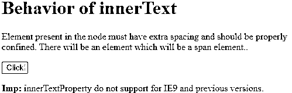
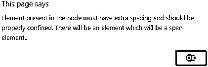
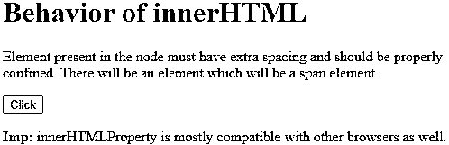
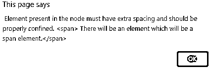
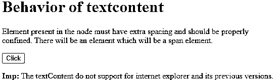
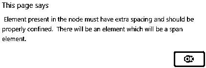
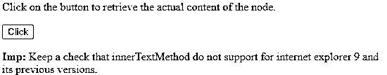
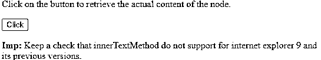

# JavaScript 内部文本

> 原文：<https://www.educba.com/javascript-innertext/>


## JavaScript innerText 简介

innerText 是 JavaScript 中最有用的属性之一，它使写在 HTML 文档上的整个文本都是动态的，但这并不意味着整个文本都被认为是动态的或定制的文本。这将是完全错误的解释，而是可以考虑，如果使用 JavaScript innerText 属性，那么它将创建一些具有普通和动态文本类型的网页，用于在消息、用户名或密码中编写和进行频繁验证，这进而得出该属性需要普通和动态文本类型的组合的事实。

### JavaScript innerText 属性是如何工作的？

顾名思义，JavaScript innerText 属性是 JavaScript 中的属性之一，它具有一个独特的功能，即设置文本，然后通过使用并使其所有后代或对象和成员拥有相同的行为，返回非常具体的文本内容，并指定给节点。让我们更清楚地说明一下，假设您设置了一个 innerText 属性，那么任何存在的子节点都将被删除，然后被替换为单个文本节点，我们在其中设置了包含字符串的节点和具有一些值的节点。innerText 属性的行为与 TextContent 有些类似，差别很小，比如 textContent 返回所有类型元素的文本内容，但是 innerText 只支持返回所有元素内容的 innerText，除了

<small>网页开发、编程语言、软件测试&其他</small>

*   **node.innerText** :用 innerHTML 属性返回待评估节点的内容。
*   **node.innerText=text** :设置包含文本内容的节点，该节点需要包含节点内容的输出。

在下一组例子中，比如 innerText 属性和 textContent 属性是如何区别工作的，这一点会变得更加清楚。

### 实现 JavaScript innerText 的示例

下面是提到的例子:

#### 示例#1

这个程序演示了 JavaScript 的 innerText 属性的行为，以及它与其他两个主要属性的不同之处，并与 TextContent 属性相关联，以使它具有动态性和唯一性，并与版本差异兼容。

**代码:**

```
<!DOCTYPE html>
<html>
<body>
<h1> Behavior of innerText</h1>
<p id="ex1"> Element present in the node must have extra spacing and should be properly confined.  There will be an element which will be a span element..</p>
<button onclick=" getInnerText()">Click</button>
<p><strong>Imp:</strong> innerTextProperty do not support for IE9 and previous versions. </p>
<p id="ex1"></p>
<script>
function getInnerText() {
alert(document.getElementById("ex1").innerText)
}
</script>
</body>
</html>
```

**输出:**




点击按钮后，输出如下所示:




#### 实施例 2

这个程序演示了 innerHTML JavaScript 的属性的行为，以及它与其他两个主要属性的不同之处，并与 innerText 和 textContent 属性相关联，以使它具有动态性和唯一性，并与版本差异兼容。

**代码:**

```
<!DOCTYPE html>
<html>
<body>
<h1> Behavior of innerHTML</h1>
<p id="ex2"> Element present in the node must have extra spacing and should be properly confined.  There will be an element which will be a span element.</p>
<button onclick=" getHTML()">Click</button>
<p><strong>Imp:</strong> innerHTMLProperty is mostly compatible with other browsers as well. </p>
<p id="ex2"></p>
<script>
function getHTML() {
alert(document.getElementById("ex2").innerHTML)
}
</script>
</body>
</html>
```

**输出:**




点击按钮后，输出如下所示:




#### 实施例 3

这个程序演示了 textContent JavaScript 的属性的行为，以及它与其他两个主要属性的不同之处，并与 innerText 和 innerHTML 属性相关联，以使它具有动态性和唯一性，并与版本差异兼容。

**代码:**

```
<!DOCTYPE html>
<html>
<body>
<h1> Behavior of textcontent</h1>
<p id="ex2"> Element present in the node must have extra spacing and should be properly confined.  There will be an element which will be a span element.</p>
<button onclick=" getTextContent()">Click</button>
<p><strong>Imp:</strong> The textContent do not support for internet explorer and its previous versions.</p>
<p id="ex2"></p>
<script>
function getTextContent() {
alert(document.getElementById("ex2").textContent)
}
</script>
</body>
</html>
```

**输出:**




点击按钮后，输出如下所示:




#### 实施例 4

这个程序演示了要从节点的实际内容中检索的实际内容。一旦单击了 click 按钮，它将显示所有需要打印的必要信息，以便节点获得进一步操作的值。

**代码:**

```
<!DOCTYPE html>
<html>
<body>
<p>Click on the button to retrieve the actual content of the node. </p>
<button onclick=" One_func()" id="aclickbtn">Click</button>
<p><strong>Imp:</strong> Keep a check that innerTextMethod do not support for internet explorer 9 and its previous versions. </p>
<p id="ex4"></p>
<script>
function One_func() {
var vr = document.getElementById("aclickbtn").innerText;
document.getElementById("ex4").innerHTML = vr;
}
</script>
</body>
</html>
```

**输出:**




点击按钮后，输出如下所示:




**Note:** One thing needs to be kept in mind that the functions related to the text and innerText or textContent or innerHTML everything needs to be version and browser compatible otherwise the visualization of the text retrieval may not come out to be proper.

### 优势

作为 JavaScript 的一部分，innerText 属性有许多相关的优点，如下所示:

*   它有助于获得隐藏的文本使用 innerHTML 属性，如密码，用户名相关的正常文本。
*   它还通过向浏览器提供 innerText 属性，为网页提供了独特的动态特性，从而有助于创建和增强网页。
*   它还可以处理普通文本的组合，这意味着如果文本被认为是动态的，这并不意味着它将只有动态文本，它将有两者的组合。
*   除了

### 结论

JavaScript 中的 innerText 类型属性主要用于在任何 html 文档上编写动态文本，它不仅会被解释为 HTML 文本，还会被解释为普通文本，这表明它将同时包含普通文本和 HTML 文本。最常见的是，它用于生成一些秘密的消息，以验证消息，用户名和密码。

### 推荐文章

这是 JavaScript innerText 的指南。这里我们讨论语法，它是如何工作的，以及实现 JavaScript innerText 的例子。您也可以浏览我们的其他相关文章，了解更多信息——

1.  [JavaScript 拆分字符串](https://www.educba.com/javascript-split-string/?source=leftnav)
2.  [JavaScript 数学函数](https://www.educba.com/javascript-math-functions/?source=leftnav)
3.  [JavaScript 中的递归函数](https://www.educba.com/recursive-function-in-javascript/?source=leftnav)
4.  [JavaScript 中的正则表达式](https://www.educba.com/regular-expressions-in-javascript/?source=leftnav)


