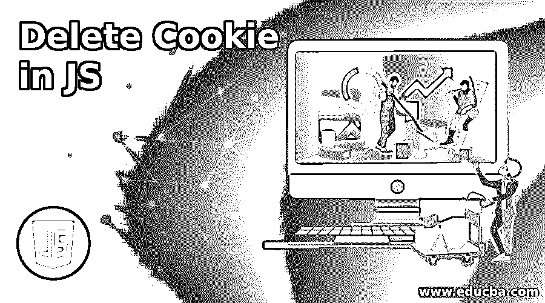
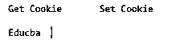
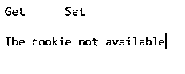
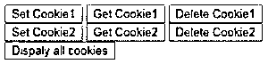

# 删除 JS 中的 Cookie

> 原文：<https://www.educba.com/delete-cookie-in-js/>




## JS 中删除 Cookie 的介绍

下面的文章提供了 JS(JavaScript)中删除 Cookie 的概要。Cookies 是在网页上存储用户信息的小文件。Cookies 基本上将当前和以前的用户会话信息存储在浏览器中，以便当用户下次打开浏览器时，上次登录的会话将被恢复。用户不必在浏览器中再次输入所有细节。我们可以使用 cookies 做多种事情。我们可以创建、读取、更改和删除 cookie。

### 如何使用 JavaScript 删除用户系统中的 Cookie？

*   使用过期属性。
*   使用最大年龄属性。
*   使用网络浏览器。
*   删除 cookie 会话。

#### 1.过期属性

它提供了创建删除 cookie 的参数的方法。它有助于创建一个持久的 cookie，你不必手动删除它，一旦时间到期，cookie 将被自动删除。

<small>网页开发、编程语言、软件测试&其他</small>

**举例:**

**代码:**

```
<!DOCTYPE html>
<html>
<head>
</head>
<body>
<input type="button" value="setCookie" onclick="setCookie()">
<input type="button" value="getCookie" onclick="getCookie()">
<script>
function setCookie()
{
document.cookie="username=Educba;expires=Sat, 20 Aug 2020 12:00:00 UTC";
}
function getCookie()
{
if(document.cookie.length!=0)
{
var array=document.cookie.split("=");
alert("Name="+array[0]+" "+"Value="+array[1]);
}
else
{
alert(" The Cookie not available");
}
}
</script>
</body>
</html>
```

**输出**:




#### 2.最大年龄属性

在 Max-age 属性中，cookie 过期或删除时间以秒为单位表示。一旦当前会话过期，cookie 将被自动删除。

**举例:**

**代码:**

```
<!DOCTYPE html>
<html lang="en">
<head>
<meta charset="UTF-8">
<title> JavaScript Delete max-age Cookie </title>
</head>
<body>
<input type="button" value="Set " onclick="set()">
<input type="button" value="Get" onclick="get()">
<script>
function set()
{
document.cookie="name=EDUCBA;max-age=0";
}
function get()
{
if(document.cookie.length!=0)
{
alert(document.cookie);
}
else
{
alert("The Cookie not avaliable");
}
}
</script>
</body>
</html>
```

**输出:**




#### 3.使用网络浏览器

这是删除 cookie 最简单的方法之一。您只需进入浏览器设置，在给出的删除 cookie 选项中删除 cookie。每个浏览器的设置各不相同。

**举例:**

**代码:**

```
<!DOCTYPE html>
<html>
<head>
</head>
<body>
<input type="button" value="Set Cookie1" onclick="setCooki1()">
<input type="button" value="Get Cookie1" onclick="getCooki1()">
<input type="button" value="Delete Cookie1" onclick="deleteCooki1()">
<br>
<input type="button" value="Set Cookie2" onclick="setCooki2()">
<input type="button" value="Get Cookie2" onclick="getCooki2()">
<input type="button" value="Delete Cookie2" onclick="deleteCooki2()">
<br>
<input type="button" value="Dispaly all cookies" onclick="displayCookies()">
<script>
function setCooki1()
{
document.cookie="name=Educba";
cooki1=  document.cookie;
}
function setCooki2()
{
document.cookie="name=Cba";
cooki2=  document.cookie;
}
function getCooki1()
{
if(cooki1.length!=0)
{
alert(cooki1);
}
else
{
alert("Cookie Unavailable");
}
}
function getCooki2()
{
if(cooki2.length!=0)
{
alert(cooki2);
}
else
{
alert("Cookie Unavailable");
}
}
function deleteCooki1()
{
document.cookie=cookie+";max-age=0";
cooki1=document.cookie;
alert("Cooki1 deleted sucessfully");
}
function deleteCooki2()
{
document.cookie=cooki2+";max-age=0";
cooki2=document.cookie;
alert("Cooki2 deleted sucessfully");
}
function displayCookie()
{
if(cooki1!=0&&cooki2!=0)
{
alert(cooki1+" "+cooki2);
}
else if(cooki1!=0)
{
alert(cooki1);
}
else if(cooki2!=0)
{
alert(cookie2);
}
else{
alert("Cookie Unavailable");
}
}
</script>
</body>
</html>
```

**输出**:




#### 4.删除 Cookie 会话

会话 cookie 是没有任何到期的普通 cookie，一旦浏览器关闭或会话终止，它将被删除。

**举例:**

**代码:**

```
Function() {
var cookiename = 'Cookie';
var options = { path: '/', expires: 12 };
$.cookie(cookiename, 'tests', option);
console.log( $.cookie(cookiename));
$.cookie(cookiename, null, options);
console.log( $.cookie( cookiename));
}
```

### 创建、设置和删除 Cookie 的概念

**代码:**

```
<script type="text/javascript">
<!
function getCookie(w){
Name = "";
hCOOKIES = new Array();
hCOOKIES = document.cookie.split('; ');
for(aa = 0; aa < hCOOKIES.length; a++){
NameValue  = new Array();
NameValue  = hCOOKIES[aa].split('=');
if(NameVal[0] == w){
dName = unescape(NameVal[1]);
}
}
return dName;
}
function printCookies(w){
dStr = "";
hCOOKIES = new Array();
hCOOKIES = document.cookie.split('; ');
for(aa = 0; aa < hCOOKIES.length; aa++){
NameVal  = new Array();
NameVal  = hCOOKIES[aa].split('=');
if(NameVal[0]){
dStr += NameVal[0] + '=' + unescape(NameVal[1]) + '; ';
}
}
return dStr;
}
function setCookie(cname, cvalue, cexpires, cpath, cdomain, csecure){
cookieStr = cname + "=" + escape(cvalue) + "; ";
if(cexpires){
cexpires = setExpiration(cexpires);
cookieStr += "cexpires=" + cexpires + "; ";
}
if(cpath){
cookieStr += "cpath=" + cpath + "; ";
}
if(cdomain){
cookieStr += "cdomain=" + cdomain + "; ";
}
if(csecure){
cookieStr += "csecure; ";
}
document.cookie = cookieStr;
}
function setExpiration(cookieLifes){
var today = new dDate();
var dexpr = new dDate(today.getTime() + cookieLife * 16 * 50 * 60 * 100);
return  expr.toGMTString();
}
// -->
</script>
```

### 调用 Cookie 函数的示例

**代码:**

```
<script type="text/javascript">
<!--
setCookie('hasVisited', 'Yes');
cookieValue = getCookie('hasVisited');
alert(cookieValue)
setCookie('VisitedToday', 'Yes', 3);
setCookie('VisitedSite', 'Yes', 3, '/');
setCookie('cookieName', 'cookieValue', 3, '/members');
setCookie('cookieName', 'cookieValue', 3, '/members', '', 1);
setCookie('cookieName', 'cookieValue', 3, '/', 'educba');
allCookies = printCookies();
document.write(allCookies);
alert(allCookies);
setCookie('cookieName', '', -1);
// -->
</script>
```

### 结论

使用 JavaScript 删除 cookie 有很多好处。这很简单，耗时少，并且可以自动化。各种方法可用于删除一个 cookie，我们已经在上面的文章中看到，其中每个主题都用例子解释。您可以通过设置过期属性、最大年龄属性、web 浏览器和会话过期来删除 cookie。如果您的系统中有更多的 cookies，那么它将占用更多的空间。这就是我们删除 cookies 并使用 JavaScript 的原因，这样做很容易。

### 推荐文章

这是一个在 JS 中删除 Cookie 的指南。在这里，我们讨论了如何使用 JavaScript 删除用户系统中的 cookie，以及调用 cookie 函数的示例。您也可以看看以下文章，了解更多信息–

1.  [JavaScript 风格可见性](https://www.educba.com/javascript-style-visibility/)
2.  [什么是 ExpressJS？](https://www.educba.com/what-is-expressjs/)
3.  [JavaScript 文件阅读器](https://www.educba.com/javascript-filereader/)
4.  [JavaScript 中的原始数据类型](https://www.educba.com/primitive-data-types-in-javascript/)


