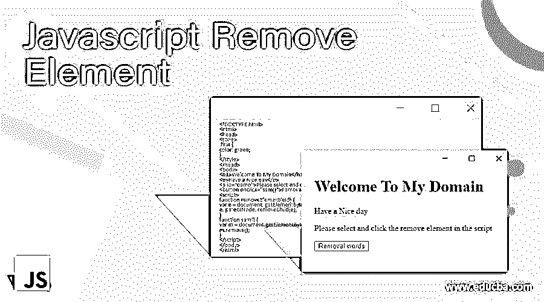
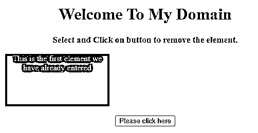
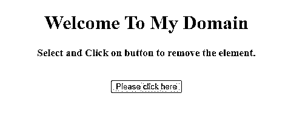
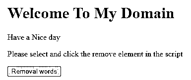
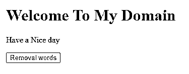

# Javascript 删除元素

> 原文：<https://www.educba.com/javascript-remove-element/>




## Javascript Remove 元素简介

在 javascript 中，移除元素是在脚本代码中移除元素的函数之一，使用元素 id 在父节点的帮助下，我们可以移除元素中的子元素。Javascript 元素有一组不同的特性和优点，可以方便地访问基于脚本的 web 应用程序。使用 DOM(文档对象模型)将支持直接删除脚本代码中的元素。移除元素将在脚本中以不同的方式进行，我们可以通过 DOM 移除元素，从集合中的数组中移除元素，如 map、list 等，基于我们可以移除它的需求。

**语法:**

<small>网页开发、编程语言、软件测试&其他</small>

remove 元素是 javascript 的一个特性，用于增加内存并删除脚本中不需要的元素或数据。

```
<html>
<body>
<script>
function functionname()
{
var variablename=document.getElementById("");
variablename.parentNode.removeChild(variablename);
**--**some javascript logics**---**
**}**
</script>
</body>
</html>
```

以上代码是删除脚本中的元素的基本语法，无论我们在 javascript 中指定的脚本中删除它，基于 dom 的模型需要 id 作为参考，使用 id 可以很容易地从脚本中删除它。

### Javascript Remove Element 是如何工作的？

移除元素是脚本中经常使用的功能之一，每当我们想要在脚本中添加元素时，它需要一些空间来将其存储在内存中，该空间具有创建的引用，使用它我们将识别哪些元素存储在特定的内存空间区域引用 id 是获取内存中的元素的重要因素之一。如果我们有一个类似继承概念的父子关系，父节点有一个引用，子节点有另一个引用，在基于 javascript dom 的模型获取中，使用名为 getElemetById()的方法，使用这些方法，我们可以将 Id 作为参数传递，然后我们可以根据需要添加新元素或删除元素，我们将在脚本中使用默认方法。

我们已经说过，有时我们使用的父子关系 removeChild()用于删除脚本中的特定子元素，基本上，基于 dom 的对象模型不支持删除元素。remove()方法有一些不同的类型集，如 removeAttribute()、removeAttributeNode()、removeChild()和 removeEventListener()等。这些是脚本将使用的一些默认方法，用于删除那些具有这些功能的特定元素。如果我们想删除特定元素的属性，我们使用 removeAttribute()这样的方法。使用 removeAttributeNode()函数我们将删除具有指定名称的对象的属性，有时这些类型的方法也在脚本代码中使用。

当返回到 removeChild()方法时，它会删除脚本中指定元素的指定子节点，如果脚本中不存在该节点元素，它会将删除的节点作为节点对象或空值返回。删除的子节点不再是 DOM 元素的时间部分。该方法返回的元素的引用还可以在以后的时间部分重新插入指定的删除的子元素，这是这类方法的主要优点之一。removeEventListener()方法将始终用于删除事件处理程序机制，类似于 addEventListener()方法的相反方法，并且该方法将并行地删除指定元素必须删除的时间段中的秒数部分。removeEventListener()方法在 IE 版本(如 8)以及早期版本中不受支持。remove 元素将主要用作 javascript 库框架，就像 jQuery 一样。当必须删除特定元素时，它只是用作 remove()方法。如果特定的子节点不属于它抛出的父节点，removeChild()方法将返回从 DOM 树中移除的子节点，但它总是保留在内存位置中，如果脚本中需要的话，以后还会用到它。

### 例子

让我们讨论 Javascript Remove 元素的例子。

#### 示例#1

**代码:**

```
<!DOCTYPE HTML>
<html>
<head>
<title>
First Remove Element in the script
</title>
<style>
#f {
background: red;
height: 102px;
width: 203px;
margin: 1 auto;
color: pink;
}
</style>
</head>
<body style = "text-align:center;">
<h1 style = "color:green;" >
Welcome To My Domain
</h1>
<p id = "u" style =
"font-size: 17px; font-weight: bold;">
</p>
<div id = "f">
This is the first element we have already entered
</div>
<br>
<button onClick = "sam()">
Please click here
</button>
<p id = "d" style =
"color: yellow; font-size: 25px; font-weight: bold;">
</p>
<script>
var a = document.getElementById('u');
var b = document.getElementById('d');
var c = document.getElementById('f');
a.innerHTML = "Select and Click on button to remove the element.";
function sam() {
c.parentNode.removeChild(c);
b.innerHTML = "Element has been removed successfully.";
}
</script>
</body>
</html>
```

**输出:**







#### 实施例 2

**代码:**

```
<!DOCTYPE html>
<html>
<head>
<style>
.first {
color: green;
}
</style>
</head>
<body>
<h1>Welcome To My Domain</h1>
<p>Have a Nice day</p>
<p id="demo">Please select and click the remove element in the script</p>
<button onclick="sam()">Removal words</button>
<script>
function removeElement(eId) {
var e = document. getElementById(eId);
e. parentNode. removeChild(e);
}
function sam() {
var m = document.getElementById("demo");
m.remove();
}
</script>
</body>
</html>
```

**输出:**







在上面的例子中，我们已经清楚地解释了具有不同场景的 remove()方法以及类似 removeChild()方法的移除方法类型。

### 结论

从这一点来看，在 javascript 中，它将支持所有类型的浏览器中的所有方法，如 add()、remove()、append()等，但有时像 Internet Explorer 8 和旧版本一样，这些默认方法不受支持，因此可能是用户环境在使用这些方法执行操作时遇到了一些问题。

### 推荐文章

这是一个 Javascript 移除元素的指南。这里我们讨论一下介绍，Javascript Remove Element 是如何工作的？并分别举例说明。您也可以看看以下文章，了解更多信息–

1.  [JavaScript 事件处理程序](https://www.educba.com/javascript-event-handler/)
2.  [JavaScript 延迟](https://www.educba.com/javascript-delay/)
3.  [JavaScript 浮动](https://www.educba.com/javascript-floating/)
4.  [JavaScript 倒计时](https://www.educba.com/javascript-countdown/)


