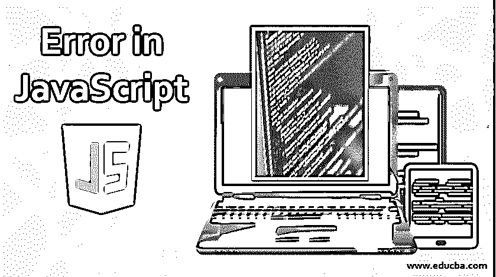
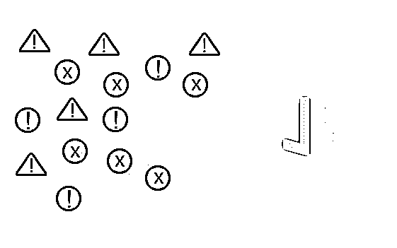
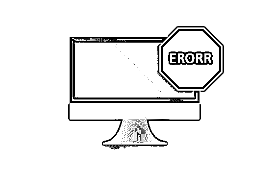
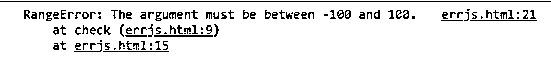
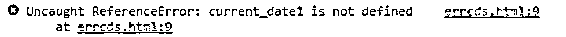
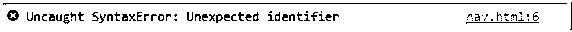

# JavaScript 中的错误

> 原文：<https://www.educba.com/errors-in-javascript/>




## JavaScript 中的错误介绍

让我们从“错误”在编程语言中的含义开始讨论，尤其是在 JavaScript 中。一个错误可以被定义为一个错误，或一个不正确的陈述，或曲解，或一个错误，但这个定义在开发一个程序时并不完全正确。在编程中，错误是一段或一部分代码，它破坏了程序的正常流程。在任何编程语言中，通常会遇到三种错误，

1.  编译时错误
2.  逻辑错误
3.  运行时错误。

当我们面对任何类型的错误时，我们经常会害怕，但错误是好的，因为我们知道如何不做某事，以及如何在下一次做得更好。

<small>网页开发、编程语言、软件测试&其他</small>

在 JavaScript 中，如果脚本抛出一个错误，[JavaScript 解释器将](https://www.educba.com/javascript-objects/)立即停止程序的执行，并在浏览器控制台中显示该错误以及该错误在文件中出现的行号。我们调试 JavaScript 的唯一方法是尽可能利用错误和警告，并找出其背后的原因。




### JavaScript 中的错误类型

一个错误对我们的应用程序来说可能是致命的，也可能不是致命的，这取决于我们所面临的错误的类型。JavaScript 中通常会出现六种类型的错误

*   评估错误
*   测距误差
*   参考误差
*   句法误差
*   类型错误
*   URI Error

让我们详细讨论每一个错误。




| **错误名称** | **描述** |
| **EvalError** | eval()函数中出现错误 |
| **范围误差** | 出现了“超出范围”的数字 |
| **参考错误** | 出现了非法引用 |
| **语法错误** | 出现了语法错误 |
| **类型错误** | 出现了类型错误 |
| **URIError** | encodeURI()中出现错误 |

**1。EvalError:** 表示全局 eval()函数中存在错误，即 eval()函数的使用方式不正确。新版本的 JavaScript 不再抛出这个错误，取而代之的是语法错误。

**2。RangeError:** 当参数或值(数值)超出或超出其允许范围时，会引发此错误。




**3。ReferenceError:** 当我们引用一个不存在的变量(使用了无效的引用)时，即该变量还没有声明时，就会抛出这个错误。这是最常见的错误之一。




**4。语法错误:**该错误表示脚本的语法无效，即代码中存在语法错误的语句。至于语法错误，像 JavaScript 这样的解释型语言在脚本加载到浏览器并被浏览器读取之前不会抛出这些错误。




**5。TypeError:** 当值不是预期的正确类型，或者使用了无效的数据类型来声明或定义变量时，会引发此错误。示例:对字符串变量或对象执行数值计算。


**6。** **URIError:** 此错误表明使用了在 URI 相关的方法/函数中无效的非法字符(encodeURI()或 decodeURI())。

### 处理 JavaScript 中的错误

当错误发生时，我们知道脚本停止执行，除非我们在脚本本身中处理这些错误，以便不中断正常的程序流。我们可以实现的处理这些错误的不同方法有:

```
try …. catch block
try {
// errorneous statement
} catch (err) {
console.error (err)
// stmts
}
```

#### 最后

在某些情况下，无论是否发生错误，都需要执行脚本的某些部分，并且该部分需要写入 finally 块中。

```
try {
// errorneous statement
} catch (err) {
console.error (err)
// stmts
} finally{
//mandatory statements to run
}
```

#### 承诺

承诺用于处理可能导致错误的异步操作。与回调和事件相比，它们可以管理多个异步操作，并提供更好的错误处理解决方案。

```
var promise = new Promise(
function(resolve, reject){
//do something
}
);
```

**举例:**

```
function captureErrorTypes() {
try {
var sum = x + y;
alert(sum);
} catch(error) {
switch (error.name) {
case 'SyntaxError':
alert("caught a " + error.name + ": " + error.message);
//handle error…
break;
case 'RangeError':
alert("caught a " + error.name + ": " + error.message);
//handle error…
break;
case 'ReferenceError':
alert("caught a " + error.name + ": " + error.message);
//handle error…
break;
default:
alert("caught a " + error.name + ": " + error.message);
//handle all other error types here…
break;
}
}
}
```

### 推荐文章

这是 JavaScript 中的错误指南。在这里，我们讨论 javascript 错误及其在任何编程语言中的含义，以及 javascript 中通常出现的类型。您也可以浏览我们推荐的其他文章，了解更多信息——

1.  [JavaScript 封装](https://www.educba.com/encapsulation-in-javascript/)
2.  [JavaScript 编译器](https://www.educba.com/javascript-compilers/)
3.  [Javascript 中的 While 循环](https://www.educba.com/while-loop-in-javascript/)
4.  [投掷 vs 投掷](https://www.educba.com/throw-vs-throws/)


