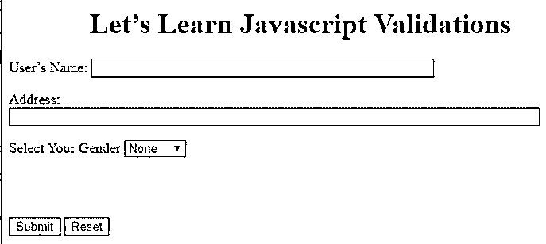
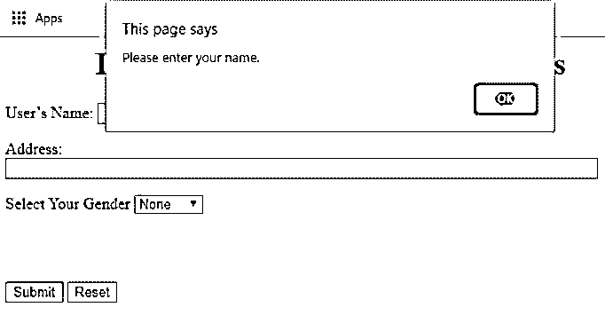
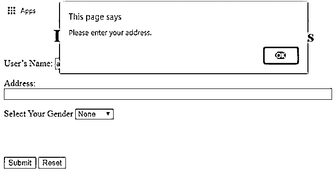
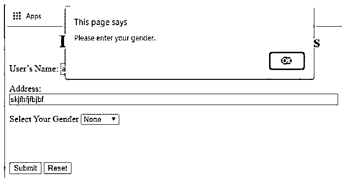
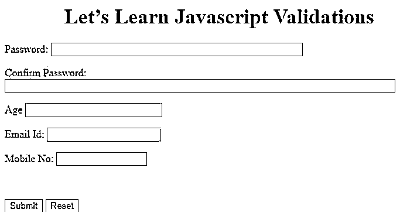
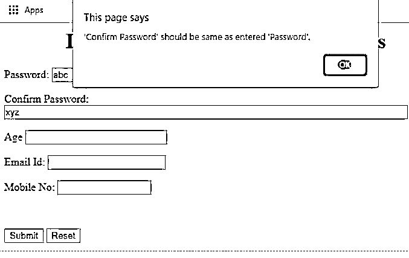
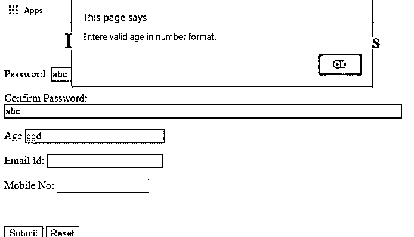
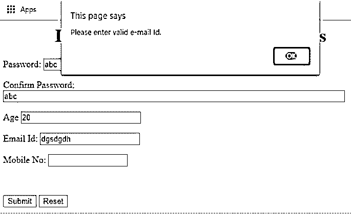
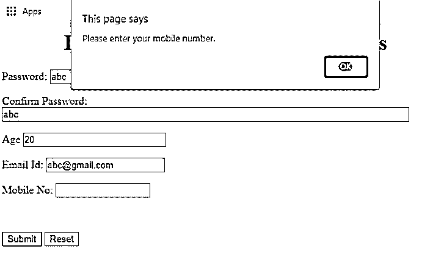

# JavaScript 验证程序

> 原文：<https://www.educba.com/javascript-validator/>


## JavaScript 验证器简介

下面的文章提供了 JavaScript 验证器的概要。在开发软件应用程序时，我们经常使用表单来接受用户输入并处理输入的数据。然而，有必要接受可以进一步处理的正确数据。为此，在开发软件时，验证是一个必要的注意事项。

大多数项目都是客户机-服务器格式的，在这种格式下，从客户端的用户那里接受数据，然后从那里发出一个包含接受的数据的请求，并发送给服务器。然后，服务器处理请求中接收到的数据，并发回响应以及需要在客户端检索和处理的必要信息。为了流畅而正确地继续这个请求-响应游戏，最重要的事情是作为输入发送到服务器的数据被正确地验证，以便服务器可以向客户端发送适当的响应。

<small>网页开发、编程语言、软件测试&其他</small>

### 什么是验证？

验证只不过是检查输入值的正确性并对其进行验证。可以通过两种方式进行验证，即服务器端验证和客户端验证。两者各有利弊。当您必须根据数据库中的可用数据来验证数据时，应该使用服务器端验证。

例如，在创建新帐户时，需要根据数据库中已有的用户名来验证输入的用户名。如果与输入的用户名匹配的用户名已经存在，应该要求用户重新输入另一个用户名。有一些验证，如强制输入指定的字段，或者输入的字段必须是数字格式，或者输入的日期字段应该是正确的格式。所有这些验证都不涉及数据库依赖性。如果使用服务器端验证，那么请求-响应周期会极大地影响我们的性能。因此，在这种情况下，应该使用客户端验证。

### 客户端的 JavaScript 验证

在基于 web 的环境中，JavaScript 可用于客户端验证。它可以确保发送到服务器的数据是干净、正确和格式良好的。JavaScript 的文档接口有一个名为 forms 的只读属性，它返回一个包含文档范围内所有表单的集合。

其访问方式如下:

```
Collection of forms in Dom = document.forms;
```

要访问特定表单的单个元素，即由 HTMLFormElement 对象表示的单个表单对象，我们可以使用 HTMLFormElement 的 elements 属性，如下所示:

```
HTMLFormElement.elements[index];
```

### 使用 Javascript 验证必填字段

**举例:**

**代码:**

```
<html>
<body>
<h1 style="text-align: center"> Let’s Learn Javascript Validations </h1>
<form name="UserForm"  onSubmit="return validateData()" method="post">
<p> User’s Name: <input type="text" size=50  name="userName"></p>
<p> Address: <input type="text" size=80 name="userAddr"></p>
<p>
Select Your Gender
<select type="text" value="" name="gender">
<option>None</option>
<option>Male</option>
<option>Female</option>
</select>
</p>
<br></br>
<p>
<input type="submit" value="Submit" name="Submit Form">
<input type="reset" value="Reset" name="Reset Form">
</p>
</form>
</body>
<script>
function validateData() {
let userForm=  document.forms["UserForm"];
let uname= userForm.elements["userName"];
let name = document.forms["UserForm"]["userName"];
let address = document.forms["UserForm"]["userAddr"];
let gender = document.forms["UserForm"]["gender"];
if (name.value == "")
{
window.alert("Please enter your name.");
name.focus();
return false;
}
if (address.value == "")
{
window.alert("Please enter your address.");
address.focus();
return false;
}
if (gender.selectedIndex< 1)
{
alert("Please enter your gender.");
gender .focus();
return false;
}
return true;
}
</script>
</html>
```

**输出:**













这里，用户表单变量是代表整个用户表单的 HTMLFormElement 对象。它的元素是通过。元素[索引]属性。所以我们可以得出结论，uname 和 name 是相同的字段。

因此，可以通过两种方式访问单个字段:

```
document.forms[index of form][index of element];
```

```
document.forms[index].elements[index];
```

运行程序后，如果您直接按提交按钮，它将验证第一个未输入的字段，即名称，因此将给出一个警告，提示您必须输入该字段，在您单击确定后，焦点将放在名称字段上，因为我们已经编写了 name . focus()；警报消息后。请注意，在脚本标记中编写验证代码的顺序很重要。首先显示的字段应该先验证，然后再验证。如果不这样做，功能不会受到影响，但焦点和检查的顺序应该总是从上到下导航每个字段。

### 使用 JavaScript 的其他验证

这里，除了检查字段是否为空，我们还可以使用 isNaN()检查其他验证，如输入的字段是否为数字，或者使用正则表达式检查特定格式，如电子邮件或手机号码[(有关正则表达式的更多信息，请参考 https://www . regular-expressions . info/)。](https://www.educba.com/regular-expression-in-ruby/)

**代码:**

```
<html>
<body>
<h1 style="text-align: center"> Let’s Learn JavascriptValidations </h1>
<form name="UserForm2" action="/submitData.php" onsubmit="return validateData()" method="post">
<p> Password: <input type="text" size=50 name="password"></p>
<p> Confirm Password: <input type="text" size=80 name="matchPassword"></p>
<p> Age <input type="text" size=25 name="age"></p>
<p> Email Id: <input type="text" size=20 name="emailId"></p>
<p> Mobile No: <input type="text" size=15 name="mobNo"></p><br>
<p><input type="submit" value="Submit" name="Submit Form">
<input type="reset" value="Reset" name="Reset Form">
</p>
</form>
</body>
<script>
function validateData()
{
var password = document.forms["UserForm2"]["password"];
varmatchPassword = document.forms["UserForm2"]["matchPassword"];
var age = document.forms["UserForm2"]["age"];
varemailId = document.forms["UserForm2"]["emailId"];
varmobNo = document.forms["UserForm2"]["mobNo"];
if (password.value=="" || matchPassword.value=="" || (password.value != matchPassword.value))
{
window.alert("'Confirm Password' should be same as entered 'Password'.");
matchPassword.focus();
return false;
}
if (age.value=="" || isNaN(age.value) ||  age.value<0 || age.value>150)
{
window.alert("Entere valid age in number format.");
age.focus();
return false;
}
varemailIdRegex =/^\w+([\.-]?\w+)*@\w+([\.-]?\w+)*(\.\w{2,3})+$/;
if (emailId .value=="" || !(emailIdRegex .test(emailId .value)))
{
window.alert("Please enter valid e-mail Id.");
emailId .focus();
return false;
}
varmobileNoRegex = /^\(?([0-9]{3})\)?[-. ]?([0-9]{3})[-. ]?([0-9]{4})$/;
if(mobNo.value=="" || !(mobNo.value.match(mobileNoRegex)))
{
window.alert("Please enter your mobile number.");
mobNo .focus();
return false;
}
return true;
}
</script>
</html>
```

**输出:**
















在上面的应用程序中，函数 NAN()用于检查输入的字符串是否不是数字(NaN)。test()和 match 函数用于检查测试或匹配时提到的正则表达式中的字段值是否可解析。通过这种方式，我们可以在客户端验证表单字段，避免占用带宽并提高应用程序的性能。使用 javaScript，我们可以验证多个字段，并根据我们的需求应用约束。

### 推荐文章

这是一个 JavaScript 验证器的指南。这里我们讨论一下入门，什么是验证？和客户端的 JavaScript 验证。您也可以看看以下文章，了解更多信息–

1.  [JavaScript 工具提示](https://www.educba.com/javascript-tooltip/)
2.  [Javascript 数组到字符串](https://www.educba.com/javascript-array-to-string/)
3.  [JavaScript 追加](https://www.educba.com/javascript-append/)
4.  [JavaScript 消息框](https://www.educba.com/javascript-message-box/)


