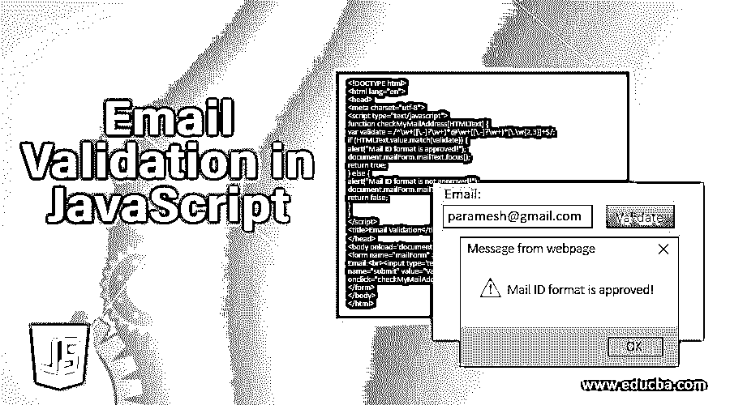
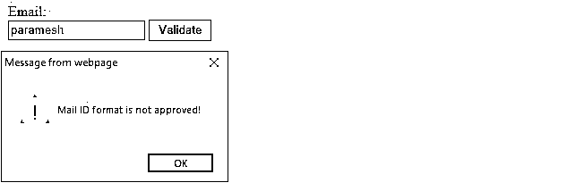
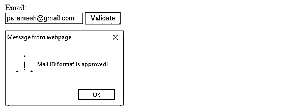
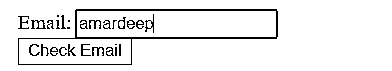
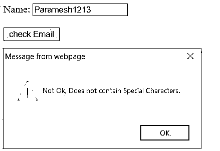
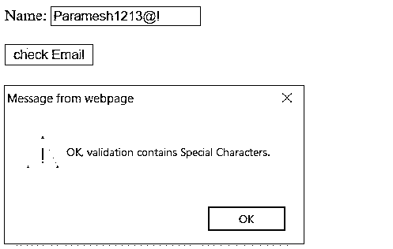
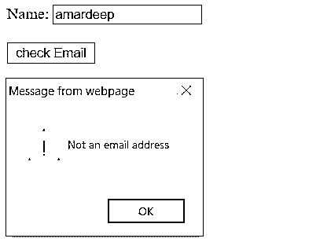
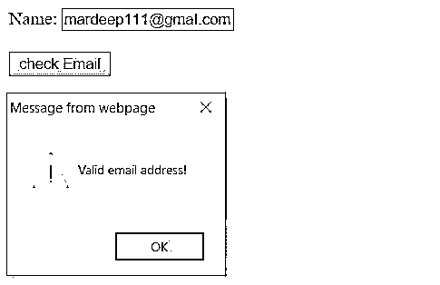

# JavaScript 中的电子邮件验证

> 原文：<https://www.educba.com/email-validation-in-javascript/>




## JavaScript 中的电子邮件验证简介

**电子邮件验证在 JavaScript 中定义为根据用户需求验证用户凭证。验证是在任何编程语言中对用户进行身份验证的过程。与其他编程语言一样。 [JavaScript 提供了](https://www.educba.com/features-of-javascript/)特性来验证客户端的页面元素。因此，不需要在服务器端进行两次交叉检查来再次验证，因此，该过程在服务器端会变得更快。**

 ******例如:****

<small>网页开发、编程语言、软件测试&其他</small>

一般来说，在电子邮件表单验证中，我们可以验证姓名、密码、电子邮件地址、手机号码等。客户端验证克服了客户端在提交页面之前不知道表单是否正确的问题。

### JavaScript 中的电子邮件验证是如何工作的？

**验证电子邮件地址非常重要，而[验证 HTML 表单页面](https://www.educba.com/html-form-validation/)。电子邮件是一个字符串或字符序列，它将被以符号(“@”)的速率分成两部分。**

 **根据用户要求，他/她可以检查:

*   电子邮件地址必须以任何字符开头。
*   电子邮件地址至少包含一个特殊字符。
*   电子邮件地址至少包含一位数字。
*   电子邮件地址包含至少 8 个字符长度等。

****语法:****

```
<input type="submit" name="emailValidation" value="validate" onclick="validateMyMail(document.form.text)"/>
<script>
function validateMyMail(HTMLInputText)
{
if(true condition)
{
//JavaScript mail validation logic for true condition
}
}
else //false condition
{
//JavaScript mail validation false condition statements
}
}
</script>
```

### JavaScript 中的电子邮件验证示例

以下是 JavaScript 中电子邮件验证的不同例子。

#### 示例#1

使用字符、数字、特殊字符、@和点号进行电子邮件验证。

****代号:****

```
<!DOCTYPE html>
<html lang="en">
<head>
<meta charset="utf-8">
<script type="text/javascript">
function checkMyMailAddress(HTMLText) {
var validate = /^\w+([\.-]?\w+)*@\w+([\.-]?\w+)*(\.\w{2,3})+$/;
if (HTMLText.value.match(validate)) {
alert("Mail ID format is approved!");
document.mailForm.mailText.focus();
return true;
} else {
alert("Mail ID format is not approved!");
document.mailForm.mailText.focus();
return false;
}
}
</script>
<title>Email Validation</title>
</head>
<body onload='document.mailForm.mailText.focus()'>
<form name="mailForm" action="#">
Email:<br><input type='text' name='mailText' /> <input type="submit"
name="submit" value="Validate"
onclick="checkMyMailAddress(document.mailForm.mailText)" />
</form>
</body>
</html>
```

**输出:**







****解释:****

验证= /^w+([.-]?w+) <u>*@w+([。-]?w+)*(。w{2，3})+$/</u> 正则表达式允许:

*   A-Z，a-z 字符
*   数字 0 到 9
*   人物喜欢！# $ % & ' * + – / = ?^ _ ` { | } ~
*   允许点号和句号

电子邮件包含所有上述指定的字符，然后只考虑有效的电子邮件。

#### 实施例 2

使用@和点号进行电子邮件验证。

**代码:**

```
<html>
<body>
<body>
<form name="form"  method="post" action="#" onsubmit="return getMyEmailValidation();">
Email: <input type="text" name="emailAddress"><br/>
<input type="submit" value="Check Email">
</form>
<script>
function getMyEmailValidation()
{
var emailValidation=document.form.emailAddress.value;
var indexWith@=emailValidation.indexOf("@");
var indexWithDot=emailValidation.lastIndexOf(".");
if (indexWith@<1 || indexWithDot<indexWith@+2 || indexWithDot+2>=emailValidation.length){
alert("Please make sure email address contains @ and .com");
return false;
}
}
</script>
</body>
</html>
```

**输出:**




请确保电子邮件地址包含@和。com

#### 实施例 3

使用字母、数字和特殊字符进行电子邮件验证。

****代号:****

```
<!DOCTYPE html>
<html lang="en">
<head>
<meta charset="utf-8">
<title>Email Validation</title>
<script type="text/javascript">
function emailContainAlphabetsSpecialChars() {
var emailValidationRegularExpression = /^[A-Za-z0-9 ]+$/
//Validate TextBox value against the Regex.
var validation = emailValidationRegularExpression.test(document.getElementById("email").value);
if (!validation) {
alert("OK, validation contains Special Characters.");
} else {
alert("Not Ok, Does not contain Special Characters.");
}
return validation;
}
</script>
</head>
<body>
Name:
<input type="text" id="email" />
<br />
<br />
<input type="button" value="check Email" onclick="emailContainAlphabetsSpecialChars()" />
</body>
</html>
```

**输出:**







**说明:**

*   在上述代码中，电子邮件包含特殊字符、数字和数字，则唯一的电子邮件有效并进一步移动。
*   电子邮件不包含特殊字符，然后弹出框显示“不正常，验证不包含特殊字符”。
*   电子邮件不包含特殊字符，然后弹出框显示“确定，验证包含特殊字符”。

#### 实施例 4

简单的电子邮件验证检查。

****代号:****

```
<!DOCTYPE html>
<html lang="en">
<head>
<meta charset="utf-8">
<title>Email Validation</title>
<script type="text/javascript">
function emailContainAlphabetsSpecialChars() {
var emailValidationRegularExpression = /\S+@\S+\.\S+/;
//Validate TextBox value against the Regex.
var validation = emailValidationRegularExpression.test(document.getElementById("email").value);
if (!validation) {
alert("Not an email address");
} else {
alert("Valid email address!");
}
return validation;
}
</script>
</head>
<body>
Name:
<input type="text" id="email" />
<br />
<br />
<input type="button" value="check Email" onclick="emailContainAlphabetsSpecialChars()" />
</body>
</html>
```

****输出:****







****解释:****

**/\S+@\S+\。\S+/正则表达式检查邮件是否包含:**

 ***   字母表
*   数字
*   特殊字符@
*   Gmail.com

如果所有上述指定的字符包含，然后弹出显示“有效的电子邮件地址”。如果上面指定的所有字符都不包含，则弹出窗口显示“无效的电子邮件地址”。

### 结论

JavaScript 中的电子邮件验证可以根据用户要求来完成，例如希望邮件中只允许数字和字符，然后采用数字、字符正则表达式，或者希望允许字符、数字、特殊字符、gmail.com 等，然后必须传递相应的正则表达式。

### 推荐文章

这是一个 JavaScript 的电子邮件验证指南。在这里，我们讨论了电子邮件验证的介绍以及如何在 JavaScript 中工作，并给出了示例和代码实现。您也可以看看以下文章，了解更多信息–

1.  [Javascript innerHTML](https://www.educba.com/javascript-innerhtml/)
2.  [Javascript 原型](https://www.educba.com/javascript-prototype/)
3.  [JavaScript 比较字符串](https://www.educba.com/javascript-compare-strings/)
4.  [在 PHP 中验证](https://www.educba.com/validation-in-php/)


******