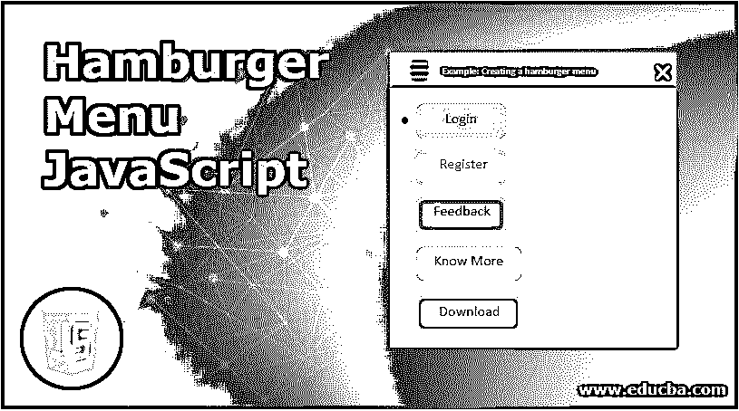
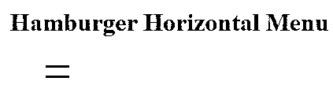
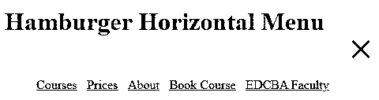
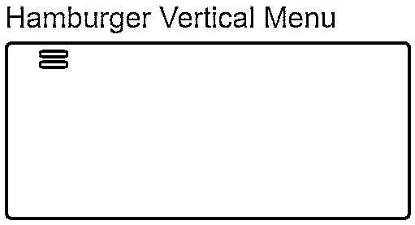
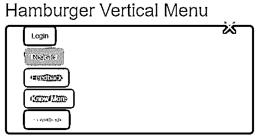

# 汉堡菜单 JavaScript

> 原文：<https://www.educba.com/hamburger-menu-javascript/>




## 汉堡菜单 JavaScript 简介

JavaScript 中的汉堡菜单被定义为导航栏或侧边栏上的链接或按钮或内容的列表，当我们单击导航栏右侧类似 triple equal 的按钮时，这些链接或按钮或内容可以被隐藏或同时显示。汉堡包菜单只是一个垂直或水平的导航条。它主要在小屏幕设备上更有用，因为移动屏幕无法拥有与个人电脑相同的空间。较小的设备没有显示导航栏，而是显示一个汉堡菜单，可以访问所有功能，如 PC。汉堡包菜单是 JavaScript 的一个高级特性，具有高度动画的外观和感觉。

**实时示例:**如果我们想显示主页、注册、登录、订单详情等主要内容。在手机、笔记本等小屏幕设备中。然后更喜欢汉堡菜单。

<small>网页开发、编程语言、软件测试&其他</small>

**优势:**

*   最适合所有类型的屏幕尺寸。

### 它在 JavaScript 中是如何工作的？

JavaScript 工作中的汉堡菜单基于 querySelector()、addEventListener()和 toggle()函数。

*   它通过从 HTML 代码中选择一个 div 类来创建一个导航栏，并通过从 HTML 代码中选择一个 div 类来切换导航栏。

**举例:**

```
<div class="navbar"> //class="navbar" used by querySelector() for creating navigation bar
<div class="navToggle"> //class="navToggle" taken inside the querySelector() as argument for displaying navigation bar toggle
</div>
</div>
```

*   **addEventListener():** 通过点击使导航栏显示或隐藏。
*   **toggle():** 激活激活或非激活的切换功能。

**语法:**

```
let navigataionBar = document.querySelector('navigation class from HTML code');
let navigationToggle = document.querySelector('navigation toggle class from HTML code');
navigationToggle.addEventListener('click', function (event)
{
navigataionBar.classList.toggle('active')
});
```

### 汉堡菜单 JavaScript 示例

汉堡菜单的不同例子如下:

#### 示例 1–带链接的汉堡水平菜单

**HTML 代码:HamburgerHorizontalMenu.html**

```
<!DOCTYPE html>
<html>
<head>
<title>Hamburger Menu in JavaScript</title>
<meta name="viewport" content="width=device-width, initial-scale=1">
<!-- adds jQuery libraries -->
<script
src="https://cdnjs.cloudflare.com/ajax/libs/jquery/2.1.3/jquery.min.js"></script>
<!-- adds ajax and bootstrap libraries -->
<script
src="https://cdnjs.cloudflare.com/ajax/libs/twitter-bootstrap/3.3.7/js/bootstrap.min.js"></script>
<!-- adds bootstrap libraries -->
<link rel="stylesheet"
href="https://cdnjs.cloudflare.com/ajax/libs/twitter-bootstrap/3.3.7/css/bootstrap.min.css">
<!-- CSS styles File-->
<link rel="stylesheet" href="HamburgerMenu.css">
<!-- JavaScript File -->
<script type="text/javascript" src="HamburgerMenu.js"></script>
</head>
<body>
<div class="navigationBar">
<h1>Hamburger Horizontal Menu</h1>
<nav>
<div class="navigation">
<ul class="navigationItems">
<li><a href="#">Courses</a></li>
<li><a href="#">Prices</a></li>
<li><a href="#">About</a></li>
<li><a href="#" >Book Course</a></li>
<li><a href="#" >EDCBA Faculty</a></li>
</ul>
<div class="navigationToggle"></div>
</div>
</nav>
</div>
</body>
</html>
```

**CSS 代码:HamburgerMenu.css**

```
h1
{
color:green;
}
body {
height: 100px;
padding: 0;
margin: 0;
overflow: hidden;
}
.navigation {
max-width: 500px;
border-radius: 8px;
background-color: white;
padding-right: 30px;
line-height: 3;
display: flex;
}
.navigationBar {
position: relative;
width: 100%;
height: 100%;
}
.navigationBar::before, .navigationBar::after {
width: 100%;
height: 50%;
background-color: #EAFBFF;
}
*, *::before, *::after {
box-sizing: border-box;
}
.navigationBar.active ul {
width: 420px;
margin-right: 20px;
}
.navigationToggle {
width: 40px;
height: 48px;
padding: 14px 5px;
cursor: pointer;
}
.navigationBar ul {
display: flex;
justify-content: space-between;
list-style: none;
width: 0;
overflow: hidden;
}
.navigationBar:not (.active ) .navigationToggle {
margin-left: -11px;
}
.navigationToggle::after {
margin-top: 10px;
}
.navigationBar.active .navigationToggle::before, .navigationBar.active .navigationToggle::after
{
position: absolute;
top: 52%;
transform: rotate(135deg);
}
.navigationToggle::before, .navigationToggle::after {
content: '';
position: relative;
display: block;
width: 30px;
height: 3px;
background-color: red;
}
.navigationBar.active .navigationToggle::after {
transform: rotate(-135deg);
margin-top: 0;
}
JavaScript Code: HamburgerMenu.js
let navWrapper = document.querySelector('.navigationBar'), navToogler = document
.querySelector('.navigationToggle')
navToogler.addEventListener('click', function(event) {
navWrapper.classList.toggle('active')
});
```

**输出:**







#### 示例 2–带按钮的汉堡垂直菜单

**HTML 代码:HamburgerVerticalMenu.html**

```
<!DOCTYPE html>
<html>
<head>
<title>Hamburger Menu in JavaScript</title>
<meta name="viewport" content="width=device-width, initial-scale=1">
<!-- adds jQuery libraries -->
<script
src="https://cdnjs.cloudflare.com/ajax/libs/jquery/2.1.3/jquery.min.js"></script>
<!-- adds ajax and bootstrap libraries -->
<script
src="https://cdnjs.cloudflare.com/ajax/libs/twitter-bootstrap/3.3.7/js/bootstrap.min.js"></script>
<!-- adds bootstrap libraries -->
<link rel="stylesheet"
href="https://cdnjs.cloudflare.com/ajax/libs/twitter-bootstrap/3.3.7/css/bootstrap.min.css">
<!-- CSS styles File-->
<link rel="stylesheet" href="HamburgerMenu.css">
<!-- JavaScript File -->
<script type="text/javascript" src="HamburgerMenu.js"></script>
</head>
<body>
<div class="navigationBar">
<h1 class="h">Hamburger Vertical Menu</h1>
<nav>
<div class="navigation">
<ul class="navigationItems">
<li><button href="#" class="btn btn-default">Login</button></li>
<li><button href="#" class="btn btn-primary">Register</button></li>
<li><button href="#" class="btn btn-success">Feedback</button></li>
<li><button href="#" class="btn btn-info">Know More</button></li>
<li><button href="#" class="btn btn-warning">Download</button></li>
</ul>
<div class="navigationToggle"></div>
</div>
</nav>
</div>
</body>
</html>
```

**CSS 代码:HamburgerMenu.css**

```
body {
height: 100px;
padding: 0;
margin: 0;
overflow: hidden;
}
.h
{
color:blue;
}
.navigation {
max-width: 500px;
border-radius: 8px;
background-color: brown;
padding-right: 30px;
line-height: 3;
display: flex;
}
.navigationBar {
position: relative;
width: 100%;
height: 100%;
}
.navigationBar::before, .navigationBar::after {
width: 100%;
height: 50%;
background-color: #EAFBFF;
}
*, *::before, *::after {
box-sizing: border-box;
}
.navigationBar.active ul {
width: 420px;
margin-right: 20px;
}
.navigationToggle {
width: 40px;
height: 48px;
padding: 14px 5px;
cursor: pointer;
}
.navigationBar ul {
justify-content: space-between;
list-style: none;
width: 0;
overflow: hidden;
}
.navigationBar:not (.active ) .navigationToggle {
margin-left: -11px
}
.navigationToggle::after {
margin-top: 10px;
}
.navigationBar.active .navigationToggle::before, .navigationBar.active .navigationToggle::after
{
position: absolute;
top: 52%;
transform: rotate(135deg);
}
.navigationToggle::before, .navigationToggle::after {
content: '';
position: relative;
display: block;
width: 30px;
height: 3px;
background-color: yellow;
}
.navigationBar.active .navigationToggle::after {
transform: rotate(-135deg);
margin-top: 0;
}
```

**JavaScript 代码:HamburgerMenu.js**

```
let navWrapper = document.querySelector('.navigationBar'), navToogler = document
.querySelector('.navigationToggle')
navToogler.addEventListener('click', function(event) {
navWrapper.classList.toggle('active')
});
```

**输出:**







#### 示例 3–带标志的汉堡菜单

**HTML 代码:HamburgerMenuLogo.html**

```
<!DOCTYPE html>
<html lang="en">
<head>
<meta charset="UTF-8">
<meta name="viewport" content="width=device-width, initial-scale=1">
<!-- adds jQuery libraries -->
<script
src="https://cdnjs.cloudflare.com/ajax/libs/jquery/2.1.3/jquery.min.js"></script>
<!-- adds ajax and bootstrap libraries -->
<script
src="https://cdnjs.cloudflare.com/ajax/libs/twitter-bootstrap/3.3.7/js/bootstrap.min.js"></script>
<!-- adds bootstrap libraries -->
<link rel="stylesheet"
href="https://cdnjs.cloudflare.com/ajax/libs/twitter-bootstrap/3.3.7/css/bootstrap.min.css">
<!-- CSS style file -->
<link rel="stylesheet" href="HamburgerMenu.css">
<title>Hamburger Menu in JavaScript</title>
</head>
<body>
<div class="container">
<div class="divClass">
<div class="logoImage">
<a href="#"></a>
</div>
<div class="navigationBar">
<div class="navigationItems">
<!-- code for triple equals structure -->
<div class="line firstLine"></div>
<div class="line secondLine"></div>
<div class="line thirdLine"></div>
</div>
<nav class="mainNavigation">
<ul class="navigationList"><!-- class="nav-link" default size for links -->
<li><a href="#" class="nav-link">Home</a></li>
<li><a href="#" class="nav-link">About Us</a></li>
<li><a href="#" class="nav-link">Services</a></li>
<li><a href="#" class="nav-link">Contact</a></li>
</ul>
</nav>
</div>
</div>
</div>
<!-- JavaScript file -->
<script src="HamburgerMenu.js"></script>
</body>
</html>
```

**CSS 代码:HamburgerMenu.css**

```
.divClass {
width: 100%;
height: 100px;
}
.navigationItems {
width: 45px;
height: 35px;
position: fixed;
top: 40px;
right: 50px;
display: flex;
flex-direction: column;
justify-content: space-between;
cursor: pointer;
z-index: 100;
}
.logoImage {
height: 80px;
width: 80px;
position: fixed;
top: 20px;
left: 50px;
z-index: 100;
}
.logoImage img {
width: 100%;
}
.line {
width: inherit;
height: 5px;
background-color: #16c3cf;
border-radius: 25px;
transform-origin: right;
transition: transform .5s;
}
.secondLine {
height: 3px;
}
.change .secondLine {
transform: translate(5px, 20px);
}
.change .thirdLine {
transform: rotateZ(45deg);
}
.change .firstLine {
transform: rotateZ(-45deg);
}
.mainNavigation {
height: 15vh;
width: 100%;
background: green;
position: fixed;
top: -15vh;
z-index: 50;
transition: top .4s;
}
.change .mainNavigation {
top: 0;
}
.nav-link::after {
content: attr(data-text);
position: absolute;
left: 0;
bottom: -100%;
background-color: #000;
padding: inherit;
color: #16c3cf;
transform: rotateX(-90deg);
transform-origin: top;
}
.nav-link {
text-decoration: none;
font-size: 20px;
text-transform: uppercase;
color: #ccc;
background-color: brown;
letter-spacing: 1px;
padding: 5px 10px;
display: block;
position: relative;
}
.navigationList {
list-style: none;
width: 80%;
margin: auto;
height: inherit;
display: flex;
justify-content: space-evenly;
align-items: center;
}
.nav-link:hover {
transform: rotateX(90deg);
}
```

**JavaScript 代码:HamburgerMenu.js**

```
document.querySelector('.navigationItems').addEventListener('click', () => {
document.querySelector('.navigationBar').classList.toggle('change');
});
```

**输出:**


### 结论

汉堡菜单用于显示内容，方法是点击三重等于图标，并通过左侧的错误符号隐藏内容。它适用于所有类型的屏幕尺寸。

### 推荐文章

这是一个汉堡菜单 JavaScript 的指南。在这里我们讨论介绍，例子和它是如何在 JavaScript 中工作的？您也可以看看以下文章，了解更多信息–

1.  [JavaScript 迭代数组](https://www.educba.com/javascript-iterate-array/)
2.  [在 JavaScript 中反转字符串](https://www.educba.com/reverse-string-in-javascript/)
3.  [JavaScript 提示](https://www.educba.com/javascript-prompt/)
4.  [JavaScript 中的 trim()函数](https://www.educba.com/trim-function-in-javascript/)


