# JavaScript 调试器

> 原文：<https://www.educba.com/javascript-debugger/>

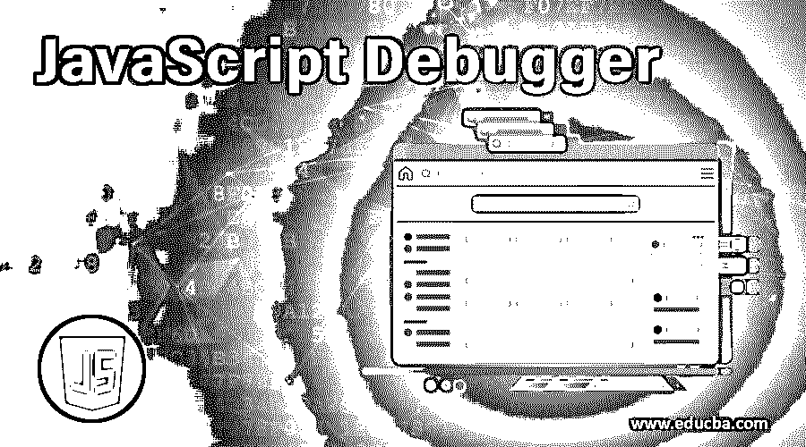


## JavaScript 调试器简介

Javascript 调试器用于找出程序中的编码错误。当我们编写一些新的编程代码时，可能会遇到一些错误。这些错误可能是语法错误，也可能是逻辑错误。总是很难找出错误在哪里，因为如果我有一万行代码，手动分析错误发生在哪里容易吗？没有权利。在这种情况下，我们在任何编程语言中都有一个叫做调试的特性。

### JavaScript 中调试器是如何工作的？

在 JavaScript 中，调试可以通过两种方式实现:

<small>网页开发、编程语言、软件测试&其他</small>

#### **1。通过使用调试器关键字**

 ***   这个 debugger 关键字用于 Chrome、Firefox、Internet Explorer 等浏览器中。
*   无论我们预测哪里会出现错误，都会有一个调试器。
*   执行代码时，编译器会在调试器中暂停执行，而不是执行整个代码。
*   有了这个，我们就可以一步一步地分析错误到底发生在哪里。

**Note:** To open a console in browsers like Chrome, Firefox, Internet Explorer, etc. press F12 or right-click on the page and click on inspect menu item then go to the console tab.

****控制台标签:****

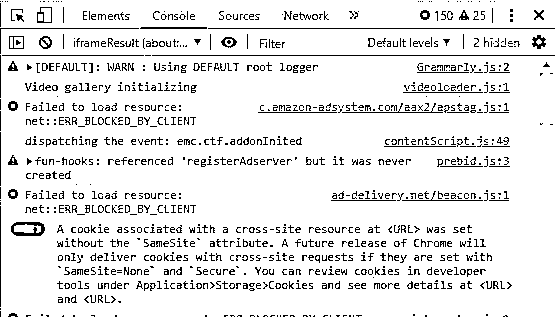


**语法:**

```
var a=10;
debugger;
for(let i=0;i<=10;i++)
{
//code
}
```

****调试器模式如下图:****

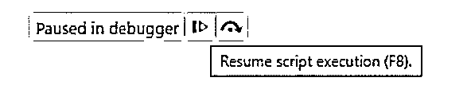


当我们在代码中使用 debugger 关键字时，如果我们按下 F12 按钮并运行代码，我们将得到如上所述的调试器模式。第一个蓝色按钮用于恢复(脱离调试)代码。

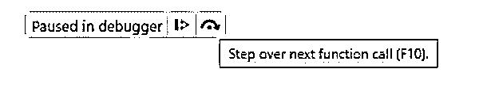


**第二个黑色按钮用于一步一步移动执行的代码行。**

 **#### **2。通过使用断点**

 ***   这些断点在 IDE 中使用，而不是使用 debugger 关键字。
*   我们预测错误发生的地方就有断点。
*   执行代码时，编译器会在调试器中暂停执行，而不是执行整个代码。
*   有了这个，我们就可以一步一步地分析错误到底发生在哪里。

****在 Eclipse IDE 中断点看起来像下面:****

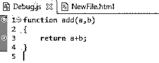


**你可以看到第 1 行和第 3 行有带圆圈 ****的断点。******

 **### JavaScript 调试器示例

这个主题是关于调试器的，所以我们将研究带有调试器关键字的示例:

#### 示例# 1–带有调试器关键字的回文

****代号:****

```
<!DOCTYPE html>
<html>
<body>
<font color="blue"><h1 align="center">Palindrome with Debugger</h1></font>
<script>
function palindromeOrNot()
{
var remainder,total=0,actualNumber;
var input=77877;
actualNumber=input;
while(input>0)
{
debugger;
remainder=input%10;
total=(total*10)+remainder;
input=parseInt(input/10);
}
if(actualNumber===total){
document.write(actualNumber+": is palindrome number ");
}
else   {
document.write(actualNumber+": is not palindrome");
}
}
palindromeOrNot();
</script>
</body>
</html>
```

****调试器输出暂停:****

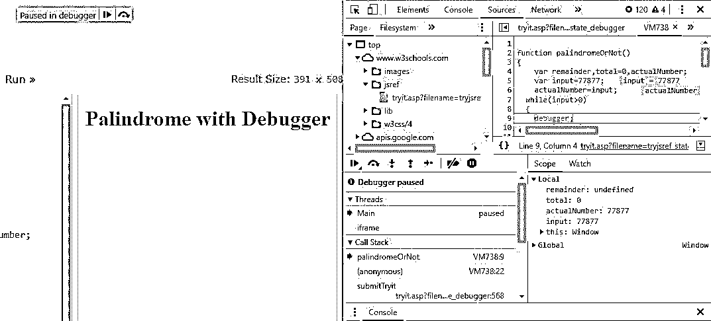


****最终输出:****

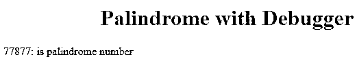


****解释:****

*   当我们按下 F12 并运行代码时，代码将如上所述进入调试器模式。
*   一旦我们点击下一个函数调用或 F10，然后代码从调试器移动到下一行，继续按，直到我们找出任何错误。
*   如果没有遇到错误，代码会自动退出调试模式并打印输出。

#### **示例# 2–使用调试器关键字的因素**

 ****代码:**

```
<!DOCTYPE html>
<html>
<body>
<font color="blue"><h1 align="center">Factors with Debugger</h1></font>
<script>
function factors()
{
var input=arguments[0],j=1;
document.write("factors of : "+input+" are ");
document.write("<br>");
while(j<=input)
{
debugger;
if(input%j==0){
debugger;
document.write(j);
document.write("<br>");
}
j++;//post increment operator
}
}
factors(10);
</script>
</body>
</html>
```

****调试器输出暂停:****

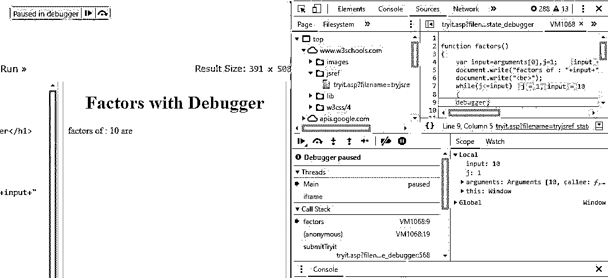


****最终输出:****

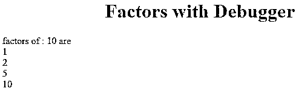


****解释:****

*   当我们按下 F12 并运行代码时，代码将如上所述进入调试器模式。
*   正如你在上面的代码中看到的，我们可以在一个程序中使用多个调试器关键字。
*   一旦我们点击下一个函数调用或 F10，然后代码从调试器移动到下一行，继续按，直到我们找出任何错误。
*   如果没有遇到错误，代码会自动退出调试模式并打印输出。

#### **示例 3–使用调试器关键字 Try、Catch 和 Finally**

 ****代码:**

```
<!DOCTYPE html>
<html>
<body>
<font color="green">
<h1 align="center">TRY CATCH FINALLY WITH DEBUGGER</h1>
</font>
<script>
function doTryCatchFinally()
{
try
{
debugger;
var p=Date.parsing("January 1,2020");
}
catch(error)
{
document.write(error+"<br>");
}
finally
{
document.write("I can kill or close connection even any errors thrown in the code");
}
}
doTryCatchFinally();
</script>
</body>
</html>
```

****调试器输出暂停:****

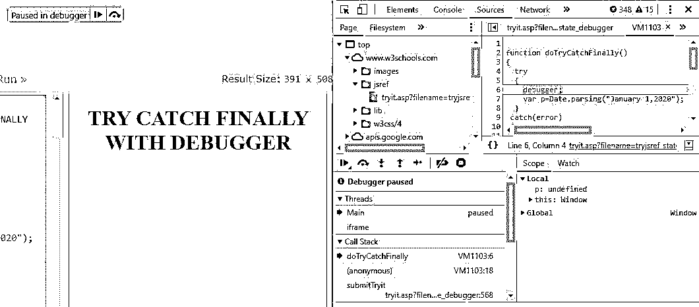


****最终输出:****

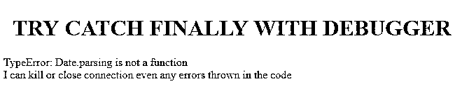


****解释:****

*   当我们按下 F12 并运行代码时，代码将如上所述进入调试器模式。
*   一旦我们点击下一个函数调用或 F10，然后代码从调试器移动到下一行，继续按，直到我们找出任何错误。
*   这里我们遇到一个错误，就是没有预定义的方法名解析()。

#### **示例# 4–带调试器关键字的完全数**

 ******代号:****

```
<!DOCTYPE html>
<html>
<body>
<font color="blue">
<h1 align="center">Perfect number with Debugger</h1>
</font>
<script>
function perfectNumber(input=28)
{
var i=1,sum=0;
while(input>i)
{
debugger;
if(input%i==0){
sum=sum+i;
}
i++;
}
if(sum==input)
{
document.write(input+" is perfect number");
}
else
{
document.write(input+" is not perfect number");
}
}
perfectNumber();
</script>
</body>
</html>
```

****调试器输出暂停:****

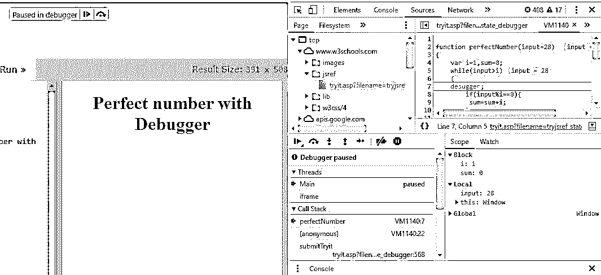


****最终输出:****

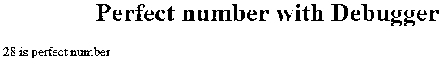


****解释:****

*   当我们按下 F12 并运行代码时，代码将如上所述进入调试器模式。
*   一旦我们点击单步执行下一个函数调用或 F10，代码就会从调试器移到下一行，继续按，直到我们找出任何错误。
*   如果没有遇到错误，那么代码会自动退出调试模式并打印输出。

### 推荐文章

这是一个 JavaScript 调试器指南。在这里，我们讨论了 javascript 中的介绍和调试器如何工作，以及示例和代码实现。您也可以阅读以下文章，了解更多信息——

1.  [JavaScript 箭头函数](https://www.educba.com/javascript-arrow-function/)
2.  [JavaScript 弹出框](https://www.educba.com/javascript-popup-box/)
3.  [Javascript void](https://www.educba.com/javascript-void/)
4.  [JavaScript 尝试捕捉](https://www.educba.com/javascript-try-catch/)


**************