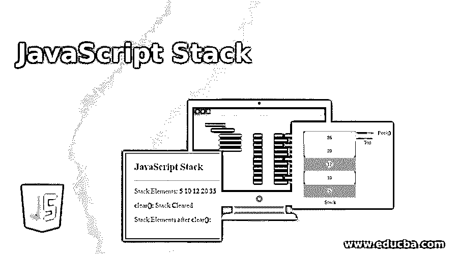
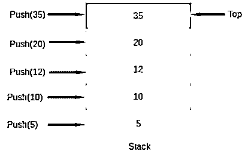
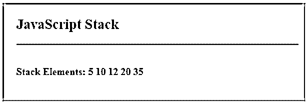
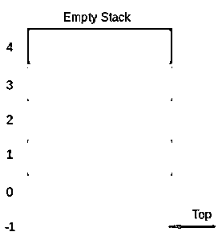
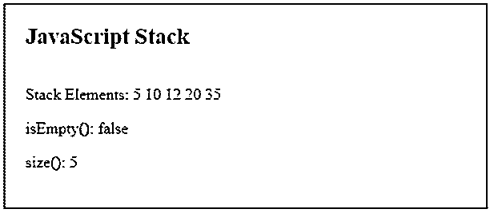
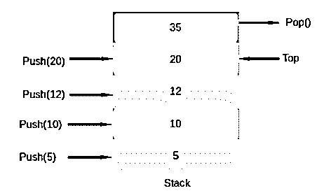
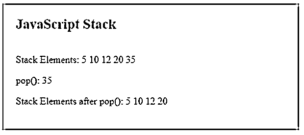
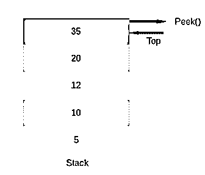
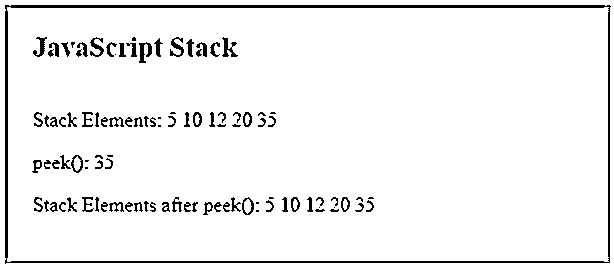
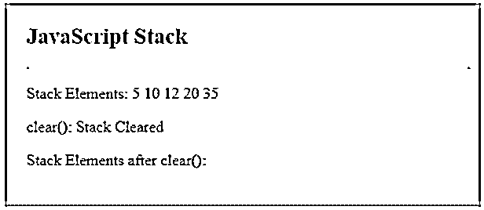

# JavaScript 堆栈

> 原文：<https://www.educba.com/javascript-stack/>




## JavaScript 堆栈的定义

JavaScript 堆栈可以通过使用其中可用的数组数据结构轻松实现。堆栈是一种基本的数据结构，它允许我们以后进先出(LIFO)或先入后出(FILO)的顺序存储和检索数据。这意味着首先插入到堆栈中的数据可以最后被移除，或者最后插入的数据可以首先被移除。对栈的数据访问只能从栈的一端进行。JavaScript stack 有两个主要方法，一个是将元素插入堆栈，另一个是从堆栈中移除元素。

### 实现 Javascript 堆栈的方法

让我们在下面的例子中用 JavaScript 一个一个地实现堆栈操作方法。

<small>网页开发、编程语言、软件测试&其他</small>

#### 1.推

这个方法会将元素插入堆栈。该元素将被插入到堆栈的顶部。如图所示，堆栈从它的一侧开始增长。顶部代表堆栈当前指向的值。每进行一次推送操作，top 都会加 1。顶部也称为堆栈指针。当堆栈为空时，即其中没有元素时，在我们的情况下，顶部将指向-1。




**代码:**

```
<!DOCTYPE html>
<html>
<head>
<meta charset = "UTF-8">
<title>
JavaScript Stack
</title>
<style>
.body-data {
border : #81D4FA 2px solid;
background-color : #03a9f400;
text-align : left;
padding-left : 20px;
padding-bottom: 20px;
height : auto;
width : auto;
}
.resultText {
margin: 0 0 3px 0;
padding: 0px;
display: block;font-weight: bold;
}
.heading {
font-weight: bold;
border-bottom: 2px solid #ddd;
font-size: 15px;
width: 98%;
}
</style>
</head>
<body>
<div class = "body-data" >
<div class = "heading" >
<h2> JavaScript Stack </h2>
</div>
<div class = "resultText" >
</br>
<p id = "result1" > Stack Elements: </p>
</div>
</div>
<script type = "text/javascript">
class Stack {
constructor () {
this.stack = [];
this.top = -1;
}
push (value) {
this.top++;
console.log( "Inserting Element: " + value );
this.stack[ this.top ] = value;
}
printElements(id) {
let elements = "";
for(vari=0;i<=this.top;i++){
elements += this.stack[i] + " ";
}
document.getElementById(id).innerHTML += elements;
}
}
let myStack = new Stack();
myStack.push( 5 );
myStack.push( 10 );
myStack.push( 12);myStack.push( 20 );
myStack.push( 35 );
myStack.printElements("result1");
</script>
</body>
</html>
```

这里，我们声明了一个实现堆栈的 on 类。类中定义了两个主要变量，stack 是存储数据的数组，top 是维护最后插入到堆栈中的元素的位置。实现一种方法来推送元素，实现另一种方法来显示堆栈元素。

**输出:**推送操作后。




#### 2.isEmpty()

该方法将检查堆栈是否为空，并将返回 true 或 false。当堆栈不包含任何元素时，顶部将指向-1，即不包含任何元素。要检查堆栈是否为空，我们可以使用这个指针。每当栈顶不指向任何地方或者指向-1，我们就可以说栈是空的。我们将以同样的方式实现这个方法。




**代码:**

```
<!DOCTYPE html>
<html>
<head>
<meta charset = "UTF-8">
<title>
JavaScript Stack
</title>
<style>
.body-data {
border : #81D4FA 2px solid;
background-color : #03a9f400;
text-align : left;
padding-left : 20px;
padding-bottom: 20px;
height : auto;
width : auto;
}
.heading {
font-weight: bold;
border-bottom: 2px solid #ddd;
font-size: 15px;
width: 98%;
}
</style>
</head>
<body>
<div class = "body-data" >
<div class = "heading" >
<h2> JavaScript Stack </h2>
</div>
<p id = "result1" > Stack Elements: </p>
<p id = "result2" >isEmpty(): </p>
</div>
<script type = "text/javascript">
class Stack {
constructor () {
this.stack = [];
this.top = -1;
}
push (value) {
this.top++;
console.log( "Inserting Element: " + value );
this.stack[ this.top ] = value;
}
printElements(id) {
let elements = "";
for(vari=0;i<=this.top;i++){
elements += this.stack[i] + " ";
}
console.log( elements );
document.getElementById(id).innerHTML += elements;
}
isEmpty(){
return this.top === -1;
}
}
let myStack = new Stack();
myStack.push( 5 );
myStack.push( 10 );
myStack.push( 12);
myStack.push( 20 );
myStack.push( 35 );
myStack.printElements("result1");
document.getElementById("result2").innerHTML += myStack.isEmpty();
</script>
</body>
</html>
```

**输出:**


#### 3.大小

该方法将返回堆栈的大小，即堆栈中有多少元素。由于 Top 变量保存了存储最后一个元素的索引，我们可以使用这个指针来找出堆栈的大小。因为数组的索引是从 0 开始的，所以我们可以在顶部加 1，找出堆栈的大小。

**代码:**

```
<!DOCTYPE html>
<html>
<head>
<meta charset = "UTF-8">
<title>
JavaScript Stack
</title>
<style>
.body-data {
border : #81D4FA 2px solid;
background-color : #03a9f400;
text-align : left;
padding-left : 20px;
padding-bottom: 20px;
height : auto;
width : auto;
}
.heading {
font-weight: bold;
border-bottom: 2px solid #ddd;
font-size: 15px;
width: 98%;
}
</style>
</head>
<body>
<div class = "body-data" >
<div class = "heading" >
<h2> JavaScript Stack </h2>
</div>
<p id = "result1" > Stack Elements: </p>
<p id = "result2" >isEmpty(): </p>
<p id = "result3" >size(): </p>
</div>
<script type = "text/javascript">
class Stack {
constructor () {
this.stack = [];
this.top = -1;
}
push (value) {
this.top++;
console.log( "Inserting Element: " + value );
this.stack[ this.top ] = value;
}
printElements(id) {
let elements = "";
for(vari=0;i<=this.top;i++){
elements += this.stack[i] + " ";
}
console.log( elements );
document.getElementById(id).innerHTML += elements;
}
isEmpty(){
return this.top === -1;
}
size() {
return this.top + 1;
}
}
let myStack = new Stack();
myStack.push( 5 );
myStack.push( 10 );
myStack.push( 12);
myStack.push( 20 );
myStack.push( 35 );
myStack.printElements("result1");
document.getElementById("result2").innerHTML += myStack.isEmpty();
document.getElementById("result3").innerHTML += myStack.size();
</script>
</body>
</html>
```

**输出:**




#### 4.流行音乐

此方法将从堆栈中移除元素。移除的元素将是堆栈中的顶部元素。由于顶部指向最后一个元素，pop()操作将删除该位置的元素。Top 将递减 1，并指向前一个元素下面的元素。




**代码:**

```
<!DOCTYPE html>
<html>
<head>
<meta charset = "UTF-8">
<title>
JavaScript Stack
</title>
<style>
.body-data {
border : #81D4FA 2px solid;
background-color : #03a9f400;
text-align : left;
padding-left : 20px;
padding-bottom: 20px;
height : auto;
width : auto;
}
.heading {
font-weight: bold;
border-bottom: 2px solid #ddd;
font-size: 15px;
width: 98%;
}
</style>
</head>
<body>
<div class = "body-data" >
<div class = "heading" >
<h2> JavaScript Stack </h2>
</div>
<p id = "result1" > Stack Elements: </p>
<p id = "result2" >pop(): </p>
<p id = "result3" > Stack Elements after pop(): </p>
</div>
<script type = "text/javascript">
class Stack {
constructor () {
this.stack = [];
this.top = -1;
}
push (value) {
this.top++;
console.log( "Inserting Element: " + value );
this.stack[ this.top ] = value;
}
printElements(id) {
let elements = "";
for(vari=0;i<=this.top;i++){
elements += this.stack[i] + " ";
}
console.log( elements );
document.getElementById(id).innerHTML += elements;
}
isEmpty(){
return this.top === -1;
}
size() {
return this.top + 1;
}
pop() {
if(this.isEmpty()){
return "Stack is Empty";
} else {
varval = this.stack[this.top];
this.top --;
return val;
}
}
}
let myStack = new Stack();
myStack.push( 5 );
myStack.push( 10 );
myStack.push( 12);
myStack.push( 20 );
myStack.push( 35 );
myStack.printElements("result1");
document.getElementById("result2").innerHTML += myStack.pop();
myStack.printElements("result3");
</script>
</body>
</html>
```

**输出:**




#### 5.偷看

该方法将返回堆栈顶部的元素。此方法不会移除元素。此操作不同于 pop 操作，因为 pop 操作会删除顶部元素，而 peek 操作只会返回顶部元素，不会删除它或减少指针。当我们只想检查最后插入的元素而不想删除它时，这个方法很有用。




**代码:**

```
<!DOCTYPE html>
<html>
<head>
<meta charset = "UTF-8">
<title>
JavaScript Stack
</title>
<style>
.body-data {
border : #81D4FA 2px solid;
background-color : #03a9f400;
text-align : left;
padding-left : 20px;
padding-bottom: 20px;
height : auto;
width : auto;
}
.heading {
font-weight: bold;
border-bottom: 2px solid #ddd;
font-size: 15px;
width: 98%;
}
</style>
</head>
<body>
<div class = "body-data" >
<div class = "heading" >
<h2> JavaScript Stack </h2>
</div>
<p id = "result1" > Stack Elements: </p>
<p id = "result2" >peek(): </p>
<p id = "result3" > Stack Elements after peek(): </p>
</div>
<script type = "text/javascript">
class Stack {
constructor () {
this.stack = [];
this.top = -1;
}
push (value) {
this.top++;
console.log( "Inserting Element: " + value );
this.stack[ this.top ] = value;
}
printElements(id) {
let elements = "";
for(vari=0;i<=this.top;i++){
elements += this.stack[i] + " ";
}
console.log( elements );
document.getElementById(id).innerHTML += elements;
}
isEmpty(){
return this.top === -1;
}
size() {
return this.top + 1;
}
pop() {
if(this.isEmpty()){
return "Stack is Empty";
} else {
varval = this.stack[this.top];
this.top --;
return val;
}
}
peek() {
if(this.isEmpty()){
return "Stack is Empty";
} else {
varval = this.stack[this.top];
return val;
}
}
}
let myStack = new Stack();
myStack.push( 5 );
myStack.push( 10 );
myStack.push( 12);
myStack.push( 20 );
myStack.push( 35 );
myStack.printElements("result1");
document.getElementById("result2").innerHTML += myStack.peek();
myStack.printElements("result3");
</script>
</body>
</html>
```

**输出:**




#### 6.清楚的

该方法将清除堆栈中的所有元素。此方法将重置堆栈指针，即 Top 为-1，并且堆栈中的所有元素都将被清除。isEmpty()方法应在此操作后返回 true。

**代码:**

```
<!DOCTYPE html>
<html>
<head>
<meta charset = "UTF-8">
<title>
JavaScript Stack
</title>
<style>
.body-data {
border : #81D4FA 2px solid;
background-color : #03a9f400;
text-align : left;
padding-left : 20px;
padding-bottom: 20px;
height : auto;
width : auto;
}
.heading {
font-weight: bold;
border-bottom: 2px solid #ddd;
font-size: 15px;
width: 98%;
}
</style>
</head>
<body>
<div class = "body-data" >
<div class = "heading" >
<h2>JavaScript Stack </h2>
</div>
<p id = "result1" > Stack Elements: </p>
<p id = "result2" >clear(): </p>
<p id = "result3" > Stack Elements after clear(): </p>
</div>
<script type = "text/javascript">
class Stack {
constructor () {
this.stack = [];
this.top = -1;
}
push (value) {
this.top++;
console.log( "Inserting Element: " + value );
this.stack[ this.top ] = value;
}
printElements(id) {
let elements = "";
for(vari=0;i<=this.top;i++){
elements += this.stack[i] + " ";
}
console.log( elements );
document.getElementById(id).innerHTML += elements;
}
clear() {
this.top=-1;
return "Stack Cleared";
}
}
let myStack = new Stack();
myStack.push( 5 );
myStack.push( 10 );
myStack.push( 12);
myStack.push( 20 );
myStack.push( 35 );
myStack.printElements("result1");
document.getElementById("result2").innerHTML += myStack.clear();
myStack.printElements("result3");
</script>
</body>
</html>
```

**输出:**




### 推荐文章

这是一个 JavaScript 栈的指南。这里我们还讨论了定义和 Javascript 堆栈方法，以及不同的例子和它们的代码实现。您也可以看看以下文章，了解更多信息–

1.  [JavaScript getElementsByTagName()](https://www.educba.com/javascript-getelementsbytagname/)
2.  [JavaScript getElementsByName()](https://www.educba.com/javascript-getelementsbyname/)
3.  JavaScript 中的[对象](https://www.educba.com/object-in-javascript/)
4.  [JavaScript 键盘事件](https://www.educba.com/javascript-keyboard-events/)


