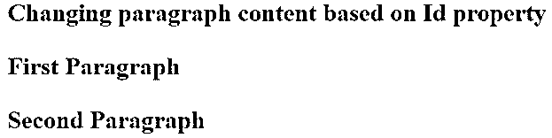
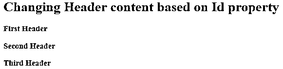
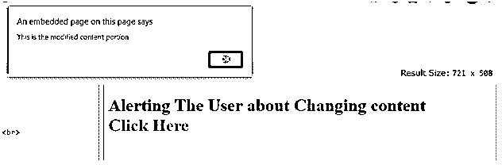
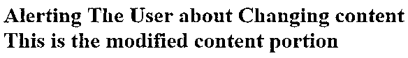
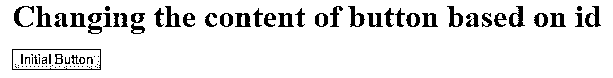
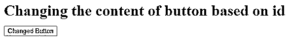
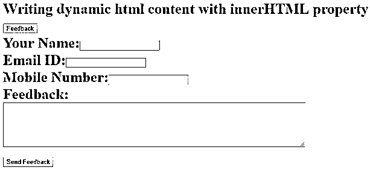
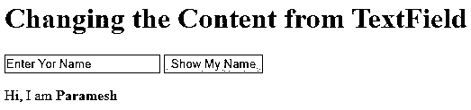
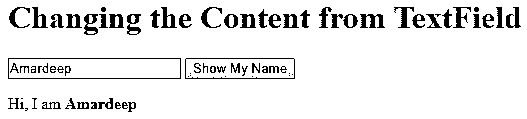

# Javascript innerHTML

> 原文：<https://www.educba.com/javascript-innerhtml/>


## Javascript innerHTML 简介

InnerHTML 属性用于修改 JavaScript 代码中的 HTML 内容。InnerHTML 属性还用于在 HTML 文档中编写动态 html 内容。大多数情况下，InnerHTML 属性用于编写动态 HTML 内容，如注册表、反馈表、评论表等。在这个主题中，我们将学习 Javascript Innerhtml。

**实时例子:**我们以 Facebook.com 为例。撰写反馈时，单击反馈链接。该链接会将您带到反馈表。这里我们使用 innerHTML 属性来实现需求。

<small>网页开发、编程语言、软件测试&其他</small>

### innerHTML 在 JavaScript 中是如何工作的？

*   基于 html id 属性的 JavaScript innerHTML 属性工程。
*   顾名思义，InnerHTML 属性总是应用于 HTML 内容。
*   基于 html id 属性，我们可以修改 html 内容并编写动态 HTML 内容。

**语法:**

```
document.getElementById(id).innerHTML = Modifiable HTML content
```

**说明:**

*   该文档为您提供了一个在 web 上显示的 HTML 文档。
*   getElemtntById()函数根据内部给定的 Id 获取内容。

**举例:**

```
<p id="name">Paramesh</p>
```

*   innerHTML 是用于修改或编写动态内容的属性。
*   在“=”之后，我们将编写想要修改的新 HTML 内容。

### 代码示例

下面是下面提到的例子:

#### 示例 1–内容变化

使用 innerHTML 属性根据 Id 属性更改段落内容:

**代码:**

```
<!DOCTYPE html>
<html>
<body>
<font color="green">
<h1>Changing paragraph content based on Id property</h>
</font>
<p id="id1">Developed an Enterprise Content Management online application by using Spring MVC as Back end and JSP, HTML, CSS, JavaScript and Angular JS as Front end.</p>
<p id="id2">Create a user with user type and admin type, where admin can allow to perform administration actions like modify user type and delete the users.</p>
<script>
document.getElementById("id1").innerHTML = "First Paragraph";
document.getElementById("id2").innerHTML = "Second Paragraph";
</script>
</body>
</html>
```

**输出:**




**说明:**

*   在上面的代码 2 中，编写了 id 为 id1 和 id2 的段落。
*   在 id1 和 id2 分别用 getElementById()函数取的 JavaScript 代码(Script 标签内)文档中。
*   在此基础上，两个 ids 内容分别更改为第一段和第二段。

#### 示例 2–根据 Id 属性更改标题内容

**代码:**

```
<!DOCTYPE html>
<html>
<body>
<font color="green">
<h1>Changing Header content based on Id property</h>
</font>
<h3 id="id1">I am first header h3 content</p>
<h3 id="id2">I am seocnd header h3 content</p>
<h3 id="id3">I am third header h3 content</p>
<script>
document.getElementById("id1").innerHTML = "First Header";
document.getElementById("id2").innerHTML = "Second Header";
document.getElementById("id3").innerHTML = "Third Header";
</script>
</body>
</html>
```

**输出:**




**说明:**

*   在上面的代码中，写了 id 为 id1、id2 和 id3 的 3 个头。
*   在 id1、id2 和 id3 分别用 getElementById()函数拍摄的 JavaScript 代码文档中。
*   基于此，3 个 id 内容分别更改为第一标题、第二标题和第三标题。

#### 示例 3–根据 id 更改锚标记的内容

**代码:**

```
<!DOCTYPE html>
<html>
<body>
<font color="green">
<h1>Alerting The User about Changing conntent</h><br>
</font>
<script>
function getMyOutput()
{
document.getElementById("id").innerHTML = "This is the modified content portion";
alert(document.getElementById("id").innerHTML)
}
</script>
<font color="blue">
<a id="id" onclick='getMyOutput()'>Click Here</a>
</font>
</body>
</html>
```

**在点击确定按钮之前-输出:**




**点击确定按钮后-输出:**




**说明:**

*   在上面的代码中声明了一个锚标记(
*   用 getElementById()函数获取的 JavaScript 代码文档中。
*   一旦我们单击 Click Here 锚标记，它将显示一个警告框，如上面的输出所示。
*   基于此 id，内容已更改，因为这是我们单击“确定”按钮时修改的内容部分。

#### 示例 4–根据 id 更改按钮的内容

**代码:**

```
<!DOCTYPE html>
<html>
<body>
<font color="green">
<h1>Changing the content of button based on id</h><br>
</font>
<script>
function getMyOutput()
{
document.getElementById("id").innerHTML = "Changed Button";
}
</script>
<font color="blue">
<button id="id" onclick='getMyOutput()'>Initial Button</button>
</font>
</body>
</html>
```

**点击初始按钮前输出:**




**点击初始按钮后输出:**




**解说:**

*   在上面的代码中声明了一个 id 为 id 的按钮，初始按钮是
*   用 getElementById()函数获取的 JavaScript 代码文档中。
*   一旦我们单击初始按钮，输出就会随着按钮内容的改变而改变。

### 使用 innerHTML 属性编写动态 html 内容

#### 示例 1–根据 id 生成反馈表

**代码:**

```
<!DOCTYPE html>
<html>
<body>
<font color="green">
<h1>Writing dynamic html content with innerHTML property</h><br>
</font>
<script>
function getFeedbackForm() {
var content="Your Name:<input type='text' name='name'><br>Email ID:<input type='text' name='email'><br>Mobile Number:<input type='text' name='mobile'><br>Feedback:<br><textarea rows='6' cols='90'></textarea><br><input type='submit' value='Send Feedback'>";
document.getElementById('feedbackID').innerHTML=content;
}
</script>
<form name="feedBack">
<input type="button" value="Feedback" onclick="getFeedbackForm()">
<div id="feedbackID"></div>
</form>
</body>
</html>
```

**输出:**




**说明:**

*   在上面，我们写了姓名及其文本字段，电子邮件 ID 及其文本字段，手机号码及其文本字段和发送反馈按钮的代码。
*   所有这些属性都存储在一个内容变量中。
*   此外，我们还创建了一个表单字段，并在其中编写了反馈按钮的代码。
*   当我们点击反馈按钮时，反馈按钮的 id 为 feedbackID。该操作由 onclick 方法执行，并在函数内部执行输出。
*   这是因为我们将内容变量传递给了 innerHTML 属性。在那里我们达到了要求。

#### 示例 2–根据 id 动态更改文本字段内容

**代码:**

```
<!DOCTYPE html>
<html>
<body>
<font color="green">
<h1> Changing the Content from TextField </h1>
</font>
<script>
function getMyText(){
var content = document.getElementById('typeContent').value;
document.getElementById('name').innerHTML = content;
}
</script>
<input type='text' id='typeContent' value='Enter Yor Name' />
<input type='button' onclick='getMyText()' value='Show My Name'/>
<p>Hi, I am  <b id='name'>Paramesh</b> </p>
</body>
</html>
```

点击按钮之前-输出:m




点击按钮-输出后:




**说明:**

*   在上面为一个文本字段和一个按钮编写的代码中。
*   最初，你好，我是 Paramesh 将显示。
*   当我们单击“显示我的姓名”按钮时,“显示我的姓名”按钮文本字段具有 id 名称。该操作由 onclick 方法执行，并在函数内部执行输出。
*   这是因为我们将内容变量传递给了 innerHTML 属性。在那里我们达到了要求。

### 推荐文章

这是 Javascript Innerhtml 的指南。这里我们讨论 innerHTML 如何在 JavaScript 中工作，并给出例子和输出。您也可以看看以下文章，了解更多信息–

1.  [JavaScript 自定义事件](https://www.educba.com/javascript-custom-events/)
2.  [JavaScript 字符串替换](https://www.educba.com/javascript-string-replace/)
3.  [JavaScript 比较字符串](https://www.educba.com/javascript-compare-strings/)
4.  [JavaScript 刷新页面](https://www.educba.com/javascript-refresh-page/)


