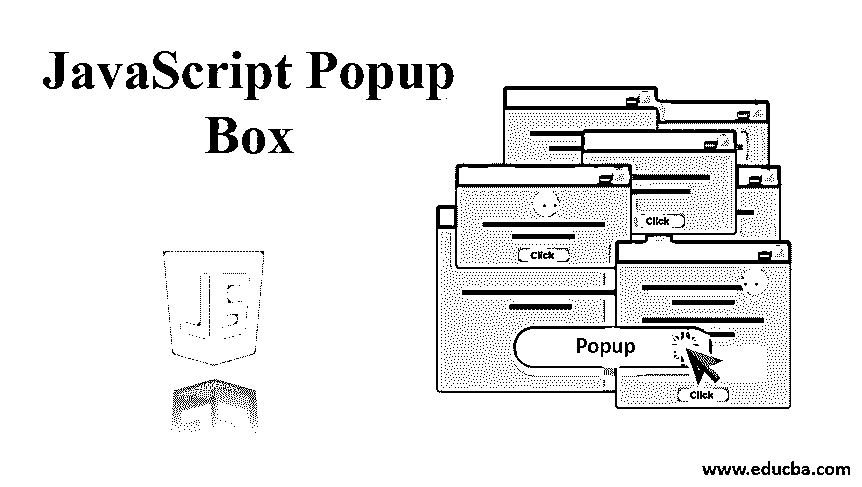
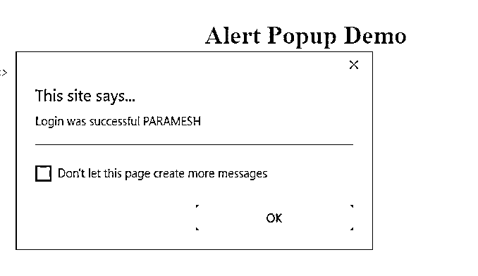
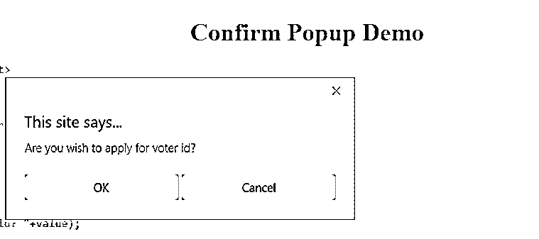
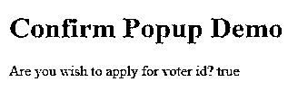
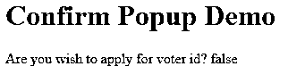
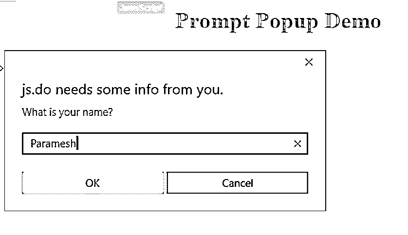
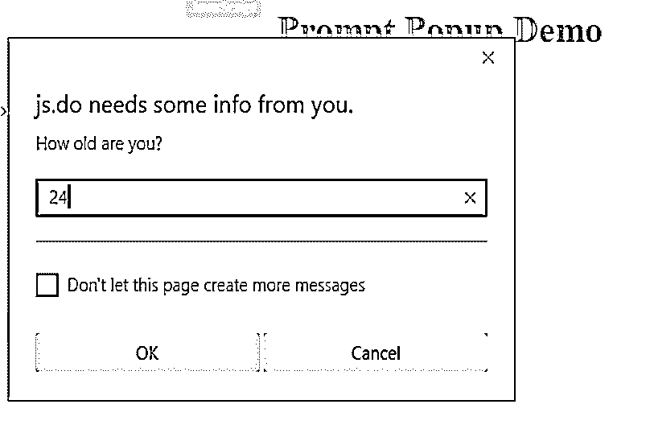
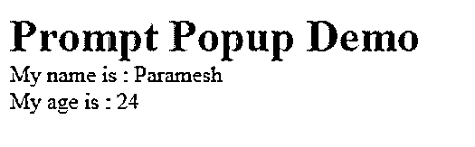

# JavaScript 弹出框

> 原文：<https://www.educba.com/javascript-popup-box/>




## JavaScript 弹出框介绍

在 JavaScript 中，弹出框用于向用户显示信息。通常，弹出框有 3 种类型:

*   警告框
*   确认框
*   提示席

### JavaScript 中的弹出框是如何工作的？

以下是 javascript 中弹出框的解释:

<small>网页开发、编程语言、软件测试&其他</small>

#### 1.警告框

*   警告框实际上是用来警告用户在表单填写时已经执行的操作。
*   出现警告框时，用户必须单击“确定”才能进入下一步。

**语法:**

```
alert("message");
```

**例:**当你填写在线申请时，它会询问你的出生日期，然后你输入你的出生日期，但如果你输入了错误的出生日期，它会显示弹出框。这是一个警告弹出框。这种警告弹出被称为“警告弹出框”。

#### 2.确认框

*   确认框实际上用于从用户处获取确认身份验证，以进行下一步。
*   当弹出提示框时，用户必须按“确定”或“取消”才能进行下一步。
*   当确认框出现时，用户必须选择确定或取消。
*   如果用户按下“确定”,则动作移动到下一步进行处理。
*   如果用户按下“Cancel ”,操作被取消，停止流程本身(Cancel 默认为空值)。

**语法:**

```
Confirm("Click Yes or No");
```

**示例:**填写在线申请表后，如果您想继续付款，将会出现一个弹出框。如果您想继续付款，请单击“是”，否则请单击“否”。单击“是”将进入付款页面，单击“否”将进入主页。

#### 3.提示席

*   实际上用于要求用户输入动态值的提示框。
*   输入值后，单击 enter 将用户的值读入我们的代码。

**语法:**

```
prompt("message","user text");
```

**示例:**在一个应用程序中，用户想要在表单中输入他的年龄，简单地说，他已经动态地输入了这个值。此时，我们使用提示弹出框来输入用户输入。

### 要实现的示例

下面的例子解释了如何在 JavaScript 弹出框中实现程序:

#### 1.警告框

**代码:**

```
<!DOCTYPE html>
<html>
<body>
<font color="green"><h1>Alert Popup Demo</h1></font>
<script>
var name="PARAMESH";
if (name==="PARAMESH")
{
alert("Login was successful "+name)
}
else
{
alert("Login was unsuccessful "+name)
}
</script>
</body>
</html>
```

**输出:**




**对以上程序的解释:**用户名等于 PARAMESH，提示框弹出框给出你登录成功的 PARAMESH。用户名不等于参数，警告框弹出框给你登录不成功。

#### 2.确认框

**代码:**

```
<!DOCTYPE html>
<html>
<body>
<font color="green"><h1>Confirm Popup Demo</h1></font>
<script>
function getConfirmAge() {
var voterApply = confirm("Are you wish to apply for voter id?");
var value;
if (voterApply)
value=voterApply;
else
value=voterApply;
document.write("Are you wish to apply for voter id? "+value);
}
getConfirmAge();
</script>
</body>
</html>
```

**输出:**




**点击是后输出:**




**点击后无输出:**




**对上述代码的解释:**一旦弹出框显示出来，如果我们按“是”,它将显示输出“你希望申请投票人 id 吗?”是，如果您按“否”,那么它将显示输出，您是否希望申请选民 id？号码

#### 3.提示席

**代码:**

```
<!DOCTYPE html>
<html>
<body>
<font color="green"><h1>Prompt Popup Demo</h1></font>
<script>
function getPromptDetails() {
var name = prompt("What is your name?");
var age = prompt("How old are you?");
document.write("My name is : "+name+"<br>");
document.write("My name is : "+age);
}
getPromptDetails();
</script>
</body>
</html>
```

**输出:**







**输入输入值后输出:**




**对上述代码的解释:**用于询问输入值的提示。输入姓名和年龄后，它将显示在控制台上，因为我的名字是:Paramesh 和我的年龄是:24

### 结论

像警告、提示和确认框这样的弹出框用于向用户提供进一步的步骤信息。警告框为警告，提示框为输入值，确认框为用户的决定。

### 推荐文章

这是一个 JavaScript 弹出框的指南。这里我们讨论三个框，即警告、确认和提示框，以及它们的语法和实现示例。您也可以浏览我们的其他相关文章，了解更多信息——

1.  [JavaScript 箭头函数](https://www.educba.com/javascript-arrow-function/)
2.  [JavaScript 中的算术](https://www.educba.com/arithmetic-operators-in-javascript/)
3.  [JavaScript 中的 Cookies】](https://www.educba.com/cookies-in-javascript/)
4.  [JavaScript 日期格式](https://www.educba.com/javascript-date-formats/)


